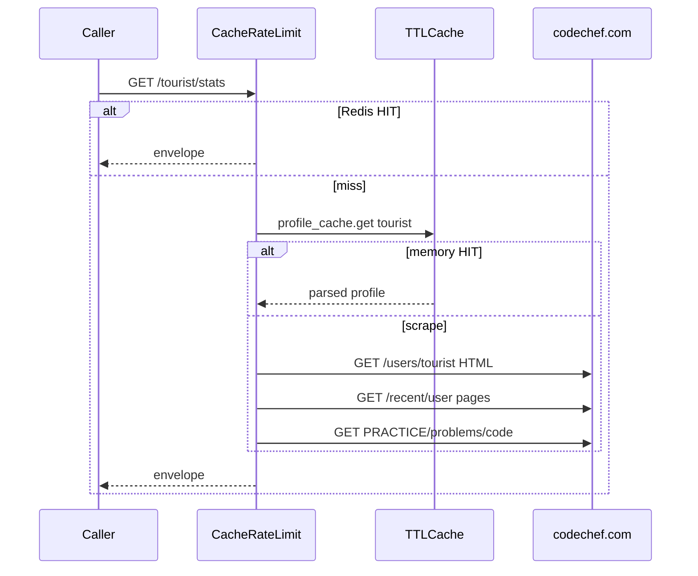

# Envelope and schemas

`PLATFORM = "codechef"`, `CATEGORY = "competitive"`. Path param is `handle`.

Try it: [playground](https://codechef-stats.tashif.codes/playground), older [dashboard](https://codechef-stats.tashif.codes/dashboard), [OpenAPI](https://codechef-stats.tashif.codes/docs), sample [tourist](https://codechef-stats.tashif.codes/tourist/profile).

## Input

No body, no auth. Path param `handle`. Deprecated aliases still work: `/profile/{handle}`, `/heatmap/{handle}`, `/rating/{handle}`.

Heatmap: `view`, `year` on both the new path and `/heatmap/{handle}`.

SVG: `theme`, `exclude`.

```http
GET /tourist/stats HTTP/1.1
Host: codechef-stats.tashif.codes

GET /profile/tourist HTTP/1.1
Host: codechef-stats.tashif.codes
```

The second path is the old alias. Same envelope. OpenAPI marks it deprecated.

Server-side scrape input: `GET https://www.codechef.com/users/{handle}` with a Chrome User-Agent, timeout 120s. Topics add XHR `GET /recent/user?user_handle={handle}&page=N` and `GET /api/contests/PRACTICE/problems/{code}`. End-to-end walk: [HTML scrape](5.1-html-scrape).

## Output envelope

```json
{
  "status": "success",
  "message": "retrieved",
  "platform": "codechef",
  "username": "tourist",
  "cached": false,
  "data": {}
}
```

`username` in the envelope is the handle. CodeChef's own HTML miss is often `status: "error"` with empty `data`. Cache that so you do not hammer ghosts.

## `data` by route

Profile: name, avatar from `.user-details-container img`, country + flag, stars string.

Stats: `totalSolved` from "Total Problems Solved". `byDifficulty` is `{}`. Topics come from the recent-activity scrape, not the profile page.

Contests: `rank` is the stars string (`1★` style after mapping). `globalRanking` from `.rating-ranks strong`. History from `var all_rating = ...;`.

Rating: numeric current / highest from `.rating-number` plus "Highest Rating N".

Heatmap: `userDailySubmissionsStats`, either `{date: value}` or a list. Dates like `"2024-8-6"` (unpadded) get normalized. `value` becomes `count`. Levels use local `ceil`.

Badges: empty. CodeChef stopped exposing a public badge list that survived the last HTML change.

SVG: `image/svg+xml`, 24h.

## Errors

404 `CodeChef user not found` when the profile page is 404. Invalid handle `favicon.ico` is 400.

## Request / response cycle

Two caches. Redis HTTP body, then in-memory `TTLCache` of the parsed profile (300s, 256 entries).



[Request path](5.2-request-path) has the Redis keys. [HTML scrape](5.1-html-scrape) has the selectors.
