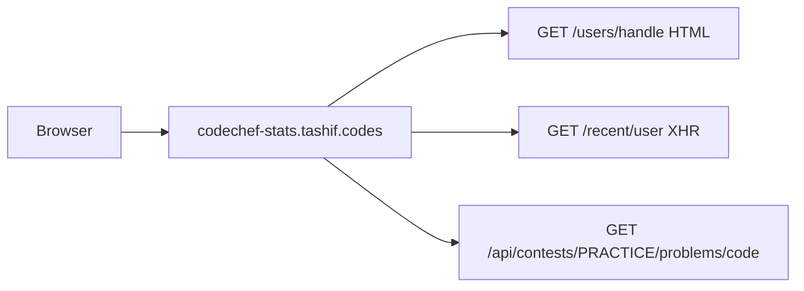

# Architecture

Full Redis walk (cache key, invalid-user 404, 60/30 limits, plus the in-memory `TTLCache`) is on [Request path](5.2-request-path). `platform="codechef"`.

The only sibling that scrapes HTML as the source of truth. One public profile page feeds almost every section. FastAPI app is `main:app`. `python main.py` is a no-op. Always uvicorn. Local port 8005.

Path param is `handle`. Deprecated aliases keep the old order: `/profile/{handle}`, `/heatmap/{handle}`, `/rating/{handle}`.

Unique HTML extra: `GET /dashboard` in `routes/docs.py`. Older handle-driven viewer. New work should use `/playground`.

Every data router declares `Depends(enforce_rate_limit)` which returns `None`. Live limiting is the Redis middleware (`platform="codechef"`). On top of that, profiles sit in an in-memory `TTLCache` (300s, 256 entries) because one scrape is expensive (`request_timeout=120`). Tag cache is 6h / 4096 entries.

Env prefix `CODECHEF_` plus raw `REDIS_URL`. `CODECHEF_RATE_LIMIT_REQUESTS` is a leftover settings field. IP limits still use `RATE_LIMIT_IP_REQUESTS`.

