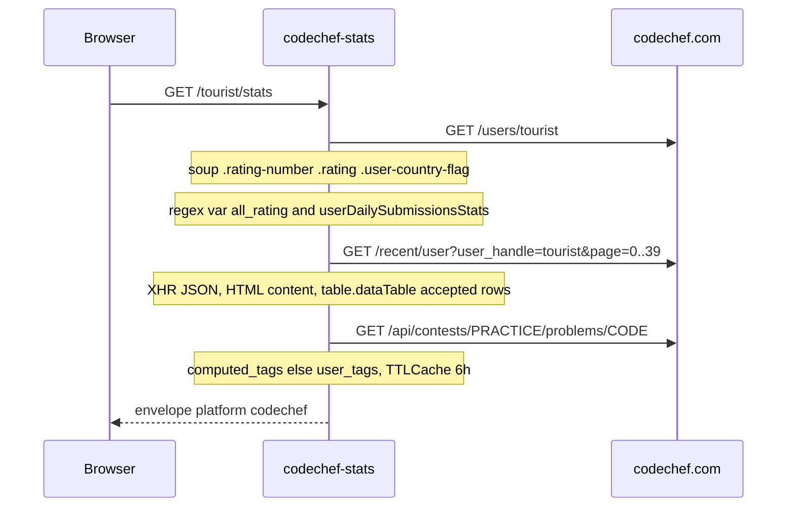

# HTML scrape

CodeChef has no public JSON stats API that this service trusts. The source of truth is the public profile HTML plus two XHR endpoints the site already uses. End-to-end: browser hits this FastAPI app, the app GETs CodeChef, BeautifulSoup plus regex pull fields, mapper wraps the shared envelope.

Playground: [codechef-stats.tashif.codes/playground](https://codechef-stats.tashif.codes/playground). Sample handle `tourist`. Timeout `CODECHEF_REQUEST_TIMEOUT` default 120s. Chrome User-Agent.

`fetch_codechef_profile` loads `https://www.codechef.com/users/{handle}` and `parse_codechef_profile` pulls inline JS plus DOM.

JS blobs:

- `var all_rating = ...;` contest series
- `var userDailySubmissionsStats = ...;` heatmap, either a dict `{date: value}` or a list

DOM: `.rating-number`, `.rating` stars, country, ranks, "Total Problems Solved". Dates like `"2024-8-6"` (unpadded). Stars `"unrated"` are dropped from rank.

Topics are not on the profile. The scraper pages `https://www.codechef.com/recent/user?user_handle={handle}&page=N` (XHR JSON wrapping HTML `content`), caps at 40 pages, 10 concurrent, then `GET https://www.codechef.com/api/contests/PRACTICE/problems/{code}` for `computed_tags` else `user_tags`.

Badges are empty. CodeChef does not expose a public badge list that survived the last HTML change. Mapper comment says so.

`byDifficulty` is `{}`. Stars become contests `rank`. `globalRank` becomes `globalRanking`. Heatmap `value` becomes count. Streaks are local `ceil` intensity.

Upstream HTML changes will break fields before they break the envelope. Empty `data` with `status: "error"` is the usual miss. Cache that miss so you do not hammer CodeChef for ghosts.

## End-to-end walk

1. Chrome UA GET `/users/{handle}`. 404 → `CodeChef user not found`. `favicon.ico` → 400.
2. BeautifulSoup `.user-details-container` for avatar and name.
3. `.rating-number` current rating. Parent text `Highest Rating N`.
4. `.rating` stars. `"unrated"` dropped from rank.
5. `.user-country-flag` / `.user-country-name`. Relative src made absolute against `codechef.com`.
6. `.rating-ranks strong` → global then country rank.
7. Regex `var all_rating = ...;` JSON list of contests.
8. Regex `var userDailySubmissionsStats = ...;` dict or list. Dict becomes `{date, value}` rows.
9. `.rating-data-section.problems-solved` heading `Total Problems Solved`, else regex on the raw page.
10. Topics (only on `/stats` and `/topics`): paginate `/recent/user` with `X-Requested-With: XMLHttpRequest`, cap 40 pages, 10 concurrent. Each page `content` is HTML. Rows with verdict title `accepted` contribute a problem code. Then `GET /api/contests/PRACTICE/problems/{code}` for `computed_tags` else `user_tags`. Tag cache 6h / 4096.

In-memory `profile_cache` (300s, 256) sits in front of step 1. Redis HTTP cache sits in front of the whole response. [Request path](5.2-request-path).
