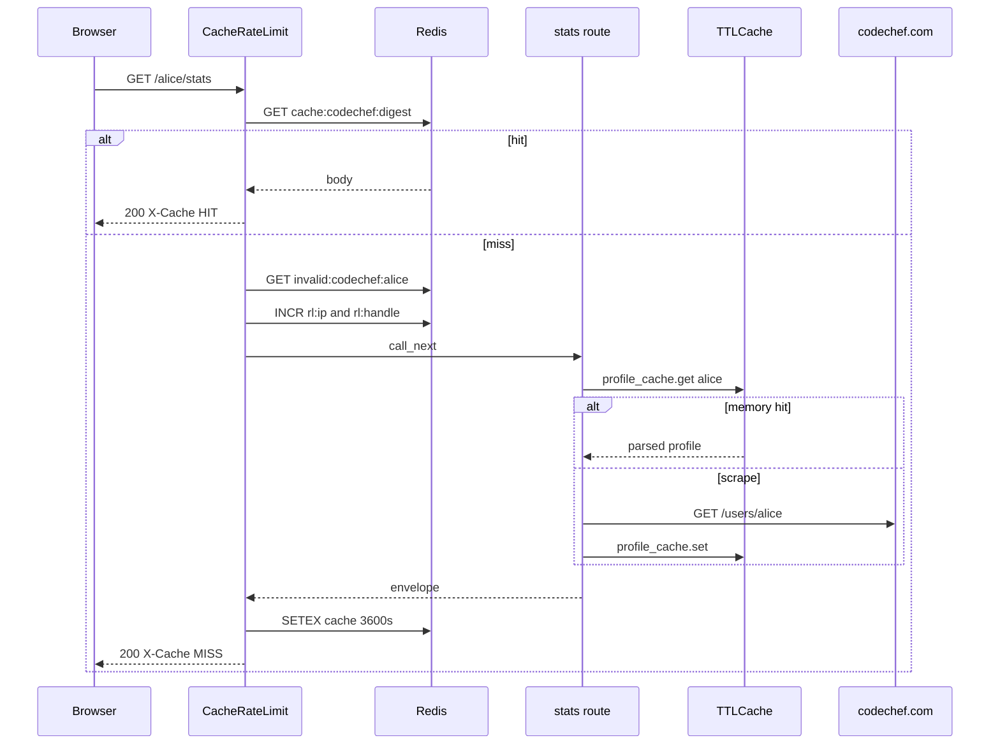

# Request path

Walk of `GET /alice/stats` with Redis on. `platform="codechef"`. CodeChef is the sibling that also keeps an in-memory `TTLCache` of parsed profiles, so a Redis miss can still skip the HTML scrape.

1. CORS middleware (added first, runs second).
2. `CacheRateLimitMiddleware` with `platform="codechef"` (added last, runs first).
3. Skip check. Path is not `/`, `/docs`, `/redoc`, `/openapi.json`, `/favicon.ico`. Method is GET. Redis is on.
4. Handle is the first path segment, lowercased: `alice`. Deprecated aliases (`/profile/alice`, `/heatmap/alice`) still use `alice`.
5. Cache key is `cache:codechef:{sha256(GET:/alice/stats:sorted_query)}`.
6. On HIT, body is base64-decoded and returned with `X-Cache: HIT`. Done. The HTML scrape never runs.
7. Negative key `invalid:codechef:alice`. On HIT, HTTP 404 `User does not exist`, `X-Cache: NEGATIVE-HIT`. Invalid-user rate limits apply (10/IP and 5/handle per 10 minutes).
8. Live limits: 60 req/min per IP, 30 req/min per handle. Over: 429 with `Retry-After` and exponential backoff 5s to 300s.
9. Route calls `fetch_codechef_profile`. That function checks `profile_cache` (in-memory `TTLCache`, 300s, 256 entries) before `GET https://www.codechef.com/users/alice`.
10. `stats_from` / `make_envelope`. HTTP 200 cached in Redis for 3600s unless `Cache-Control` says otherwise. `X-Cache: MISS`.

Without Redis, steps 5 to 8 disappear. The in-memory profile cache still works inside one process. Restart uvicorn and you scrape again. Rate limits disappear too.

Every data router also declares `Depends(enforce_rate_limit)`. That dependency returns `None`. Live limiting is the Redis middleware. `CODECHEF_RATE_LIMIT_REQUESTS` is a leftover settings field.

IP is `X-Forwarded-For` first hop, else `X-Real-IP`, else `request.client.host`.

`/playground` is not in `SKIP_PATHS`. With Redis on, the first path segment is treated as handle `playground`. `/dashboard` becomes handle `dashboard` the same way.

Invalid-user markers: `user does not exist`, `user not found`, `not found on`, `invalid username`. A 404 from CodeChef (`CodeChef user not found`) matches. Empty `data` with `status: "error"` on a miss is cached as a ghost so you do not hammer CodeChef for handles that never existed.

Tag cache is a second `TTLCache` (6h, 4096 entries) for practice-problem tags. Also process-local.

## Redis env

Pydantic prefix is `CODECHEF_`, so `CODECHEF_REDIS_URL` is the settings field. The field default also reads raw `REDIS_URL` at import, which is how a shared `.env` still works. Redis errors fail open.

In-memory profile cache does **not** need Redis. It uses `cache_ttl_seconds` default 300 and `cache_max_entries` default 256. Redis HTTP TTL is the family default 3600.

| Env | Default |
| --- | --- |
| `API_CACHE_TTL_SECONDS` | 3600 (Redis HTTP body) |
| `INVALID_USER_CACHE_TTL_SECONDS` | 300 |
| `RATE_LIMIT_IP_REQUESTS` | 60 per 60s |
| `RATE_LIMIT_HANDLE_REQUESTS` | 30 per 60s |
| `INVALID_RATE_LIMIT_IP_REQUESTS` | 10 per 600s |
| `INVALID_RATE_LIMIT_HANDLE_REQUESTS` | 5 per 600s |
| `RATE_LIMIT_BACKOFF_BASE_SECONDS` | 5 |
| `RATE_LIMIT_BACKOFF_MAX_SECONDS` | 300 |

Keys:

- `cache:codechef:{sha256}`
- `invalid:codechef:{handle}`
- `rl:ip:codechef:{ip}` / `rl:handle:codechef:{handle}`
- `backoff:{same}` / `violations:{same}`

Two layers, two clocks. Redis HIT never reaches `TTLCache`. Redis MISS with a warm `TTLCache` still skips the 120s scrape timeout.
