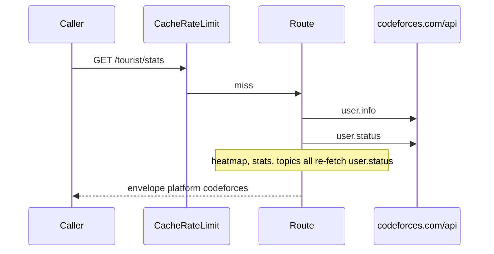

# Envelope and schemas

`PLATFORM = "codeforces"`, `CATEGORY = "competitive"`. Path param is `userid` (the handle).

Try it: [playground](https://codeforces-stats.tashif.codes/playground), [OpenAPI](https://codeforces-stats.tashif.codes/docs), sample [tourist](https://codeforces-stats.tashif.codes/tourist/profile).

## Input

No body, no API key. Path `userid`. Heatmap also still understands old `days`. Prefer `view` / `year`. SVG `theme` / `exclude`.

```http
GET /tourist/stats HTTP/1.1
Host: codeforces-stats.tashif.codes

GET /multi/tourist;Petr HTTP/1.1
Host: codeforces-stats.tashif.codes

GET /contests/upcoming?gym=true HTTP/1.1
Host: codeforces-stats.tashif.codes
```

`userids` on `/multi` is semicolon-separated. Commas are rewritten to semicolons.

Server-side official REST (no scrape):

```http
GET https://codeforces.com/api/user.info?handles={h1;h2} HTTP/1.1
GET https://codeforces.com/api/user.rating?handle= HTTP/1.1
GET https://codeforces.com/api/user.status?handle= HTTP/1.1
GET https://codeforces.com/api/contest.list?gym= HTTP/1.1
```

`status=="OK"` or it is an error. See [Official API](5.1-official-api).

## Output envelope

```json
{
  "status": "success",
  "message": "retrieved",
  "platform": "codeforces",
  "username": "tourist",
  "cached": false,
  "data": {}
}
```

## `data` by route

Profile: `firstName + lastName` or handle → `displayName`. `titlePhoto` else `avatar`. `organization` → `institution`.

Stats: distinct solved is `(contestId, index)` with `verdict=="OK"`. Topics are problem `tags`. No difficulty buckets. `byDifficulty` stays empty / zeros.

Contests: `rating` / `maxRating` / `rank` from `user.info` (title like `specialist`). History from `user.rating`. `badgesCount=0`.

Heatmap years run from `registrationTimeSeconds` to today. Intensity uses `round`, not LeetCode's `ceil`.

Badges: empty model, HTTP 200.

SVG: `image/svg+xml`.

## Legacy helpers (still mounted)

| Path | Returns |
| --- | --- |
| `GET /{userid}/basic` | profile-shaped, deprecated |
| `GET /{userid}/solved` | stats-shaped, deprecated |
| `GET /multi/{userids}` | several handles |
| `GET /users/common-contests/{userids}` | overlap |
| `GET /contests/upcoming` | `?gym=true` includes gyms |

OpenAPI marks these `deprecated=True`. CodeTrace's Codeforces deep dive still uses upcoming contests. Canonical card composition should go through `/{userid}/profile` and `/{userid}/contests`.

## Errors

Missing user is HTTP 404 with `detail`, not a fake zeroed stats object.

`get_contests_participated_by_user` sleeps 2s before `user.status`. Redis HIT skips that sleep. The local limiter is a courtesy. Codeforces bans noisy IPs.

## Request / response cycle



[Request path](5.2-request-path).
