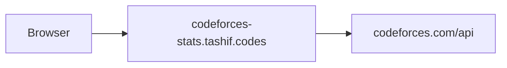

# Architecture

Official REST. `aiohttp`. `status=="OK"` or it is an error. Path param is `userid` because the first version of this API used that word. The Codeforces word is handle. Envelope `platform` is `"codeforces"`.

`python app.py` binds `127.0.0.1:8000` in production mode and `58353` in development. Use 8003.

This is the only stats API with first-class non-user routes: upcoming contests, common contests, `/multi/{userids}`. Those five are `deprecated=True` in OpenAPI and still useful. Canonical card composition should go through `/{userid}/profile` and `/{userid}/contests`.

Heatmap, stats, and topics all re-fetch `user.status`. That list is the expensive call. Distinct solved is `(contestId, index)` with `verdict=="OK"`. Topics are problem `tags`. No difficulty buckets. Badges empty.

`get_contests_participated_by_user` sleeps 2s first. Codeforces bans noisy IPs. The local Redis limiter is a courtesy, not a substitute. Full walk of `CacheRateLimitMiddleware(platform="codeforces")` is on [Request path](5.2-request-path). A cache HIT skips that 2s sleep.
