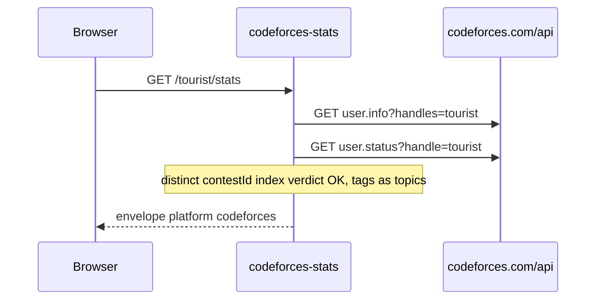

# Official API

Not a scrape. Codeforces publishes REST. `aiohttp`, `status=="OK"` or error. No API key. Be polite. The 2s sleep before contest-participation `user.status` is the politeness. Redis HIT skips it.

Playground: [codeforces-stats.tashif.codes/playground](https://codeforces-stats.tashif.codes/playground). Sample `tourist`.

```http
GET https://codeforces.com/api/user.info?handles={h1;h2}
GET https://codeforces.com/api/user.rating?handle=
GET https://codeforces.com/api/user.status?handle=
GET https://codeforces.com/api/contest.list?gym=
```

`userids` on `/multi/{userids}` is semicolon-separated (`tourist;Petr`). Commas are accepted and rewritten.

Heatmap years run from `registrationTimeSeconds` to today. `days` is the old window query. Prefer `view`. Intensity uses `round`, not `ceil` like LeetCode.

Mapper: `firstName + lastName` or handle → displayName. `titlePhoto` else `avatar`. `organization` → institution. Contests: `rating` / `maxRating` / `rank` from `user.info`, history from `user.rating`. `badgesCount=0`.

Missing user is HTTP 404 with `detail`, not a fake zeroed stats object. That is the luxury of an official API.

`/contests/upcoming?gym=true` includes gym contests. CodeTrace's Codeforces deep dive still uses this.

No API key. Be polite.

## End-to-end walk



Heatmap, stats, and topics all re-fetch `user.status`. That list is the expensive call. `get_contests_participated_by_user` sleeps 2s first. Redis HIT on the HTTP envelope skips both the sleep and the second fetch.

Missing user: HTTP 404 with `detail`. `status != "OK"` from Codeforces becomes that miss.
