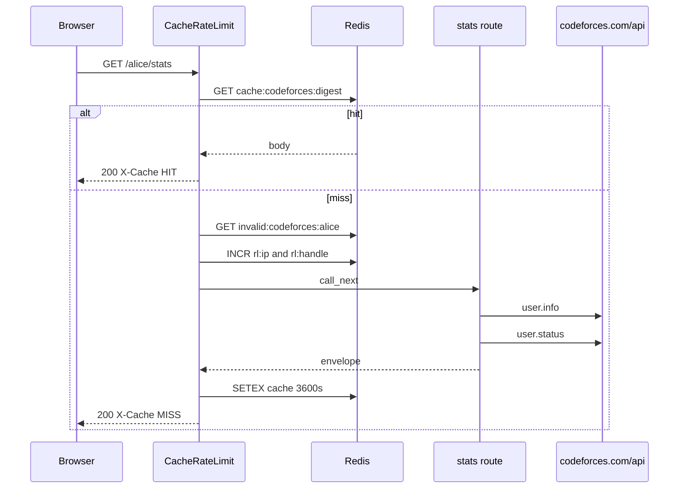

# Request path

Walk of `GET /alice/stats` with Redis on. `platform="codeforces"`. Path param is `userid`. The handle in Redis keys is still the first path segment.

1. CORS middleware (added first, runs second).
2. `CacheRateLimitMiddleware` with `platform="codeforces"` (added last, runs first).
3. Skip check. Path is not `/`, `/docs`, `/redoc`, `/openapi.json`, `/favicon.ico`. Method is GET. Redis is on.
4. Handle is the first path segment, lowercased: `alice`.
5. Cache key is `cache:codeforces:{sha256(GET:/alice/stats:sorted_query)}`.
6. On HIT, body is base64-decoded and returned with `X-Cache: HIT`. Done. `user.status` is not fetched.
7. Negative key `invalid:codeforces:alice`. On HIT, HTTP 404 `User does not exist`, `X-Cache: NEGATIVE-HIT`. Invalid-user rate limits apply (10/IP and 5/handle per 10 minutes).
8. Live limits: 60 req/min per IP, 30 req/min per handle. Over: 429 with `Retry-After` and exponential backoff 5s to 300s.
9. Route re-fetches `user.status` for heatmap, stats, and topics. Distinct solved is `(contestId, index)` with `verdict=="OK"`.
10. `make_envelope` wraps it. HTTP 200 cached for 3600s unless `Cache-Control` says otherwise. `X-Cache: MISS`.

Without Redis, steps 5 to 8 disappear. Every GET hits `codeforces.com/api`. Rate limits disappear too.

This API also has non-user routes. First path segment is still treated as the handle:

- `GET /multi/tourist;Petr` → handle `multi`
- `GET /contests/upcoming` → handle `contests`

Those five share the IP bucket with real users. They do not share a handle bucket with `alice`. Redis still caches the response body.

`get_contests_participated_by_user` sleeps 2s before `user.status`. Codeforces bans noisy IPs. The local Redis limiter is a courtesy, not a substitute. A cache HIT skips that sleep.

IP is `X-Forwarded-For` first hop, else `X-Real-IP`, else `request.client.host`.

`/playground` is not in `SKIP_PATHS`. With Redis on, the first path segment is treated as handle `playground`.

Invalid-user markers: `user does not exist`, `user not found`, `not found on`, `invalid username`. Missing Codeforces users are HTTP 404 with `detail`, so they land in the negative cache.

## Redis env

`REDIS_URL` turns the middleware on. There is no in-process HTTP cache. Redis errors fail open: cache miss, rate limit allow.

| Env | Default |
| --- | --- |
| `API_CACHE_TTL_SECONDS` | 3600 |
| `INVALID_USER_CACHE_TTL_SECONDS` | 300 |
| `RATE_LIMIT_IP_REQUESTS` | 60 per 60s |
| `RATE_LIMIT_HANDLE_REQUESTS` | 30 per 60s |
| `INVALID_RATE_LIMIT_IP_REQUESTS` | 10 per 600s |
| `INVALID_RATE_LIMIT_HANDLE_REQUESTS` | 5 per 600s |
| `RATE_LIMIT_BACKOFF_BASE_SECONDS` | 5 |
| `RATE_LIMIT_BACKOFF_MAX_SECONDS` | 300 |

Keys:

- `cache:codeforces:{sha256}`
- `invalid:codeforces:{handle}`
- `rl:ip:codeforces:{ip}` / `rl:handle:codeforces:{handle}`
- `backoff:{same}` / `violations:{same}`
