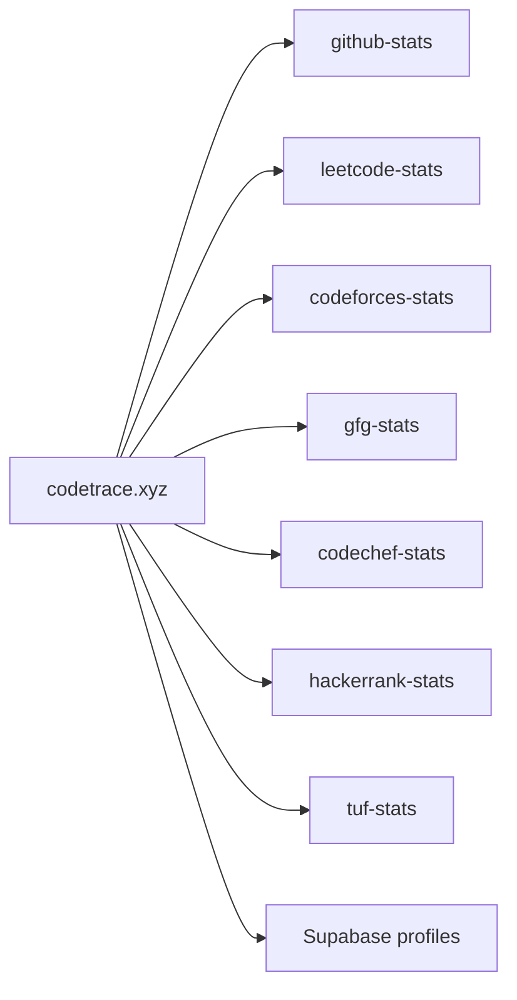

# CodeTrace

Dashboard that stacks GitHub, LeetCode, Codeforces, GFG, CodeChef, HackerRank, and takeUforward into one shareable page. Live at [codetrace.xyz](https://codetrace.xyz). Source is [tashifkhan/stats-api-demo](https://github.com/tashifkhan/stats-api-demo).

It does not scrape those sites itself. Each card is a GET against the matching `*-stats.tashif.codes` API. Same envelope, seven backends.

Ramachandra College of Engineering's placement tracker is a copy of this. I wrote that up in [Ramachandra College copied CodeTrace](/blog/Ramachandra-College-CodeTrace-Copy). Their live portal is [sptracker1.vercel.app](https://sptracker1.vercel.app/). [rcee.ac.in](https://rcee.ac.in) is the college site.

## Docs map

- [Overview](1-overview)
- [Pages and routes](2-pages-and-routes)
- [Stats APIs](3-stats-apis)
- [Saved profiles](4-saved-profiles)
- [The RCEE copy](5-the-rcee-copy)
- [Architecture](6-architecture)
- [App shell](6.1-app-shell-and-providers)
- [Unified client](6.2-unified-client)
- [Profile aggregation](6.3-profile-aggregation)
- [Proxies and deploy](6.4-proxies-and-deploy)

## Stack

React 19, Vite, TanStack Router, TanStack Query, nuqs, Tailwind 4, shadcn/Radix, Recharts, `react-activity-calendar`, Supabase Auth + Postgres for claimed usernames.

The npm package is still named `stats-api-demo`. The product name is CodeTrace.

## What you get

- Marketing landing at `/`.
- Handle form at `/app`. Query params are the share URL (`?github=tashifkhan&leetcode=khan-tashif`).
- Aggregated profile at `/profile?…` with one heatmap, rating lines, difficulty rings, language bars.
- Per-platform deep dives at `/github/$username`, `/leetcode/$username`, and the rest.
- Optional Google login, claim a short name, public page at `/$profileUsername`.

