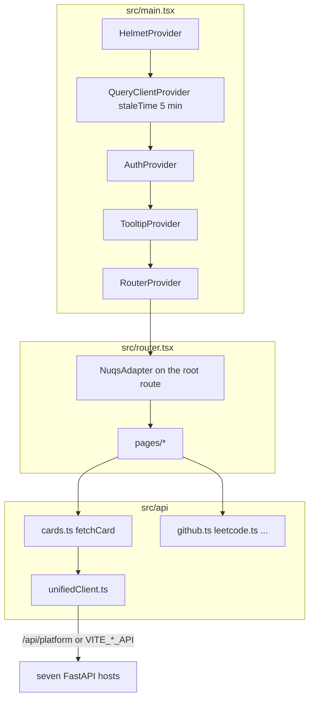

# Architecture

CodeTrace is a Vite SPA. It does not scrape contest sites. Each card is six GETs against a stats API, merged in the browser.

## Layout on disk

| Path | Job |
| --- | --- |
| `src/main.tsx` | providers |
| `src/router.tsx` | TanStack route tree |
| `src/pages/` | one file per route |
| `src/api/` | unified client, `cards.ts`, seven adapters, `savedProfiles.ts` |
| `src/hooks/` | Query wrappers. Pages are not supposed to `fetch` |
| `src/components/` | cards, heatmap, shadcn under `ui/` |
| `src/lib/` | supabase, profileConfig, posthog, apiLinks |
| `src/types/unified.ts` | contract. Comment says it mirrors backend `UNIFIED_SCHEMA.md` |
| `scripts/start-apis.py` | boots the seven FastAPI siblings |
| `supabase/migrations/` | claimed usernames |

Query cache is split: default 5 min, unified cards 45 min (`CARD_STALE_TIME` in `useCards.ts`).

There is no Next.js App Router, no cookie session, no BFF. Prod is Vercel rewrites plus an SPA fallback. Auth is optional Google via Supabase. The dashboard works with those env vars missing.

`src/lib/posthog.ts` is a side-effect import in `main.tsx`. `api_host` is `/ph`. Do not copy the project key into tutorials.
