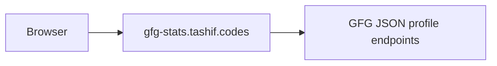

# GeeksForGeeks stats API

FastAPI service for public GFG profiles. Live at [gfg-stats.tashif.codes](https://gfg-stats.tashif.codes). Source is [tashifkhan/GFG-Stats-API](https://github.com/tashifkhan/GFG-Stats-API).

The schema puts GFG in `fundamentals` with HackerRank. CodeTrace's `fetchCard` currently tags it `dsa` with LeetCode and TUF. The bucket on `/profile` follows the client, not this table.

GFG's public pages moved. This API uses the current JSON endpoints under `/profile/{username}`, not the old HTML scrape.

## Docs map

- [Overview](1-overview)
- [Dashboard](2-dashboard)
- [Canonical endpoints](3-canonical-endpoints)
- [Envelope and schemas](3.1-envelope-and-schemas)
- [Platform notes](4-platform-notes)
- [Architecture](5-architecture)
- [Upstream JSON](5.1-upstream-json)
- [Request path](5.2-request-path)

## What it returns

Solved counts by School / Basic / Easy / Medium / Hard, coding score, institute rank, streaks, heatmap, and an SVG card.



## Live access

- Site: [gfg-stats.tashif.codes](https://gfg-stats.tashif.codes)
- Playground: [gfg-stats.tashif.codes/playground](https://gfg-stats.tashif.codes/playground)
- OpenAPI: [gfg-stats.tashif.codes/docs](https://gfg-stats.tashif.codes/docs)
- Sample JSON: [tashif_ahmad_khan/profile](https://gfg-stats.tashif.codes/tashif_ahmad_khan/profile)
- Repo: [github.com/tashifkhan/GFG-Stats-API](https://github.com/tashifkhan/GFG-Stats-API)

## Run it locally

```bash
cd GFG
uv sync
uv run python -m uvicorn app:app --reload --port 8004
```

`python app.py` defaults to `58353`, which collides with Codeforces. Use 8004.
