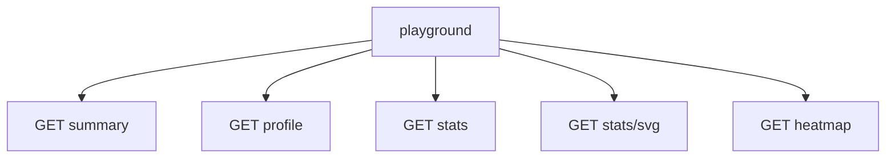

# Dashboard

`GET /` is the GFG profile explorer. Bar chart for difficulty, cards for coding score / institute rank / streaks.

Live [playground](https://gfg-stats.tashif.codes/playground) and [OpenAPI](https://gfg-stats.tashif.codes/docs). Placeholder handle is `demo`.

`/playground` is the same tester the other stats APIs ship. Schemas: [Envelope and schemas](3.1-envelope-and-schemas).

