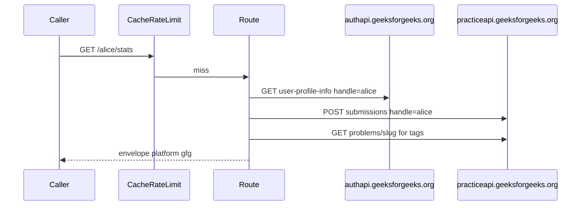

# Envelope and schemas

Same card as LeetCode. `PLATFORM = "gfg"`. Schema category is `fundamentals`. CodeTrace's `fetchCard` currently tags GFG `dsa`. The bucket on `/profile` follows the client.

Try it: [playground](https://gfg-stats.tashif.codes/playground), [OpenAPI](https://gfg-stats.tashif.codes/docs), sample [tashif_ahmad_khan](https://gfg-stats.tashif.codes/tashif_ahmad_khan/profile). Placeholder handle in the HTML is `demo`.

## Input

No body, no auth. Path param is `username`.

Heatmap query: `view=all|last_365|year` plus `year`. Deprecated aliases `range=all|last365days|year` and unused `month` still parse. Prefer `view`.

SVG query: `theme=dark|light`, `exclude` comma-separated topic names.

```http
GET /tashif_ahmad_khan/stats HTTP/1.1
Host: gfg-stats.tashif.codes

GET /tashif_ahmad_khan/heatmap?view=last_365 HTTP/1.1
Host: gfg-stats.tashif.codes
```

Server-side upstream input (the browser never sends this):

```http
GET https://authapi.geeksforgeeks.org/api-get/user-profile-info/?handle={username}&article_count=false&redirect=true HTTP/1.1

POST https://practiceapi.geeksforgeeks.org/api/v1/user/problems/submissions/ HTTP/1.1
Content-Type: application/json

{"handle":"tashif_ahmad_khan","requestType":"","year":"","month":""}
```

Headers impersonate the site: `Origin: https://www.geeksforgeeks.org`, `Referer: https://www.geeksforgeeks.org/`, Chrome User-Agent. See [Upstream JSON](5.1-upstream-json).

## Output envelope

```json
{
  "status": "success",
  "message": "retrieved",
  "platform": "gfg",
  "username": "tashif_ahmad_khan",
  "cached": false,
  "data": {}
}
```

Older clients still see flattened `totalProblemsSolved`, `School`, `Basic`, `Easy`, `Medium`, `Hard` next to `data`.

## `data` by route

Profile: `displayName` from `info.fullName`, `username` from `userName`, `avatar` from `profilePicture`, `institution` from `institute`.

Stats `byDifficulty` is the reason the shared dict is not three LeetCode fields:

```json
{
  "totalSolved": 412,
  "totalQuestions": null,
  "acceptanceRate": null,
  "byDifficulty": {
    "school": 10,
    "basic": 40,
    "easy": 120,
    "medium": 180,
    "hard": 62
  },
  "topicAnalysis": [
    { "topic": "Arrays", "count": 80 }
  ]
}
```

Contests and rating exist so CodeTrace can loop six paths. Expect empty history / null rating, HTTP 200, not 404.

Heatmap is synthesized from `user_subtime` on solved problems. There is no native GFG calendar. `created_date` drives which years get fetched.

Badges: empty list, `badgesCount=0` on summary.

SVG: `image/svg+xml`, 24h cache.

Deprecated alias `GET /{username}/solved-problems` returns the stats envelope.

Missing user: HTTP 404 `User '{handle}' not found on GeeksForGeeks` when authapi says so.

## Request / response cycle



Full Redis walk: [Request path](5.2-request-path).
