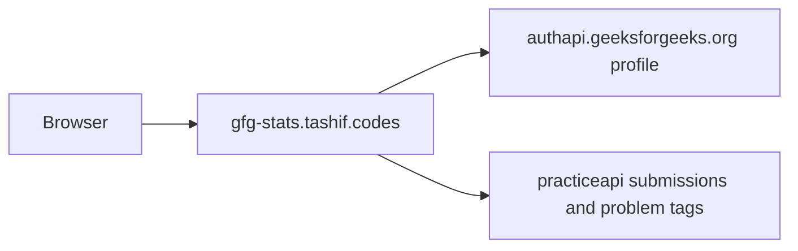

# Architecture

Same FastAPI family as LeetCode: CORS `*`, `CacheRateLimitMiddleware(platform="gfg")`, additive envelope, SVG card, HTML `/` and `/playground`. Path param is `username`. Built-in `python app.py` binds `58353`, which collides with Codeforces. Use 8004.

Full Redis walk (cache key, invalid-user 404, 60/30 limits, env table, mermaid) is on [Request path](5.2-request-path).

`routers/` is an empty leftover. Live routes are under `routes/`.

There is no official documented GFG stats API. This service impersonates a browser against the JSON the site already uses. An old `geeks-for-geeks-api.vercel.app` URL is still copied into several files and never called.

Contests, rating, and badges routes exist so CodeTrace can loop the same six paths. They return empty models, not 404. `summary_from` hardcodes `totalContests=0` and `badgesCount=0`.
