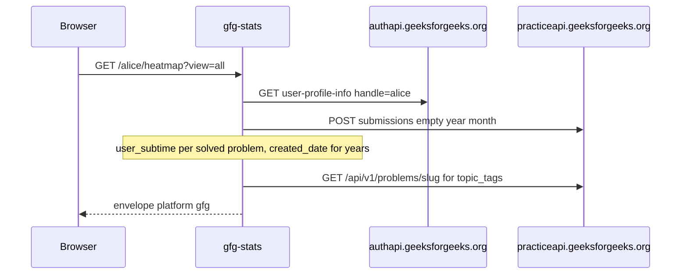

# Upstream JSON

GFG's public pages used to be HTML. This API does not scrape them anymore. It impersonates a browser against the JSON the site already calls. An old `geeks-for-geeks-api.vercel.app` URL is still copied into several files and never called.

Playground: [gfg-stats.tashif.codes/playground](https://gfg-stats.tashif.codes/playground).

Live work is `services/profile.py` and `services/heatmap.py`.

```http
GET https://authapi.geeksforgeeks.org/api-get/user-profile-info/?handle={username}&article_count=false&redirect=true
POST https://practiceapi.geeksforgeeks.org/api/v1/user/problems/submissions/
GET https://practiceapi.geeksforgeeks.org/api/v1/problems/{slug}/
```

The POST body is `{"handle","requestType":"","year":"","month":""}`. Heatmap counts `user_subtime` on solved problems. There is no native calendar. Account `created_date` drives which years get fetched (`today` down to signup). The route still accepts deprecated `range=last365days` and unused `month`. Canonical path fetches full history then `window_heatmap`.

Topics: `build_topic_analysis` hits the problem JSON for tags. Tags are static, so `_TAG_CACHE` lives for the process lifetime. That is the only extra cache. HTTP cache is Redis like the siblings.

Mapper: `info.fullName` → displayName, `userName` → username, `profilePicture` → avatar, `institute` → institution. Stats use `totalProblemsSolved` plus `solvedStats` keys `school|basic|easy|medium|hard`. Those school/basic keys are why the shared `byDifficulty` object is a dict, not three LeetCode fields.

`favicon.ico` as a username is treated as invalid. Easy to hit if a browser requests the icon against the API host.

## End-to-end walk

Headers on every call: Chrome UA, `Accept: application/json`, plus Origin/Referer of `www.geeksforgeeks.org` on the topic GETs.



1. Profile GET. `payload.data` missing → 404 `User profile information not found`.
2. Submissions POST. `status == failed` → 404. `result` missing → 422.
3. `solvedStats` keys `school|basic|easy|medium|hard`. Each problem has `pname`, `slug`, `user_subtime`.
4. Heatmap: no calendar endpoint. Count submissions by day from `user_subtime`. Walk years from `created_date` to today. Then `window_heatmap` for `view`.
5. Topics: `GET practiceapi .../problems/{slug}/` → `results.tags.topic_tags`. Process `_TAG_CACHE` for the life of the worker.
6. Timeouts: 504. Connect errors: 503. Non-JSON: 422. 400/404/406 with `user not found` / `valid user details` → 404.

Contests, rating, badges never hit extra upstream. Empty models after the profile fetch proves the user exists.
