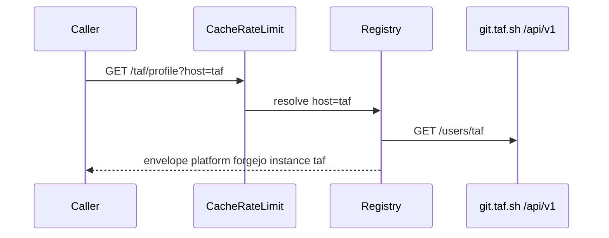

# Envelope and schemas

Same card family, extra keys. `platform` is `"forgejo"` or `"gitea"` from a live `/api/v1/version` probe, not a hardcoded string. Envelope also has `instance` and `software`.

There is no `githost-stats.tashif.codes` host. Local [playground](http://127.0.0.1:8008/playground) and [OpenAPI](http://127.0.0.1:8008/docs). Sample path `/taf/profile?host=git.taf.sh`. CodeTrace does not call this API.

## Input

Every username route needs a target. Three ways:

| How | Example |
| --- | --- |
| registry key | `GET /taf/profile?host=codeberg` |
| custom origin | `GET /taf/stats?base_url=https://git.taf.sh` |
| embed prefix | `GET /f/codeberg/taf/stats/svg?theme=dark` |

Missing host is 400 `"No host selected."`, not "guess the first registry entry".

Other query:

| Param | Where | What |
| --- | --- | --- |
| `view`, `year` | heatmap | same window as siblings |
| `deep` | summary, stats, heatmap | continue the commit walk |
| `theme`, `exclude` | stats / svg | card |
| `emails` | any | extra commit emails for identity |

```http
GET /taf/heatmap?host=codeberg&view=all&deep=true HTTP/1.1
Host: 127.0.0.1:8008
```

Server-side Gitea-family REST. No GitHub API. SSRF on custom `base_url`: https:443 only, CGNAT/Tailscale blocked. See [SSRF and registry](5.2-ssrf-and-registry) and [Why not GitHub's API](5.1-why-not-github-api).

```http
GET {origin}/api/v1/version HTTP/1.1
GET {origin}/api/v1/users/{username} HTTP/1.1
GET {origin}/api/v1/users/{username}/repos HTTP/1.1
GET {origin}/api/v1/users/{username}/heatmap HTTP/1.1
```

Deep walk lists commits on owned default branches and filters author here. Upstream swagger has no author/since/until that actually works.

## Output envelope

```json
{
  "status": "success",
  "message": "retrieved",
  "platform": "forgejo",
  "username": "taf",
  "instance": "codeberg",
  "software": { "name": "forgejo", "version": "11.0.0" },
  "cached": false,
  "data": {}
}
```

`instance` is the registry key or the hostname for custom URLs. `software` is after an 8s probe, cached 24h at `githost:probe:{base_url}`.

## `data` by route

Profile: `full_name`, `login`, `avatar_url`, `location`, `description`, `website`. `verified` is forge `active`.

Stats: language bytes from owned public non-mirror repos → `topicAnalysis`. Commits map like GitHub (`totalSolved`).

Heatmap extras on the block: `source` (`native` | `synthesized`), `complete`. Native counts actions and caps ~371 days. `deep=true` rebuilds from commits. Never splice the two metrics at the seam. See [Deep history](4-deep-history).

Badges: derived (`mappers.derive_badges`), not a forge achievement API.

Repos / orgs: first-class. Orgs may come back `restricted` without a token for that instance.

No contests or rating routes. Planned and not shipped: `/{username}/stars`, `/languages`, `/activity`, `?type=` to skip the probe.

SVG: `image/svg+xml`. Prefix form is `include_in_schema=False` so Swagger stays on the query form.

## Errors

Bare `/{username}` without host: 400. Unknown registry key: 404 listing keys. Custom base with private IP: blocked. User missing: 404 `User does not exist`.

## Request / response cycle



[Request path](5.3-request-path) for Redis, skip list (`/playground`, `/healthz`), and `/f/{host}/` handle extraction.
