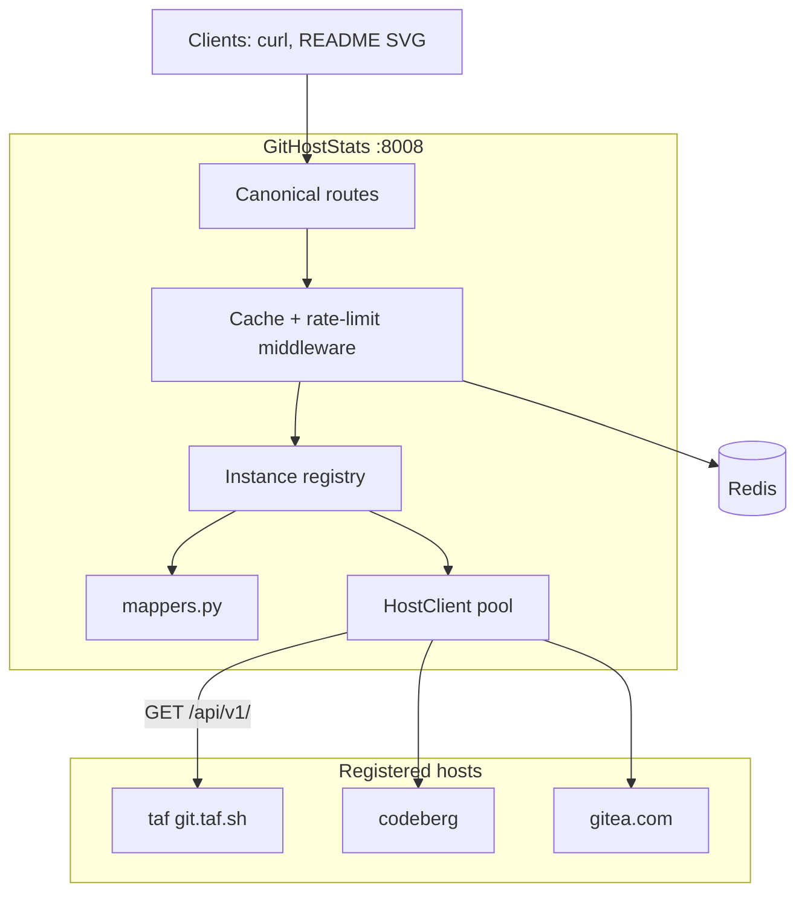

# Architecture

One FastAPI service for every Gitea-family host. Named after the protocol, not a product. Local port 8008. Design writeup: [dump 038](https://dump.taf.sh/d/038_githoststats-one-api-every-git-host-plan/).

Shipped layout is close to the dump mermaid. Mappers live in `services/mappers.py` (no separate `canonical_mapper.py`). Badges are `mappers.derive_badges`.

Bare `/{username}` is rejected. No implicit first registry entry. Three ways in: `?host=`, `?base_url=`, `/f/{host}/{username}/...`.

`platform` is the family from `/api/v1/version`: `+gitea` in the string or major ≥ 2 → `forgejo`, else `gitea`. `instance` is the registry key or the hostname for custom URLs. `software` is `{name, version}` after an 8s probe, cached 24h at `githost:probe:{base_url}`.

`CacheRateLimitMiddleware(platform="githost")`. Skip list includes `/playground` and `/healthz`. Handle extraction understands `/f/{host}/{username}`. Full Redis walk, plus history keys `host:{instance}:histman:` / `hist:`, is on [Request path](5.3-request-path).

Planned and not shipped: `/{username}/stars`, `/languages`, `/activity`, contests/rating null routes, `?type=` to skip the probe, merge-commit skip, self-mode `/user/emails`. CodeTrace does not call this API.
