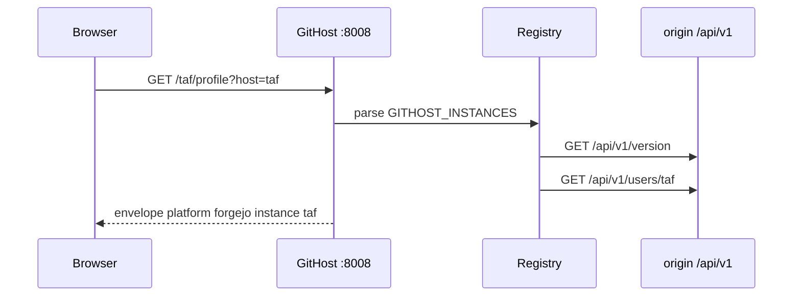

# Why not GitHub's API

GitHub is `/api/v3` plus GraphQL, OAuth device flow, and GitHub-only schemas. Forgejo kept Gitea's `/api/v1`. `gh` + `GH_HOST` against `git.taf.sh` is a dead end (dump 036). This service is the sibling of GitHub-Stats-API, pointed at that REST.

Live probes while writing the plan:

```bash
curl -s https://git.taf.sh/api/v1/version
# {"version":"16.0.3+gitea-1.22.0"}

curl -s https://git.taf.sh/api/v1/settings/api
# max_response_items 50, default_paging_num 30
```

What `/api/v1` gives anonymously on public data: user profile, repos, starred, orgs, activity feeds, a first-class heatmap, commits with server-side author filters that **do not actually exist** on this swagger (the walk filters here), per-repo languages.

Rejected names: `ForgeStats` (jargon), `Gitea-Stats-API` / `Forgejo-Stats-API` (each excludes a host), `forgefolio`, `anvil` (Foundry), `Instance-Stats-API` (buries git). Envelope still names the host via `instance` and `software`.

Native heatmap counts **actions**, not commits, and caps at about 371 days. That is why `deep=true` exists. See [Deep history](4-deep-history).

Local playground (no live hostname): `http://127.0.0.1:8008/playground`. Sample `/taf/profile?host=git.taf.sh`.

## End-to-end walk



Custom `?base_url=` runs SSRF first (https:443, no CGNAT). Tokens from `GITHOST_TOKEN_<KEY>` never go to the caller. [SSRF and registry](5.2-ssrf-and-registry). Deep heatmap walk: [Deep history](4-deep-history).
