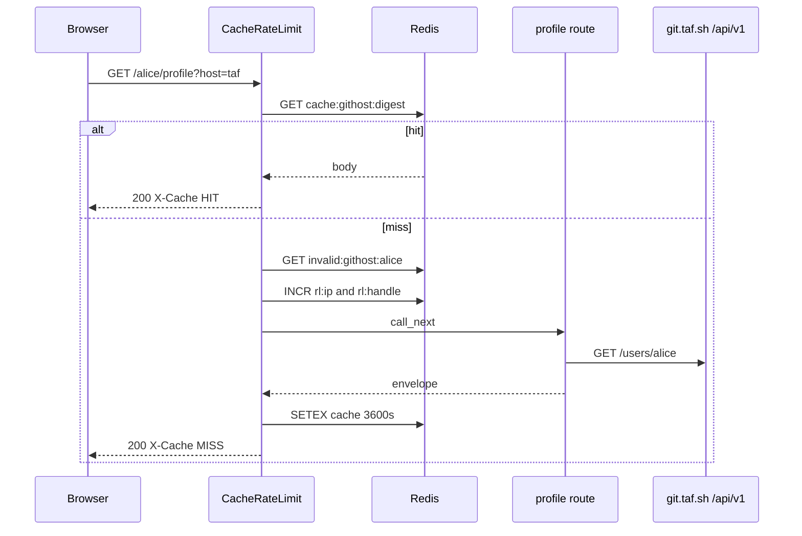

# Request path

Walk of `GET /alice/profile?host=taf` with Redis on. `platform="githost"`. There is no live `*-stats.tashif.codes` host for this service. Local port 8008.

GitHost's skip list is wider than the coding-platform siblings, and the handle is not always the first path segment.

1. CORS middleware (added first, runs second).
2. `CacheRateLimitMiddleware` with `platform="githost"` (added last, runs first).
3. Skip check. Path is not `/`, `/playground`, `/healthz`, `/docs`, `/redoc`, `/openapi.json`, `/favicon.ico`. Method is GET. Redis is on. `/playground` **is** skipped here. The LeetCode-family APIs do not skip it.
4. Handle from `_handle_from_path`. `/{username}/profile` → `alice`. `/f/{host}/{username}/profile` strips `f` and the host key, then takes the username. Rate limit is on the username so one caller cannot spread load across hosts. A segment with a `.` is skipped.
5. Cache key is `cache:githost:{sha256(GET:/alice/profile:sorted_query)}`. Query is part of the digest, so `?host=taf` and `?host=codeberg` are different bodies.
6. On HIT, body is base64-decoded and returned with `X-Cache: HIT`. Done.
7. Negative key `invalid:githost:alice`. On HIT, HTTP 404 `User does not exist`, `X-Cache: NEGATIVE-HIT`. Invalid-user rate limits apply (10/IP and 5/handle per 10 minutes).
8. Live limits: 60 req/min per IP, 30 req/min per handle. Over: 429 with `Retry-After` and exponential backoff 5s to 300s.
9. Route resolves the instance (`?host=`, `?base_url=`, or `/f/{host}/`), SSRF-checks custom URLs, then `GET /api/v1/users/alice`.
10. Mapper builds the envelope. HTTP 200 cached for 3600s unless `Cache-Control` says otherwise. `X-Cache: MISS`.

Without Redis, steps 5 to 8 disappear. Deep history also has nothing to store. `HistoryService.refresh` returns empty days and `complete: false`.

`redis_enabled()` is true if `REDIS_URL` is set, or both `UPSTASH_REDIS_REST_URL` and `UPSTASH_REDIS_REST_TOKEN`.

Invalid-user markers are slightly shorter: `user does not exist`, `user not found`, `not found`. No `invalid username`. HTTP 404 is always a ghost.

IP is `X-Forwarded-For` first hop, else `X-Real-IP`, else `request.client.host`.

Bare `/{username}` is rejected by the router. Middleware still extracts handle `alice` if someone hits it. `/healthz` is skipped, so it never becomes handle `healthz`.

## Extra Redis keys

HTTP cache is the family shape. Deep history and probes use their own keys. Those are **not** written by `CacheRateLimitMiddleware`.

- `githost:probe:{base_url}` is the `/api/v1/version` result, 24h (`GITHOST_VERSION_TTL`)
- `host:{instance}:histman:{username}` is the per-repo walk manifest, keyed by `repo.id`
- `host:{instance}:hist:{username}:{repo_id}` is the day histogram, TTL `GITHOST_HIST_TTL` (30d)

See [Deep history](4-deep-history) for the walk. Without Redis, `view=all&deep=true` cannot accumulate.

## Redis env

| Env | Default |
| --- | --- |
| `REDIS_URL` | unset |
| `UPSTASH_REDIS_REST_URL` + `UPSTASH_REDIS_REST_TOKEN` | unset |
| `API_CACHE_TTL_SECONDS` | 3600 |
| `INVALID_USER_CACHE_TTL_SECONDS` | 300 |
| `RATE_LIMIT_IP_REQUESTS` | 60 per 60s |
| `RATE_LIMIT_HANDLE_REQUESTS` | 30 per 60s |
| `INVALID_RATE_LIMIT_IP_REQUESTS` | 10 per 600s |
| `INVALID_RATE_LIMIT_HANDLE_REQUESTS` | 5 per 600s |
| `RATE_LIMIT_BACKOFF_BASE_SECONDS` | 5 |
| `RATE_LIMIT_BACKOFF_MAX_SECONDS` | 300 |
| `GITHOST_HIST_TTL` | 30 days |
| `GITHOST_VERSION_TTL` | 86400 |

HTTP keys:

- `cache:githost:{sha256}`
- `invalid:githost:{handle}`
- `rl:ip:githost:{ip}` / `rl:handle:githost:{handle}`
- `backoff:{same}` / `violations:{same}`
