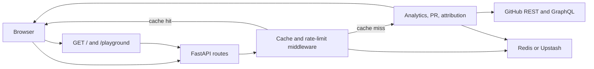

# GitHub analytics API

FastAPI service that turns a public GitHub username into stats, language splits, contribution history, repos, PRs, and embeddable cards. Live at [github-stats.tashif.codes](https://github-stats.tashif.codes). Source is [tashifkhan/GitHub-Stats-API](https://github.com/tashifkhan/GitHub-Stats-API).

Callers do not send a GitHub token. The server uses `GITHUB_TOKEN` and talks to GitHub's REST and GraphQL APIs. Redis, either `REDIS_URL` or Upstash REST, caches successful GETs and stores own-commit attribution so later requests do not start from zero.

CodeTrace consumes the canonical card routes. Sibling APIs for the other platforms: [LeetCode](/docs/leetcode-stats-api/1-overview), [Codeforces](/docs/codeforces-stats-api/1-overview), [GFG](/docs/gfg-stats-api/1-overview), [CodeChef](/docs/codechef-stats-api/1-overview), [HackerRank](/docs/hackerrank-stats-api/1-overview), [TUF](/docs/tuf-stats-api/1-overview), [GitHost](/docs/githost-stats-api/1-overview). Dashboard: [CodeTrace](/docs/codetrace/1-overview).

## Docs map

- [Overview](1-overview)
- [Interactive dashboard](2-dashboard)
- [API endpoints, general](3-api-general)
- [Envelope and schemas](3.1-envelope-and-schemas)
- [User analytics](4-user-analytics)
- [Pull requests and organizations](5-api-pulls-orgs)
- [Dashboard details](6-api-details)
- [Error handling](7-errors)
- [Architecture](8-architecture)
- [Own-commit attribution](8.1-own-commit-attribution)
- [Cache and limiter](8.2-cache-and-limiter)
- [Canonical vs extras](8.3-canonical-vs-extras)
- [HTML scrapes](8.4-html-scrapes)

## What it returns

Type a username and the service pulls several GitHub surfaces into JSON, plus one SVG card.

- **Canonical card.** Shared envelope used by CodeTrace: summary, profile, stats, heatmap, badges.
- **Language mix.** Own-commit attribution by default, so forks count the patches the user wrote, not the upstream tree.
- **Contribution history.** Calendar, streaks, and a per-repo breakdown of additions and deletions.
- **Repository metadata.** README, topics, optional releases, stars, pins, starred lists, commits.
- **PRs.** Owned-repo pulls, external pulls, and orgs where a merged PR landed.

## Request flow

The HTML docs and playground are FastAPI routes on the same app. JSON routes go through cache and rate-limit middleware, then services, then GitHub.

`/` and `/docs` skip the Redis cache. Username GETs hash method, path, and query into `cache:github:...`. A 404 for a missing user is stored separately as `invalid:github:{handle}` so the app does not keep asking GitHub for ghosts.

## Live access

- Site: [github-stats.tashif.codes](https://github-stats.tashif.codes)
- Playground: [github-stats.tashif.codes/playground](https://github-stats.tashif.codes/playground)
- OpenAPI: [github-stats.tashif.codes/docs](https://github-stats.tashif.codes/docs)
- ReDoc: [github-stats.tashif.codes/redoc](https://github-stats.tashif.codes/redoc)
- Sample JSON: [tashifkhan/profile](https://github-stats.tashif.codes/tashifkhan/profile)
- Repo: [github.com/tashifkhan/GitHub-Stats-API](https://github.com/tashifkhan/GitHub-Stats-API)

## Run it locally

Needs Python, a GitHub token, and preferably Redis if you care about attribution.

1. Clone [GitHub-Stats-API](https://github.com/tashifkhan/GitHub-Stats-API).
2. Install from `requirements.txt`.
3. Set `GITHUB_TOKEN` in `.env`.
4. Optionally set `REDIS_URL`, or `UPSTASH_REDIS_REST_URL` plus `UPSTASH_REDIS_REST_TOKEN`.
5. `python main.py` serves `http://localhost:8989`. Override with `HOST` and `PORT`.

Vercel maps every path to `main.py`.
