# Interactive dashboard

The root URL is a custom HTML docs page, not a JSON payload. `/playground` is the live tester: one username, then run any canonical route against the same origin.

## Docs homepage

`GET /` returns the Command-Code HTML shell. It lists canonical paths, shows the shared envelope, and links to OpenAPI, ReDoc, the playground, and the GitHub repo. Search in the left nav filters those links client-side.

Recent playground lookups live in `localStorage` under `pg_recent_github`. The list keeps six handles. Clearing it only affects that browser.

## Playground

`GET /playground` is the UI the old "profile stalker" README was pointing at. Enter a GitHub username, then Run all or fire one row.

- Path templates such as `/{username}/stats` get the input substituted and URL-encoded.
- Each row shows status, latency, formatted fields, and raw JSON.
- `/{username}/stats/svg` has `theme` and `exclude` controls and renders the SVG inline.
- Run all walks the canonical list in parallel and fills a progress bar.

Nothing is proxied to a third-party API from the playground. The browser calls this FastAPI app. The app still uses the server `GITHUB_TOKEN` when it hits GitHub.

## UI data sources

The playground does not invent a second backend. Each card is one GET on the live API.

```mermaid
flowchart TB
  UI["Playground form"]
  Summary["GET /{username}"]
  Profile["GET /{username}/profile"]
  Stats["GET /{username}/stats"]
  Svg["GET /{username}/stats/svg"]
  Heat["GET /{username}/heatmap"]
  Badges["GET /{username}/badges"]
  Lang["GET /{username}/languages"]
  Contrib["GET /{username}/contributions"]
  Repos["GET /{username}/repos"]
  Commits["GET /{username}/commits"]
  Stars["GET /{username}/stars"]
  Pulls["GET /{username}/me/pulls"]
  Orgs["GET /{username}/org-contributions"]
  Prs["GET /{username}/prs"]

  UI --> Summary
  UI --> Profile
  UI --> Stats
  UI --> Svg
  UI --> Heat
  UI --> Badges
  UI --> Lang
  UI --> Contrib
  UI --> Repos
  UI --> Commits
  UI --> Stars
  UI --> Pulls
  UI --> Orgs
  UI --> Prs
```

Those are the rows in `CANONICAL_ENDPOINTS` inside `routes/docs.py`. The playground does not auto-run `/{username}/contributions/breakdown`, `/{username}/pinned`, `/{username}/star-lists`, or `/{username}/profile-views`. Those still exist. Call them from curl, OpenAPI, or by editing the URL.

## What the JSON is for

Clients that are not the playground usually want a slice, not every row.

| You want | Call |
| --- | --- |
| Name, avatar, bio, social | `GET /{username}/profile` |
| Commits plus language topics | `GET /{username}/stats` |
| Contribution calendar | `GET /{username}/heatmap` or `GET /{username}/contributions` |
| README and topics for a portfolio | `GET /{username}/repos` |
| Releases and commit counts | `GET /{username}/repos?full=true` |
| Own-commit language mix | `GET /{username}/languages` and `GET /{username}/contributions/breakdown` |
| README badge | `GET /{username}/stats/svg` |

## Search history

Focus the username field to reopen recent handles. The list is local only. It is not a server-side history API.
