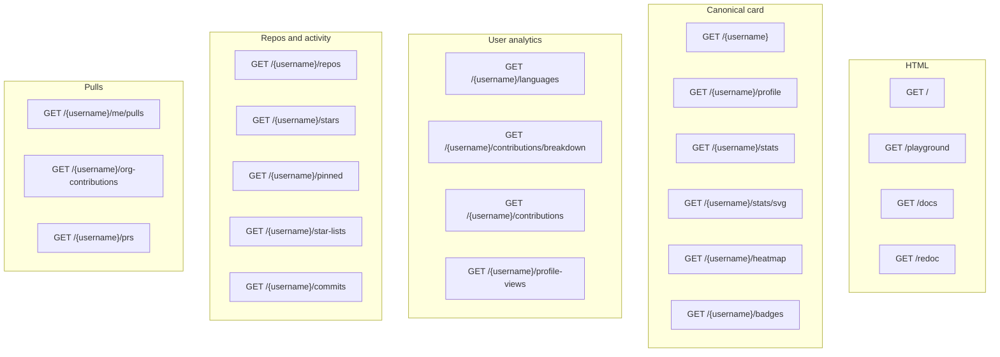

# API endpoints: general

HTML shells, OpenAPI, the shared JSON envelope, and how routes group. Username paths are documented on the later pages.

## HTML and explorers

### Docs homepage

- **Method and path.** `GET /`
- **Response.** `text/html`. Custom docs, not the JSON API.

```bash
curl -s https://github-stats.tashif.codes/
```

### Playground

- **Method and path.** `GET /playground`
- **Live.** [github-stats.tashif.codes/playground](https://github-stats.tashif.codes/playground)
- **Response.** `text/html`. Browser tester that calls the JSON routes on the same host.

Canonical field list: [Envelope and schemas](3.1-envelope-and-schemas). HTML-only GitHub surfaces: [HTML scrapes](8.4-html-scrapes).

### Swagger UI

- **Method and path.** `GET /docs`
- **Response.** FastAPI's OpenAPI explorer. Models, query params, and try-it requests.

### ReDoc

- **Method and path.** `GET /redoc`
- **Response.** Three-panel reading view of the same OpenAPI spec.

`GET /openapi.json` is the spec those two pages render.

## Response envelope

Canonical routes wrap the payload. `status`, `platform`, `username`, `cached`, and `data` are always present. `/{username}/stats` and `/{username}/contributions` also flatten the older fields next to `data` so existing clients keep working.

```json
{
  "status": "success",
  "message": "retrieved",
  "platform": "github",
  "username": "tashifkhan",
  "cached": false,
  "data": {}
}
```

`cached` on the envelope is set by the mapper. Redis cache hits also send `X-Cache: HIT` on the HTTP response.

Legacy-shaped lists such as `/{username}/languages` and `/{username}/repos` return arrays, not this envelope.

## Auth

JSON routes do not take a caller token. Missing `GITHUB_TOKEN` on the server is `500` with `GitHub token not configured`. CORS allows any origin.

## Endpoint groups



`routes/api.py` is not mounted. Do not call those duplicate handlers. They are leftovers.

## Base URL

Production: `https://github-stats.tashif.codes`

Local default: `http://localhost:8989`

Replace `{username}` with a GitHub login. Query params are optional unless a page says otherwise.
