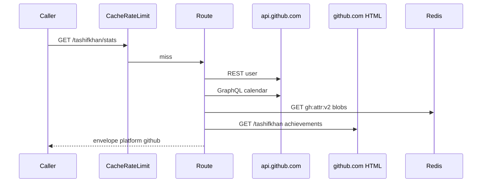

# Envelope and schemas

`PLATFORM = "github"`, `CATEGORY = "development"`. Canonical card plus first-class extras that coding platforms do not have.

Try it: [playground](https://github-stats.tashif.codes/playground), [OpenAPI](https://github-stats.tashif.codes/docs), sample [tashifkhan](https://github-stats.tashif.codes/tashifkhan/profile). Placeholder handle in HTML is `demo`.

Callers send no GitHub token. Server uses `GITHUB_TOKEN`. Missing token is 500 `GitHub token not configured`.

## Input

Path `username`. No body.

Canonical query:

| Param | Routes | What |
| --- | --- | --- |
| `view`, `year` | heatmap | window |
| `theme`, `exclude` | stats, svg | card. `excluded` repeatable query wins if present |
| `attributed` | stats, languages | default `true` |

Extras: `full` on repos, `include_repos` on star-lists, `first=1..6` on pinned, `source` ignored (portfolio cache-buster).

```http
GET /tashifkhan/stats?attributed=true HTTP/1.1
Host: github-stats.tashif.codes

GET /tashifkhan/stats/svg?theme=dark&exclude=HTML,CSS,Markdown HTTP/1.1
Host: github-stats.tashif.codes
```

There are **no** `/{username}/contests` or `/{username}/rating` routes. CodeTrace still asks. Those 404. The client turns a failed section into an empty stub.

Server-side: GitHub REST + GraphQL, plus HTML scrapes where GitHub has no API. See [HTML scrapes](8.4-html-scrapes).

## Output envelope

Canonical routes:

```json
{
  "status": "success",
  "message": "retrieved",
  "platform": "github",
  "username": "tashifkhan",
  "cached": false,
  "data": {}
}
```

`/{username}/stats` and `/{username}/contributions` also flatten older fields: `topLanguages`, `totalCommits`, `longestStreak`, `currentStreak`, `profile_visitors`, `contributions`.

Legacy-shaped lists (`/{username}/languages`, `/{username}/repos`, `/{username}/me/pulls`) return arrays, not this envelope.

## Canonical `data`

Summary: `totalSolved` is total commits. `totalActiveDays` is days with a contribution. Contests fields on the Card object are empty `Contests()` / `Rating()` inside `build_card`, but those routes do not exist.

Profile: `country` is GitHub location.

Stats: languages → `topicAnalysis` with `count = round(percentage)`. `byDifficulty` keys `commits`, optional `prs` / `issues` / `reviews`.

Heatmap: GraphQL calendars, then `window_heatmap`.

Badges: scraped profile achievements (Pull Shark, YOLO, …). `level` is the tier label when present.

SVG extras for GitHub only: `totalStars`, `currentStreak`, `longestStreak` as `{n}d`. Label "Total Commits" / "TOP LANGUAGES". Accent `#3fb950`. `Cache-Control` 24h.

## Extra routes

```http
GET /{username}/languages
GET /{username}/contributions
GET /{username}/contributions/breakdown
GET /{username}/repos?attributed&full
GET /{username}/stars
GET /{username}/pinned?first=1..6
GET /{username}/star-lists?include_repos
GET /{username}/commits
GET /{username}/profile-views
GET /{username}/me/pulls
GET /{username}/org-contributions
GET /{username}/prs
```

Breakdown `status`: `complete`, `deadline`, `rate_limited`, `cache_disabled`. Check `coverage` / `partial` / `cache_enabled` before treating an empty mix as "this user writes no code".

Playground list in `routes/docs.py` omits breakdown, pinned, star-lists, profile-views. Those routes still exist.

## Errors

| HTTP | When |
| --- | --- |
| 400 | bad heatmap window |
| 404 | missing user, or Redis negative cache |
| 429 | this API's limiter |
| 500 | no `GITHUB_TOKEN` |
| 502 | GitHub error that is not 404 and not throttle |
| 503 | GitHub primary/secondary rate limit. Do not treat as missing user |

GitHub 403 with `x-ratelimit-remaining: 0` is 503, not 404. Mapping throttle to 404 used to blacklist a real login.

JSON arrays from `/repos` are never inspected for invalid-user markers.

## Request / response cycle



[Cache and limiter](8.2-cache-and-limiter). [Own-commit attribution](8.1-own-commit-attribution). [HTML scrapes](8.4-html-scrapes).
