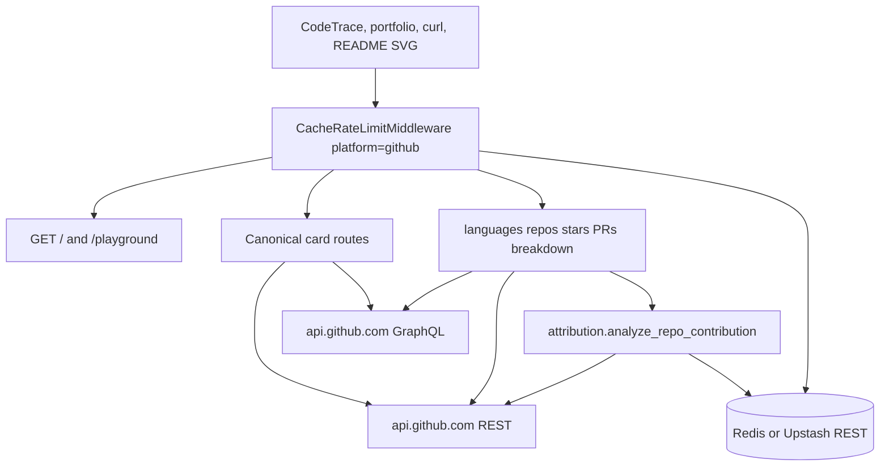

# Architecture

GitHub is the heavy sibling. Coding-platform APIs scrape one page or one contest API. This one walks commit diffs so language bars count the user's patches, not the upstream tree of a Linux fork.

Live: [github-stats.tashif.codes](https://github-stats.tashif.codes). Playground: [github-stats.tashif.codes/playground](https://github-stats.tashif.codes/playground). Callers never send a token. The server uses `GITHUB_TOKEN`. Redis is both an HTTP cache and a progress store for attribution. Full middleware walk is on [Cache and limiter](8.2-cache-and-limiter). Achievements and star lists are HTML scrapes: [HTML scrapes](8.4-html-scrapes).

## Why this shape

GitHub's language API is whole-tree bytes. A fork of Linux looks like C. A popular repo with one commit from you looks like the maintainers' stack. Default is `attributed=true`: count commits `author={username}`, skip vendored paths, and if the walk cannot finish, return a thin own-commit mix rather than a pretty lie.

That walk is hundreds of REST calls. Vercel Hobby is about 10s. Redis stores finished repos keyed by `pushed_at`. The next request spends a few seconds of new work. Coverage is public: `coverage`, `partial`, `status`, `cache_enabled`.

## Routers mounted in `main.py`

docs, profile, heatmap, badges, summary, analytics, PRs. `routes/api.py` is imported as a comment only. Duplicate handlers there are leftovers and some of them forget `await`. Do not call them.

`middleware/rate_limiter.py` is a dead SlowAPI limiter (`15/minute`, `700/day`). Nothing mounts it. Live policy is `core/middleware.py`.

Local bind default is port **8989**. `RUNNING.md` pins **8001**.
