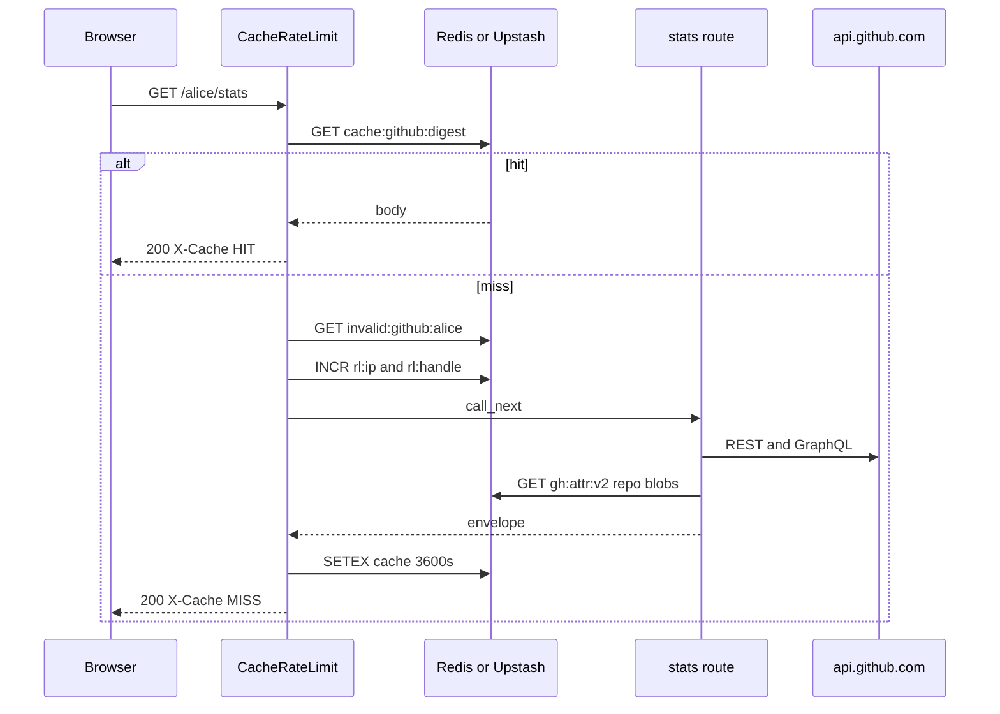

# Cache and limiter

Walk of `GET /alice/stats` with Redis on. `platform="github"`. GitHub is the sibling that also stores own-commit attribution in Redis. Those keys are separate from the HTTP cache.

`redis_enabled()` is true if `REDIS_URL` is set, or both `UPSTASH_REDIS_REST_URL` and `UPSTASH_REDIS_REST_TOKEN`. Wire URL wins when both exist. Upstash is HTTP GET/SET/INCR. Vercel often provisions only REST, so an empty `REDIS_URL` used to mean no cache, no limiter, and no persistent attribution.

1. CORS middleware (added first, runs second).
2. `CacheRateLimitMiddleware` with `platform="github"` (added last, runs first).
3. Skip check. Path is not `/`, `/docs`, `/redoc`, `/openapi.json`, `/favicon.ico`, and does not start with `/docs/` or `/redoc/`. Method is GET. Redis is on. First path segment containing `.` is skipped.
4. Handle is the first path segment, lowercased: `alice`.
5. Cache key is `cache:github:{sha256(GET:/alice/stats:sorted_query)}`.
6. On HIT, body is base64-decoded and returned with `X-Cache: HIT`. Done. Attribution is not walked.
7. Negative key `invalid:github:alice`. On HIT, HTTP 404 `User does not exist`, `X-Cache: NEGATIVE-HIT`. Invalid-user rate limits apply (10/IP and 5/handle per 10 minutes).
8. Live limits: 60 req/min per IP, 30 req/min per handle. Over: 429 with `Retry-After` and exponential backoff 5s to 300s.
9. Route talks to `api.github.com`. Language bars may read `gh:attr:v2:{full_name}:{user}:{pushed_at}`. SVG sets `max-age=86400`, so middleware stores 24h.
10. `make_envelope` wraps JSON. HTTP 200 cached for 3600s unless `Cache-Control` says otherwise. `X-Cache: MISS`.

Without Redis: no response cache, no this-API rate limit, no attribution accumulation. GitHub's 5000/hour token budget still applies. Walks still honor `ATTRIBUTION_RATE_LIMIT_FLOOR`.

JSON arrays from `/repos` and `/pinned` are never inspected for invalid-user markers. Only dict envelopes and HTTP 404 count as ghosts.

GitHub 403 with `x-ratelimit-remaining: 0` is HTTP **503**, not 404. Mapping throttle to 404 used to blacklist a real login in the invalid-user cache. `raise_for_github_status` is the guard.



IP is `X-Forwarded-For` first hop, else `X-Real-IP`, else `request.client.host`. Vercel sits in front, so the forwarded header is the one that matters.

`/playground` is not in `SKIP_PATHS`. With Redis on, the first path segment is treated as handle `playground`.

`middleware/rate_limiter.py` is a dead SlowAPI limiter (`15/minute`, `700/day`). Nothing mounts it. Live policy is `core/middleware.py`.

Profile views are **not** Redis. `ProfileViewsService` reads `profile_views.json` in the process cwd. On Vercel that file is ephemeral, so counts reset per instance.

Attribution keys (not written by the HTTP middleware):

```
CACHE_VERSION = v2
gh:attr:v2:{full_name}:{username}:{version_token}
```

`version_token` is `repo.pushed_at`. Truncated walks are returned and **not** cached. See [Own-commit attribution](8.1-own-commit-attribution).

## Redis env

Redis errors fail open: cache miss, rate limit allow.

| Env | Default |
| --- | --- |
| `REDIS_URL` | unset |
| `UPSTASH_REDIS_REST_URL` + `UPSTASH_REDIS_REST_TOKEN` | unset |
| `API_CACHE_TTL_SECONDS` | 3600 |
| `INVALID_USER_CACHE_TTL_SECONDS` | 300 |
| `RATE_LIMIT_IP_REQUESTS` | 60 per 60s |
| `RATE_LIMIT_HANDLE_REQUESTS` | 30 per 60s |
| `INVALID_RATE_LIMIT_IP_REQUESTS` | 10 per 600s |
| `INVALID_RATE_LIMIT_HANDLE_REQUESTS` | 5 per 600s |
| `RATE_LIMIT_BACKOFF_BASE_SECONDS` | 5 |
| `RATE_LIMIT_BACKOFF_MAX_SECONDS` | 300 |

HTTP keys:

- `cache:github:{sha256}`
- `invalid:github:{handle}`
- `rl:ip:github:{ip}` / `rl:handle:github:{handle}`
- `backoff:{same}` / `violations:{same}`
