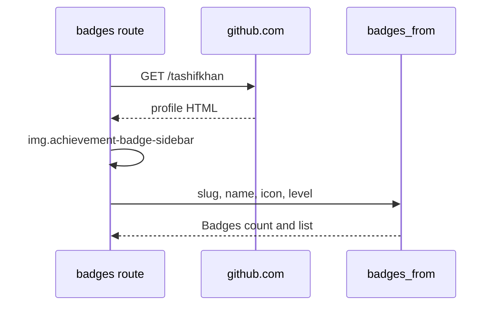

# HTML scrapes

Most of this API is REST and GraphQL with `GITHUB_TOKEN`. Three surfaces have no API, so the server GETs public HTML with a Chrome User-Agent and BeautifulSoup. Failure returns empty lists, not a 500, except star-lists which raise on a non-200 stars tab.

Playground: [github-stats.tashif.codes/playground](https://github-stats.tashif.codes/playground). Badges row is the achievements scrape.

## Achievements → canonical badges

GitHub does not expose Pull Shark / YOLO / Arctic Code Vault through REST or GraphQL. `services/achievements.py::get_user_achievements` loads the public profile.

```http
GET https://github.com/{username} HTTP/1.1
User-Agent: Mozilla/5.0 (X11; Linux x86_64) AppleWebKit/537.36 (KHTML, like Gecko) Chrome/120.0.0.0 Safari/537.36
```

Timeout 15s. Follow redirects. Non-200 or parse failure → `[]`.

Walk:

1. Parse HTML.
2. Find every `img.achievement-badge-sidebar`.
3. Parent `<a href="...?achievement={slug}">`.
4. Deduplicate on slug.
5. Name from `alt` after stripping `Achievement: `, else title-case the slug.
6. Optional `span.achievement-tier-label` → `level`.
7. `icon` is `img.src`.

`badges_from` maps that list onto canonical `Badges`. Empty page means empty badges, HTTP 200, not 404.



## Starred lists

`GET /{username}/star-lists` scrapes the stars tab. REST can list starred repos. It cannot list the named lists UI (`/stars/{user}/lists/...`).

```http
GET https://github.com/{username}?tab=stars HTTP/1.1
```

Parse `#profile-lists-container a[href]`, fallback `div[jscontroller] ul li a`. Keep hrefs that start with `/stars/{username}/lists/`. Name from inner `h3`, description from `.Truncate-text`, repo count from a text node containing `repositories`.

`?include_repos=true` then scrapes each list URL for `owner/repo` slugs (`fetch_repos_from_star_list`). That is a second HTML GET per list.

Non-200 on the stars tab is HTTPException with that status. Empty container is `[]`.

## What is not scraped

Languages, commits, PRs, calendar, profile REST user, pinned (GraphQL), stars totals (REST `stargazers_count`) stay on the API. `BeautifulSoup` imports in `languages.py`, `commits.py`, `profile.py`, `graphql.py`, `contributions.py`, `pull_requests.py` are leftovers from older HTML paths. Live attribution walks commit diffs via REST.

Profile views are a local `profile_views.json`, not GitHub and not Redis.

## Why scrape at all

GitHub's public HTML is the only source for achievements and named star lists. The scrape uses the same HTML a logged-out browser sees. No session cookie. If GitHub renames `achievement-badge-sidebar`, badges go empty until the selector is updated. The JSON envelope stays up.
