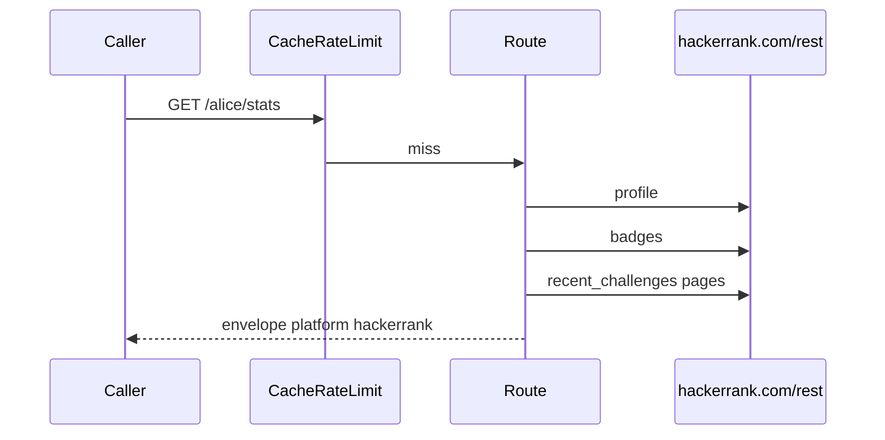

# Envelope and schemas

`PLATFORM = "hackerrank"`. Schema category is `fundamentals`. CodeTrace's `fetchCard` currently tags it `dsa`.

Try it: [playground](https://hackerrank-stats.tashif.codes/playground), [OpenAPI](https://hackerrank-stats.tashif.codes/docs). Placeholder handle is `demo`.

## Input

No body, no auth. Path `username`. Heatmap `view` / `year`. SVG `theme` / `exclude`.

```http
GET /alice/stats HTTP/1.1
Host: hackerrank-stats.tashif.codes
```

Server-side public REST, Chrome Accept + User-Agent, timeout 20s. Profile 404 means the user is missing. Most other endpoints tolerate 404 so a profile without contests still returns a card.

```http
GET https://www.hackerrank.com/rest/contests/master/hackers/{username}/profile HTTP/1.1
GET https://www.hackerrank.com/rest/hackers/{username}/scores_elo HTTP/1.1
GET https://www.hackerrank.com/rest/hackers/{username}/badges HTTP/1.1
GET https://www.hackerrank.com/rest/hackers/{username}/contest_participation?offset=0&limit=50 HTTP/1.1
GET https://www.hackerrank.com/rest/hackers/{username}/rating_histories_elo HTTP/1.1
GET https://www.hackerrank.com/rest/hackers/{username}/submission_histories HTTP/1.1
GET https://www.hackerrank.com/rest/hackers/{username}/recent_challenges?limit=100&response_version=v2 HTTP/1.1
GET https://www.hackerrank.com/rest/contests/master/challenges/{slug} HTTP/1.1
```

`recent_challenges` is the full solved history despite the name. Pagination is `cursor`, max 25 pages. See [Public REST](5.1-public-rest).

## Output envelope

```json
{
  "status": "success",
  "message": "retrieved",
  "platform": "hackerrank",
  "username": "alice",
  "cached": false,
  "data": {}
}
```

`GET /{username}` still flattens `totalSolved`, `ranking`, `practiceScore`, `reputation`, `submissionCalendar` next to `data`.

## `data` by route

Profile: `realName`, `userAvatar`, `countryName`, `school`, `company`, `aboutMe`, websites, github/twitter/linkedin.

Stats: `totalSolved` prefers badge `solved` sums, else unique `ch_slug`s. `practiceScore` is the sum of track scores, not solved-challenge count. Difficulty and acceptance rate are not in public data. `byDifficulty` stays zeros. Topics = challenge `track.name` via process `_TRACK_CACHE`.

Contests: `badge.name` → `rank`, plus `topPercentage` and `globalRanking` when present. Empty history is 200 `history: []`.

Rating: derived from contest history.

Heatmap: submission history keys are epoch seconds or ISO dates. Decoder accepts both. Heatmaps are often empty even when the UI shows activity. Empty days is a 200, not a 404. Levels already 0 to 4 from the decoder.

Badges: active = max stars then level.

SVG: `image/svg+xml`.

## Errors

Profile missing: 404. Other sections tolerate 404 so the card still paints.

`ranking` is the best practice-track rank with score > 0, not a global profile rank. Do not treat it as Codeforces rating rank.

## Request / response cycle



[Request path](5.2-request-path).
