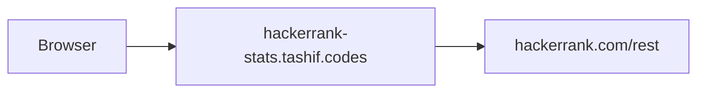

# Architecture

FastAPI port of the LeetCode layout. Comment in `main.py` says so. `create_app()` returns `app`. Built-in port **58352**, same as LeetCode. Use 8006.

No `summary.py`. `GET /{username}` lives in `routes/stats.py`. `routes/legacy.py` is an empty router.

Public REST, no auth. Profile 404 means the user is missing. Most other endpoints tolerate 404 so a profile without contests still returns a card.

`CacheRateLimitMiddleware(platform="hackerrank")`. Full Redis walk (cache key, invalid-user 404, 60/30 limits, env table) is on [Request path](5.2-request-path).

Difficulty and acceptance rate are not in public data. Canonical `byDifficulty` stays zeros. `ranking` is the best practice-track rank with score > 0, not a global profile rank. `practiceScore` is the sum of track scores, not solved-challenge count. `totalSolved` prefers badge `solved` sums, else unique `ch_slug`s.
