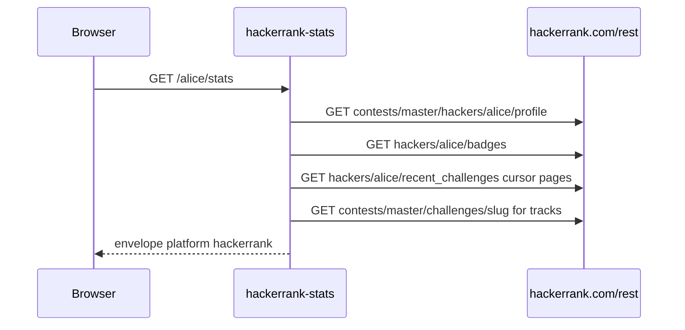

# Public REST

No login. The site still serves `/rest/hackers/...` JSON to a logged-out Chrome UA. This API is a typed proxy, not an HTML scrape. Empty heatmaps are common. That is upstream, not Redis.

Playground: [hackerrank-stats.tashif.codes/playground](https://hackerrank-stats.tashif.codes/playground).

`HackerRankAPI` in `services/client.py`:

```http
GET /rest/contests/master/hackers/{username}/profile
GET /rest/hackers/{username}/scores_elo
GET /rest/hackers/{username}/badges
GET /rest/hackers/{username}/contest_participation?offset=0&limit=50
GET /rest/hackers/{username}/rating_histories_elo
GET /rest/hackers/{username}/submission_histories
GET /rest/hackers/{username}/recent_challenges?limit=100&response_version=v2
GET /rest/contests/master/challenges/{slug}
```

`recent_challenges` is the full solved history despite the name. Pagination is `cursor`, max 25 pages. Timeout 20s.

Submission history keys are epoch seconds **or** ISO dates. Decoder accepts both. Heatmaps are often empty even when the UI shows activity. CodeTrace already treats an empty heatmap as "no calendar", not an error.

Topics = challenge `track.name`, process `_TRACK_CACHE`. Active badge = max stars then level.

Mapper copies `realName`, `userAvatar`, `countryName`, `school`, `company`, `aboutMe`, websites, github/twitter/linkedin. Contests: `badge.name` → rank, plus `topPercentage` and `globalRanking` when present. Rating is derived from contest history. Heatmap levels are already 0 to 4 from the decoder.

## End-to-end walk

Timeout 20s. Follow redirects. Profile missing `model` → `"user does not exist"`. Scores, badges, contests, ratings, submissions, recent challenges tolerate 404 (and recent challenges also 500) so a thin profile still builds a card.



`fetch_all_recent_challenges` loops up to 25 pages. Stops on `last_page`, missing cursor, or cursor equal to the previous one. Challenge detail fills `_TRACK_CACHE` for topic bars.

Submission history keys mix epoch seconds and ISO dates. `parse_submission_history` accepts both. Plenty of real accounts return `{}`. CodeTrace treats an empty heatmap as "no calendar", not an error.
