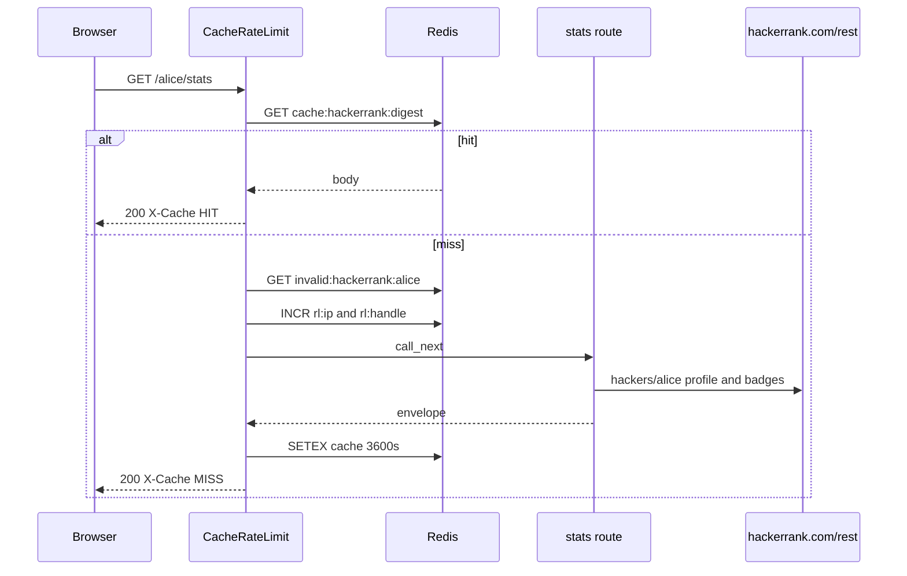

# Request path

Walk of `GET /alice/stats` with Redis on. `platform="hackerrank"`.

1. CORS middleware (added first, runs second).
2. `CacheRateLimitMiddleware` with `platform="hackerrank"` (added last, runs first).
3. Skip check. Path is not `/`, `/docs`, `/redoc`, `/openapi.json`, `/favicon.ico`. Method is GET. Redis is on.
4. Handle is the first path segment, lowercased: `alice`.
5. Cache key is `cache:hackerrank:{sha256(GET:/alice/stats:sorted_query)}`.
6. On HIT, body is base64-decoded and returned with `X-Cache: HIT`. Done.
7. Negative key `invalid:hackerrank:alice`. On HIT, HTTP 404 `User does not exist`, `X-Cache: NEGATIVE-HIT`. Invalid-user rate limits apply (10/IP and 5/handle per 10 minutes).
8. Live limits: 60 req/min per IP, 30 req/min per handle. Over: 429 with `Retry-After` and exponential backoff 5s to 300s.
9. Route talks to public `/rest/hackers/...`. Profile 404 means the user is missing. Most other endpoints tolerate 404 so a profile without contests still returns a card.
10. `make_envelope` wraps it. HTTP 200 cached for 3600s unless `Cache-Control` says otherwise. `X-Cache: MISS`.

Without Redis, steps 5 to 8 disappear. Every GET hits `hackerrank.com/rest`. Rate limits disappear too.

Track names for topics sit in process `_TRACK_CACHE`. Independent of Redis.

IP is `X-Forwarded-For` first hop, else `X-Real-IP`, else `request.client.host`. Built-in bind port is 58352, same as LeetCode. Local map pins this service at 8006.

`/playground` is not in `SKIP_PATHS`. With Redis on, the first path segment is treated as handle `playground`.

Invalid-user markers: `user does not exist`, `user not found`, `not found on`, `invalid username`. Empty heatmaps on a real user are 200s with empty days, not 404s, so they cache as HIT.

## Redis env

`REDIS_URL` turns the middleware on. There is no in-process HTTP cache. Redis errors fail open: cache miss, rate limit allow.

| Env | Default |
| --- | --- |
| `API_CACHE_TTL_SECONDS` | 3600 |
| `INVALID_USER_CACHE_TTL_SECONDS` | 300 |
| `RATE_LIMIT_IP_REQUESTS` | 60 per 60s |
| `RATE_LIMIT_HANDLE_REQUESTS` | 30 per 60s |
| `INVALID_RATE_LIMIT_IP_REQUESTS` | 10 per 600s |
| `INVALID_RATE_LIMIT_HANDLE_REQUESTS` | 5 per 600s |
| `RATE_LIMIT_BACKOFF_BASE_SECONDS` | 5 |
| `RATE_LIMIT_BACKOFF_MAX_SECONDS` | 300 |

Keys:

- `cache:hackerrank:{sha256}`
- `invalid:hackerrank:{handle}`
- `rl:ip:hackerrank:{ip}` / `rl:handle:hackerrank:{handle}`
- `backoff:{same}` / `violations:{same}`
