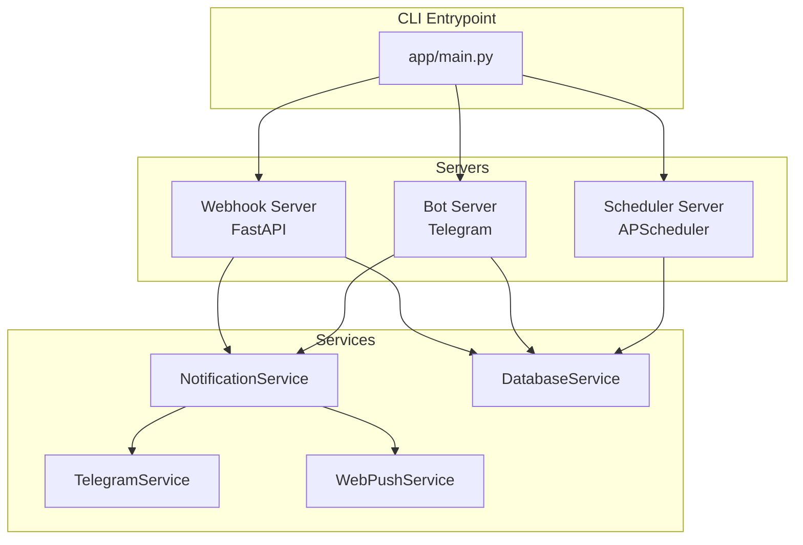
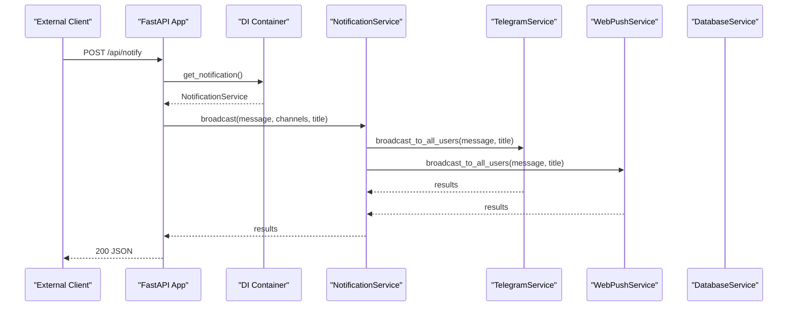
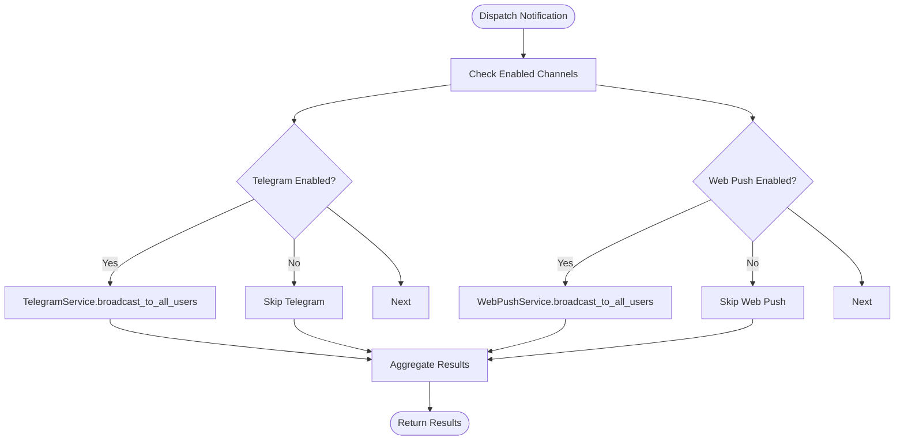
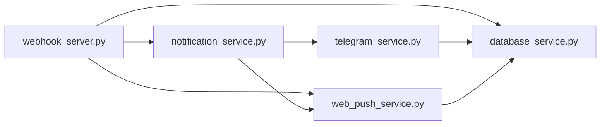

# API Reference

<cite>
**Referenced Files in This Document**
- [app/main.py](file://app/main.py)
- [app/servers/webhook_server.py](file://app/servers/webhook_server.py)
- [app/servers/bot_server.py](file://app/servers/bot_server.py)
- [app/servers/scheduler_server.py](file://app/servers/scheduler_server.py)
- [app/core/config.py](file://app/core/config.py)
- [app/services/notification_service.py](file://app/services/notification_service.py)
- [app/services/telegram_service.py](file://app/services/telegram_service.py)
- [app/services/web_push_service.py](file://app/services/web_push_service.py)
- [app/services/database_service.py](file://app/services/database_service.py)
- [docs/API.md](file://docs/API.md)
- [docs/index.md](file://docs/index.md)
</cite>

## Table of Contents
1. [Introduction](#introduction)
2. [Project Structure](#project-structure)
3. [Core Components](#core-components)
4. [Architecture Overview](#architecture-overview)
5. [Detailed Component Analysis](#detailed-component-analysis)
6. [Dependency Analysis](#dependency-analysis)
7. [Performance Considerations](#performance-considerations)
8. [Troubleshooting Guide](#troubleshooting-guide)
9. [Conclusion](#conclusion)
10. [Appendices](#appendices)

## Introduction
This document provides comprehensive API documentation for the SuperSet Telegram Notification Bot’s REST API endpoints and webhook interfaces. It covers FastAPI endpoints, request/response schemas, error handling, webhook specifications for external integrations, Telegram bot command handling, and callback mechanisms. It also documents rate limiting, pagination, filtering, versioning, and client integration guidelines.

## Project Structure
The application exposes two primary server modes:
- Telegram Bot Server: Interactive commands and long-polling.
- Webhook/REST Server: FastAPI endpoints for health checks, push subscriptions, notifications, statistics, and webhook triggers.

**Diagram sources**
- [app/main.py](file://app/main.py#L370-L632)
- [app/servers/webhook_server.py](file://app/servers/webhook_server.py#L69-L361)
- [app/servers/bot_server.py](file://app/servers/bot_server.py#L29-L519)
- [app/servers/scheduler_server.py](file://app/servers/scheduler_server.py#L33-L388)
- [app/services/notification_service.py](file://app/services/notification_service.py#L13-L237)
- [app/services/telegram_service.py](file://app/services/telegram_service.py#L20-L351)
- [app/services/web_push_service.py](file://app/services/web_push_service.py#L27-L242)
- [app/services/database_service.py](file://app/services/database_service.py#L16-L200)

**Section sources**
- [app/main.py](file://app/main.py#L370-L632)
- [docs/index.md](file://docs/index.md#L92-L123)

## Core Components
- Webhook Server (FastAPI): Exposes health, push subscription, notification dispatch, and statistics endpoints; includes a webhook trigger endpoint for external integrations.
- Bot Server: Telegram long-polling server handling user commands and admin commands.
- Notification Service: Unified dispatcher routing messages to Telegram and Web Push channels.
- Telegram Service: Telegram API wrapper with message formatting and broadcasting.
- Web Push Service: VAPID-enabled web push notifications with subscription management hooks.
- Database Service: MongoDB abstraction for notices, jobs, placement offers, users, and statistics.

**Section sources**
- [app/servers/webhook_server.py](file://app/servers/webhook_server.py#L69-L361)
- [app/servers/bot_server.py](file://app/servers/bot_server.py#L29-L519)
- [app/services/notification_service.py](file://app/services/notification_service.py#L13-L237)
- [app/services/telegram_service.py](file://app/services/telegram_service.py#L20-L351)
- [app/services/web_push_service.py](file://app/services/web_push_service.py#L27-L242)
- [app/services/database_service.py](file://app/services/database_service.py#L16-L200)

## Architecture Overview
The REST API is implemented with FastAPI and integrates with dependency-injected services. The webhook server initializes services lazily and exposes endpoints for:
- Health checks
- Web push subscription management
- Notification dispatch to Telegram and Web Push
- Statistics retrieval
- External webhook trigger for update jobs

**Diagram sources**
- [app/servers/webhook_server.py](file://app/servers/webhook_server.py#L244-L264)
- [app/services/notification_service.py](file://app/services/notification_service.py#L61-L91)
- [app/services/telegram_service.py](file://app/services/telegram_service.py#L140-L172)
- [app/services/web_push_service.py](file://app/services/web_push_service.py#L120-L155)

## Detailed Component Analysis

### REST API Endpoints

#### Health Endpoints
- GET /
  - Description: Basic health check.
  - Response: HealthResponse with status and version.
  - Status Codes: 200 OK.

- GET /health
  - Description: Detailed health status.
  - Response: HealthResponse with status and version.
  - Status Codes: 200 OK.

**Section sources**
- [app/servers/webhook_server.py](file://app/servers/webhook_server.py#L172-L181)
- [app/servers/webhook_server.py](file://app/servers/webhook_server.py#L177-L181)

#### Web Push Subscription Endpoints
- POST /api/push/subscribe
  - Description: Subscribe to web push notifications.
  - Request Body: PushSubscription (endpoint, keys, user_id).
  - Response: JSON success indicator.
  - Status Codes: 200 OK, 501 Not Implemented if web push not configured, 500 Internal Server Error on failure.

- POST /api/push/unsubscribe
  - Description: Unsubscribe from web push notifications.
  - Request Body: PushSubscription (endpoint, keys, user_id).
  - Response: JSON success indicator.
  - Status Codes: 200 OK, 501 Not Implemented if web push not configured, 500 Internal Server Error on failure.

- GET /api/push/vapid-key
  - Description: Get VAPID public key for client subscription.
  - Response: JSON with publicKey.
  - Status Codes: 200 OK, 501 Not Implemented if web push not configured.

**Section sources**
- [app/servers/webhook_server.py](file://app/servers/webhook_server.py#L186-L227)
- [app/servers/webhook_server.py](file://app/servers/webhook_server.py#L228-L238)
- [app/servers/webhook_server.py](file://app/servers/webhook_server.py#L230-L238)

#### Notification Endpoints
- POST /api/notify
  - Description: Send notification to specified channels (defaults to both).
  - Request Body: NotifyRequest (message, title, channels).
  - Response: NotifyResponse (success, results).
  - Status Codes: 200 OK, 501 Not Implemented if notification service not configured, 500 Internal Server Error on failure.

- POST /api/notify/telegram
  - Description: Send notification via Telegram only.
  - Request Body: NotifyRequest (message, title, channels ignored).
  - Response: JSON success indicator.
  - Status Codes: 200 OK, 501 Not Implemented if notification service not configured, 500 Internal Server Error on failure.

- POST /api/notify/web-push
  - Description: Send notification via Web Push only.
  - Request Body: NotifyRequest (message, title, channels ignored).
  - Response: JSON success indicator.
  - Status Codes: 200 OK, 501 Not Implemented if notification service not configured, 500 Internal Server Error on failure.

**Section sources**
- [app/servers/webhook_server.py](file://app/servers/webhook_server.py#L244-L264)
- [app/servers/webhook_server.py](file://app/servers/webhook_server.py#L266-L282)
- [app/servers/webhook_server.py](file://app/servers/webhook_server.py#L283-L300)

#### Statistics Endpoints
- GET /api/stats
  - Description: Get all statistics (placement, notice, user).
  - Response: StatsResponse (placement_stats, notice_stats, user_stats).
  - Status Codes: 200 OK, 501 Not Implemented if database not configured.

- GET /api/stats/placements
  - Description: Get placement statistics.
  - Response: Placement statistics dictionary.
  - Status Codes: 200 OK, 501 Not Implemented if database not configured.

- GET /api/stats/notices
  - Description: Get notice statistics.
  - Response: Notice statistics dictionary.
  - Status Codes: 200 OK, 501 Not Implemented if database not configured.

- GET /api/stats/users
  - Description: Get user statistics.
  - Response: User statistics dictionary.
  - Status Codes: 200 OK, 501 Not Implemented if database not configured.

**Section sources**
- [app/servers/webhook_server.py](file://app/servers/webhook_server.py#L306-L316)
- [app/servers/webhook_server.py](file://app/servers/webhook_server.py#L318-L324)
- [app/servers/webhook_server.py](file://app/servers/webhook_server.py#L326-L332)
- [app/servers/webhook_server.py](file://app/servers/webhook_server.py#L334-L340)

#### Webhook Trigger Endpoint
- POST /webhook/update
  - Description: Trigger update job via webhook (sends unsent notices).
  - Response: JSON success and result.
  - Status Codes: 200 OK, 501 Not Implemented if services not configured, 500 Internal Server Error on failure.

**Section sources**
- [app/servers/webhook_server.py](file://app/servers/webhook_server.py#L346-L360)

### Request/Response Schemas

- HealthResponse
  - Fields: status (string), version (string, default "1.2.1").

- PushSubscription
  - Fields: endpoint (string), keys (dict with p256dh and auth), user_id (optional integer).

- NotifyRequest
  - Fields: message (string), title (optional string, default "SuperSet Update"), channels (optional list of strings, default ["telegram", "web_push"]).

- NotifyResponse
  - Fields: success (boolean), results (dict).

- StatsResponse
  - Fields: placement_stats (dict), notice_stats (dict), user_stats (dict).

**Section sources**
- [app/servers/webhook_server.py](file://app/servers/webhook_server.py#L26-L62)

### Error Handling
- HTTPException raised with appropriate status codes:
  - 501 Not Implemented when services are not configured.
  - 500 Internal Server Error for unexpected failures.
- Responses include human-readable details in the exception payload.

**Section sources**
- [app/servers/webhook_server.py](file://app/servers/webhook_server.py#L192-L196)
- [app/servers/webhook_server.py](file://app/servers/webhook_server.py#L207-L208)
- [app/servers/webhook_server.py](file://app/servers/webhook_server.py#L216-L217)
- [app/servers/webhook_server.py](file://app/servers/webhook_server.py#L231-L232)
- [app/servers/webhook_server.py](file://app/servers/webhook_server.py#L250-L253)
- [app/servers/webhook_server.py](file://app/servers/webhook_server.py#L272-L275)
- [app/servers/webhook_server.py](file://app/servers/webhook_server.py#L289-L292)
- [app/servers/webhook_server.py](file://app/servers/webhook_server.py#L352-L353)

### Webhook Endpoint Specifications
- Endpoint: POST /webhook/update
- Purpose: External integration trigger to send unsent notices.
- Authentication: No explicit authentication enforced in code; secure via network controls and reverse proxy.
- Payload: No body required; triggers internal logic to send unsent notices to Telegram and Web Push.
- Validation: Minimal; relies on internal service availability.
- Security Considerations:
  - Restrict access to trusted networks.
  - Use HTTPS and reverse proxy with TLS termination.
  - Consider adding basic auth or HMAC signature verification if integrating with untrusted environments.

**Section sources**
- [app/servers/webhook_server.py](file://app/servers/webhook_server.py#L346-L360)

### Telegram Bot API Integration
- Bot Server: Implements long-polling Telegram bot with command handlers.
- Commands:
  - /start: Register user and welcome message.
  - /stop: Deactivate subscription.
  - /status: Show subscription status.
  - /stats: Placement statistics.
  - /noticestats: Notice statistics.
  - /userstats: User statistics (admin).
  - /web: Useful links.
  - Admin commands: /users, /boo, /fu, /logs, etc.
- Integration Points:
  - Uses TelegramService for message sending and formatting.
  - Uses DatabaseService for user management and statistics.
- Callback Mechanisms:
  - Command handlers invoked via Telegram’s long-polling updater.
  - Admin commands gated by TELEGRAM_CHAT_ID.

**Section sources**
- [app/servers/bot_server.py](file://app/servers/bot_server.py#L87-L403)
- [app/services/telegram_service.py](file://app/services/telegram_service.py#L20-L351)
- [app/services/database_service.py](file://app/services/database_service.py#L16-L200)

### Notification Dispatch Flow
- NotificationService routes messages to enabled channels.
- TelegramService:
  - Splits long messages (>4000 characters).
  - Formats Markdown/HTML with fallbacks.
  - Rate limits with small delays between broadcasts.
- WebPushService:
  - VAPID-signed push notifications.
  - Graceful degradation if pywebpush not installed.
  - Removes expired subscriptions on 404/410 responses.

**Diagram sources**
- [app/services/notification_service.py](file://app/services/notification_service.py#L61-L91)
- [app/services/telegram_service.py](file://app/services/telegram_service.py#L140-L172)
- [app/services/web_push_service.py](file://app/services/web_push_service.py#L120-L155)

**Section sources**
- [app/services/notification_service.py](file://app/services/notification_service.py#L13-L237)
- [app/services/telegram_service.py](file://app/services/telegram_service.py#L20-L351)
- [app/services/web_push_service.py](file://app/services/web_push_service.py#L27-L242)

### Statistics Retrieval
- Stats endpoints delegate to DatabaseService methods:
  - get_placement_stats
  - get_notice_stats
  - get_users_stats
- Filtering and Pagination:
  - No explicit pagination parameters on stats endpoints.
  - Filtering by branch/company not exposed on stats endpoints in current implementation.

**Section sources**
- [app/servers/webhook_server.py](file://app/servers/webhook_server.py#L306-L340)
- [app/services/database_service.py](file://app/services/database_service.py#L16-L200)

### Versioning Strategy
- FastAPI app version is set to "1.0.0".
- Health endpoints include a version field ("1.2.1") in response model.
- No explicit API versioning path/version header implemented.

**Section sources**
- [app/servers/webhook_server.py](file://app/servers/webhook_server.py#L139-L144)
- [app/servers/webhook_server.py](file://app/servers/webhook_server.py#L26-L31)

### Rate Limiting
- No built-in rate limiting middleware in webhook_server.py.
- TelegramService applies small delays between broadcasts to avoid rate limits.
- Recommendation: Integrate a rate limiting library (e.g., starlette-ratelimit) or reverse proxy throttling for REST endpoints.

**Section sources**
- [app/servers/webhook_server.py](file://app/servers/webhook_server.py#L146-L153)
- [app/services/telegram_service.py](file://app/services/telegram_service.py#L163)

### Client Implementation Examples
- Web Push Subscription:
  - Obtain VAPID public key via GET /api/push/vapid-key.
  - Subscribe using browser PushManager and POST /api/push/subscribe with endpoint and keys.
- Notification Dispatch:
  - POST /api/notify with message, title, and channels.
  - POST /api/notify/telegram or /api/notify/web-push for single-channel dispatch.
- Statistics:
  - GET /api/stats, /api/stats/placements, /api/stats/notices, /api/stats/users.

**Section sources**
- [app/servers/webhook_server.py](file://app/servers/webhook_server.py#L228-L238)
- [app/servers/webhook_server.py](file://app/servers/webhook_server.py#L244-L300)
- [app/servers/webhook_server.py](file://app/servers/webhook_server.py#L306-L340)

## Dependency Analysis
- Webhook Server depends on:
  - DatabaseService for stats and unsent notices.
  - NotificationService for dispatching to channels.
  - WebPushService for web push operations.
- NotificationService depends on:
  - TelegramService and WebPushService implementations.
- TelegramService depends on:
  - TelegramClient for actual API calls.
  - DatabaseService for user lookups and broadcasting.
- WebPushService depends on:
  - pywebpush (optional) and VAPID keys.
  - DatabaseService for subscription management.

**Diagram sources**
- [app/servers/webhook_server.py](file://app/servers/webhook_server.py#L69-L138)
- [app/services/notification_service.py](file://app/services/notification_service.py#L13-L41)
- [app/services/telegram_service.py](file://app/services/telegram_service.py#L20-L51)
- [app/services/web_push_service.py](file://app/services/web_push_service.py#L27-L60)
- [app/services/database_service.py](file://app/services/database_service.py#L16-L46)

**Section sources**
- [app/servers/webhook_server.py](file://app/servers/webhook_server.py#L69-L138)
- [app/services/notification_service.py](file://app/services/notification_service.py#L13-L41)
- [app/services/telegram_service.py](file://app/services/telegram_service.py#L20-L51)
- [app/services/web_push_service.py](file://app/services/web_push_service.py#L27-L60)
- [app/services/database_service.py](file://app/services/database_service.py#L16-L46)

## Performance Considerations
- Message Chunking: TelegramService splits long messages (>4000 characters) and retries without formatting if needed.
- Broadcast Delays: Small delays between user broadcasts reduce rate limit risk.
- Optional Web Push: WebPushService gracefully degrades if pywebpush is not installed.
- Database Queries: Stats endpoints use aggregation and count operations; ensure indexes on frequently queried fields.

[No sources needed since this section provides general guidance]

## Troubleshooting Guide
- Health Checks:
  - Use GET / and GET /health to verify service availability.
- Web Push Issues:
  - Confirm VAPID keys are configured; use GET /api/push/vapid-key to verify.
  - Check subscription removal on 404/410 responses.
- Notification Failures:
  - Review NotificationService results per channel.
  - Verify Telegram bot token and chat ID configuration.
- Database Connectivity:
  - Ensure MongoDB connection string is valid and reachable.

**Section sources**
- [app/servers/webhook_server.py](file://app/servers/webhook_server.py#L172-L181)
- [app/servers/webhook_server.py](file://app/servers/webhook_server.py#L228-L238)
- [app/services/web_push_service.py](file://app/services/web_push_service.py#L185-L193)
- [app/services/notification_service.py](file://app/services/notification_service.py#L82-L91)
- [app/core/config.py](file://app/core/config.py#L26-L31)

## Conclusion
The SuperSet Telegram Notification Bot provides a robust REST API for web push subscriptions, notification dispatch, and statistics retrieval, alongside a Telegram bot for user interactions. The webhook server integrates dependency-injected services to deliver scalable notifications across channels. While rate limiting is not built-in, practical measures like message chunking and broadcast delays mitigate risks. For production deployments, secure the webhook endpoint, configure VAPID keys, and monitor logs for reliable operation.

[No sources needed since this section summarizes without analyzing specific files]

## Appendices

### Configuration and Environment Variables
- Required:
  - MONGO_CONNECTION_STR
  - TELEGRAM_BOT_TOKEN
  - TELEGRAM_CHAT_ID
- Optional:
  - GOOGLE_API_KEY
  - PLCAMENT_EMAIL, PLCAMENT_APP_PASSWORD
  - VAPID_PRIVATE_KEY, VAPID_PUBLIC_KEY, VAPID_EMAIL
  - WEBHOOK_PORT, WEBHOOK_HOST

**Section sources**
- [app/core/config.py](file://app/core/config.py#L26-L86)

### CLI Commands and Servers
- bot: Run Telegram bot server (commands only).
- scheduler: Run scheduler server for automated updates.
- webhook: Run FastAPI webhook server.
- update, update-supersets, update-emails: Data collection commands.
- send: Send unsent notices via Telegram/Web Push.
- official: Update official placement data.

**Section sources**
- [app/main.py](file://app/main.py#L370-L632)