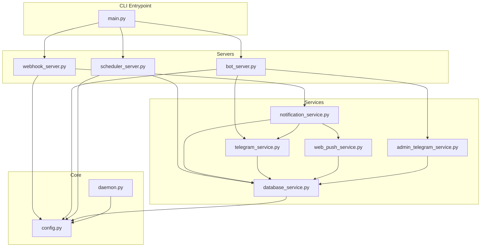
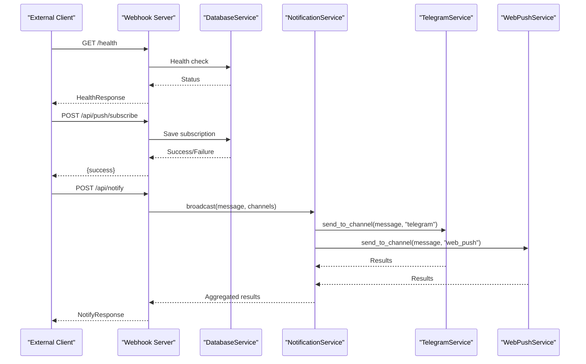
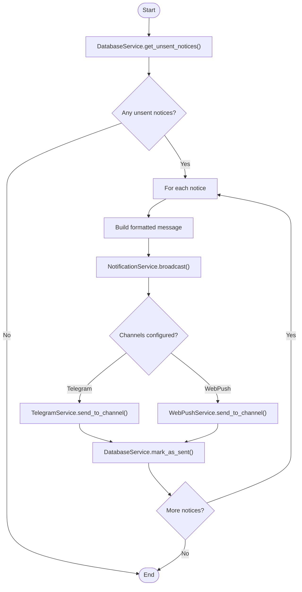
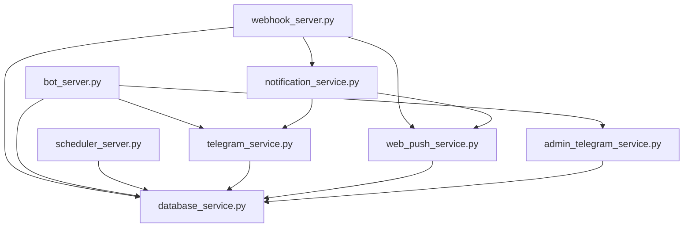

# API Architecture & Endpoints

<cite>
**Referenced Files in This Document**
- [main.py](file://app/main.py)
- [webhook_server.py](file://app/servers/webhook_server.py)
- [bot_server.py](file://app/servers/bot_server.py)
- [scheduler_server.py](file://app/servers/scheduler_server.py)
- [config.py](file://app/core/config.py)
- [daemon.py](file://app/core/daemon.py)
- [notification_service.py](file://app/services/notification_service.py)
- [telegram_service.py](file://app/services/telegram_service.py)
- [web_push_service.py](file://app/services/web_push_service.py)
- [database_service.py](file://app/services/database_service.py)
- [admin_telegram_service.py](file://app/services/admin_telegram_service.py)
- [API.md](file://docs/API.md)
- [ARCHITECTURE.md](file://docs/ARCHITECTURE.md)
</cite>

## Table of Contents
1. [Introduction](#introduction)
2. [Project Structure](#project-structure)
3. [Core Components](#core-components)
4. [Architecture Overview](#architecture-overview)
5. [Detailed Component Analysis](#detailed-component-analysis)
6. [Dependency Analysis](#dependency-analysis)
7. [Performance Considerations](#performance-considerations)
8. [Troubleshooting Guide](#troubleshooting-guide)
9. [Conclusion](#conclusion)

## Introduction
This document provides comprehensive API documentation for the webhook and bot server architecture. It covers FastAPI-based webhook endpoints, Telegram bot command handlers, dual-server architecture, integration points, security considerations, rate limiting, and error handling patterns. The system consists of:
- A FastAPI webhook server exposing REST endpoints for health checks, statistics, web push subscriptions, and notification dispatch.
- A Telegram bot server handling user commands and admin operations.
- A scheduler server coordinating automated updates and broadcasts.
- A unified notification service orchestrating multiple channels (Telegram and Web Push).

## Project Structure
The application is organized around a service-oriented architecture with clear separation of concerns:
- Entry points: main.py orchestrates CLI commands to start servers and run jobs.
- Servers: dedicated FastAPI webhook server and Telegram bot server.
- Services: notification, telegram, web push, database, and admin services.
- Core utilities: configuration management and daemon utilities.

**Diagram sources**
- [main.py](file://app/main.py#L370-L628)
- [webhook_server.py](file://app/servers/webhook_server.py#L69-L361)
- [bot_server.py](file://app/servers/bot_server.py#L29-L507)
- [scheduler_server.py](file://app/servers/scheduler_server.py#L33-L376)
- [config.py](file://app/core/config.py#L18-L254)
- [daemon.py](file://app/core/daemon.py#L114-L251)

**Section sources**
- [main.py](file://app/main.py#L370-L628)
- [webhook_server.py](file://app/servers/webhook_server.py#L69-L361)
- [bot_server.py](file://app/servers/bot_server.py#L29-L507)
- [scheduler_server.py](file://app/servers/scheduler_server.py#L33-L376)
- [config.py](file://app/core/config.py#L18-L254)
- [daemon.py](file://app/core/daemon.py#L114-L251)

## Core Components
- FastAPI Webhook Server: Exposes health, stats, web push subscription, and notification endpoints. Provides dependency injection for database, notification, and web push services.
- Telegram Bot Server: Handles user commands (/start, /stop, /status, /stats, /web) and admin commands (/users, /boo, etc.). Integrates with database and admin services.
- Scheduler Server: Runs automated update jobs and broadcasts using APScheduler.
- Notification Service: Aggregates channels and routes notifications to Telegram and Web Push.
- Telegram Service: Implements Telegram API interactions and message formatting.
- Web Push Service: Manages VAPID-signed web push notifications and subscription storage.
- Database Service: Wraps MongoDB operations for notices, jobs, placement offers, users, and policies.
- Admin Telegram Service: Provides admin-only commands and system management.
- Configuration and Daemon Utilities: Centralized settings and process lifecycle management.

**Section sources**
- [webhook_server.py](file://app/servers/webhook_server.py#L69-L361)
- [bot_server.py](file://app/servers/bot_server.py#L29-L507)
- [scheduler_server.py](file://app/servers/scheduler_server.py#L33-L376)
- [notification_service.py](file://app/services/notification_service.py#L13-L237)
- [telegram_service.py](file://app/services/telegram_service.py#L20-L351)
- [web_push_service.py](file://app/services/web_push_service.py#L27-L242)
- [database_service.py](file://app/services/database_service.py#L16-L795)
- [admin_telegram_service.py](file://app/services/admin_telegram_service.py#L19-L349)
- [config.py](file://app/core/config.py#L18-L254)
- [daemon.py](file://app/core/daemon.py#L114-L251)

## Architecture Overview
The system employs a dual-server architecture:
- Webhook Server: Stateless REST API for external integrations and internal coordination.
- Telegram Bot Server: Interactive command-driven server for user and admin operations.
- Scheduler Server: Automated job runner decoupled from the bot server.

**Diagram sources**
- [webhook_server.py](file://app/servers/webhook_server.py#L172-L361)
- [notification_service.py](file://app/services/notification_service.py#L61-L91)
- [telegram_service.py](file://app/services/telegram_service.py#L140-L172)
- [web_push_service.py](file://app/services/web_push_service.py#L120-L155)
- [database_service.py](file://app/services/database_service.py#L116-L147)

**Section sources**
- [webhook_server.py](file://app/servers/webhook_server.py#L172-L361)
- [notification_service.py](file://app/services/notification_service.py#L61-L91)
- [telegram_service.py](file://app/services/telegram_service.py#L140-L172)
- [web_push_service.py](file://app/services/web_push_service.py#L120-L155)
- [database_service.py](file://app/services/database_service.py#L116-L147)

## Detailed Component Analysis

### Webhook Server Endpoints
The webhook server exposes the following endpoints:

- GET /
  - Purpose: Root health check.
  - Response: HealthResponse with status and version.
  - Authentication: None.

- GET /health
  - Purpose: Detailed health status including database connectivity.
  - Response: HealthResponse with status and version.
  - Authentication: None.

- POST /api/push/subscribe
  - Purpose: Subscribe a user to web push notifications.
  - Request: PushSubscription model (endpoint, keys, user_id).
  - Response: JSON with success boolean.
  - Authentication: None.
  - Notes: Requires web push service to be enabled.

- POST /api/push/unsubscribe
  - Purpose: Unsubscribe a user from web push notifications.
  - Request: PushSubscription model (endpoint, keys, user_id).
  - Response: JSON with success boolean.
  - Authentication: None.

- POST /api/notify
  - Purpose: Send notification to specified channels.
  - Request: NotifyRequest model (message, title, channels).
  - Response: NotifyResponse with success and results.
  - Authentication: None.

- POST /api/notify/telegram
  - Purpose: Send notification via Telegram only.
  - Request: NotifyRequest model.
  - Response: JSON with success boolean.
  - Authentication: None.

- POST /api/notify/web-push
  - Purpose: Send notification via Web Push only.
  - Request: NotifyRequest model.
  - Response: JSON with success boolean.
  - Authentication: None.

- GET /api/stats
  - Purpose: Get all statistics (placement, notice, user).
  - Response: StatsResponse with placement_stats, notice_stats, user_stats.
  - Authentication: None.

- GET /api/stats/placements
  - Purpose: Get placement statistics.
  - Response: Dictionary with placement stats.
  - Authentication: None.

- GET /api/stats/notices
  - Purpose: Get notice statistics.
  - Response: Dictionary with notice stats.
  - Authentication: None.

- GET /api/stats/users
  - Purpose: Get user statistics.
  - Response: Dictionary with user stats.
  - Authentication: None.

- POST /webhook/update
  - Purpose: Trigger update job via webhook.
  - Response: JSON with success and result.
  - Authentication: None.

Request/Response Models
- HealthResponse: status (string), version (string).
- PushSubscription: endpoint (string), keys (dict), user_id (integer, optional).
- NotifyRequest: message (string), title (string, optional), channels (array of strings, optional).
- NotifyResponse: success (boolean), results (dict).
- StatsResponse: placement_stats (dict), notice_stats (dict), user_stats (dict).

Security Considerations
- No built-in authentication or rate limiting on webhook endpoints.
- Webhook endpoints are intended for trusted integrations.
- Consider deploying behind a reverse proxy with authentication and rate limiting in production.

**Section sources**
- [webhook_server.py](file://app/servers/webhook_server.py#L26-L62)
- [webhook_server.py](file://app/servers/webhook_server.py#L172-L361)
- [database_service.py](file://app/services/database_service.py#L161-L200)

### Telegram Bot Server Commands
The Telegram bot server supports the following commands:

- /start
  - Registers a user and welcomes them with available commands.
  - Interacts with DatabaseService to add or reactivate users.

- /stop
  - Deactivates a user's subscription.

- /status
  - Checks subscription status and displays user details.

- /stats
  - Displays placement statistics computed by PlacementStatsCalculatorService.

- /noticestats
  - Shows notice statistics from DatabaseService.

- /userstats (admin)
  - Displays user statistics (admin-only).

- /web
  - Provides useful links to JIIT tools.

Admin Commands
- /users (admin)
  - Lists all users and their subscription status.

- /boo <message> (admin)
  - Broadcasts a message to all active users.

- /fu or /scrapyyy (admin)
  - Forces an immediate update workflow.

- /logs [lines] (admin)
  - Retrieves recent log entries.

- /kill (admin)
  - Stops the scheduler daemon.

Security and Authentication
- Admin commands are restricted to the configured admin chat ID.
- Unauthorized attempts are rejected with a warning.

**Section sources**
- [bot_server.py](file://app/servers/bot_server.py#L87-L361)
- [admin_telegram_service.py](file://app/services/admin_telegram_service.py#L43-L349)
- [database_service.py](file://app/services/database_service.py#L616-L728)

### Dual-Server Architecture and Coordination
The system runs two distinct processes:
- Webhook Server: Exposes REST endpoints for integrations and internal coordination.
- Telegram Bot Server: Handles user and admin commands with long-polling mode.
- Scheduler Server: Runs automated jobs using APScheduler.

Integration Points
- NotificationService coordinates delivery across channels.
- DatabaseService persists and retrieves data used by both servers.
- AdminTelegramService bridges admin commands to system operations.

Process Lifecycle
- Daemon utilities manage background processes with PID files and graceful shutdown.

**Section sources**
- [main.py](file://app/main.py#L37-L85)
- [bot_server.py](file://app/servers/bot_server.py#L405-L453)
- [scheduler_server.py](file://app/servers/scheduler_server.py#L274-L376)
- [daemon.py](file://app/core/daemon.py#L114-L251)

### Data Flow and Processing Logic
Notification Pipeline
- DatabaseService identifies unsent notices.
- NotificationService batches and routes to channels.
- TelegramService and WebPushService deliver messages.
- DatabaseService marks notices as sent upon successful delivery.

**Diagram sources**
- [notification_service.py](file://app/services/notification_service.py#L93-L167)
- [database_service.py](file://app/services/database_service.py#L116-L147)
- [telegram_service.py](file://app/services/telegram_service.py#L62-L99)
- [web_push_service.py](file://app/services/web_push_service.py#L81-L88)

**Section sources**
- [notification_service.py](file://app/services/notification_service.py#L93-L167)
- [database_service.py](file://app/services/database_service.py#L116-L147)
- [telegram_service.py](file://app/services/telegram_service.py#L62-L99)
- [web_push_service.py](file://app/services/web_push_service.py#L81-L88)

## Dependency Analysis
Component Relationships
- Webhook Server depends on NotificationService, DatabaseService, and WebPushService.
- Telegram Bot Server depends on DatabaseService, TelegramService, AdminTelegramService, and PlacementStatsCalculatorService.
- Scheduler Server depends on DatabaseService and NotificationService indirectly via runner modules.
- All services depend on DatabaseService for persistence.
- Configuration and daemon utilities provide cross-cutting concerns.

**Diagram sources**
- [webhook_server.py](file://app/servers/webhook_server.py#L159-L167)
- [bot_server.py](file://app/servers/bot_server.py#L488-L499)
- [scheduler_server.py](file://app/servers/scheduler_server.py#L90-L92)
- [notification_service.py](file://app/services/notification_service.py#L34-L35)
- [telegram_service.py](file://app/services/telegram_service.py#L46-L48)
- [web_push_service.py](file://app/services/web_push_service.py#L58-L59)
- [database_service.py](file://app/services/database_service.py#L36-L43)

**Section sources**
- [webhook_server.py](file://app/servers/webhook_server.py#L159-L167)
- [bot_server.py](file://app/servers/bot_server.py#L488-L499)
- [scheduler_server.py](file://app/servers/scheduler_server.py#L90-L92)
- [notification_service.py](file://app/services/notification_service.py#L34-L35)
- [telegram_service.py](file://app/services/telegram_service.py#L46-L48)
- [web_push_service.py](file://app/services/web_push_service.py#L58-L59)
- [database_service.py](file://app/services/database_service.py#L36-L43)

## Performance Considerations
- Message Chunking: TelegramService splits long messages to comply with API limits.
- Rate Limiting: TelegramService applies small delays between broadcasts to avoid throttling.
- Database Efficiency: DatabaseService uses indexed queries and batch operations where appropriate.
- Asynchronous Processing: BotServer and SchedulerServer use asyncio and APScheduler respectively for concurrency.
- Caching: Settings are cached via LRU cache to reduce repeated loads.

[No sources needed since this section provides general guidance]

## Troubleshooting Guide
Common Issues and Resolutions
- Webhook Endpoints Return 501 Not Implemented
  - Cause: Services not configured (web push or notification).
  - Resolution: Ensure VAPID keys and notification channels are properly set.

- Telegram Bot Cannot Send Messages
  - Cause: Missing bot token or chat ID.
  - Resolution: Verify TELEGRAM_BOT_TOKEN and TELEGRAM_CHAT_ID in environment.

- Admin Commands Blocked
  - Cause: Unauthorized chat ID.
  - Resolution: Confirm admin chat ID matches the sender's chat ID.

- Scheduler Not Running
  - Cause: Process not started or stopped.
  - Resolution: Use CLI status and stop commands to manage daemon lifecycle.

Error Handling Patterns
- HTTP Exceptions: Webhook endpoints raise HTTPException with appropriate status codes.
- Graceful Degradation: Services catch exceptions and log errors without crashing.
- Daemon Lifecycle: PID files and signal handling ensure clean shutdown.

**Section sources**
- [webhook_server.py](file://app/servers/webhook_server.py#L192-L208)
- [webhook_server.py](file://app/servers/webhook_server.py#L272-L281)
- [admin_telegram_service.py](file://app/services/admin_telegram_service.py#L43-L55)
- [daemon.py](file://app/core/daemon.py#L75-L111)

## Conclusion
The webhook and bot server architecture provides a robust, modular foundation for delivering notifications across Telegram and Web Push channels. The dual-server design separates concerns effectively, while the service-oriented architecture enables testability and extensibility. For production deployments, consider adding authentication, rate limiting, and monitoring to complement the existing error handling and daemon utilities.