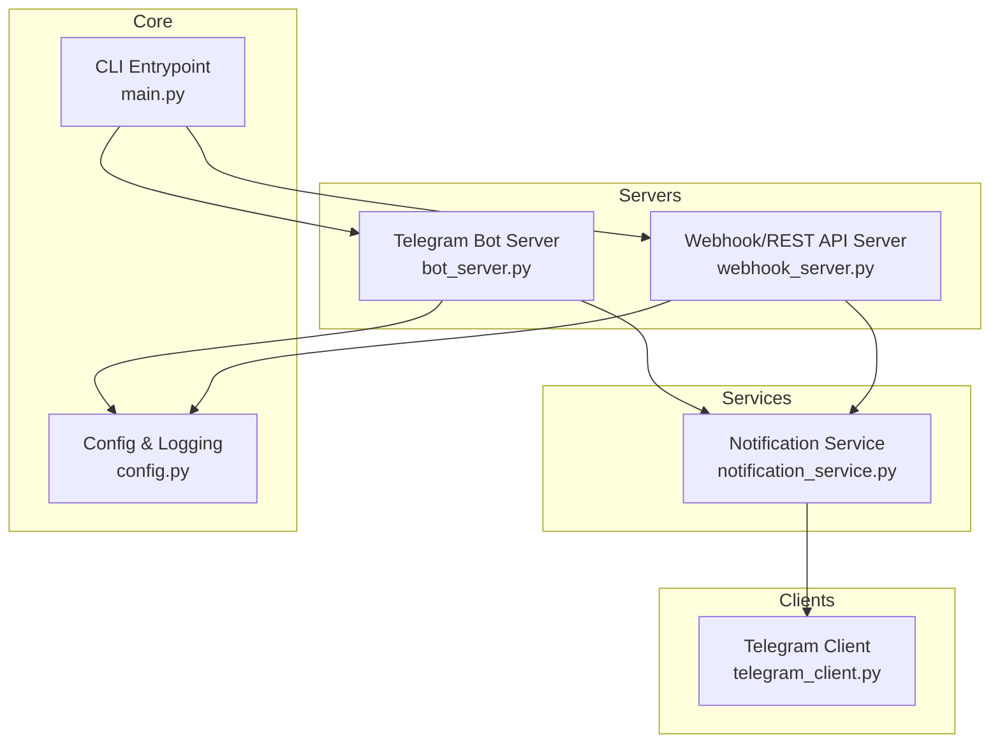
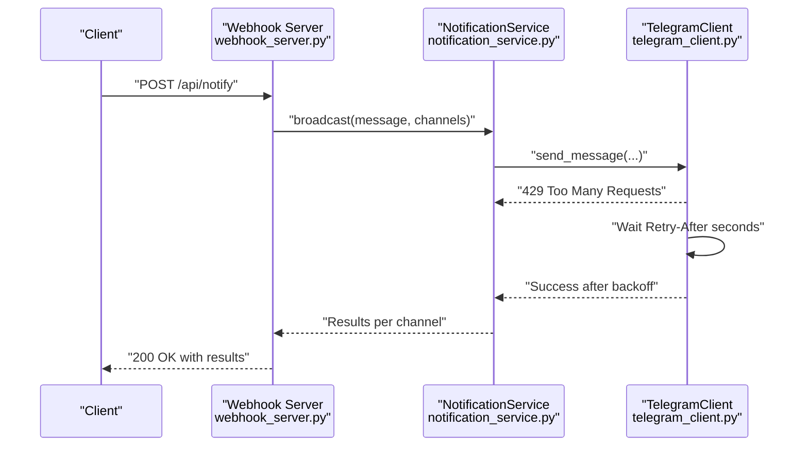
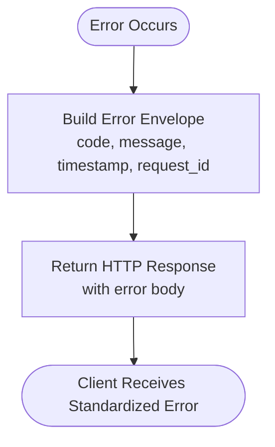
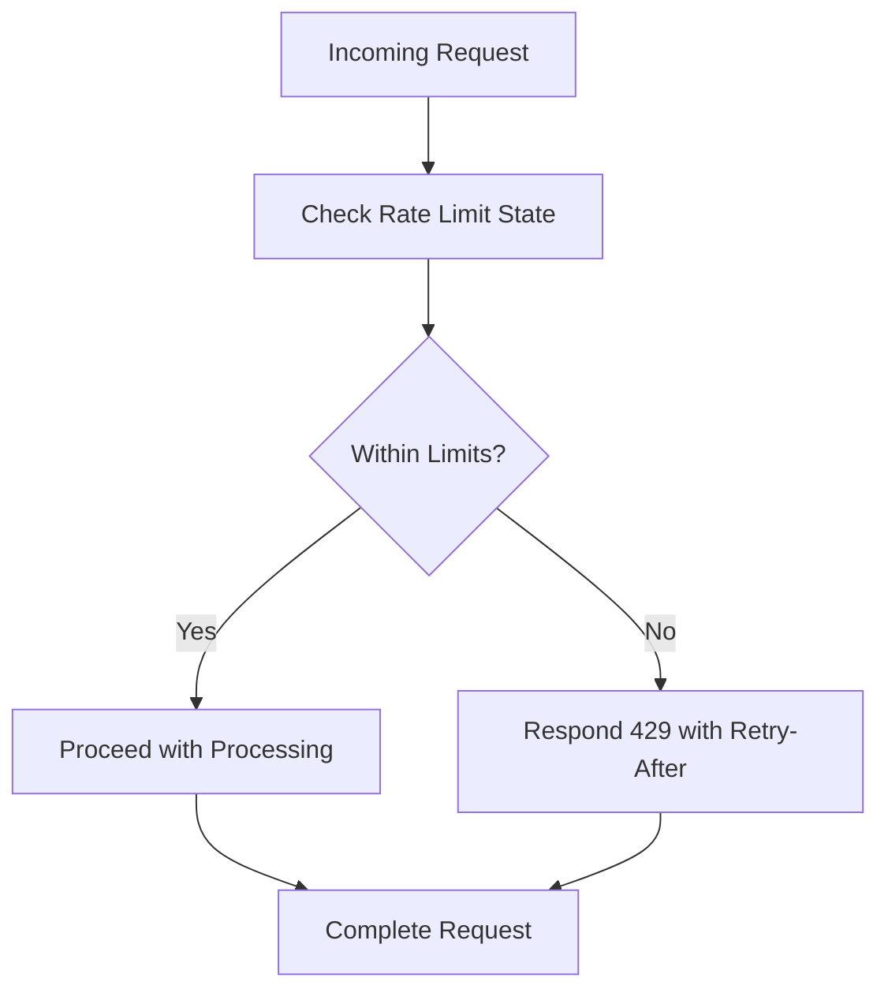
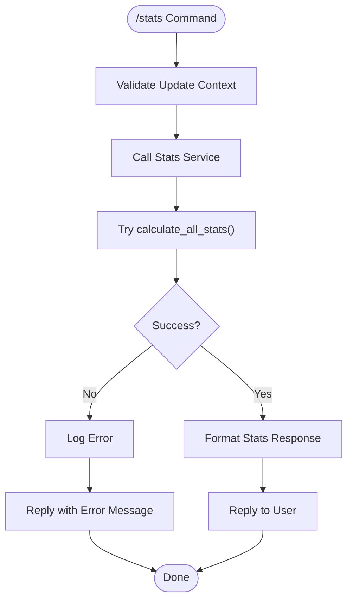
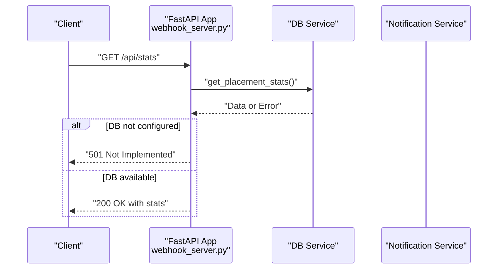
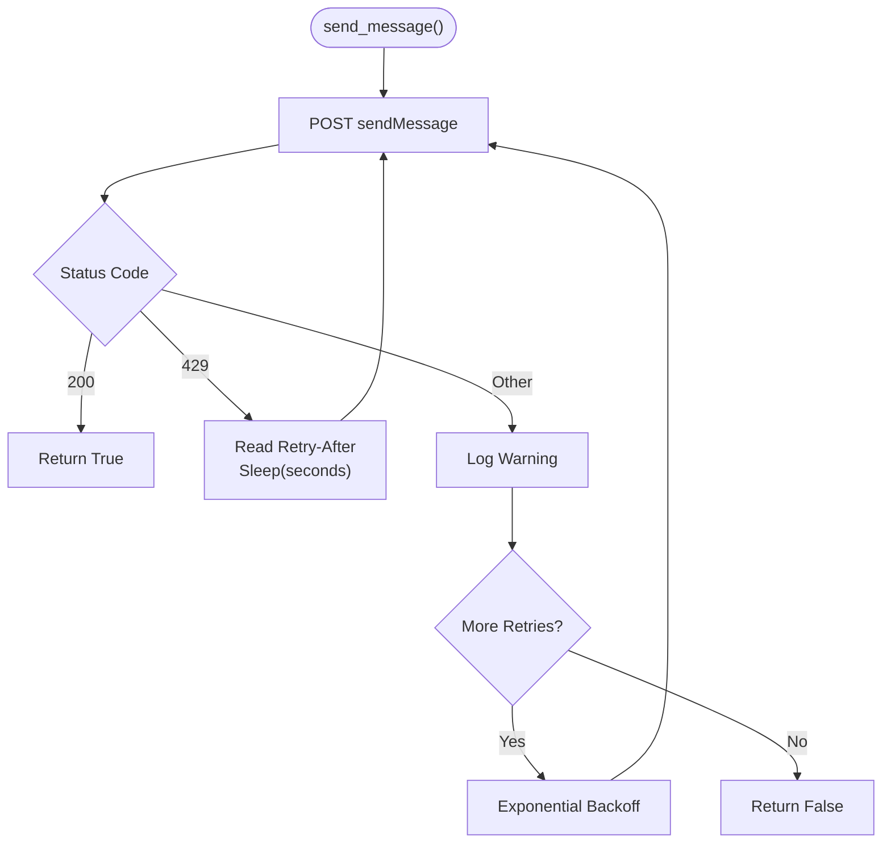
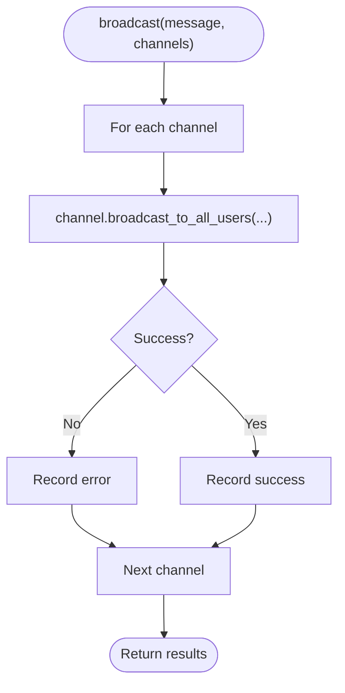
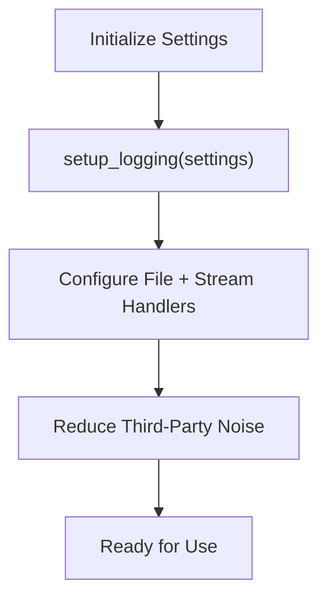
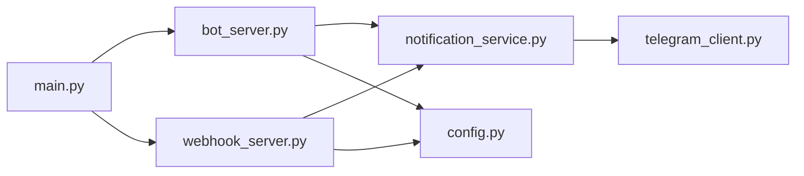

# Error Handling & Rate Limiting

<cite>
**Referenced Files in This Document**
- [API.md](file://docs/API.md)
- [bot_server.py](file://app/servers/bot_server.py)
- [webhook_server.py](file://app/servers/webhook_server.py)
- [telegram_client.py](file://app/clients/telegram_client.py)
- [notification_service.py](file://app/services/notification_service.py)
- [config.py](file://app/core/config.py)
- [main.py](file://app/main.py)
</cite>

## Table of Contents
1. [Introduction](#introduction)
2. [Project Structure](#project-structure)
3. [Core Components](#core-components)
4. [Architecture Overview](#architecture-overview)
5. [Detailed Component Analysis](#detailed-component-analysis)
6. [Dependency Analysis](#dependency-analysis)
7. [Performance Considerations](#performance-considerations)
8. [Troubleshooting Guide](#troubleshooting-guide)
9. [Conclusion](#conclusion)

## Introduction
This document consolidates the error handling patterns and rate limiting strategies across the two server types in the project: the Telegram Bot Server and the Webhook/REST API Server. It defines the standardized error response format, documents rate limiting policies, and explains how rate limit headers and 429 responses are handled. It also covers retry mechanisms, circuit breaker patterns, and graceful degradation strategies for robust service operation.

## Project Structure
The error handling and rate limiting concerns are distributed across:
- Servers: Telegram Bot Server and Webhook/REST API Server
- Clients: Telegram API client with built-in retry/backoff and rate-limit handling
- Services: Notification routing and channel-specific send operations
- Core: Logging and configuration utilities

**Diagram sources**
- [bot_server.py](file://app/servers/bot_server.py#L1-L519)
- [webhook_server.py](file://app/servers/webhook_server.py#L1-L387)
- [telegram_client.py](file://app/clients/telegram_client.py#L1-L126)
- [notification_service.py](file://app/services/notification_service.py#L1-L237)
- [config.py](file://app/core/config.py#L1-L254)
- [main.py](file://app/main.py#L1-L632)

**Section sources**
- [bot_server.py](file://app/servers/bot_server.py#L1-L519)
- [webhook_server.py](file://app/servers/webhook_server.py#L1-L387)
- [telegram_client.py](file://app/clients/telegram_client.py#L1-L126)
- [notification_service.py](file://app/services/notification_service.py#L1-L237)
- [config.py](file://app/core/config.py#L1-L254)
- [main.py](file://app/main.py#L1-L632)

## Core Components
- Standardized error response format with code, human-readable message, timestamp, and request ID.
- Rate limiting policies:
  - Bot Commands: 30 per minute per user
  - REST API: 100 per minute per IP
  - Webhook: unlimited (trusted Telegram servers)
- Rate limit headers: X-RateLimit-Limit, X-RateLimit-Remaining, X-RateLimit-Reset
- 429 responses with retry-after guidance
- Retry/backoff and exponential backoff for Telegram API calls
- Circuit breaker-like behavior via graceful degradation and fallbacks

**Section sources**
- [API.md](file://docs/API.md#L505-L596)
- [telegram_client.py](file://app/clients/telegram_client.py#L83-L111)

## Architecture Overview
The error handling and rate limiting architecture is layered:
- Servers define endpoints and raise HTTP exceptions with standardized error bodies.
- Services encapsulate cross-channel notification routing and handle per-channel failures gracefully.
- Clients implement retry/backoff and translate 429 responses into controlled delays.
- Logging and configuration utilities centralize logging and environment-driven behavior.

**Diagram sources**
- [webhook_server.py](file://app/servers/webhook_server.py#L244-L264)
- [notification_service.py](file://app/services/notification_service.py#L61-L91)
- [telegram_client.py](file://app/clients/telegram_client.py#L83-L111)

## Detailed Component Analysis

### Standardized Error Response Format
- All errors follow a consistent JSON shape with code, message, timestamp, and request ID.
- The API documentation defines the standard error envelope and common error codes mapped to HTTP status codes.

**Section sources**
- [API.md](file://docs/API.md#L507-L520)

### Rate Limiting Policies and Headers
- Bot Commands: 30 per minute per user
- REST API: 100 per minute per IP
- Webhook: unlimited (trusted Telegram servers)
- Rate limit headers: X-RateLimit-Limit, X-RateLimit-Remaining, X-RateLimit-Reset
- 429 responses include a retry-after hint

**Section sources**
- [API.md](file://docs/API.md#L570-L596)

### Telegram Bot Server Error Handling
- Command handlers perform basic input validation and delegate to services.
- Exceptions in stats calculation are caught and surfaced to the user.
- Logging is used for operational visibility.

**Section sources**
- [bot_server.py](file://app/servers/bot_server.py#L246-L299)

### Webhook/REST API Server Error Handling
- Endpoints raise HTTPException with standardized details for misconfiguration or processing failures.
- Health endpoints return structured responses.
- Stats endpoints return aggregated data or raise 501/503 when services are not configured.

**Section sources**
- [webhook_server.py](file://app/servers/webhook_server.py#L306-L341)

### Telegram Client Retry and Backoff
- The Telegram client implements retries with exponential backoff on transient failures.
- On 429 responses, it reads Retry-After header and waits before retrying.
- Non-transient failures are logged and retried according to backoff.

**Section sources**
- [telegram_client.py](file://app/clients/telegram_client.py#L83-L111)

### Notification Service Failure Handling
- Broadcast loops through channels and logs errors per channel without failing the whole operation.
- Unsolicited notices send path marks as sent only on full success per channel.

**Section sources**
- [notification_service.py](file://app/services/notification_service.py#L61-L91)

### Logging and Configuration
- Centralized logging configuration with environment-driven log levels and daemon mode.
- Safe printing utilities suppress output in daemon mode and log instead.

**Section sources**
- [config.py](file://app/core/config.py#L188-L254)

## Dependency Analysis
- The Webhook server depends on NotificationService for routing and on TelegramClient for Telegram delivery.
- The Telegram Bot Server depends on services for DB operations and stats calculation.
- Logging and configuration utilities are used across servers and services.

**Diagram sources**
- [webhook_server.py](file://app/servers/webhook_server.py#L1-L387)
- [notification_service.py](file://app/services/notification_service.py#L1-L237)
- [telegram_client.py](file://app/clients/telegram_client.py#L1-L126)
- [bot_server.py](file://app/servers/bot_server.py#L1-L519)
- [config.py](file://app/core/config.py#L1-L254)
- [main.py](file://app/main.py#L1-L632)

**Section sources**
- [webhook_server.py](file://app/servers/webhook_server.py#L1-L387)
- [notification_service.py](file://app/services/notification_service.py#L1-L237)
- [telegram_client.py](file://app/clients/telegram_client.py#L1-L126)
- [bot_server.py](file://app/servers/bot_server.py#L1-L519)
- [config.py](file://app/core/config.py#L1-L254)
- [main.py](file://app/main.py#L1-L632)

## Performance Considerations
- Exponential backoff reduces thundering herds under rate limits.
- Circuit breaker-like behavior: per-channel failure isolation prevents cascading failures.
- Graceful degradation: continue processing other items when encountering errors.

[No sources needed since this section provides general guidance]

## Troubleshooting Guide
Common scenarios and resolutions:
- Rate limit exceeded (429): Respect Retry-After and back off. Consider batching or reducing request frequency.
- Unauthorized or forbidden: Verify authentication tokens and permissions.
- Service unavailable: Check database connectivity and external service health.
- Internal errors: Review logs and stack traces for root cause.

Error code reference (HTTP status mappings and guidance):
- INVALID_REQUEST (400): Fix malformed requests.
- UNAUTHORIZED (401): Provide valid credentials.
- FORBIDDEN (403): Insufficient permissions.
- NOT_FOUND (404): Resource does not exist.
- CONFLICT (409): Resource conflict; retry with corrected state.
- RATE_LIMITED (429): Back off and retry later.
- INTERNAL_ERROR (500): Investigate server-side issues.
- SERVICE_UNAVAILABLE (503): Dependency failure; retry after recovery.

**Section sources**
- [API.md](file://docs/API.md#L522-L534)

## Conclusion
The project implements a consistent error response format and standardized rate limiting policies across both server types. The Telegram client’s retry/backoff and 429 handling, combined with service-level graceful degradation and robust logging, ensures resilient operation under load and transient failures. Adhering to the documented policies and using the provided patterns will maintain reliability and predictable behavior for both users and operators.