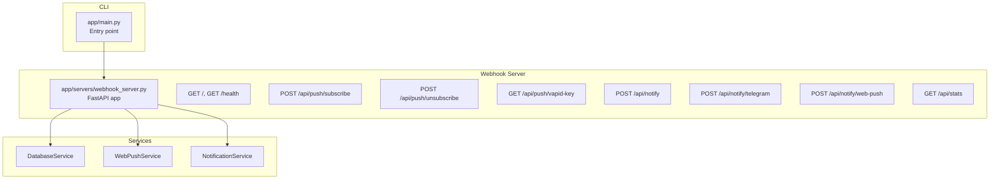
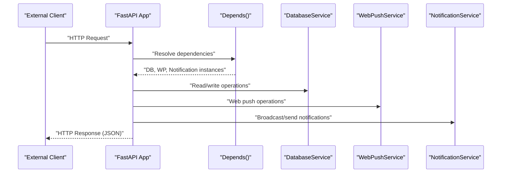
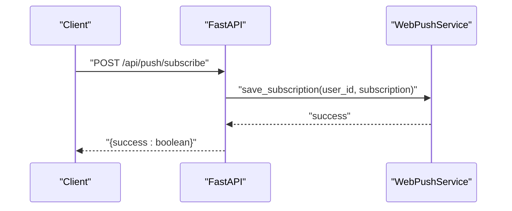
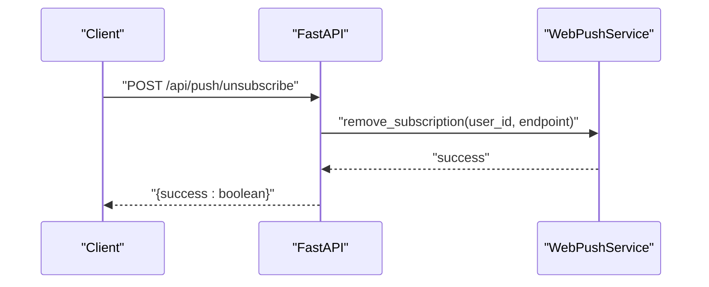
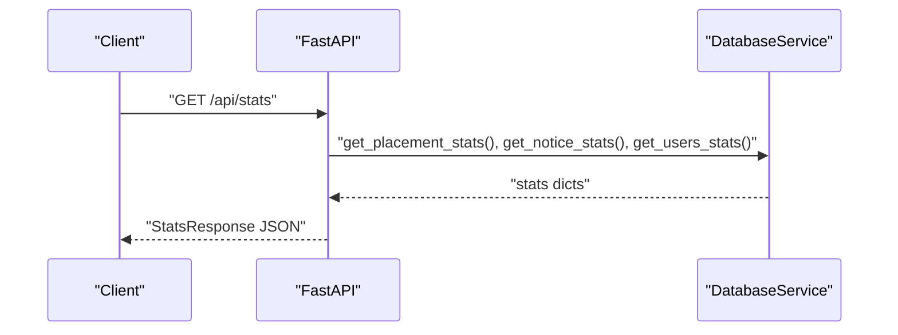
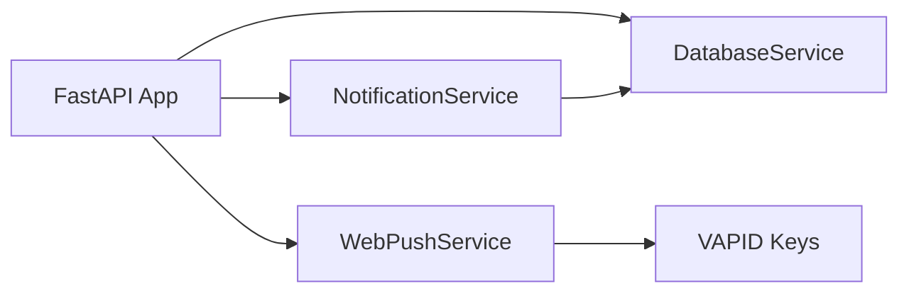

# REST API Endpoints

<cite>
**Referenced Files in This Document**
- [app/main.py](file://app/main.py)
- [app/servers/webhook_server.py](file://app/servers/webhook_server.py)
- [app/servers/bot_server.py](file://app/servers/bot_server.py)
- [app/servers/scheduler_server.py](file://app/servers/scheduler_server.py)
- [app/services/web_push_service.py](file://app/services/web_push_service.py)
- [app/services/database_service.py](file://app/services/database_service.py)
- [app/core/config.py](file://app/core/config.py)
- [docs/API.md](file://docs/API.md)
- [app/requirements.txt](file://app/requirements.txt)
</cite>

## Table of Contents
1. [Introduction](#introduction)
2. [Project Structure](#project-structure)
3. [Core Components](#core-components)
4. [Architecture Overview](#architecture-overview)
5. [Detailed Component Analysis](#detailed-component-analysis)
6. [Dependency Analysis](#dependency-analysis)
7. [Performance Considerations](#performance-considerations)
8. [Troubleshooting Guide](#troubleshooting-guide)
9. [Conclusion](#conclusion)
10. [Appendices](#appendices)

## Introduction
This document provides comprehensive documentation for the REST API endpoints exposed by the webhook server, along with related internal endpoints and integration patterns. It covers:
- GET / (root health)
- GET /health (detailed health)
- POST /api/push/subscribe (web push subscription)
- POST /api/push/unsubscribe (web push unsubscription)
- GET /api/stats (statistics aggregation)
- POST /api/notify (broadcast notifications)
- POST /api/notify/telegram (Telegram-only notifications)
- POST /api/notify/web-push (Web Push-only notifications)
- GET /api/push/vapid-key (VAPID public key for web push)

It explains request/response schemas, query parameters, authentication requirements, FastAPI-based implementation, request validation, response formatting, webhook endpoint for Telegram integration, web push subscription management, statistics retrieval with filtering options, error response formats, status codes, and rate limiting strategies. Curl examples and integration patterns with external systems are included.

## Project Structure
The webhook server is implemented using FastAPI and exposes multiple endpoints under the /api path. It integrates with dependency-injected services for database operations, notification dispatch, and web push delivery. The CLI entry point supports running the webhook server independently.

**Diagram sources**
- [app/main.py](file://app/main.py#L88-L96)
- [app/servers/webhook_server.py](file://app/servers/webhook_server.py#L69-L361)

**Section sources**
- [app/main.py](file://app/main.py#L88-L96)
- [app/servers/webhook_server.py](file://app/servers/webhook_server.py#L69-L361)

## Core Components
- FastAPI application factory with dependency injection for database, notification, and web push services.
- Pydantic models for request/response schemas.
- Dependency providers for services via FastAPI Depends.
- CORS middleware enabled for cross-origin requests.
- Health endpoints returning standardized status objects.
- Statistics endpoints aggregating data from the database.
- Web push subscription endpoints guarded by availability of web push configuration.
- Notification endpoints dispatching to Telegram and/or Web Push channels.

**Section sources**
- [app/servers/webhook_server.py](file://app/servers/webhook_server.py#L69-L144)
- [app/servers/webhook_server.py](file://app/servers/webhook_server.py#L159-L167)
- [app/servers/webhook_server.py](file://app/servers/webhook_server.py#L172-L181)
- [app/servers/webhook_server.py](file://app/servers/webhook_server.py#L186-L226)
- [app/servers/webhook_server.py](file://app/servers/webhook_server.py#L306-L341)

## Architecture Overview
The webhook server composes services at startup and exposes REST endpoints. Requests are validated by Pydantic models, and responses are returned as JSON. Services are injected via FastAPI’s dependency system. Web push requires VAPID keys and the pywebpush library; otherwise endpoints return 501 Not Implemented.

**Diagram sources**
- [app/servers/webhook_server.py](file://app/servers/webhook_server.py#L97-L138)
- [app/servers/webhook_server.py](file://app/servers/webhook_server.py#L159-L167)
- [app/servers/webhook_server.py](file://app/servers/webhook_server.py#L186-L226)

## Detailed Component Analysis

### GET /
- Purpose: Root health check endpoint.
- Response model: HealthResponse with status and version.
- Typical response: {"status": "ok", "version": "1.x.x"}.
- Status codes: 200 OK.

**Section sources**
- [app/servers/webhook_server.py](file://app/servers/webhook_server.py#L172-L175)
- [app/servers/webhook_server.py](file://app/servers/webhook_server.py#L26-L31)

### GET /health
- Purpose: Detailed health status including service checks.
- Response model: HealthResponse with status and version.
- Typical response: {"status": "healthy", "version": "1.x.x"}.
- Status codes: 200 OK.

**Section sources**
- [app/servers/webhook_server.py](file://app/servers/webhook_server.py#L177-L180)
- [app/servers/webhook_server.py](file://app/servers/webhook_server.py#L26-L31)

### POST /api/push/subscribe
- Purpose: Subscribe a user to web push notifications.
- Authentication: None (endpoint is public).
- Request body: PushSubscription (endpoint, keys, optional user_id).
- Response: {"success": true/false}.
- Validation: Raises HTTP 501 if web push is not configured; raises HTTP 500 on exceptions.
- Status codes: 200 OK, 500 Internal Server Error, 501 Not Implemented.

**Diagram sources**
- [app/servers/webhook_server.py](file://app/servers/webhook_server.py#L186-L208)
- [app/services/web_push_service.py](file://app/services/web_push_service.py#L213-L225)

**Section sources**
- [app/servers/webhook_server.py](file://app/servers/webhook_server.py#L186-L208)
- [app/services/web_push_service.py](file://app/services/web_push_service.py#L213-L225)

### POST /api/push/unsubscribe
- Purpose: Unsubscribe a user from web push notifications.
- Authentication: None.
- Request body: PushSubscription (endpoint, keys, optional user_id).
- Response: {"success": true/false}.
- Validation: Raises HTTP 501 if web push is not configured; raises HTTP 500 on exceptions.
- Status codes: 200 OK, 500 Internal Server Error, 501 Not Implemented.

**Diagram sources**
- [app/servers/webhook_server.py](file://app/servers/webhook_server.py#L210-L226)
- [app/services/web_push_service.py](file://app/services/web_push_service.py#L227-L237)

**Section sources**
- [app/servers/webhook_server.py](file://app/servers/webhook_server.py#L210-L226)
- [app/services/web_push_service.py](file://app/services/web_push_service.py#L227-L237)

### GET /api/push/vapid-key
- Purpose: Retrieve the VAPID public key for client-side web push subscription.
- Authentication: None.
- Response: {"publicKey": "<VAPID_PUBLIC_KEY>"}.
- Validation: Raises HTTP 501 if web push is not configured or VAPID key is missing.
- Status codes: 200 OK, 501 Not Implemented.

**Section sources**
- [app/servers/webhook_server.py](file://app/servers/webhook_server.py#L228-L238)
- [app/services/web_push_service.py](file://app/services/web_push_service.py#L239-L241)

### POST /api/notify
- Purpose: Broadcast a notification to configured channels (defaults to Telegram and Web Push).
- Authentication: None.
- Request body: NotifyRequest (message, optional title, optional channels array).
- Response model: NotifyResponse (success: boolean, results: dict).
- Validation: Raises HTTP 501 if notification service is not configured; raises HTTP 500 on exceptions.
- Status codes: 200 OK, 500 Internal Server Error, 501 Not Implemented.

**Section sources**
- [app/servers/webhook_server.py](file://app/servers/webhook_server.py#L244-L264)
- [app/servers/webhook_server.py](file://app/servers/webhook_server.py#L41-L54)

### POST /api/notify/telegram
- Purpose: Send a notification via Telegram only.
- Authentication: None.
- Request body: NotifyRequest (message, optional title, channels ignored).
- Response: {"success": true/false}.
- Validation: Raises HTTP 501 if notification service is not configured; raises HTTP 500 on exceptions.
- Status codes: 200 OK, 500 Internal Server Error, 501 Not Implemented.

**Section sources**
- [app/servers/webhook_server.py](file://app/servers/webhook_server.py#L266-L281)

### POST /api/notify/web-push
- Purpose: Send a notification via Web Push only.
- Authentication: None.
- Request body: NotifyRequest (message, optional title, channels ignored).
- Response: {"success": true/false}.
- Validation: Raises HTTP 501 if notification service is not configured; raises HTTP 500 on exceptions.
- Status codes: 200 OK, 500 Internal Server Error, 501 Not Implemented.

**Section sources**
- [app/servers/webhook_server.py](file://app/servers/webhook_server.py#L283-L300)

### GET /api/stats
- Purpose: Retrieve aggregated statistics (placement, notices, users).
- Authentication: None.
- Response model: StatsResponse (placement_stats, notice_stats, user_stats).
- Validation: Raises HTTP 501 if database service is not configured.
- Status codes: 200 OK, 501 Not Implemented.

**Diagram sources**
- [app/servers/webhook_server.py](file://app/servers/webhook_server.py#L306-L316)
- [app/services/database_service.py](file://app/services/database_service.py#L501-L728)

**Section sources**
- [app/servers/webhook_server.py](file://app/servers/webhook_server.py#L306-L316)
- [app/services/database_service.py](file://app/services/database_service.py#L501-L728)

### Additional Internal Endpoints
- POST /webhook/update: Trigger unsent notice dispatch via notification service. Returns {"success": true, "result": ...}. Raises HTTP 501 if services not configured; HTTP 500 on exceptions.

**Section sources**
- [app/servers/webhook_server.py](file://app/servers/webhook_server.py#L346-L360)

## Dependency Analysis
- FastAPI app lifecycle manages service initialization and cleanup.
- Dependency injection resolves DatabaseService, WebPushService, and NotificationService.
- WebPushService requires VAPID keys and pywebpush; otherwise endpoints return 501.
- DatabaseService provides statistics and user operations used by stats endpoints.

**Diagram sources**
- [app/servers/webhook_server.py](file://app/servers/webhook_server.py#L97-L138)
- [app/services/web_push_service.py](file://app/services/web_push_service.py#L55-L79)

**Section sources**
- [app/servers/webhook_server.py](file://app/servers/webhook_server.py#L97-L138)
- [app/services/web_push_service.py](file://app/services/web_push_service.py#L55-L79)

## Performance Considerations
- Web push broadcasting iterates over active users and their subscriptions; consider batching and exponential backoff for large subscriber bases.
- Database queries for stats should leverage indexes on frequently queried fields (e.g., timestamps, sent flags).
- Notification dispatch should be asynchronous to avoid blocking requests.
- Enable CORS appropriately for production origins to reduce preflight overhead.

## Troubleshooting Guide
Common issues and resolutions:
- Web push not configured:
  - Symptom: 501 Not Implemented on /api/push/* and /api/push/vapid-key.
  - Resolution: Set VAPID_PRIVATE_KEY, VAPID_PUBLIC_KEY, VAPID_EMAIL and ensure pywebpush is installed.
- Missing database:
  - Symptom: 501 Not Implemented on /api/stats.
  - Resolution: Ensure MONGO_CONNECTION_STR is configured and reachable.
- Notification service not configured:
  - Symptom: 501 Not Implemented on /api/notify*.
  - Resolution: Verify Telegram credentials and ensure NotificationService is constructed with required channels.
- Rate limiting:
  - The project documentation mentions rate limits for bot commands and REST API. For FastAPI, implement rate limiting middleware or use a gateway/proxy to enforce limits.

**Section sources**
- [app/servers/webhook_server.py](file://app/servers/webhook_server.py#L192-L196)
- [app/servers/webhook_server.py](file://app/servers/webhook_server.py#L228-L238)
- [app/servers/webhook_server.py](file://app/servers/webhook_server.py#L306-L316)
- [docs/API.md](file://docs/API.md#L570-L596)

## Conclusion
The webhook server provides a robust REST API surface for health checks, web push subscription management, statistics retrieval, and notification dispatch. It leverages FastAPI for request validation and dependency injection for maintainable service composition. Proper configuration of VAPID keys and database connectivity is essential for full functionality.

## Appendices

### Request/Response Schemas and Validation
- HealthResponse: status (string), version (string).
- PushSubscription: endpoint (string), keys (object with p256dh and auth), user_id (integer, optional).
- NotifyRequest: message (string), title (string, optional), channels (array of strings, optional).
- NotifyResponse: success (boolean), results (object).
- StatsResponse: placement_stats (object), notice_stats (object), user_stats (object).

**Section sources**
- [app/servers/webhook_server.py](file://app/servers/webhook_server.py#L26-L62)
- [app/servers/webhook_server.py](file://app/servers/webhook_server.py#L159-L167)

### Authentication and Security
- Public endpoints: No authentication required.
- Web push endpoints guard against misconfiguration by returning 501 when web push is disabled.
- Production deployment should enforce authentication and rate limiting at the network or gateway level.

**Section sources**
- [app/servers/webhook_server.py](file://app/servers/webhook_server.py#L192-L196)
- [app/servers/webhook_server.py](file://app/servers/webhook_server.py#L228-L238)

### Integration Patterns
- Telegram webhook integration:
  - The bot server handles Telegram commands and user management. While the webhook server does not expose a Telegram webhook endpoint, administrators can trigger updates via /webhook/update to dispatch unsent notices.
- Web push integration:
  - Clients obtain VAPID public key via /api/push/vapid-key, create a subscription, then POST to /api/push/subscribe. Subscriptions are stored and used for broadcasts.

**Section sources**
- [app/servers/webhook_server.py](file://app/servers/webhook_server.py#L228-L238)
- [app/servers/webhook_server.py](file://app/servers/webhook_server.py#L346-L360)
- [app/servers/bot_server.py](file://app/servers/bot_server.py#L87-L300)

### Curl Examples
- Health checks:
  - curl -s http://localhost:8000/
  - curl -s http://localhost:8000/health
- Web push:
  - curl -s -X POST http://localhost:8000/api/push/subscribe -H "Content-Type: application/json" -d '{"endpoint":"<your-endpoint>","keys":{"p256dh":"<key>","auth":"<key>"}}'
  - curl -s -X POST http://localhost:8000/api/push/unsubscribe -H "Content-Type: application/json" -d '{"endpoint":"<your-endpoint>","keys":{"p256dh":"<key>","auth":"<key>"}}'
  - curl -s http://localhost:8000/api/push/vapid-key
- Notifications:
  - curl -s -X POST http://localhost:8000/api/notify -H "Content-Type: application/json" -d '{"message":"<your message>","title":"<optional>","channels":["telegram","web_push"]}'
  - curl -s -X POST http://localhost:8000/api/notify/telegram -H "Content-Type: application/json" -d '{"message":"<your message>","title":"<optional>"}'
  - curl -s -X POST http://localhost:8000/api/notify/web-push -H "Content-Type: application/json" -d '{"message":"<your message>","title":"<optional>"}'
- Statistics:
  - curl -s http://localhost:8000/api/stats

**Section sources**
- [app/servers/webhook_server.py](file://app/servers/webhook_server.py#L172-L181)
- [app/servers/webhook_server.py](file://app/servers/webhook_server.py#L186-L238)
- [app/servers/webhook_server.py](file://app/servers/webhook_server.py#L244-L300)
- [app/servers/webhook_server.py](file://app/servers/webhook_server.py#L306-L316)

### Environment Configuration
- Required for web push: VAPID_PRIVATE_KEY, VAPID_PUBLIC_KEY, VAPID_EMAIL.
- Required for database: MONGO_CONNECTION_STR.
- Required for notifications: TELEGRAM_BOT_TOKEN, TELEGRAM_CHAT_ID.

**Section sources**
- [app/core/config.py](file://app/core/config.py#L71-L86)
- [app/core/config.py](file://app/core/config.py#L26-L43)
- [app/requirements.txt](file://app/requirements.txt#L49-L58)