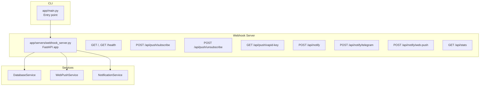
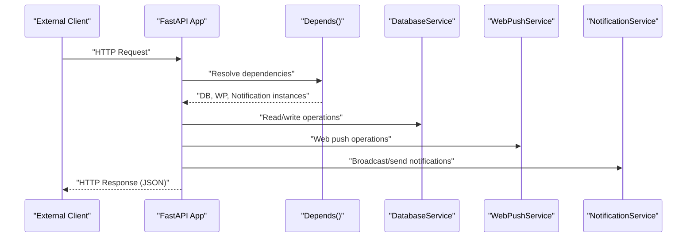
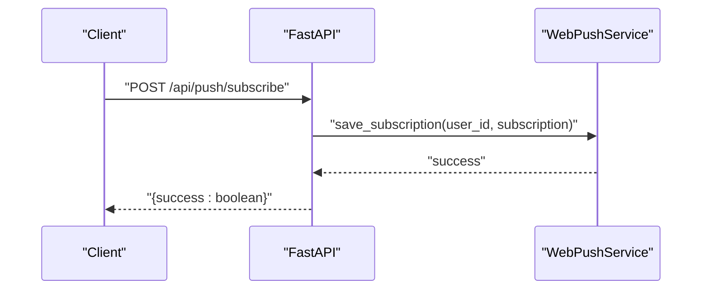
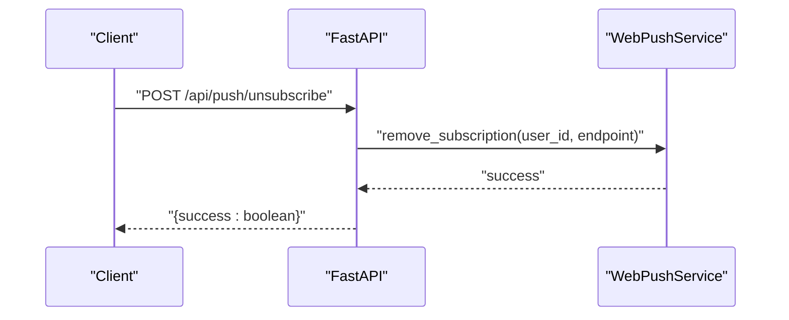
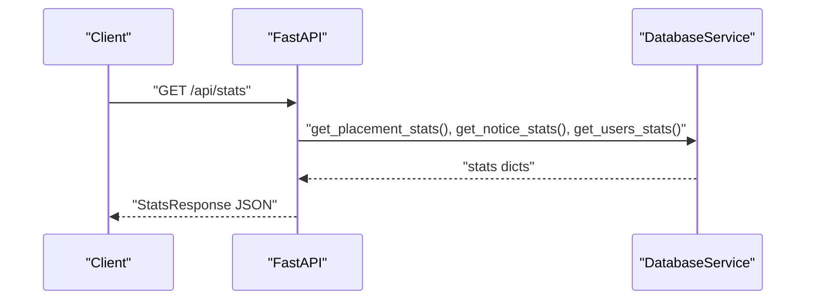
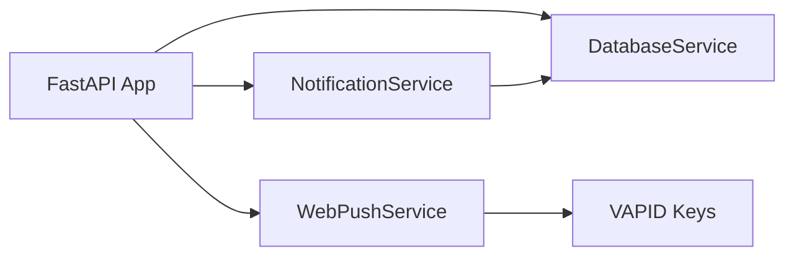

# REST API endpoints

## Introduction
HTTP routes on the webhook server: health, web push subscribe/unsubscribe, stats, notification dispatch, and the external webhook trigger. Request bodies, responses, and where each route plugs into the services.

## Project structure
The webhook server is implemented using FastAPI and exposes multiple endpoints under the /api path. It integrates with dependency-injected services for database operations, notification dispatch, and web push delivery. The CLI entry point supports running the webhook server independently.

```mermaid
graph TB
subgraph "CLI"
Main["app/main.py<br/>Entry point"]
end
subgraph "Webhook Server"
WSServer["app/servers/webhook_server.py<br/>FastAPI app"]
Health["GET /, GET /health"]
PushSub["POST /api/push/subscribe"]
PushUnsub["POST /api/push/unsubscribe"]
VapidKey["GET /api/push/vapid-key"]
Notify["POST /api/notify"]
NotifyTG["POST /api/notify/telegram"]
NotifyWP["POST /api/notify/web-push"]
Stats["GET /api/stats"]
end
subgraph "Services"
DB["DatabaseService"]
WP["WebPushService"]
Notif["NotificationService"]
end
Main --> WSServer
WSServer --> DB
WSServer --> WP
WSServer --> Notif
```

## Core components
- FastAPI application factory with dependency injection for database, notification, and web push services.
- Pydantic models for request/response schemas.
- Dependency providers for services via FastAPI Depends.
- CORS middleware enabled for cross-origin requests.
- Health endpoints returning standardized status objects.
- Statistics endpoints aggregating data from the database.
- Web push subscription endpoints guarded by availability of web push configuration.
- Notification endpoints dispatching to Telegram and/or Web Push channels.

## Architecture overview
The webhook server composes services at startup and exposes REST endpoints. Requests are validated by Pydantic models, and responses are returned as JSON. Services are injected via FastAPI's dependency system. Web push requires VAPID keys and the pywebpush library; otherwise endpoints return 501 Not Implemented.

```mermaid
sequenceDiagram
participant Client as "External Client"
participant API as "FastAPI App"
participant Dep as "Depends()"
participant DB as "DatabaseService"
participant WP as "WebPushService"
participant Notif as "NotificationService"
Client->>API : "HTTP Request"
API->>Dep : "Resolve dependencies"
Dep-->>API : "DB, WP, Notification instances"
API->>DB : "Read/write operations"
API->>WP : "Web push operations"
API->>Notif : "Broadcast/send notifications"
API-->>Client : "HTTP Response (JSON)"
```

## Detailed component analysis

### GET /
- Purpose: Root health check endpoint.
- Response model: HealthResponse with status and version.
- Typical response: {"status": "ok", "version": "1.x.x"}.
- Status codes: 200 OK.

### GET /health
- Purpose: Detailed health status including service checks.
- Response model: HealthResponse with status and version.
- Typical response: {"status": "healthy", "version": "1.x.x"}.
- Status codes: 200 OK.

### POST /api/push/subscribe
- Purpose: Subscribe a user to web push notifications.
- Authentication: None (endpoint is public).
- Request body: PushSubscription (endpoint, keys, optional user_id).
- Response: {"success": true/false}.
- Validation: Raises HTTP 501 if web push is not configured; raises HTTP 500 on exceptions.
- Status codes: 200 OK, 500 Internal Server Error, 501 Not Implemented.

```mermaid
sequenceDiagram
participant Client as "Client"
participant API as "FastAPI"
participant WP as "WebPushService"
Client->>API : "POST /api/push/subscribe"
API->>WP : "save_subscription(user_id, subscription)"
WP-->>API : "success"
API-->>Client : "{success : boolean}"
```

### POST /api/push/unsubscribe
- Purpose: Unsubscribe a user from web push notifications.
- Authentication: None.
- Request body: PushSubscription (endpoint, keys, optional user_id).
- Response: {"success": true/false}.
- Validation: Raises HTTP 501 if web push is not configured; raises HTTP 500 on exceptions.
- Status codes: 200 OK, 500 Internal Server Error, 501 Not Implemented.

```mermaid
sequenceDiagram
participant Client as "Client"
participant API as "FastAPI"
participant WP as "WebPushService"
Client->>API : "POST /api/push/unsubscribe"
API->>WP : "remove_subscription(user_id, endpoint)"
WP-->>API : "success"
API-->>Client : "{success : boolean}"
```

### GET /api/push/vapid-key
- Purpose: Retrieve the VAPID public key for client-side web push subscription.
- Authentication: None.
- Response: {"publicKey": "<VAPID_PUBLIC_KEY>"}.
- Validation: Raises HTTP 501 if web push is not configured or VAPID key is missing.
- Status codes: 200 OK, 501 Not Implemented.

### POST /api/notify
- Purpose: Broadcast a notification to configured channels (defaults to Telegram and Web Push).
- Authentication: None.
- Request body: NotifyRequest (message, optional title, optional channels array).
- Response model: NotifyResponse (success: boolean, results: dict).
- Validation: Raises HTTP 501 if notification service is not configured; raises HTTP 500 on exceptions.
- Status codes: 200 OK, 500 Internal Server Error, 501 Not Implemented.

### POST /api/notify/telegram
- Purpose: Send a notification via Telegram only.
- Authentication: None.
- Request body: NotifyRequest (message, optional title, channels ignored).
- Response: {"success": true/false}.
- Validation: Raises HTTP 501 if notification service is not configured; raises HTTP 500 on exceptions.
- Status codes: 200 OK, 500 Internal Server Error, 501 Not Implemented.

### POST /api/notify/web-push
- Purpose: Send a notification via Web Push only.
- Authentication: None.
- Request body: NotifyRequest (message, optional title, channels ignored).
- Response: {"success": true/false}.
- Validation: Raises HTTP 501 if notification service is not configured; raises HTTP 500 on exceptions.
- Status codes: 200 OK, 500 Internal Server Error, 501 Not Implemented.

### GET /api/stats
- Purpose: Retrieve aggregated statistics (placement, notices, users).
- Authentication: None.
- Response model: StatsResponse (placement_stats, notice_stats, user_stats).
- Validation: Raises HTTP 501 if database service is not configured.
- Status codes: 200 OK, 501 Not Implemented.

```mermaid
sequenceDiagram
participant Client as "Client"
participant API as "FastAPI"
participant DB as "DatabaseService"
Client->>API : "GET /api/stats"
API->>DB : "get_placement_stats(), get_notice_stats(), get_users_stats()"
DB-->>API : "stats dicts"
API-->>Client : "StatsResponse JSON"
```

### Additional internal endpoints
- POST /webhook/update: Trigger unsent notice dispatch via notification service. Returns {"success": true, "result":..}. Raises HTTP 501 if services not configured; HTTP 500 on exceptions.

## Dependency analysis
- FastAPI app lifecycle manages service initialization and cleanup.
- Dependency injection resolves DatabaseService, WebPushService, and NotificationService.
- WebPushService requires VAPID keys and pywebpush; otherwise endpoints return 501.
- DatabaseService provides statistics and user operations used by stats endpoints.

```mermaid
graph LR
App["FastAPI App"] --> DB["DatabaseService"]
App --> WP["WebPushService"]
App --> Notif["NotificationService"]
WP --> Vapid["VAPID Keys"]
Notif --> DB
```

## Performance considerations
- Web push broadcasting iterates over active users and their subscriptions; consider batching and exponential backoff for large subscriber bases.
- Database queries for stats should use indexes on frequently queried fields (e.g., timestamps, sent flags).
- Notification dispatch should be asynchronous to avoid blocking requests.
- Enable CORS appropriately for production origins to reduce preflight overhead.

## Troubleshooting guide
Common issues and resolutions:
- Web push not configured:
 - Symptom: 501 Not Implemented on /api/push/* and /api/push/vapid-key.
 - Resolution: Set VAPID_PRIVATE_KEY, VAPID_PUBLIC_KEY, VAPID_EMAIL and ensure pywebpush is installed.
- Missing database:
 - Symptom: 501 Not Implemented on /api/stats.
 - Resolution: Ensure MONGO_CONNECTION_STR is configured and reachable.
- Notification service not configured:
 - Symptom: 501 Not Implemented on /api/notify*.
 - Resolution: Verify Telegram credentials and ensure NotificationService is constructed with required channels.
- Rate limiting:
 - The project documentation mentions rate limits for bot commands and REST API. For FastAPI, implement rate limiting middleware or use a gateway/proxy to enforce limits.

## Conclusion
Webhook server is a thin FastAPI front for health, push, stats, and send. FastAPI validates requests; DI wires services. VAPID keys and a working MongoDB URI are required or push and stats routes will no-op.
