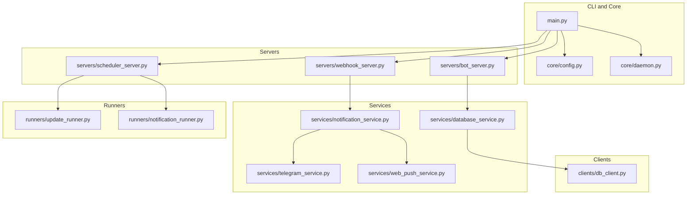
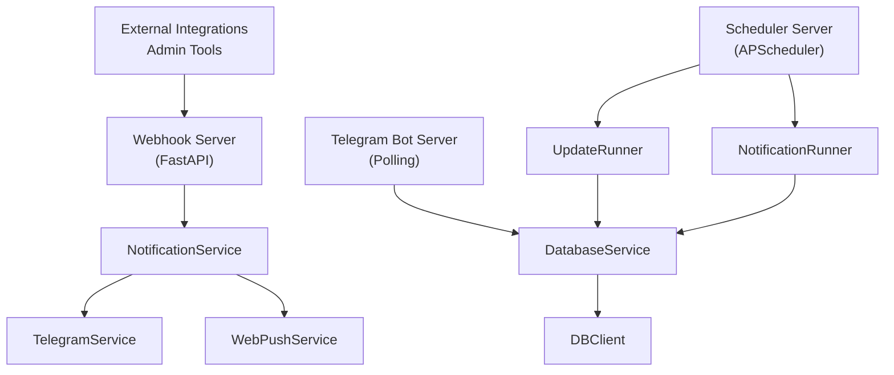
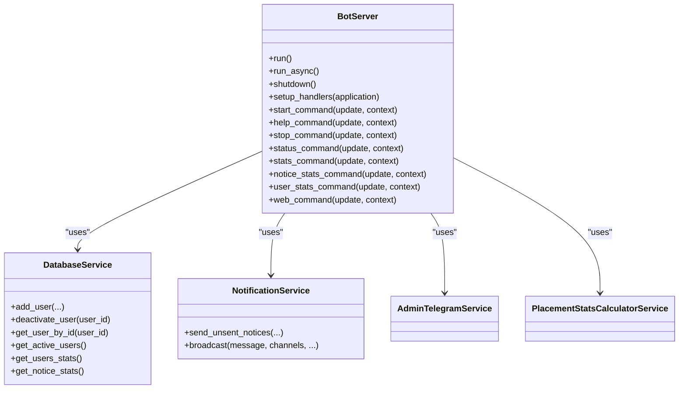
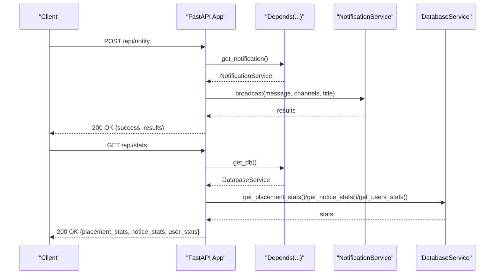
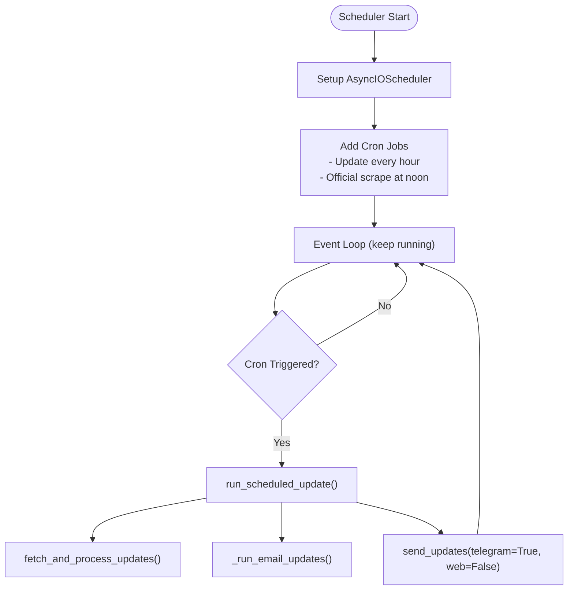
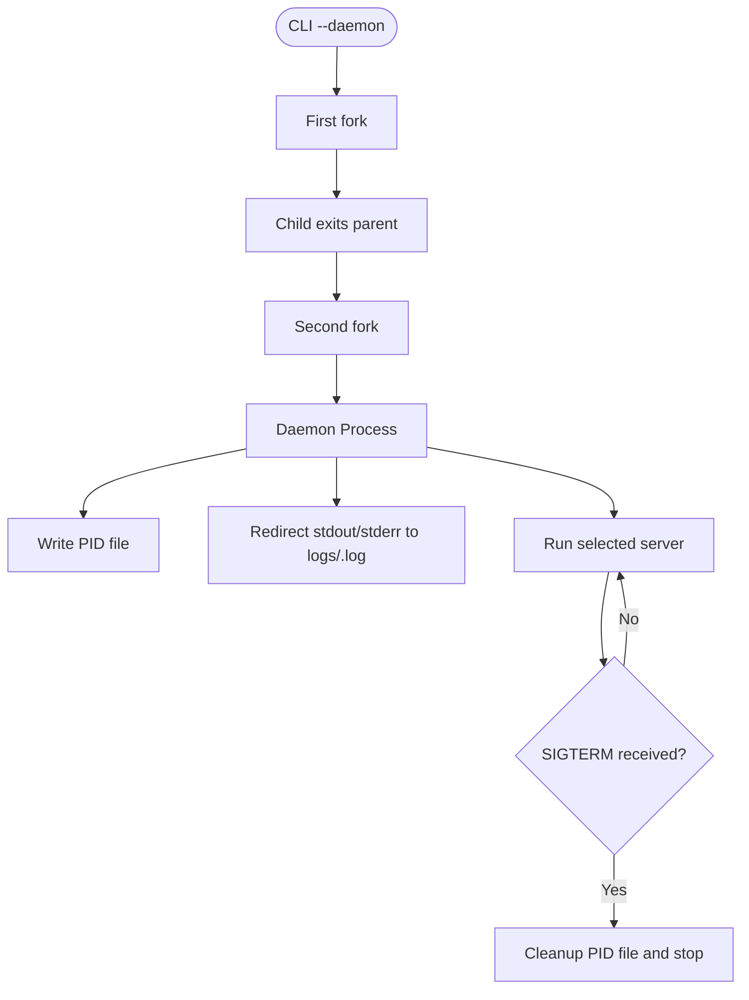
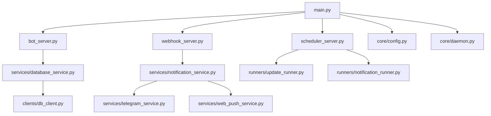

# Server architecture

## Introduction
This page explains the dual-server system design for the SuperSet Telegram Notification Bot. The system separates concerns into:
- Telegram bot server: interactive commands and user session management
- Webhook server: REST APIs for external integrations, web push subscriptions, and administrative endpoints
- Scheduler server: automated update jobs (fetching data and sending notifications)

The architecture emphasizes decoupling, dependency injection, daemon mode operation, and clear inter-server communication patterns. It supports both polling-based Telegram bot and webhook-based integration, plus a dedicated scheduler for periodic tasks.

## Project structure
The repository organizes code by responsibility:
- app/main.py: CLI entrypoint and command dispatch
- app/servers/: FastAPI webhook server, Telegram bot server, and scheduler server
- app/services/: Notification orchestration, channel implementations, database abstraction, and utilities
- app/clients/: Database client and external API clients
- app/runners/: Data ingestion and notification sending workflows
- app/core/: Configuration, daemon utilities, and shared settings
- docs/: Deployment, configuration, and operational guides

```mermaid
graph TB
subgraph "CLI and Core"
MAIN["main.py"]
CFG["core/config.py"]
DAEMON["core/daemon.py"]
end
subgraph "Servers"
BOT["servers/bot_server.py"]
WEB["servers/webhook_server.py"]
SCHED["servers/scheduler_server.py"]
end
subgraph "Services"
NOTIF["services/notification_service.py"]
TG["services/telegram_service.py"]
WP["services/web_push_service.py"]
DBS["services/database_service.py"]
end
subgraph "Clients"
DBC["clients/db_client.py"]
end
subgraph "Runners"
UPD["runners/update_runner.py"]
NOTIF_RUN["runners/notification_runner.py"]
end
MAIN --> BOT
MAIN --> WEB
MAIN --> SCHED
MAIN --> DAEMON
MAIN --> CFG
WEB --> NOTIF
BOT --> DBS
SCHED --> UPD
SCHED --> NOTIF_RUN
NOTIF --> TG
NOTIF --> WP
DBS --> DBC
```

## Core components
- Telegram Bot Server: Handles user commands (/start, /help, /stop, /status, /stats, /noticestats, /userstats, /web), user registration and management, and admin commands via injected services.
- Webhook Server: FastAPI-based REST server exposing health checks, web push subscription endpoints, notification dispatch, and statistics endpoints.
- Scheduler Server: Runs automated update jobs (SuperSet + Emails) and official placement scraping on a cron schedule, independent of the Telegram bot.
- Configuration and Daemon Utilities: Centralized settings, logging, daemon mode, and PID management for process lifecycle.
- Services and Clients: Notification orchestration, channel implementations (Telegram, Web Push), database abstraction, and MongoDB client.

## Architecture overview
The system is designed as a distributed, decoupled architecture:
- CLI entrypoint (main.py) launches one of three modes: bot, webhook, or scheduler.
- Bot server runs continuously in polling mode, responding to user commands and maintaining user sessions.
- Webhook server exposes REST endpoints for external systems and internal admin tasks.
- Scheduler server runs periodic jobs independently, fetching data and broadcasting notifications.
- All servers share a common configuration and logging setup, and rely on dependency injection for services and clients.

```mermaid
graph TB
CLIENT["External Integrations<br/>Admin Tools"]
BOT["Telegram Bot Server<br/>(Polling)"]
WEB["Webhook Server<br/>(FastAPI)"]
SCHED["Scheduler Server<br/>(APScheduler)"]
NOTIF["NotificationService"]
TG["TelegramService"]
WP["WebPushService"]
DB["DatabaseService"]
DBC["DBClient"]
UPD["UpdateRunner"]
NOTIF_RUN["NotificationRunner"]
CLIENT --> WEB
WEB --> NOTIF
BOT --> DB
SCHED --> UPD
SCHED --> NOTIF_RUN
NOTIF --> TG
NOTIF --> WP
DB --> DBC
UPD --> DB
NOTIF_RUN --> DB
```

## Detailed component analysis

### Telegram bot server
- Responsibilities:
  - Command routing (/start, /help, /stop, /status, /stats, /noticestats, /userstats, /web)
  - User registration and deactivation
  - Admin command delegation
  - Asynchronous polling loop with graceful shutdown
- Dependency Injection:
  - DatabaseService, NotificationService, AdminTelegramService, PlacementStatsCalculatorService
- Session and User Management:
  - Adds users on /start, deactivates on /stop, retrieves user status and stats
- Error Handling:
  - Graceful shutdown, logging, and safe printing in daemon mode

```mermaid
classDiagram
class BotServer {
+run()
+run_async()
+shutdown()
+setup_handlers(application)
+start_command(update, context)
+help_command(update, context)
+stop_command(update, context)
+status_command(update, context)
+stats_command(update, context)
+notice_stats_command(update, context)
+user_stats_command(update, context)
+web_command(update, context)
}
class DatabaseService {
+add_user(...)
+deactivate_user(user_id)
+get_user_by_id(user_id)
+get_active_users()
+get_users_stats()
+get_notice_stats()
}
class NotificationService {
+send_unsent_notices(...)
+broadcast(message, channels, ...)
}
class AdminTelegramService
class PlacementStatsCalculatorService
BotServer --> DatabaseService : "uses"
BotServer --> NotificationService : "uses"
BotServer --> AdminTelegramService : "uses"
BotServer --> PlacementStatsCalculatorService : "uses"
```

### Webhook server (FastAPI)
- Responsibilities:
  - Health checks (/, /health)
  - Web push subscription management (/api/push/subscribe, /api/push/unsubscribe, /api/push/vapid-key)
  - Notification dispatch (/api/notify, /api/notify/telegram, /api/notify/web-push)
  - Statistics endpoints (/api/stats, /api/stats/placements, /api/stats/notices, /api/stats/users)
  - External integration webhook (/webhook/update)
- Middleware and Routing:
  - CORS middleware
  - Dependency injection via app state and Depends
- Error Handling:
  - HTTP exceptions with descriptive details
  - Validation via Pydantic models

```mermaid
sequenceDiagram
participant Client as "Client"
participant API as "FastAPI App"
participant Dep as "Depends(...)"
participant Notif as "NotificationService"
participant DB as "DatabaseService"
Client->>API : POST /api/notify
API->>Dep : get_notification()
Dep-->>API : NotificationService
API->>Notif : broadcast(message, channels, title)
Notif-->>API : results
API-->>Client : 200 OK {success, results}
Client->>API : GET /api/stats
API->>Dep : get_db()
Dep-->>API : DatabaseService
API->>DB : get_placement_stats()/get_notice_stats()/get_users_stats()
DB-->>API : stats
API-->>Client : 200 OK {placement_stats, notice_stats, user_stats}
```

### Scheduler server
- Responsibilities:
  - Scheduled update jobs (fetch SuperSet + Emails, send notifications)
  - Official placement data scraping
  - Independent operation from the Telegram bot
- Scheduling:
  - Cron-based jobs at multiple times per day
  - Daily official placement scrape at noon IST
- Execution:
  - Uses runners and services directly (no service injection)

```mermaid
flowchart TD
Start(["Scheduler Start"]) --> Setup["Setup AsyncIOScheduler"]
Setup --> Jobs["Add Cron Jobs<br/>- Update every hour<br/>- Official scrape at noon"]
Jobs --> Loop["Event Loop (keep running)"]
Loop --> Trigger{"Cron Triggered?"}
Trigger --> |Yes| RunUpdate["run_scheduled_update()"]
RunUpdate --> FetchSS["fetch_and_process_updates()"]
RunUpdate --> FetchEmails["_run_email_updates()"]
RunUpdate --> SendTG["send_updates(telegram=True, web=False)"]
Trigger --> |No| Loop
SendTG --> Loop
```

### Daemon mode operation and process management
- Daemon Utilities:
  - Double-fork daemonization, PID file management, status checks, and controlled stop
  - Separate logging for scheduler daemon
- CLI Integration:
  - main.py supports daemon mode for bot and scheduler
  - Reinitializes logging after fork to ensure proper file handles

```mermaid
flowchart TD
Start(["CLI --daemon"]) --> Fork1["First fork"]
Fork1 --> Child1["Child exits parent"]
Child1 --> Fork2["Second fork"]
Fork2 --> Daemon["Daemon Process"]
Daemon --> PID["Write PID file"]
Daemon --> Logs["Redirect stdout/stderr to logs/<name>.log"]
Daemon --> Run["Run selected server"]
Run --> Stop{"SIGTERM received?"}
Stop --> |Yes| Cleanup["Cleanup PID file and stop"]
Stop --> |No| Run
```

### Inter-Server communication patterns
- No direct inter-server calls:
  - Bot server manages user sessions and commands
  - Webhook server exposes REST endpoints for external integrations
  - Scheduler server operates independently and uses runners/services directly
- Shared infrastructure:
  - All servers use the same configuration and logging setup
  - Database access is centralized via DatabaseService and DBClient

## Dependency analysis
The system follows a layered dependency structure with clear inversion of control via dependency injection:
- Servers depend on services, which depend on clients
- Configuration and daemon utilities are shared across servers
- Runners encapsulate workflows and are reused by both scheduler and CLI

```mermaid
graph TB
MAIN["main.py"]
BOT["bot_server.py"]
WEB["webhook_server.py"]
SCHED["scheduler_server.py"]
CFG["core/config.py"]
DAEMON["core/daemon.py"]
NOTIF["services/notification_service.py"]
TG["services/telegram_service.py"]
WP["services/web_push_service.py"]
DBS["services/database_service.py"]
DBC["clients/db_client.py"]
UPD["runners/update_runner.py"]
NOTIF_RUN["runners/notification_runner.py"]
MAIN --> BOT
MAIN --> WEB
MAIN --> SCHED
MAIN --> CFG
MAIN --> DAEMON
BOT --> DBS
WEB --> NOTIF
SCHED --> UPD
SCHED --> NOTIF_RUN
NOTIF --> TG
NOTIF --> WP
DBS --> DBC
```

## Performance considerations
- Asynchronous design:
  - Bot server uses asynchronous polling
  - Scheduler uses AsyncIOScheduler for non-blocking jobs
- Rate limiting and batching:
  - TelegramService applies rate limiting when broadcasting to users
  - Long messages are split to comply with Telegram limits
- Efficient data fetching:
  - UpdateRunner pre-fetches existing IDs to minimize API calls
  - Selective enrichment of jobs reduces expensive operations
- Resource isolation:
  - Separate daemon logs for bot and scheduler reduce contention
- Scalability:
  - Webhook server can be horizontally scaled behind a load balancer
  - MongoDB can be sharded for high-volume operations

[No sources needed since this section provides general guidance]

## Troubleshooting guide
- Health checks:
  - Use GET /health on the webhook server to verify service availability
- Logs:
  - Bot logs: logs/superset_bot.log
  - Scheduler logs: logs/scheduler.log
- Daemon status:
  - Use main.py status to check running daemons
  - Use main.py stop <bot|scheduler> to stop a daemon
- Common issues:
  - Missing environment variables cause configuration errors
  - MongoDB connectivity failures require verifying MONGO_CONNECTION_STR
  - Telegram bot token or chat ID misconfiguration affects message delivery
  - Web push requires VAPID keys; missing keys disable web push

## Conclusion
The dual-server architecture cleanly separates concerns: the Telegram bot server focuses on user interactions, the webhook server exposes REST APIs for integrations, and the scheduler server automates data ingestion and notifications. The design uses dependency injection, daemon mode, and shared configuration to achieve maintainability, scalability, and operability. With clear inter-server boundaries and reliable error handling, the system supports both small deployments and larger-scale production environments.

[No sources needed since this section summarizes without analyzing specific files]

## Appendices

### Deployment considerations
- Choose deployment option based on environment and scale (Local/VPS, Docker, GitHub Actions, cloud platforms)
- Use systemd or PM2 for process supervision and automatic restarts
- Configure reverse proxy for webhook deployments and SSL certificates
- Enable log rotation and automated backups for MongoDB

### Scaling strategies
- Horizontal scaling:
  - Run multiple instances of the webhook server behind a load balancer
  - Use Kubernetes deployments with readiness/liveness probes
- Database scaling:
  - Enable MongoDB sharding for high-volume collections
- Operational scaling:
  - Separate bot and scheduler instances for independent scaling
  - Use separate process managers for each server

### Monitoring approaches
- Health endpoints:
  - Use /health for liveness/readiness checks
- Logging:
  - Tail logs for errors and warnings
- Alerts:
  - Monitor health externally and send alerts on failure
- Metrics:
  - Track unsent notices and send success/failure ratios
