# Telegram Bot API

<cite>
**Referenced Files in This Document**
- [main.py](file://app/main.py)
- [bot_server.py](file://app/servers/bot_server.py)
- [webhook_server.py](file://app/servers/webhook_server.py)
- [telegram_service.py](file://app/services/telegram_service.py)
- [admin_telegram_service.py](file://app/services/admin_telegram_service.py)
- [database_service.py](file://app/services/database_service.py)
- [config.py](file://app/core/config.py)
- [db_client.py](file://app/clients/db_client.py)
- [notification_service.py](file://app/services/notification_service.py)
- [notice_formatter_service.py](file://app/services/notice_formatter_service.py)
- [API.md](file://docs/API.md)
- [ARCHITECTURE.md](file://docs/ARCHITECTURE.md)
- [CONFIGURATION.md](file://docs/CONFIGURATION.md)
</cite>

## Table of Contents
1. [Introduction](#introduction)
2. [Project Structure](#project-structure)
3. [Core Components](#core-components)
4. [Architecture Overview](#architecture-overview)
5. [Detailed Component Analysis](#detailed-component-analysis)
6. [Dependency Analysis](#dependency-analysis)
7. [Performance Considerations](#performance-considerations)
8. [Troubleshooting Guide](#troubleshooting-guide)
9. [Conclusion](#conclusion)
10. [Appendices](#appendices)

## Introduction
This document provides comprehensive documentation for the Telegram Bot API endpoints and command handlers. It covers user commands (/start, /stop, /status, /stats, /web), admin commands (/users, /boo, /fu, /logs), dual-mode operation (long-polling and webhook), command routing, user session management, subscription handling, MongoDB integration, and the message formatting system. Practical examples, error handling, and troubleshooting guidance are included.

## Project Structure
The project is organized around a modular architecture with clear separation of concerns:
- CLI entry point orchestrating servers and jobs
- Telegram bot server with command handlers
- Webhook/FastAPI server exposing REST endpoints
- Services for database, notifications, formatting, and administration
- Configuration and database client modules

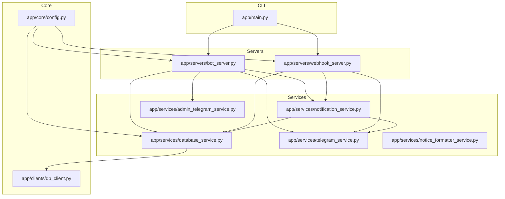

**Diagram sources**
- [main.py](file://app/main.py#L37-L100)
- [bot_server.py](file://app/servers/bot_server.py#L29-L82)
- [webhook_server.py](file://app/servers/webhook_server.py#L69-L130)
- [database_service.py](file://app/services/database_service.py#L16-L46)
- [notification_service.py](file://app/services/notification_service.py#L13-L41)
- [telegram_service.py](file://app/services/telegram_service.py#L20-L52)
- [admin_telegram_service.py](file://app/services/admin_telegram_service.py#L19-L42)
- [config.py](file://app/core/config.py#L18-L128)
- [db_client.py](file://app/clients/db_client.py#L16-L41)

**Section sources**
- [main.py](file://app/main.py#L37-L100)
- [bot_server.py](file://app/servers/bot_server.py#L29-L82)
- [webhook_server.py](file://app/servers/webhook_server.py#L69-L130)
- [database_service.py](file://app/services/database_service.py#L16-L46)
- [notification_service.py](file://app/services/notification_service.py#L13-L41)
- [telegram_service.py](file://app/services/telegram_service.py#L20-L52)
- [admin_telegram_service.py](file://app/services/admin_telegram_service.py#L19-L42)
- [config.py](file://app/core/config.py#L18-L128)
- [db_client.py](file://app/clients/db_client.py#L16-L41)

## Core Components
- BotServer: Implements long-polling Telegram bot with command handlers for user and admin commands.
- WebhookServer: FastAPI-based server exposing health, push subscription, notification, and stats endpoints.
- DatabaseService: Wraps MongoDB operations for notices, jobs, placement offers, users, and policies.
- TelegramService: Handles Telegram messaging, formatting, and broadcasting.
- NotificationService: Routes notifications to configured channels and manages unsent notices.
- AdminTelegramService: Provides admin-only commands with authentication via chat ID.
- Configuration and DB Client: Centralized settings and MongoDB connectivity.

**Section sources**
- [bot_server.py](file://app/servers/bot_server.py#L29-L82)
- [webhook_server.py](file://app/servers/webhook_server.py#L69-L130)
- [database_service.py](file://app/services/database_service.py#L16-L46)
- [telegram_service.py](file://app/services/telegram_service.py#L20-L52)
- [notification_service.py](file://app/services/notification_service.py#L13-L41)
- [admin_telegram_service.py](file://app/services/admin_telegram_service.py#L19-L42)
- [config.py](file://app/core/config.py#L18-L128)
- [db_client.py](file://app/clients/db_client.py#L16-L41)

## Architecture Overview
The system supports two operational modes:
- Long-polling Telegram bot server (BotServer) with command handlers.
- Webhook/FastAPI server (WebhookServer) with REST endpoints for health, push subscriptions, notifications, and stats.

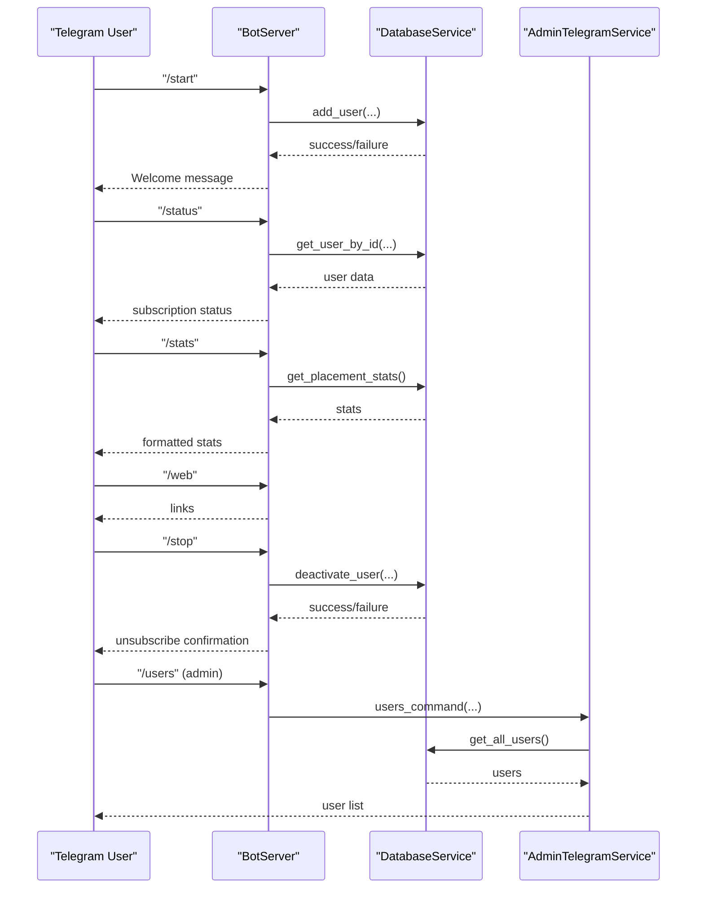

**Diagram sources**
- [bot_server.py](file://app/servers/bot_server.py#L87-L163)
- [bot_server.py](file://app/servers/bot_server.py#L212-L244)
- [bot_server.py](file://app/servers/bot_server.py#L246-L299)
- [bot_server.py](file://app/servers/bot_server.py#L346-L361)
- [bot_server.py](file://app/servers/bot_server.py#L191-L211)
- [admin_telegram_service.py](file://app/services/admin_telegram_service.py#L57-L108)
- [database_service.py](file://app/services/database_service.py#L616-L669)
- [database_service.py](file://app/services/database_service.py#L714-L729)

**Section sources**
- [bot_server.py](file://app/servers/bot_server.py#L87-L163)
- [bot_server.py](file://app/servers/bot_server.py#L212-L244)
- [bot_server.py](file://app/servers/bot_server.py#L246-L299)
- [bot_server.py](file://app/servers/bot_server.py#L346-L361)
- [admin_telegram_service.py](file://app/services/admin_telegram_service.py#L57-L108)
- [database_service.py](file://app/services/database_service.py#L616-L669)
- [database_service.py](file://app/services/database_service.py#L714-L729)

## Detailed Component Analysis

### Telegram Bot Commands

#### /start
- Purpose: Register user for notifications.
- Request: /start
- Response: Welcome message with available commands and links.
- Database actions:
  - Insert or update user record in Users collection.
  - Set active subscription and timestamps.

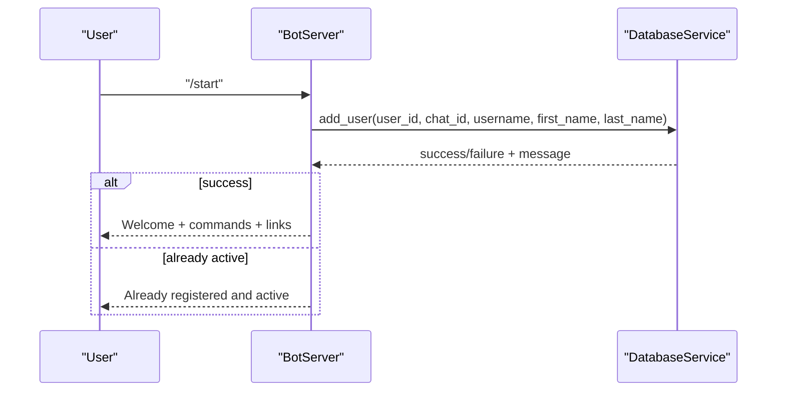

**Diagram sources**
- [bot_server.py](file://app/servers/bot_server.py#L87-L163)
- [database_service.py](file://app/services/database_service.py#L616-L669)

**Section sources**
- [bot_server.py](file://app/servers/bot_server.py#L87-L163)
- [database_service.py](file://app/services/database_service.py#L616-L669)

#### /stop
- Purpose: Unsubscribe user from notifications.
- Request: /stop
- Response: Confirmation or inactive message.
- Database actions:
  - Deactivate user subscription.

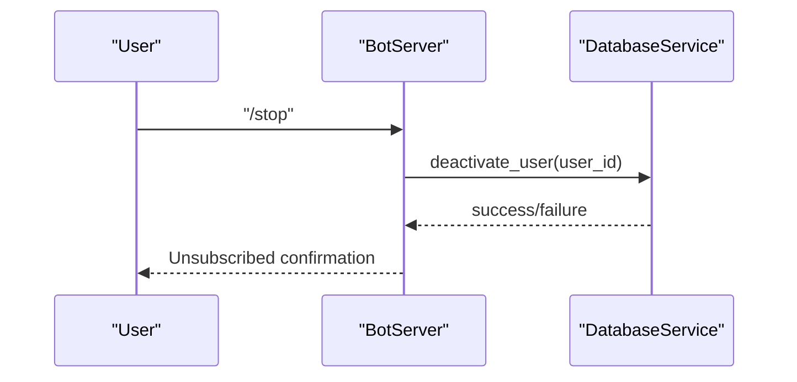

**Diagram sources**
- [bot_server.py](file://app/servers/bot_server.py#L191-L211)
- [database_service.py](file://app/services/database_service.py#L670-L682)

**Section sources**
- [bot_server.py](file://app/servers/bot_server.py#L191-L211)
- [database_service.py](file://app/services/database_service.py#L670-L682)

#### /status
- Purpose: Check subscription status.
- Request: /status
- Response: Active/inactive status with registration date and user ID.
- Database actions:
  - Retrieve user by ID.

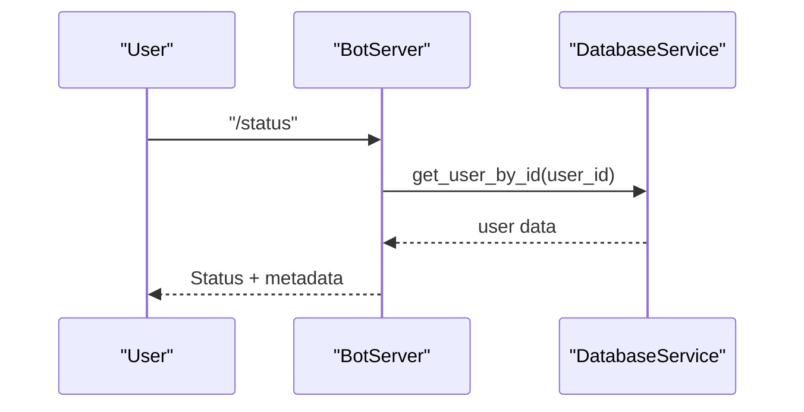

**Diagram sources**
- [bot_server.py](file://app/servers/bot_server.py#L212-L244)
- [database_service.py](file://app/services/database_service.py#L704-L713)

**Section sources**
- [bot_server.py](file://app/servers/bot_server.py#L212-L244)
- [database_service.py](file://app/services/database_service.py#L704-L713)

#### /stats
- Purpose: View placement statistics.
- Request: /stats
- Response: Formatted statistics including overall placement percentage, packages, and branch-wise stats.
- Database actions:
  - Compute and return placement statistics.

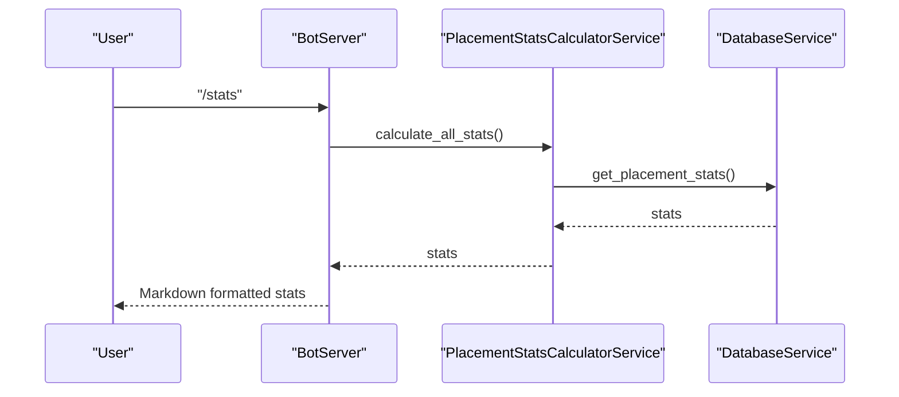

**Diagram sources**
- [bot_server.py](file://app/servers/bot_server.py#L246-L299)
- [database_service.py](file://app/services/database_service.py#L501-L600)

**Section sources**
- [bot_server.py](file://app/servers/bot_server.py#L246-L299)
- [database_service.py](file://app/services/database_service.py#L501-L600)

#### /web
- Purpose: Get useful links to JIIT tools.
- Request: /web
- Response: HTML-formatted links.

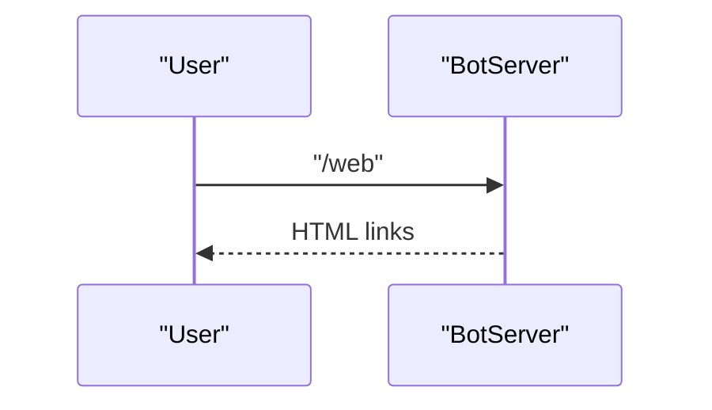

**Diagram sources**
- [bot_server.py](file://app/servers/bot_server.py#L346-L361)

**Section sources**
- [bot_server.py](file://app/servers/bot_server.py#L346-L361)

### Admin Commands

#### Authentication and Permission Checks
- Admin commands are restricted to a specific chat ID configured in settings.
- The AdminTelegramService validates the sender's chat ID against the configured admin chat ID.

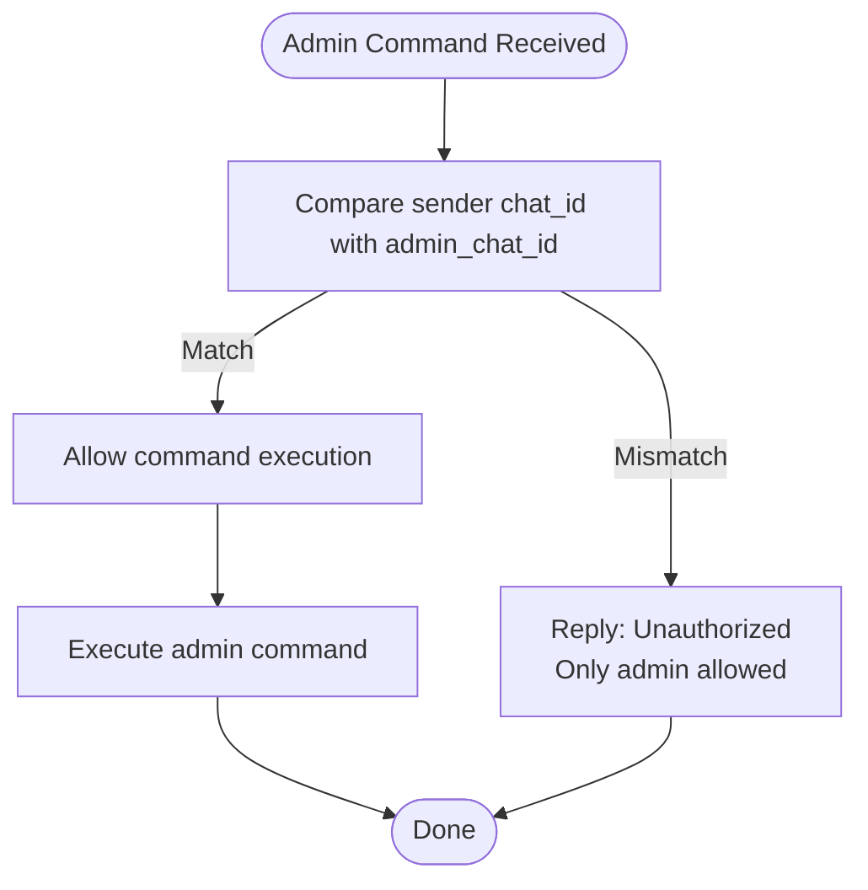

**Diagram sources**
- [admin_telegram_service.py](file://app/services/admin_telegram_service.py#L43-L56)

**Section sources**
- [admin_telegram_service.py](file://app/services/admin_telegram_service.py#L43-L56)
- [config.py](file://app/core/config.py#L39-L43)

#### /users
- Purpose: List all users and subscription stats.
- Request: /users
- Response: User list with status and counts.

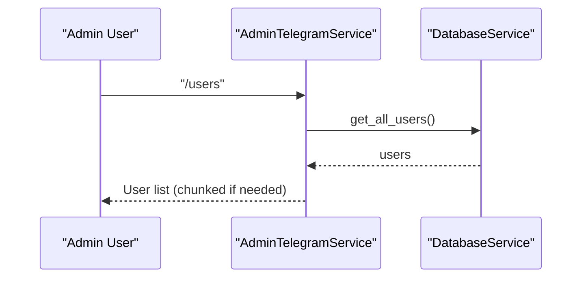

**Diagram sources**
- [admin_telegram_service.py](file://app/services/admin_telegram_service.py#L57-L108)
- [database_service.py](file://app/services/database_service.py#L694-L702)

**Section sources**
- [admin_telegram_service.py](file://app/services/admin_telegram_service.py#L57-L108)
- [database_service.py](file://app/services/database_service.py#L694-L702)

#### /boo <message>
- Purpose: Broadcast message to all active users or targeted user.
- Request: /boo broadcast <message> or /boo <chat_id> <message>
- Response: Broadcast result summary.

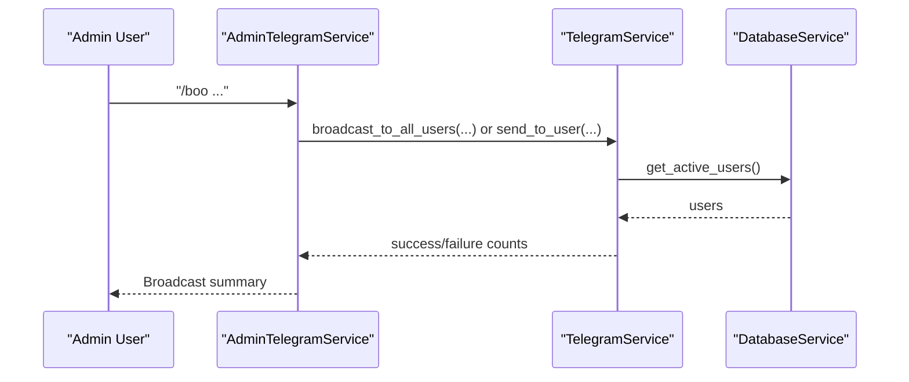

**Diagram sources**
- [admin_telegram_service.py](file://app/services/admin_telegram_service.py#L109-L192)
- [telegram_service.py](file://app/services/telegram_service.py#L140-L172)
- [database_service.py](file://app/services/database_service.py#L684-L692)

**Section sources**
- [admin_telegram_service.py](file://app/services/admin_telegram_service.py#L109-L192)
- [telegram_service.py](file://app/services/telegram_service.py#L140-L172)
- [database_service.py](file://app/services/database_service.py#L684-L692)

#### /fu and /scrapyyy
- Purpose: Force immediate update from all sources and broadcast.
- Request: /fu or /scrapyyy
- Response: Progress and results summary.

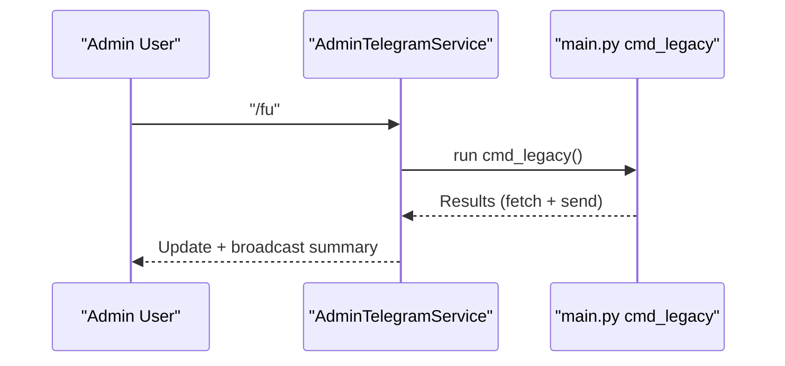

**Diagram sources**
- [admin_telegram_service.py](file://app/services/admin_telegram_service.py#L193-L248)
- [main.py](file://app/main.py#L319-L335)

**Section sources**
- [admin_telegram_service.py](file://app/services/admin_telegram_service.py#L193-L248)
- [main.py](file://app/main.py#L319-L335)

#### /logs [lines]
- Purpose: View recent log entries.
- Request: /logs [lines]
- Response: Log content (HTML escaped and truncated if needed).

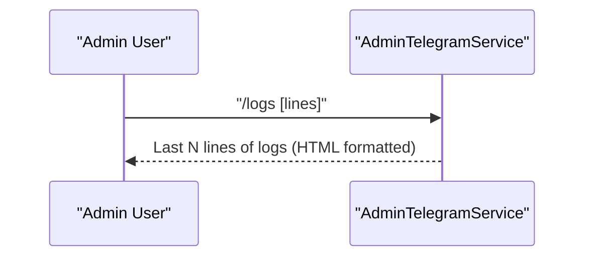

**Diagram sources**
- [admin_telegram_service.py](file://app/services/admin_telegram_service.py#L277-L349)

**Section sources**
- [admin_telegram_service.py](file://app/services/admin_telegram_service.py#L277-L349)

### Dual-Mode Operation: Long-Polling and Webhook
- Long-polling mode: BotServer initializes and runs an asynchronous polling loop.
- Webhook mode: WebhookServer exposes endpoints for health, push subscriptions, notifications, and stats.

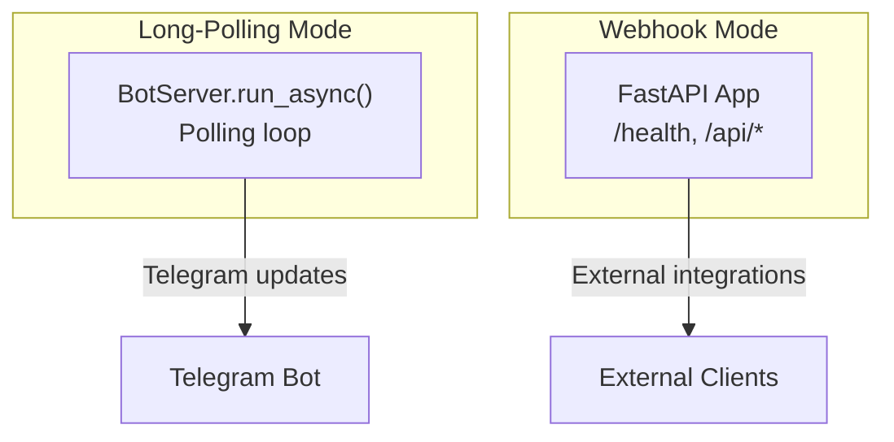

**Diagram sources**
- [bot_server.py](file://app/servers/bot_server.py#L405-L453)
- [webhook_server.py](file://app/servers/webhook_server.py#L139-L144)

**Section sources**
- [bot_server.py](file://app/servers/bot_server.py#L405-L453)
- [webhook_server.py](file://app/servers/webhook_server.py#L139-L144)

### Command Routing Mechanism
- BotServer registers command handlers for user and admin commands.
- Admin commands are conditionally registered when AdminTelegramService is available.

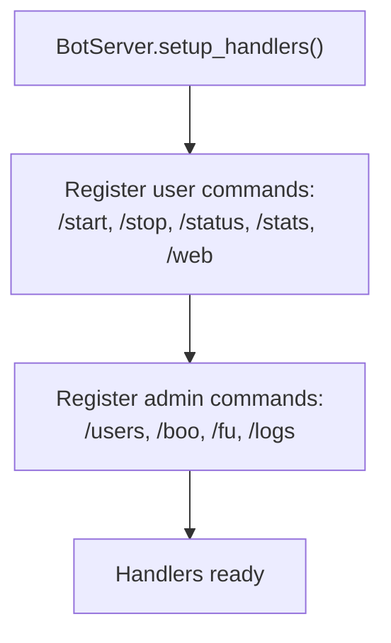

**Diagram sources**
- [bot_server.py](file://app/servers/bot_server.py#L366-L404)

**Section sources**
- [bot_server.py](file://app/servers/bot_server.py#L366-L404)

### User Session Management and Subscription Handling
- User registration and deactivation handled by DatabaseService.
- Active user retrieval for broadcasting.

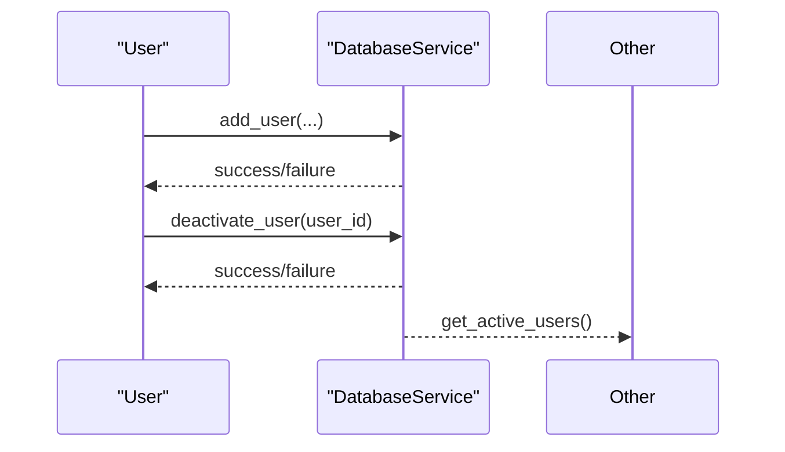

**Diagram sources**
- [database_service.py](file://app/services/database_service.py#L616-L669)
- [database_service.py](file://app/services/database_service.py#L670-L682)
- [database_service.py](file://app/services/database_service.py#L684-L692)

**Section sources**
- [database_service.py](file://app/services/database_service.py#L616-L669)
- [database_service.py](file://app/services/database_service.py#L670-L682)
- [database_service.py](file://app/services/database_service.py#L684-L692)

### MongoDB Integration
- DBClient establishes and manages MongoDB connections.
- DatabaseService encapsulates CRUD operations across collections: Notices, Jobs, PlacementOffers, Users, Policies, OfficialPlacementData.

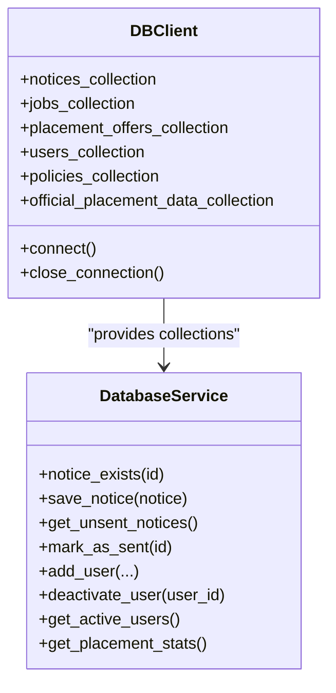

**Diagram sources**
- [db_client.py](file://app/clients/db_client.py#L16-L104)
- [database_service.py](file://app/services/database_service.py#L16-L46)

**Section sources**
- [db_client.py](file://app/clients/db_client.py#L16-L104)
- [database_service.py](file://app/services/database_service.py#L16-L46)

### Message Formatting System
- TelegramService converts Markdown to HTML/Telegram-compatible formats and handles long message splitting.
- NoticeFormatterService formats notices using LLM-based extraction and structured templates.

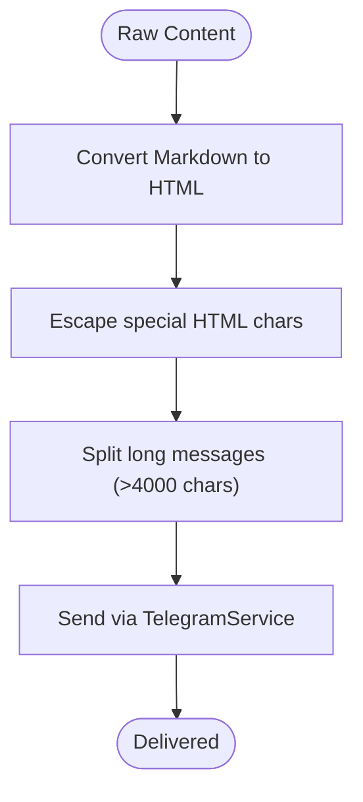

**Diagram sources**
- [telegram_service.py](file://app/services/telegram_service.py#L304-L351)
- [telegram_service.py](file://app/services/telegram_service.py#L218-L254)

**Section sources**
- [telegram_service.py](file://app/services/telegram_service.py#L304-L351)
- [telegram_service.py](file://app/services/telegram_service.py#L218-L254)
- [notice_formatter_service.py](file://app/services/notice_formatter_service.py#L392-L775)

## Dependency Analysis
The system exhibits strong dependency injection and separation of concerns:
- BotServer depends on DatabaseService, NotificationService, TelegramService, AdminTelegramService, and PlacementStatsCalculatorService.
- WebhookServer depends on DatabaseService, NotificationService, and TelegramService.
- DatabaseService depends on DBClient.
- Configuration is centralized via Settings with caching.

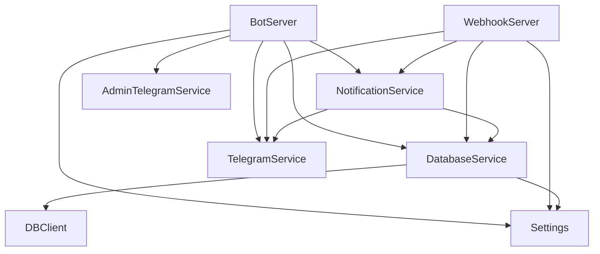

**Diagram sources**
- [bot_server.py](file://app/servers/bot_server.py#L455-L507)
- [webhook_server.py](file://app/servers/webhook_server.py#L69-L130)
- [database_service.py](file://app/services/database_service.py#L28-L46)
- [config.py](file://app/core/config.py#L156-L186)

**Section sources**
- [bot_server.py](file://app/servers/bot_server.py#L455-L507)
- [webhook_server.py](file://app/servers/webhook_server.py#L69-L130)
- [database_service.py](file://app/services/database_service.py#L28-L46)
- [config.py](file://app/core/config.py#L156-L186)

## Performance Considerations
- Message chunking: TelegramService splits long messages (>4000 chars) and retries without formatting if needed.
- Rate limiting: Broadcast loops include small delays to avoid rate limits.
- Asynchronous polling: BotServer uses asyncio for non-blocking operations.
- Database indexing: Recommended indexes on frequently queried fields (e.g., notices.id, users.user_id, placement_offers.company).

**Section sources**
- [telegram_service.py](file://app/services/telegram_service.py#L218-L254)
- [telegram_service.py](file://app/services/telegram_service.py#L163-L172)
- [bot_server.py](file://app/servers/bot_server.py#L405-L453)
- [ARCHITECTURE.md](file://docs/ARCHITECTURE.md#L599-L613)

## Troubleshooting Guide
Common issues and resolutions:
- Telegram bot token missing or invalid: Ensure TELEGRAM_BOT_TOKEN is set and valid.
- Admin command unauthorized: Verify TELEGRAM_CHAT_ID matches the admin chat ID.
- MongoDB connection failures: Check MONGO_CONNECTION_STR and network/firewall settings.
- Long message delivery failures: Messages are split automatically; if formatting fails, fallback to plain text.
- Webhook endpoint not reachable: Confirm server is running and port is open.

**Section sources**
- [config.py](file://app/core/config.py#L34-L43)
- [admin_telegram_service.py](file://app/services/admin_telegram_service.py#L43-L56)
- [db_client.py](file://app/clients/db_client.py#L42-L72)
- [telegram_service.py](file://app/services/telegram_service.py#L101-L122)
- [webhook_server.py](file://app/servers/webhook_server.py#L369-L387)

## Conclusion
The Telegram Bot API provides robust user and admin command handling with dual-mode operation, comprehensive MongoDB integration, and a flexible notification routing system. The documented endpoints, commands, and workflows enable reliable deployment and maintenance of placement notifications across Telegram and web push channels.

## Appendices

### API Endpoints Summary
- GET /health: Health check
- POST /api/push/subscribe: Subscribe to web push
- POST /api/push/unsubscribe: Unsubscribe from web push
- GET /api/push/vapid-key: Get VAPID public key
- POST /api/notify: Send notification to specified channels
- POST /api/notify/telegram: Send Telegram-only notification
- POST /api/notify/web-push: Send Web Push-only notification
- GET /api/stats: Get all statistics
- GET /api/stats/placements: Get placement statistics
- GET /api/stats/notices: Get notice statistics
- GET /api/stats/users: Get user statistics
- POST /webhook/update: Trigger update job via webhook

**Section sources**
- [webhook_server.py](file://app/servers/webhook_server.py#L172-L361)

### Configuration Reference
Key environment variables:
- MONGO_CONNECTION_STR: MongoDB connection URI
- TELEGRAM_BOT_TOKEN: Telegram bot token
- TELEGRAM_CHAT_ID: Default chat/channel ID
- SUPERSET_CREDENTIALS: JSON array of SuperSet credentials
- GOOGLE_API_KEY: Gemini LLM API key
- VAPID_PRIVATE_KEY, VAPID_PUBLIC_KEY, VAPID_EMAIL: Web push VAPID keys
- WEBHOOK_PORT, WEBHOOK_HOST: Webhook server configuration
- LOG_LEVEL, LOG_FILE: Logging configuration

**Section sources**
- [CONFIGURATION.md](file://docs/CONFIGURATION.md#L47-L127)
- [config.py](file://app/core/config.py#L26-L122)