# Telegram bot API

## Introduction
This page provides detailed documentation for the Telegram Bot API endpoints and command handlers. It covers user commands (/start, /stop, /status, /stats, /web), admin commands (/users, /boo, /fu, /logs), dual-mode operation (long-polling and webhook), command routing, user session management, subscription handling, MongoDB integration, and the message formatting system. Practical examples, error handling, and troubleshooting guidance are included.

## Project structure
The project is organized around a modular architecture with clear separation of concerns:
- CLI entry point orchestrating servers and jobs
- Telegram bot server with command handlers
- Webhook/FastAPI server exposing REST endpoints
- Services for database, notifications, formatting, and administration
- Configuration and database client modules

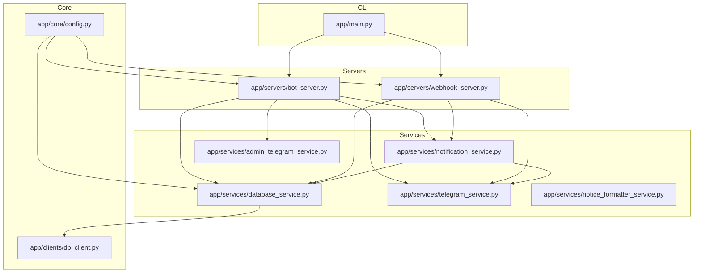
```mermaid
graph TB
subgraph "CLI"
MAIN["app/main.py"]
end
subgraph "Servers"
BOT["app/servers/bot_server.py"]
WEB["app/servers/webhook_server.py"]
end
subgraph "Services"
DB["app/services/database_service.py"]
NOTIF["app/services/notification_service.py"]
TG["app/services/telegram_service.py"]
ADMIN["app/services/admin_telegram_service.py"]
FORMATTER["app/services/notice_formatter_service.py"]
end
subgraph "Core"
CFG["app/core/config.py"]
DBC["app/clients/db_client.py"]
end
MAIN --> BOT
MAIN --> WEB
BOT --> DB
BOT --> NOTIF
BOT --> ADMIN
BOT --> TG
WEB --> DB
WEB --> NOTIF
WEB --> TG
NOTIF --> DB
NOTIF --> TG
DB --> DBC
CFG --> BOT
CFG --> WEB
CFG --> DB
```

## Core components
- BotServer: Implements long-polling Telegram bot with command handlers for user and admin commands.
- WebhookServer: FastAPI-based server exposing health, push subscription, notification, and stats endpoints.
- DatabaseService: Wraps MongoDB operations for notices, jobs, placement offers, users, and policies.
- TelegramService: Handles Telegram messaging, formatting, and broadcasting.
- NotificationService: Routes notifications to configured channels and manages unsent notices.
- AdminTelegramService: Provides admin-only commands with authentication via chat ID.
- Configuration and DB Client: Centralized settings and MongoDB connectivity.

## Architecture overview
The system supports two operational modes:
- Long-polling Telegram bot server (BotServer) with command handlers.
- Webhook/FastAPI server (WebhookServer) with REST endpoints for health, push subscriptions, notifications, and stats.

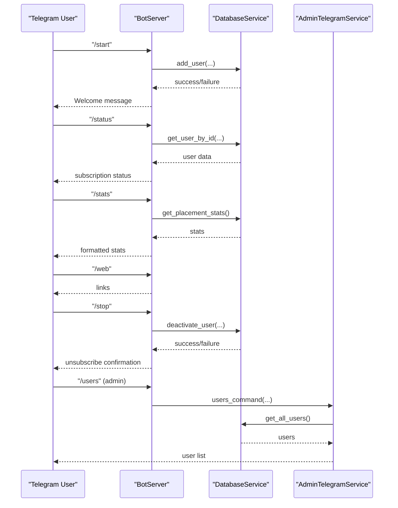
```mermaid
sequenceDiagram
participant User as "Telegram User"
participant Bot as "BotServer"
participant DB as "DatabaseService"
participant Admin as "AdminTelegramService"
User->>Bot : "/start"
Bot->>DB : add_user(...)
DB-->>Bot : success/failure
Bot-->>User : Welcome message
User->>Bot : "/status"
Bot->>DB : get_user_by_id(...)
DB-->>Bot : user data
Bot-->>User : subscription status
User->>Bot : "/stats"
Bot->>DB : get_placement_stats()
DB-->>Bot : stats
Bot-->>User : formatted stats
User->>Bot : "/web"
Bot-->>User : links
User->>Bot : "/stop"
Bot->>DB : deactivate_user(...)
DB-->>Bot : success/failure
Bot-->>User : unsubscribe confirmation
User->>Bot : "/users" (admin)
Bot->>Admin : users_command(...)
Admin->>DB : get_all_users()
DB-->>Admin : users
Admin-->>User : user list
```

## Detailed component analysis

### Telegram bot commands

#### /start
- Purpose: Register user for notifications.
- Request: /start
- Response: Welcome message with available commands and links.
- Database actions:
  - Insert or update user record in Users collection.
  - Set active subscription and timestamps.

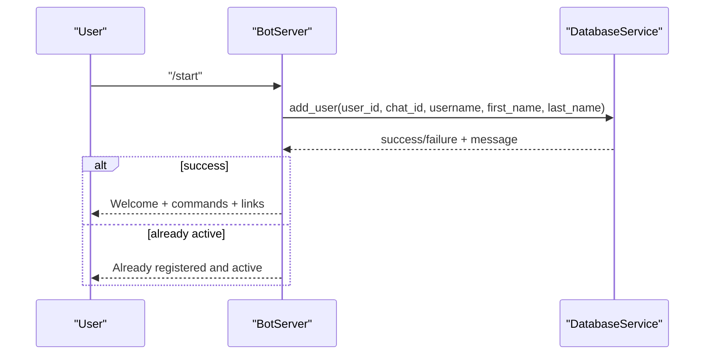
```mermaid
sequenceDiagram
participant User as "User"
participant Bot as "BotServer"
participant DB as "DatabaseService"
User->>Bot : "/start"
Bot->>DB : add_user(user_id, chat_id, username, first_name, last_name)
DB-->>Bot : success/failure + message
alt success
Bot-->>User : Welcome + commands + links
else already active
Bot-->>User : Already registered and active
end
```

#### /stop
- Purpose: Unsubscribe user from notifications.
- Request: /stop
- Response: Confirmation or inactive message.
- Database actions:
  - Deactivate user subscription.

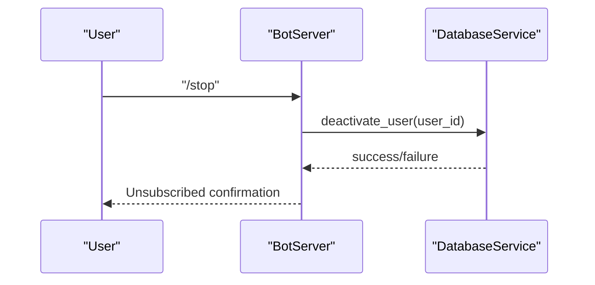
```mermaid
sequenceDiagram
participant User as "User"
participant Bot as "BotServer"
participant DB as "DatabaseService"
User->>Bot : "/stop"
Bot->>DB : deactivate_user(user_id)
DB-->>Bot : success/failure
Bot-->>User : Unsubscribed confirmation
```

#### /status
- Purpose: Check subscription status.
- Request: /status
- Response: Active/inactive status with registration date and user ID.
- Database actions:
  - Retrieve user by ID.

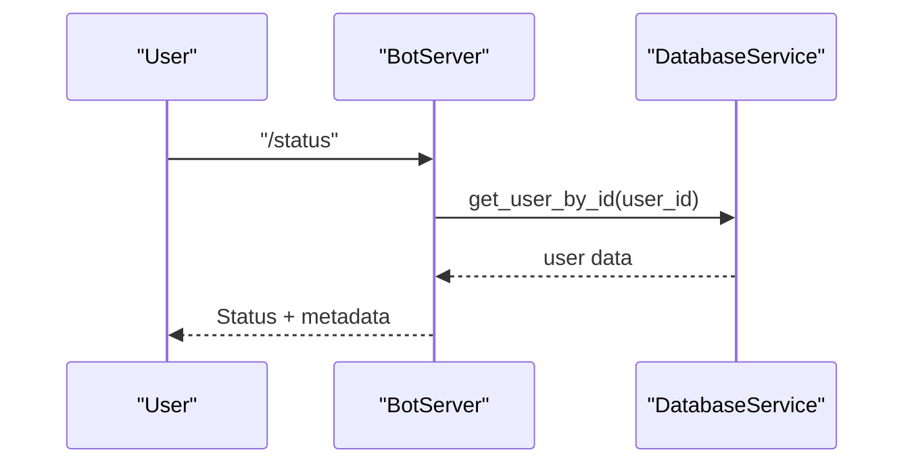
```mermaid
sequenceDiagram
participant User as "User"
participant Bot as "BotServer"
participant DB as "DatabaseService"
User->>Bot : "/status"
Bot->>DB : get_user_by_id(user_id)
DB-->>Bot : user data
Bot-->>User : Status + metadata
```

#### /stats
- Purpose: View placement statistics.
- Request: /stats
- Response: Formatted statistics including overall placement percentage, packages, and branch-wise stats.
- Database actions:
  - Compute and return placement statistics.

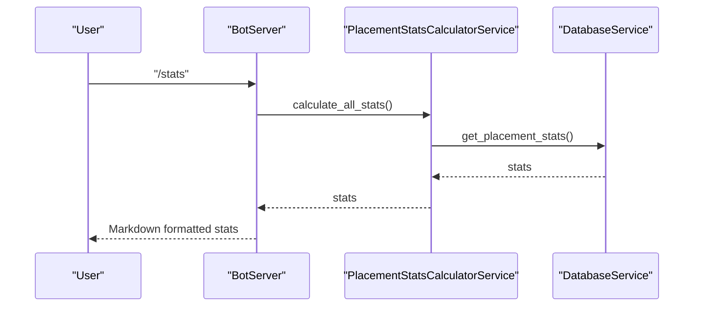
```mermaid
sequenceDiagram
participant User as "User"
participant Bot as "BotServer"
participant Stats as "PlacementStatsCalculatorService"
participant DB as "DatabaseService"
User->>Bot : "/stats"
Bot->>Stats : calculate_all_stats()
Stats->>DB : get_placement_stats()
DB-->>Stats : stats
Stats-->>Bot : stats
Bot-->>User : Markdown formatted stats
```

#### /web
- Purpose: Get useful links to JIIT tools.
- Request: /web
- Response: HTML-formatted links.

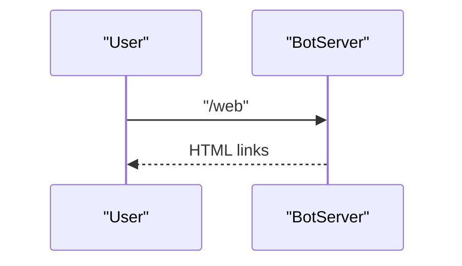
```mermaid
sequenceDiagram
participant User as "User"
participant Bot as "BotServer"
User->>Bot : "/web"
Bot-->>User : HTML links
```

### Admin commands

#### Authentication and permission checks
- Admin commands are restricted to a specific chat ID configured in settings.
- The AdminTelegramService validates the sender's chat ID against the configured admin chat ID.

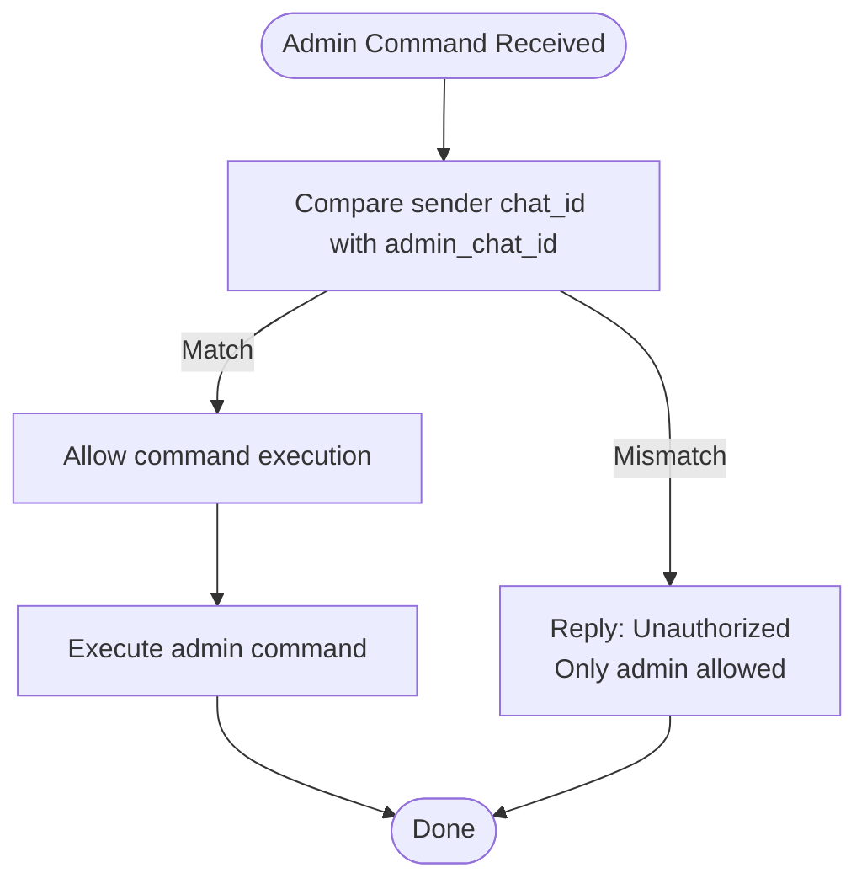
```mermaid
flowchart TD
Start([Admin Command Received]) --> CheckChat["Compare sender chat_id with admin_chat_id"]
CheckChat --> |Match| Allow["Allow command execution"]
CheckChat --> |Mismatch| Deny["Reply: Unauthorized<br/>Only admin allowed"]
Allow --> Execute["Execute admin command"]
Execute --> End([Done])
Deny --> End
```

#### /users
- Purpose: List all users and subscription stats.
- Request: /users
- Response: User list with status and counts.

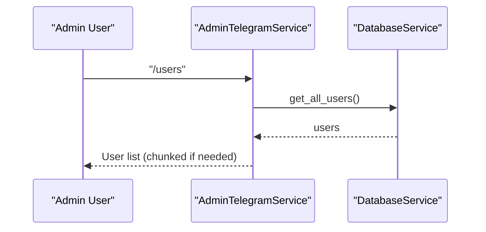
```mermaid
sequenceDiagram
participant User as "Admin User"
participant Admin as "AdminTelegramService"
participant DB as "DatabaseService"
User->>Admin : "/users"
Admin->>DB : get_all_users()
DB-->>Admin : users
Admin-->>User : User list (chunked if needed)
```

#### /boo <message>
- Purpose: Broadcast message to all active users or targeted user.
- Request: /boo broadcast <message> or /boo <chat_id> <message>
- Response: Broadcast result summary.

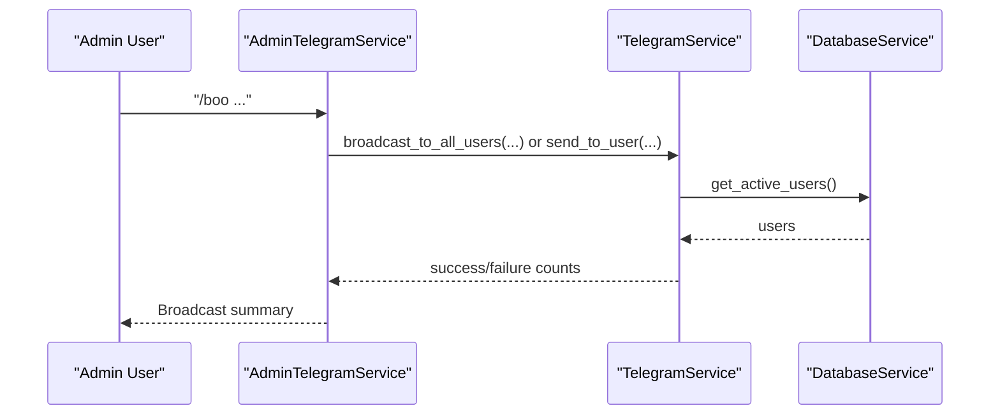
```mermaid
sequenceDiagram
participant Admin as "Admin User"
participant AdminSvc as "AdminTelegramService"
participant TG as "TelegramService"
participant DB as "DatabaseService"
Admin->>AdminSvc : "/boo ..."
AdminSvc->>TG : broadcast_to_all_users(...) or send_to_user(...)
TG->>DB : get_active_users()
DB-->>TG : users
TG-->>AdminSvc : success/failure counts
AdminSvc-->>Admin : Broadcast summary
```

#### /fu and /scrapyyy
- Purpose: Force immediate update from all sources and broadcast.
- Request: /fu or /scrapyyy
- Response: Progress and results summary.

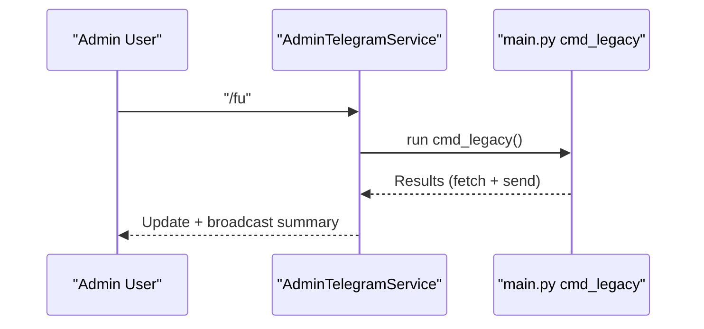
```mermaid
sequenceDiagram
participant Admin as "Admin User"
participant AdminSvc as "AdminTelegramService"
participant Main as "main.py cmd_legacy"
Admin->>AdminSvc : "/fu"
AdminSvc->>Main : run cmd_legacy()
Main-->>AdminSvc : Results (fetch + send)
AdminSvc-->>Admin : Update + broadcast summary
```

#### /logs [lines]
- Purpose: View recent log entries.
- Request: /logs [lines]
- Response: Log content (HTML escaped and truncated if needed).

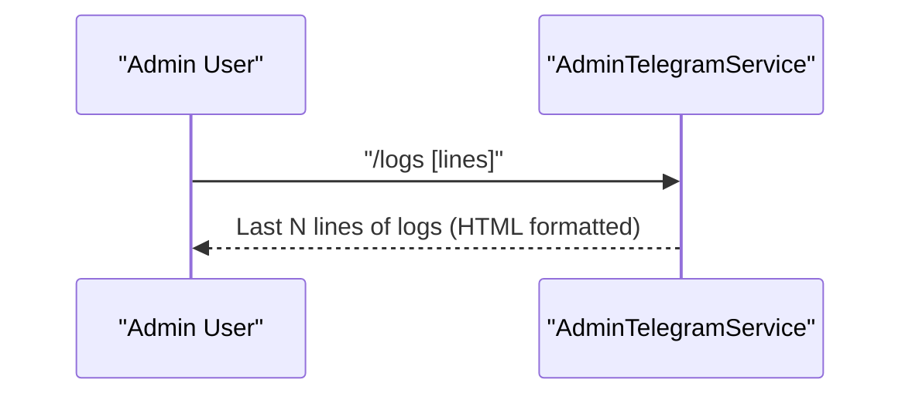
```mermaid
sequenceDiagram
participant Admin as "Admin User"
participant AdminSvc as "AdminTelegramService"
Admin->>AdminSvc : "/logs [lines]"
AdminSvc-->>Admin : Last N lines of logs (HTML formatted)
```

### Dual-Mode operation: long-polling and webhook
- Long-polling mode: BotServer initializes and runs an asynchronous polling loop.
- Webhook mode: WebhookServer exposes endpoints for health, push subscriptions, notifications, and stats.

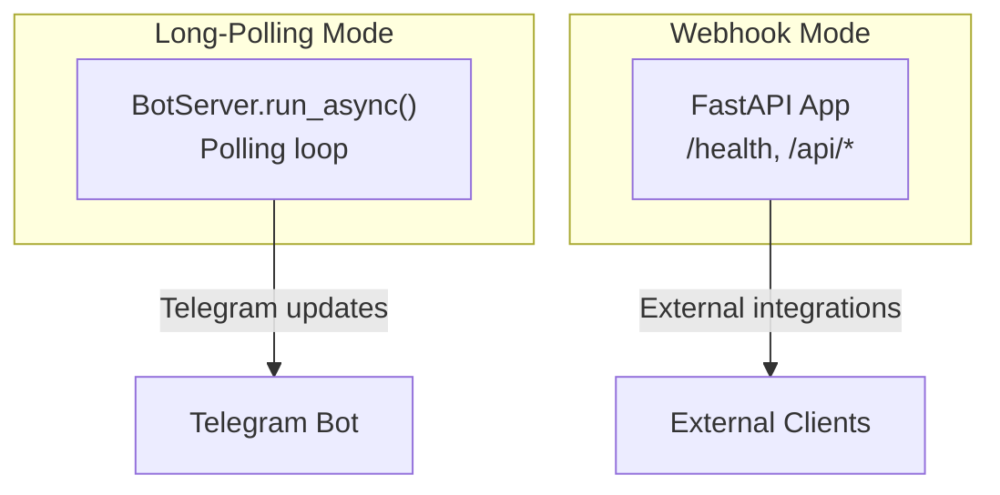
```mermaid
graph TB
subgraph "Long-Polling Mode"
BPOLL["BotServer.run_async()<br/>Polling loop"]
end
subgraph "Webhook Mode"
WAPI["FastAPI App<br/>/health, /api/*"]
end
BPOLL --> |"Telegram updates"| BOT["Telegram Bot"]
WAPI --> |"External integrations"| EXTERNAL["External Clients"]
```

### Command routing mechanism
- BotServer registers command handlers for user and admin commands.
- Admin commands are conditionally registered when AdminTelegramService is available.

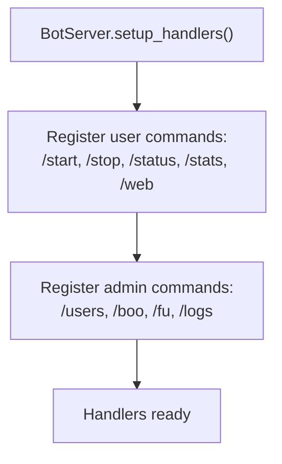
```mermaid
flowchart TD
Init["BotServer.setup_handlers()"] --> RegUser["Register user commands:<br/>/start, /stop, /status, /stats, /web"]
RegUser --> RegAdmin["Register admin commands:<br/>/users, /boo, /fu, /logs"]
RegAdmin --> Ready["Handlers ready"]
```

### User session management and subscription handling
- User registration and deactivation handled by DatabaseService.
- Active user retrieval for broadcasting.

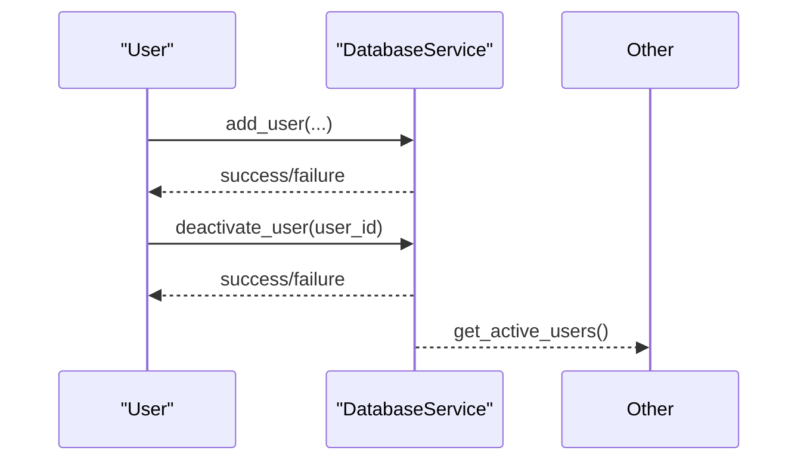
```mermaid
sequenceDiagram
participant User as "User"
participant DB as "DatabaseService"
User->>DB : add_user(...)
DB-->>User : success/failure
User->>DB : deactivate_user(user_id)
DB-->>User : success/failure
DB-->>Other : get_active_users()
```

### MongoDB integration
- DBClient establishes and manages MongoDB connections.
- DatabaseService encapsulates CRUD operations across collections: Notices, Jobs, PlacementOffers, Users, Policies, OfficialPlacementData.

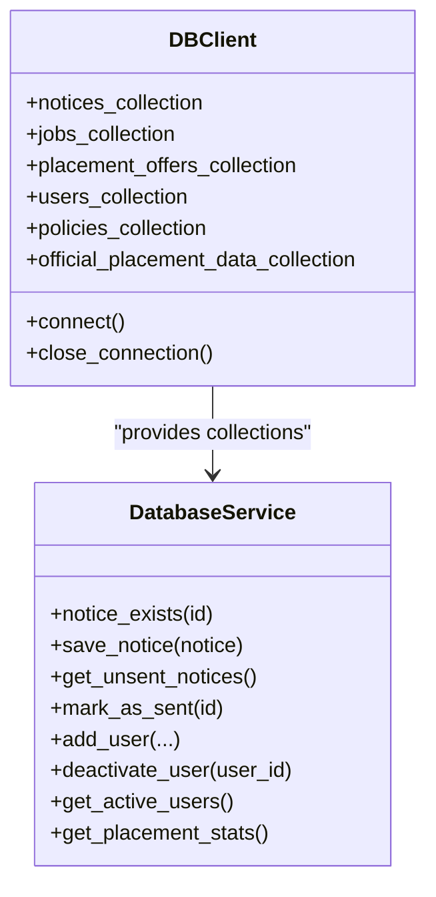
```mermaid
classDiagram
class DBClient {
+connect()
+close_connection()
+notices_collection
+jobs_collection
+placement_offers_collection
+users_collection
+policies_collection
+official_placement_data_collection
}
class DatabaseService {
+notice_exists(id)
+save_notice(notice)
+get_unsent_notices()
+mark_as_sent(id)
+add_user(...)
+deactivate_user(user_id)
+get_active_users()
+get_placement_stats()
}
DBClient --> DatabaseService : "provides collections"
```

### Message formatting system
- TelegramService converts Markdown to HTML/Telegram-compatible formats and handles long message splitting.
- NoticeFormatterService formats notices using LLM-based extraction and structured templates.

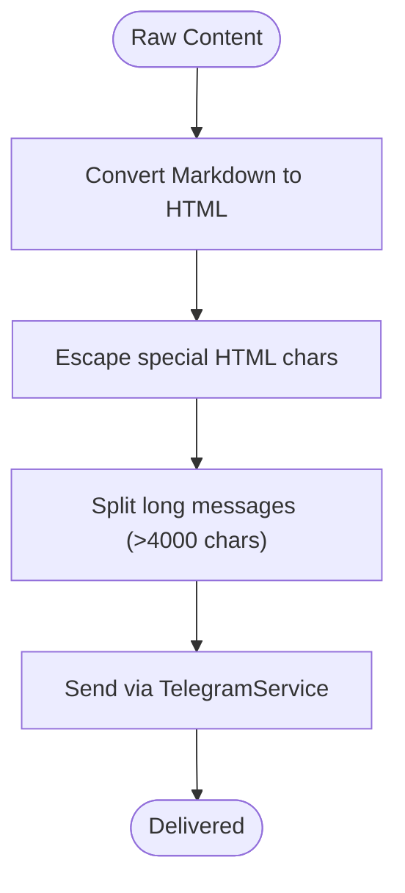
```mermaid
flowchart TD
Start([Raw Content]) --> FormatMD["Convert Markdown to HTML"]
FormatMD --> Escape["Escape special HTML chars"]
Escape --> Split["Split long messages (>4000 chars)"]
Split --> Send["Send via TelegramService"]
Send --> End([Delivered])
```

## Dependency analysis
The system exhibits strong dependency injection and separation of concerns:
- BotServer depends on DatabaseService, NotificationService, TelegramService, AdminTelegramService, and PlacementStatsCalculatorService.
- WebhookServer depends on DatabaseService, NotificationService, and TelegramService.
- DatabaseService depends on DBClient.
- Configuration is centralized via Settings with caching.

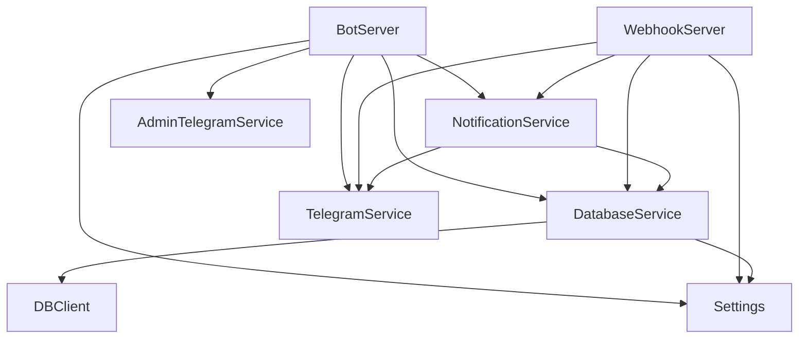
```mermaid
graph TB
Bot["BotServer"] --> DB["DatabaseService"]
Bot --> Notif["NotificationService"]
Bot --> TG["TelegramService"]
Bot --> Admin["AdminTelegramService"]
Web["WebhookServer"] --> DB
Web --> Notif
Web --> TG
Notif --> DB
Notif --> TG
DB --> DBC["DBClient"]
Bot --> Cfg["Settings"]
Web --> Cfg
DB --> Cfg
```

## Performance considerations
- Message chunking: TelegramService splits long messages (>4000 chars) and retries without formatting if needed.
- Rate limiting: Broadcast loops include small delays to avoid rate limits.
- Asynchronous polling: BotServer uses asyncio for non-blocking operations.
- Database indexing: Recommended indexes on frequently queried fields (e.g., notices.id, users.user_id, placement_offers.company).

## Troubleshooting guide
Common issues and resolutions:
- Telegram bot token missing or invalid: Ensure TELEGRAM_BOT_TOKEN is set and valid.
- Admin command unauthorized: Verify TELEGRAM_CHAT_ID matches the admin chat ID.
- MongoDB connection failures: Check MONGO_CONNECTION_STR and network/firewall settings.
- Long message delivery failures: Messages are split automatically; if formatting fails, fallback to plain text.
- Webhook endpoint not reachable: Confirm server is running and port is open.

## Conclusion
The Telegram Bot API provides reliable user and admin command handling with dual-mode operation, detailed MongoDB integration, and a flexible notification routing system. The documented endpoints, commands, and workflows enable reliable deployment and maintenance of placement notifications across Telegram and web push channels.

## Appendices

### API endpoints summary
- GET /health: Health check
- POST /api/push/subscribe: Subscribe to web push
- POST /api/push/unsubscribe: Unsubscribe from web push
- GET /api/push/vapid-key: Get VAPID public key
- POST /api/notify: Send notification to specified channels
- POST /api/notify/telegram: Send Telegram-only notification
- POST /api/notify/web-push: Send Web Push-only notification
- GET /api/stats: Get all statistics
- GET /api/stats/placements: Get placement statistics
- GET /api/stats/notices: Get notice statistics
- GET /api/stats/users: Get user statistics
- POST /webhook/update: Trigger update job via webhook

### Configuration reference
Key environment variables:
- MONGO_CONNECTION_STR: MongoDB connection URI
- TELEGRAM_BOT_TOKEN: Telegram bot token
- TELEGRAM_CHAT_ID: Default chat/channel ID
- SUPERSET_CREDENTIALS: JSON array of SuperSet credentials
- GOOGLE_API_KEY: Gemini LLM API key
- VAPID_PRIVATE_KEY, VAPID_PUBLIC_KEY, VAPID_EMAIL: Web push VAPID keys
- WEBHOOK_PORT, WEBHOOK_HOST: Webhook server configuration
- LOG_LEVEL, LOG_FILE: Logging configuration
