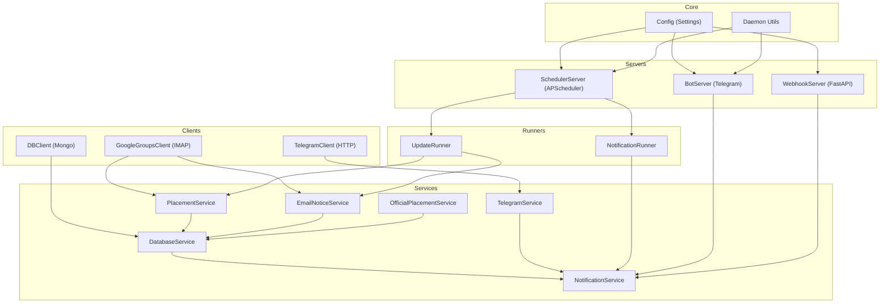
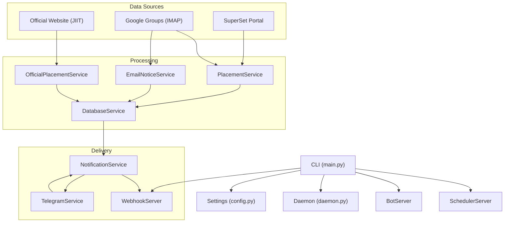
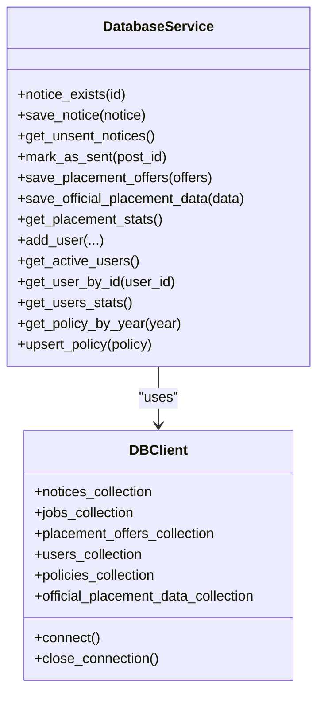
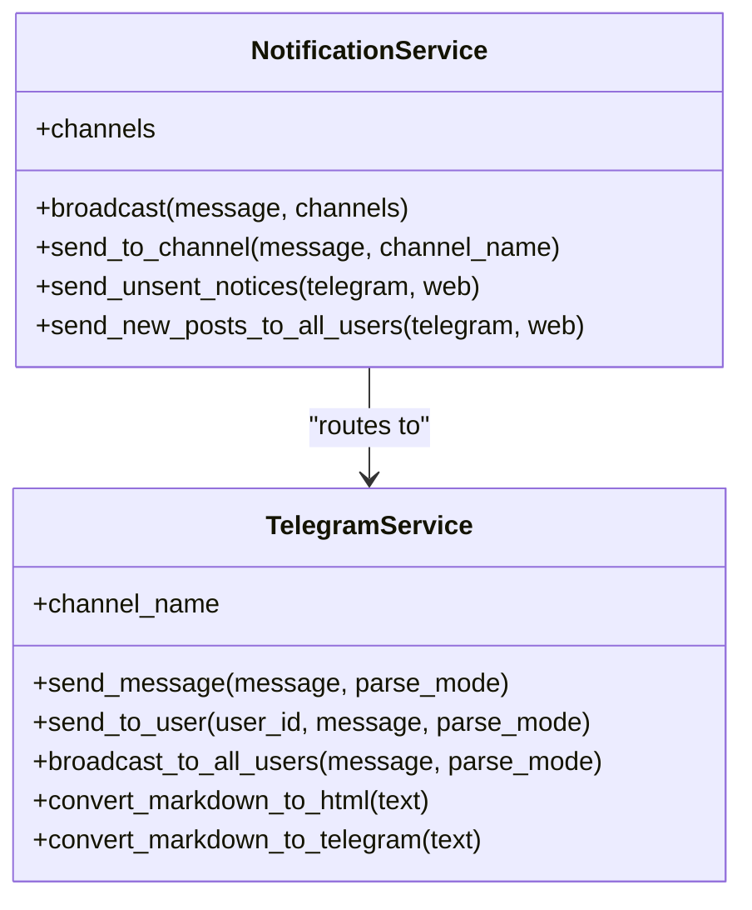
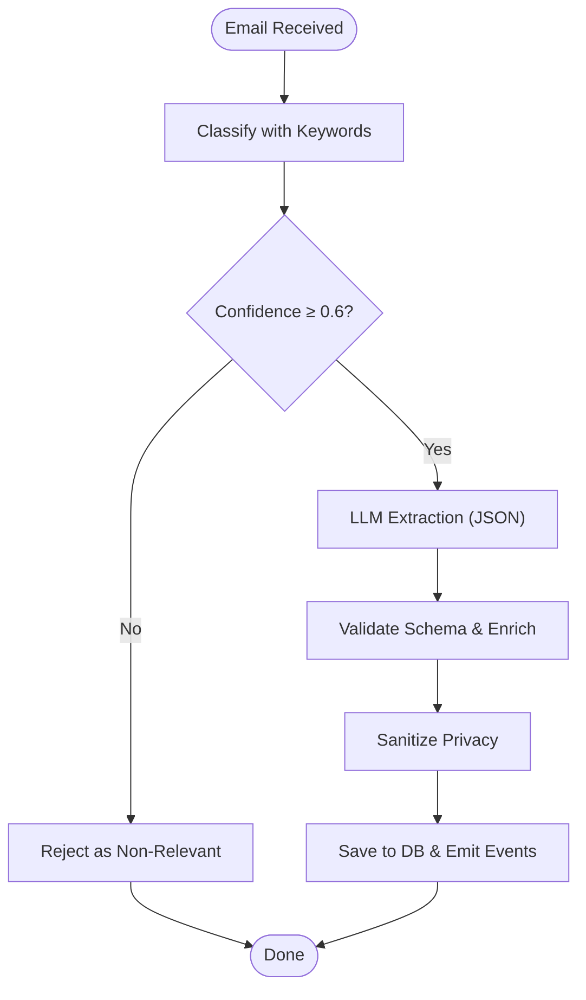
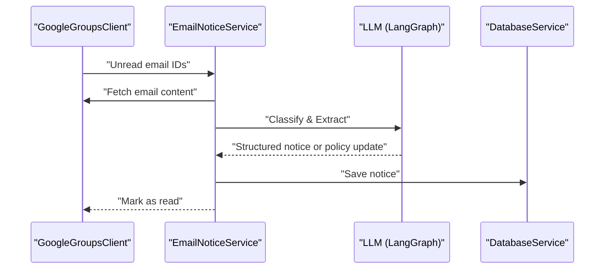
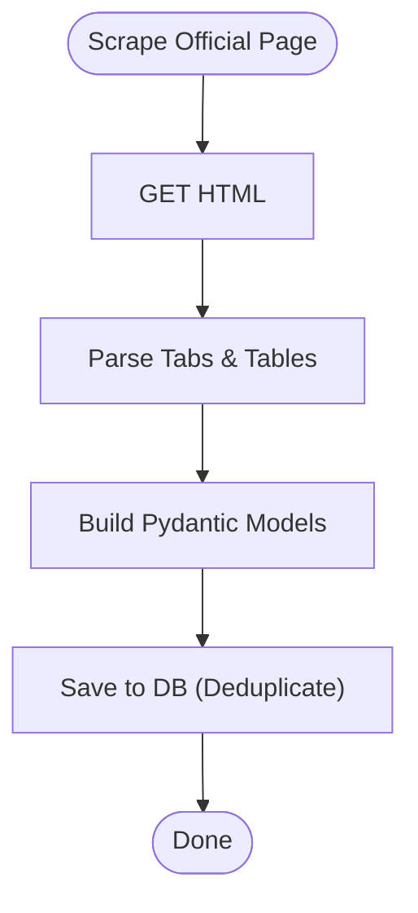
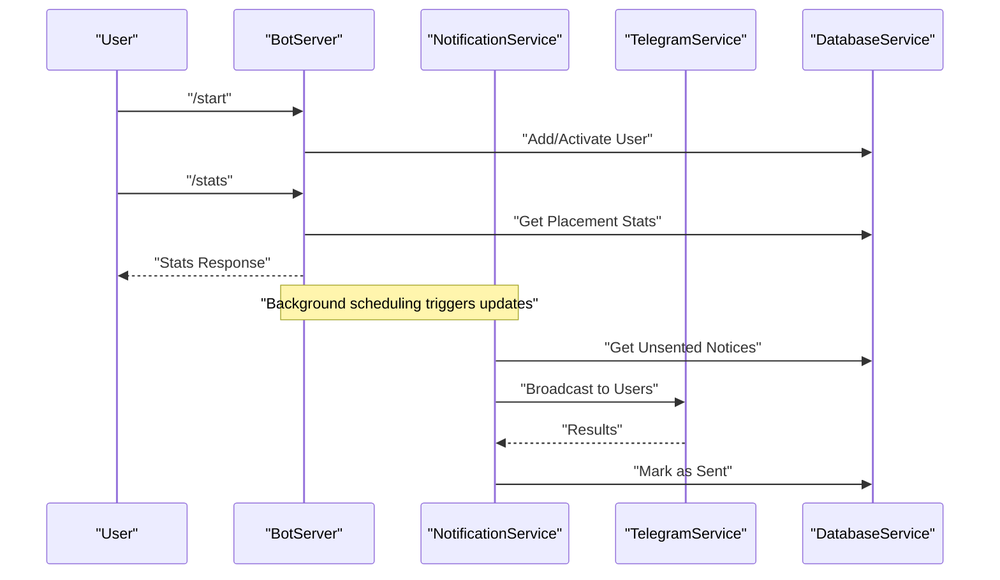
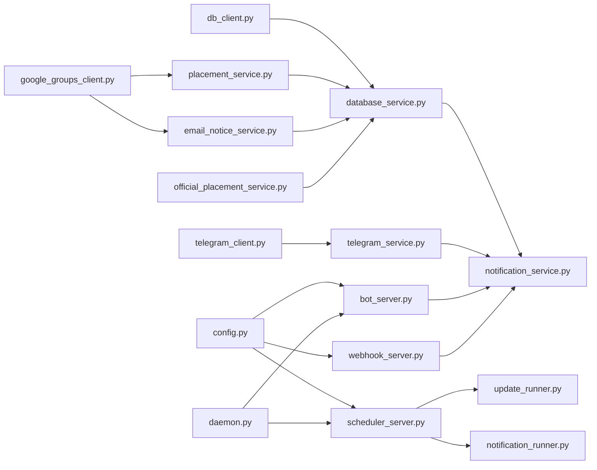

# Architecture & Design

<cite>
**Referenced Files in This Document**
- [app/main.py](file://app/main.py)
- [app/core/config.py](file://app/core/config.py)
- [app/core/daemon.py](file://app/core/daemon.py)
- [app/services/__init__.py](file://app/services/__init__.py)
- [app/servers/__init__.py](file://app/servers/__init__.py)
- [app/runners/__init__.py](file://app/runners/__init__.py)
- [app/services/database_service.py](file://app/services/database_service.py)
- [app/services/notification_service.py](file://app/services/notification_service.py)
- [app/services/telegram_service.py](file://app/services/telegram_service.py)
- [app/services/placement_service.py](file://app/services/placement_service.py)
- [app/services/email_notice_service.py](file://app/services/email_notice_service.py)
- [app/services/official_placement_service.py](file://app/services/official_placement_service.py)
- [app/servers/bot_server.py](file://app/servers/bot_server.py)
- [app/servers/webhook_server.py](file://app/servers/webhook_server.py)
- [app/servers/scheduler_server.py](file://app/servers/scheduler_server.py)
- [app/clients/db_client.py](file://app/clients/db_client.py)
- [app/clients/telegram_client.py](file://app/clients/telegram_client.py)
- [app/clients/google_groups_client.py](file://app/clients/google_groups_client.py)
</cite>

## Table of Contents
1. [Introduction](#introduction)
2. [Project Structure](#project-structure)
3. [Core Components](#core-components)
4. [Architecture Overview](#architecture-overview)
5. [Detailed Component Analysis](#detailed-component-analysis)
6. [Dependency Analysis](#dependency-analysis)
7. [Performance Considerations](#performance-considerations)
8. [Troubleshooting Guide](#troubleshooting-guide)
9. [Conclusion](#conclusion)

## Introduction
This document describes the SuperSet Telegram Notification Bot system’s architecture and design. The system is built as a service-oriented application with strong separation of concerns, dependency injection, and modular components. It integrates with external data sources (SuperSet portal, email groups, and official websites) and delivers notifications via Telegram and Web Push channels. The system supports daemon mode for production deployments and provides a FastAPI webhook server for API-driven integrations.

## Project Structure
The repository follows a layered, feature-based organization:
- Core: configuration and daemon utilities
- Clients: low-level integrations (MongoDB, Telegram API, Google Groups IMAP)
- Services: domain services implementing business logic (notifications, placement processing, official data scraping)
- Servers: HTTP servers (Telegram bot, webhook, scheduler)
- Runners: orchestration modules for update and notification dispatch
- Data: local JSON datasets and MongoDB storage artifacts

**Diagram sources**
- [app/core/config.py](file://app/core/config.py#L18-L128)
- [app/core/daemon.py](file://app/core/daemon.py#L20-L251)
- [app/clients/db_client.py](file://app/clients/db_client.py#L16-L104)
- [app/clients/telegram_client.py](file://app/clients/telegram_client.py#L19-L126)
- [app/clients/google_groups_client.py](file://app/clients/google_groups_client.py#L19-L465)
- [app/services/database_service.py](file://app/services/database_service.py#L16-L795)
- [app/services/notification_service.py](file://app/services/notification_service.py#L13-L237)
- [app/services/telegram_service.py](file://app/services/telegram_service.py#L20-L351)
- [app/services/placement_service.py](file://app/services/placement_service.py#L419-L800)
- [app/services/email_notice_service.py](file://app/services/email_notice_service.py#L335-L800)
- [app/services/official_placement_service.py](file://app/services/official_placement_service.py#L81-L459)
- [app/servers/bot_server.py](file://app/servers/bot_server.py#L29-L519)
- [app/servers/webhook_server.py](file://app/servers/webhook_server.py#L69-L387)
- [app/servers/scheduler_server.py](file://app/servers/scheduler_server.py#L33-L388)
- [app/runners/__init__.py](file://app/runners/__init__.py#L1-L10)

**Section sources**
- [app/core/config.py](file://app/core/config.py#L18-L128)
- [app/core/daemon.py](file://app/core/daemon.py#L20-L251)
- [app/clients/db_client.py](file://app/clients/db_client.py#L16-L104)
- [app/clients/telegram_client.py](file://app/clients/telegram_client.py#L19-L126)
- [app/clients/google_groups_client.py](file://app/clients/google_groups_client.py#L19-L465)
- [app/services/database_service.py](file://app/services/database_service.py#L16-L795)
- [app/services/notification_service.py](file://app/services/notification_service.py#L13-L237)
- [app/services/telegram_service.py](file://app/services/telegram_service.py#L20-L351)
- [app/services/placement_service.py](file://app/services/placement_service.py#L419-L800)
- [app/services/email_notice_service.py](file://app/services/email_notice_service.py#L335-L800)
- [app/services/official_placement_service.py](file://app/services/official_placement_service.py#L81-L459)
- [app/servers/bot_server.py](file://app/servers/bot_server.py#L29-L519)
- [app/servers/webhook_server.py](file://app/servers/webhook_server.py#L69-L387)
- [app/servers/scheduler_server.py](file://app/servers/scheduler_server.py#L33-L388)
- [app/runners/__init__.py](file://app/runners/__init__.py#L1-L10)

## Core Components
- Configuration and Environment: centralized settings with typed validation and logging initialization
- Daemon Utilities: process forking, PID management, and graceful shutdown
- Clients:
  - DBClient: MongoDB connection and collection access
  - TelegramClient: Telegram Bot API wrapper with retries and rate-limit handling
  - GoogleGroupsClient: IMAP-based email fetching with forwarded metadata extraction
- Services:
  - DatabaseService: MongoDB operations for notices, jobs, placement offers, users, policies, and official data
  - NotificationService: channel-agnostic orchestrator for broadcasting to Telegram and Web Push
  - TelegramService: Telegram channel implementation with formatting and broadcasting
  - PlacementService: LLM-powered placement offer extraction pipeline with privacy sanitization
  - EmailNoticeService: LLM-powered notice classification and extraction with policy detection
  - OfficialPlacementService: web scraping of official placement data with deduplication
- Servers:
  - BotServer: Telegram bot with commands and user management
  - WebhookServer: FastAPI endpoints for push subscriptions, notifications, and stats
  - SchedulerServer: APScheduler-based automation for periodic updates and official data scraping
- Runners:
  - UpdateRunner: orchestrates fetching and processing from SuperSet and email sources
  - NotificationRunner: dispatches unsent notices to channels

**Section sources**
- [app/core/config.py](file://app/core/config.py#L18-L128)
- [app/core/daemon.py](file://app/core/daemon.py#L20-L251)
- [app/clients/db_client.py](file://app/clients/db_client.py#L16-L104)
- [app/clients/telegram_client.py](file://app/clients/telegram_client.py#L19-L126)
- [app/clients/google_groups_client.py](file://app/clients/google_groups_client.py#L19-L465)
- [app/services/database_service.py](file://app/services/database_service.py#L16-L795)
- [app/services/notification_service.py](file://app/services/notification_service.py#L13-L237)
- [app/services/telegram_service.py](file://app/services/telegram_service.py#L20-L351)
- [app/services/placement_service.py](file://app/services/placement_service.py#L419-L800)
- [app/services/email_notice_service.py](file://app/services/email_notice_service.py#L335-L800)
- [app/services/official_placement_service.py](file://app/services/official_placement_service.py#L81-L459)
- [app/servers/bot_server.py](file://app/servers/bot_server.py#L29-L519)
- [app/servers/webhook_server.py](file://app/servers/webhook_server.py#L69-L387)
- [app/servers/scheduler_server.py](file://app/servers/scheduler_server.py#L33-L388)
- [app/runners/__init__.py](file://app/runners/__init__.py#L1-L10)

## Architecture Overview
The system employs a service-oriented architecture with dependency injection and clear boundaries between data sources, processing services, and delivery channels. The CLI entry point coordinates servers and scripts, while the daemon utilities enable production-grade background processes. External integrations are encapsulated in dedicated clients, and services coordinate business logic with minimal coupling.

**Diagram sources**
- [app/main.py](file://app/main.py#L370-L632)
- [app/core/config.py](file://app/core/config.py#L18-L128)
- [app/core/daemon.py](file://app/core/daemon.py#L114-L232)
- [app/services/placement_service.py](file://app/services/placement_service.py#L419-L800)
- [app/services/email_notice_service.py](file://app/services/email_notice_service.py#L335-L800)
- [app/services/official_placement_service.py](file://app/services/official_placement_service.py#L81-L459)
- [app/services/database_service.py](file://app/services/database_service.py#L16-L795)
- [app/services/notification_service.py](file://app/services/notification_service.py#L13-L237)
- [app/services/telegram_service.py](file://app/services/telegram_service.py#L20-L351)
- [app/servers/bot_server.py](file://app/servers/bot_server.py#L29-L519)
- [app/servers/webhook_server.py](file://app/servers/webhook_server.py#L69-L387)
- [app/servers/scheduler_server.py](file://app/servers/scheduler_server.py#L33-L388)

## Detailed Component Analysis

### DatabaseService
- Responsibilities: CRUD operations for notices, jobs, placement offers, users, policies, and official placement data; statistical queries; MongoDB connection lifecycle
- Patterns: dependency injection via DBClient; collection delegation; transaction-like operations with error handling and logging
- Persistence: MongoDB collections for each domain entity; deduplication and indexing considerations for notices and placement offers

**Diagram sources**
- [app/clients/db_client.py](file://app/clients/db_client.py#L16-L104)
- [app/services/database_service.py](file://app/services/database_service.py#L16-L795)

**Section sources**
- [app/clients/db_client.py](file://app/clients/db_client.py#L16-L104)
- [app/services/database_service.py](file://app/services/database_service.py#L16-L795)

### NotificationService and TelegramService
- NotificationService: channel-agnostic orchestrator; broadcasts to enabled channels; tracks unsent notices and marks them after successful delivery
- TelegramService: channel implementation with message formatting (HTML/Markdown), long message splitting, rate limiting, and user broadcasting

**Diagram sources**
- [app/services/notification_service.py](file://app/services/notification_service.py#L13-L237)
- [app/services/telegram_service.py](file://app/services/telegram_service.py#L20-L351)

**Section sources**
- [app/services/notification_service.py](file://app/services/notification_service.py#L13-L237)
- [app/services/telegram_service.py](file://app/services/telegram_service.py#L20-L351)

### PlacementService (LLM-powered)
- Implements a LangGraph pipeline for placement offer extraction:
  - Classification: keyword-based confidence scoring
  - Extraction: LLM-based JSON schema extraction with retry
  - Validation: schema validation and enrichment
  - Privacy: sanitization of headers and forwarded metadata
- Integrates with GoogleGroupsClient for email ingestion and DatabaseService for persistence

**Diagram sources**
- [app/services/placement_service.py](file://app/services/placement_service.py#L419-L800)
- [app/clients/google_groups_client.py](file://app/clients/google_groups_client.py#L19-L465)
- [app/services/database_service.py](file://app/services/database_service.py#L274-L442)

**Section sources**
- [app/services/placement_service.py](file://app/services/placement_service.py#L419-L800)
- [app/clients/google_groups_client.py](file://app/clients/google_groups_client.py#L19-L465)
- [app/services/database_service.py](file://app/services/database_service.py#L274-L442)

### EmailNoticeService (LLM-powered)
- Classifies and extracts structured notices from Google Groups emails
- Detects placement policy updates and delegates to PlacementPolicyService
- Formats notices for consistent delivery and persists to database

**Diagram sources**
- [app/services/email_notice_service.py](file://app/services/email_notice_service.py#L335-L800)
- [app/clients/google_groups_client.py](file://app/clients/google_groups_client.py#L88-L168)
- [app/services/database_service.py](file://app/services/database_service.py#L80-L160)

**Section sources**
- [app/services/email_notice_service.py](file://app/services/email_notice_service.py#L335-L800)
- [app/clients/google_groups_client.py](file://app/clients/google_groups_client.py#L88-L168)
- [app/services/database_service.py](file://app/services/database_service.py#L80-L160)

### OfficialPlacementService
- Scrapes official JIIT placement page, parses tabs and tables, and stores deduplicated results
- Uses DatabaseService for persistence and timestamp updates

**Diagram sources**
- [app/services/official_placement_service.py](file://app/services/official_placement_service.py#L81-L459)
- [app/services/database_service.py](file://app/services/database_service.py#L443-L484)

**Section sources**
- [app/services/official_placement_service.py](file://app/services/official_placement_service.py#L81-L459)
- [app/services/database_service.py](file://app/services/database_service.py#L443-L484)

### Servers and Orchestration
- BotServer: Telegram bot with commands and user management; DI for services
- WebhookServer: FastAPI app exposing health, push subscription, notification, and stats endpoints; DI for services
- SchedulerServer: APScheduler-based automation for periodic updates and official data scraping

**Diagram sources**
- [app/servers/bot_server.py](file://app/servers/bot_server.py#L29-L519)
- [app/servers/webhook_server.py](file://app/servers/webhook_server.py#L69-L387)
- [app/servers/scheduler_server.py](file://app/servers/scheduler_server.py#L33-L388)
- [app/services/notification_service.py](file://app/services/notification_service.py#L93-L237)
- [app/services/telegram_service.py](file://app/services/telegram_service.py#L140-L173)
- [app/services/database_service.py](file://app/services/database_service.py#L116-L148)

**Section sources**
- [app/servers/bot_server.py](file://app/servers/bot_server.py#L29-L519)
- [app/servers/webhook_server.py](file://app/servers/webhook_server.py#L69-L387)
- [app/servers/scheduler_server.py](file://app/servers/scheduler_server.py#L33-L388)
- [app/services/notification_service.py](file://app/services/notification_service.py#L93-L237)
- [app/services/telegram_service.py](file://app/services/telegram_service.py#L140-L173)
- [app/services/database_service.py](file://app/services/database_service.py#L116-L148)

## Dependency Analysis
- Configuration and daemon utilities are foundational and consumed by all servers and CLI commands
- Clients encapsulate external integrations and are injected into services
- Services depend on clients and each other minimally, enabling testability and modularity
- Servers orchestrate services and expose APIs; they rely on DI factories to wire dependencies
- Runners coordinate update and notification dispatch, mirroring CLI commands

**Diagram sources**
- [app/core/config.py](file://app/core/config.py#L18-L128)
- [app/core/daemon.py](file://app/core/daemon.py#L20-L251)
- [app/clients/db_client.py](file://app/clients/db_client.py#L16-L104)
- [app/clients/telegram_client.py](file://app/clients/telegram_client.py#L19-L126)
- [app/clients/google_groups_client.py](file://app/clients/google_groups_client.py#L19-L465)
- [app/services/database_service.py](file://app/services/database_service.py#L16-L795)
- [app/services/notification_service.py](file://app/services/notification_service.py#L13-L237)
- [app/services/telegram_service.py](file://app/services/telegram_service.py#L20-L351)
- [app/services/placement_service.py](file://app/services/placement_service.py#L419-L800)
- [app/services/email_notice_service.py](file://app/services/email_notice_service.py#L335-L800)
- [app/services/official_placement_service.py](file://app/services/official_placement_service.py#L81-L459)
- [app/servers/bot_server.py](file://app/servers/bot_server.py#L29-L519)
- [app/servers/webhook_server.py](file://app/servers/webhook_server.py#L69-L387)
- [app/servers/scheduler_server.py](file://app/servers/scheduler_server.py#L33-L388)

**Section sources**
- [app/core/config.py](file://app/core/config.py#L18-L128)
- [app/core/daemon.py](file://app/core/daemon.py#L20-L251)
- [app/clients/db_client.py](file://app/clients/db_client.py#L16-L104)
- [app/clients/telegram_client.py](file://app/clients/telegram_client.py#L19-L126)
- [app/clients/google_groups_client.py](file://app/clients/google_groups_client.py#L19-L465)
- [app/services/database_service.py](file://app/services/database_service.py#L16-L795)
- [app/services/notification_service.py](file://app/services/notification_service.py#L13-L237)
- [app/services/telegram_service.py](file://app/services/telegram_service.py#L20-L351)
- [app/services/placement_service.py](file://app/services/placement_service.py#L419-L800)
- [app/services/email_notice_service.py](file://app/services/email_notice_service.py#L335-L800)
- [app/services/official_placement_service.py](file://app/services/official_placement_service.py#L81-L459)
- [app/servers/bot_server.py](file://app/servers/bot_server.py#L29-L519)
- [app/servers/webhook_server.py](file://app/servers/webhook_server.py#L69-L387)
- [app/servers/scheduler_server.py](file://app/servers/scheduler_server.py#L33-L388)

## Performance Considerations
- Asynchronous processing: Telegram bot and webhook server use async frameworks; scheduler leverages APScheduler for non-blocking jobs
- Retry and backoff: TelegramClient implements exponential backoff for rate-limited responses; PlacementService and EmailNoticeService include retry logic for LLM extraction
- Connection pooling and lifecycle: DBClient manages MongoDB connections; services close connections after operations to prevent leaks
- Rate limiting: TelegramService applies small delays between broadcasts to avoid throttling
- Scheduling cadence: SchedulerServer runs frequent intervals (hourly) to balance freshness and load
- Scalability: Modular design allows horizontal scaling of servers and runners; database sharding and indexing can be introduced at the MongoDB layer

[No sources needed since this section provides general guidance]

## Troubleshooting Guide
- Configuration issues: verify environment variables for MongoDB, Telegram, Google API, and VAPID keys; Settings validates and loads from .env
- Daemon mode: PID files and logging are managed by daemon utilities; use status/stop commands to inspect and terminate processes
- Email fetching: GoogleGroupsClient requires proper credentials and app password; IMAP connectivity and folder selection are handled internally
- Telegram delivery: TelegramClient logs failures and retries; check rate limits and parse modes; fallback to plain text if formatted messages fail
- Database connectivity: DBClient tests connection with ping; ensure connection string and network access to MongoDB
- Scheduler jobs: SchedulerServer logs errors and continues; review logs for specific job failures and adjust schedules as needed

**Section sources**
- [app/core/config.py](file://app/core/config.py#L156-L254)
- [app/core/daemon.py](file://app/core/daemon.py#L235-L251)
- [app/clients/google_groups_client.py](file://app/clients/google_groups_client.py#L52-L87)
- [app/clients/telegram_client.py](file://app/clients/telegram_client.py#L113-L126)
- [app/clients/db_client.py](file://app/clients/db_client.py#L42-L80)
- [app/servers/scheduler_server.py](file://app/servers/scheduler_server.py#L114-L117)

## Conclusion
The SuperSet Telegram Notification Bot is a modular, service-oriented system designed for reliability and maintainability. It integrates external data sources through decoupled clients, processes content with LLM-powered pipelines, and delivers notifications across multiple channels. The architecture supports production-grade deployment via daemon mode, FastAPI webhooks, and APScheduler-based automation, with clear separation of concerns and dependency injection enabling testability and extensibility.