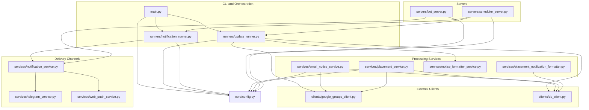
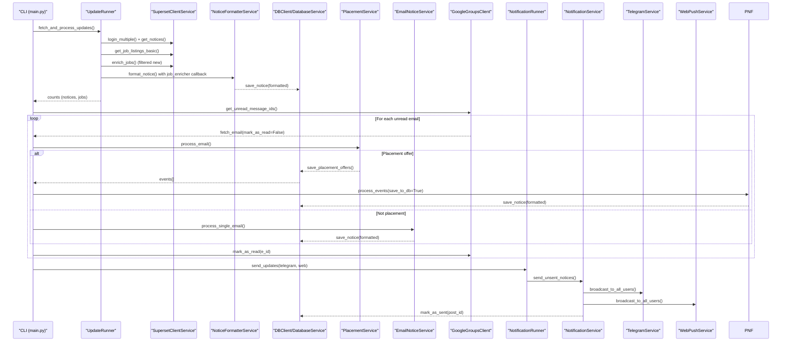
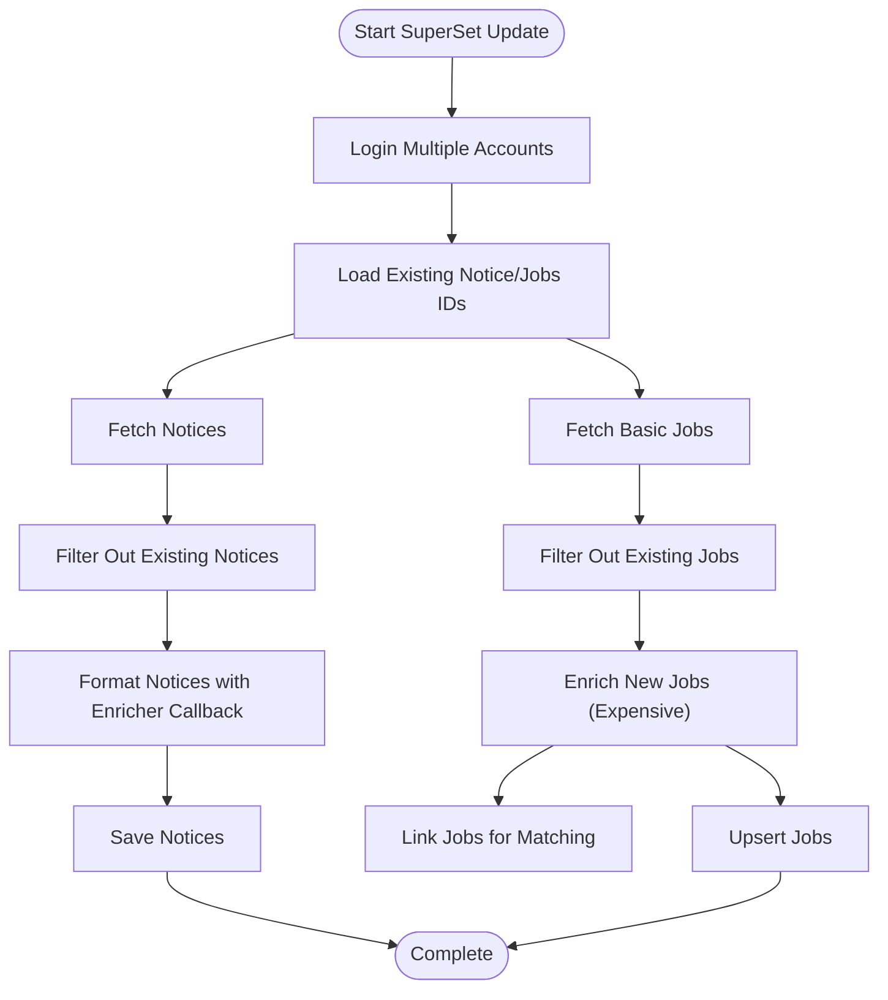
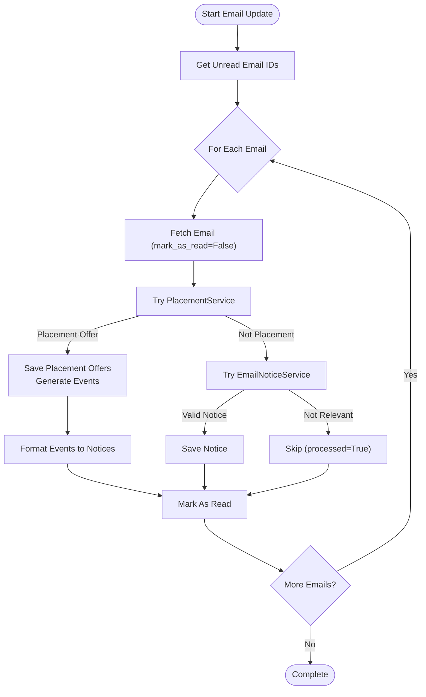
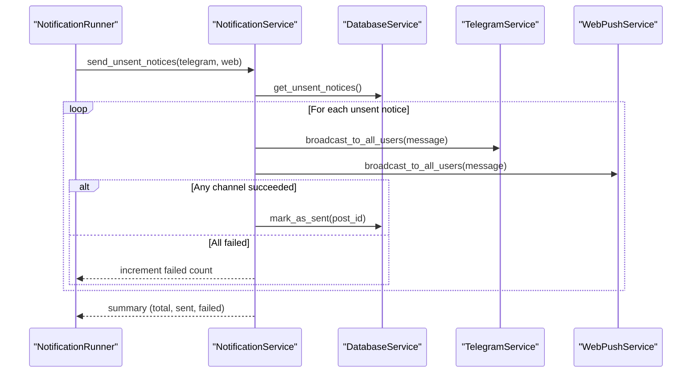
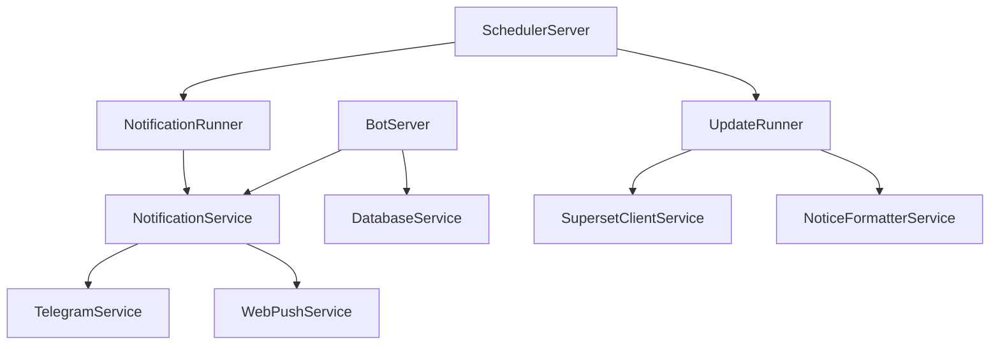
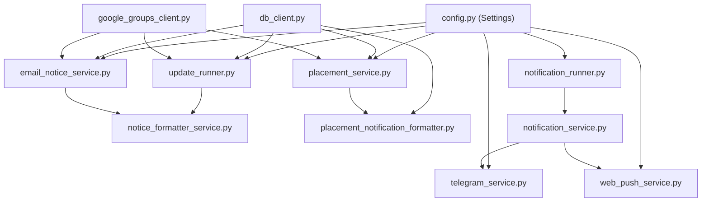

# Data Flow & Processing Pipeline

<cite>
**Referenced Files in This Document**
- [main.py](file://app/main.py)
- [update_runner.py](file://app/runners/update_runner.py)
- [notification_runner.py](file://app/runners/notification_runner.py)
- [email_notice_service.py](file://app/services/email_notice_service.py)
- [placement_service.py](file://app/services/placement_service.py)
- [telegram_service.py](file://app/services/telegram_service.py)
- [web_push_service.py](file://app/services/web_push_service.py)
- [notification_service.py](file://app/services/notification_service.py)
- [google_groups_client.py](file://app/clients/google_groups_client.py)
- [db_client.py](file://app/clients/db_client.py)
- [notice_formatter_service.py](file://app/services/notice_formatter_service.py)
- [placement_notification_formatter.py](file://app/services/placement_notification_formatter.py)
- [bot_server.py](file://app/servers/bot_server.py)
- [scheduler_server.py](file://app/servers/scheduler_server.py)
- [config.py](file://app/core/config.py)
</cite>

## Table of Contents
1. [Introduction](#introduction)
2. [Project Structure](#project-structure)
3. [Core Components](#core-components)
4. [Architecture Overview](#architecture-overview)
5. [Detailed Component Analysis](#detailed-component-analysis)
6. [Dependency Analysis](#dependency-analysis)
7. [Performance Considerations](#performance-considerations)
8. [Troubleshooting Guide](#troubleshooting-guide)
9. [Conclusion](#conclusion)

## Introduction
This document explains the complete data flow and processing pipeline for the SuperSet Telegram Notification Bot. It covers how data enters the system from external sources (SuperSet portal and Gmail/emails), how it is processed and transformed, and how notifications are delivered across Telegram and Web Push channels. It also details the sequential orchestration pattern that prevents data loss by marking emails as read only after successful processing, and the prioritization of placement offers over general notices. Error handling, retry mechanisms, and data consistency strategies are addressed throughout.

## Project Structure
The system is organized into modular components:
- CLI entry point and orchestration commands
- Runners for update and notification tasks
- Services for processing notices, placement offers, and formatting
- Clients for external systems (Google Groups, Telegram, MongoDB)
- Servers for bot and scheduler operations
- Configuration and logging utilities

**Diagram sources**
- [main.py](file://app/main.py#L1-L632)
- [update_runner.py](file://app/runners/update_runner.py#L1-L278)
- [notification_runner.py](file://app/runners/notification_runner.py#L1-L160)
- [email_notice_service.py](file://app/services/email_notice_service.py#L1-L1155)
- [placement_service.py](file://app/services/placement_service.py#L1-L1176)
- [notice_formatter_service.py](file://app/services/notice_formatter_service.py#L1-L866)
- [placement_notification_formatter.py](file://app/services/placement_notification_formatter.py#L1-L380)
- [google_groups_client.py](file://app/clients/google_groups_client.py#L1-L465)
- [db_client.py](file://app/clients/db_client.py#L1-L104)
- [telegram_service.py](file://app/services/telegram_service.py#L1-L351)
- [web_push_service.py](file://app/services/web_push_service.py#L1-L242)
- [notification_service.py](file://app/services/notification_service.py#L1-L237)
- [bot_server.py](file://app/servers/bot_server.py#L1-L519)
- [scheduler_server.py](file://app/servers/scheduler_server.py#L1-L388)
- [config.py](file://app/core/config.py#L1-L254)

**Section sources**
- [main.py](file://app/main.py#L1-L632)
- [config.py](file://app/core/config.py#L1-L254)

## Core Components
- CLI and Orchestration: Central CLI dispatches commands for updates, notifications, and administrative tasks. It coordinates SuperSet and email processing, and triggers notification delivery.
- Runners: Encapsulate update and notification workflows for testability and reuse.
- Processing Services:
  - EmailNoticeService: LLM-driven classification and extraction of general notices from emails.
  - PlacementService: Keyword-based classification and LLM extraction/validation for placement offers.
  - Formatters: Transform structured data into human-friendly messages for Telegram and Web Push.
- External Clients:
  - GoogleGroupsClient: IMAP-based email retrieval and marking.
  - DBClient: MongoDB connectivity and collection access.
- Delivery Channels:
  - TelegramService: Message formatting and broadcasting.
  - WebPushService: VAPID-authenticated push notifications.
  - NotificationService: Aggregates channels and orchestrates unsent notice delivery.

**Section sources**
- [main.py](file://app/main.py#L1-L632)
- [update_runner.py](file://app/runners/update_runner.py#L1-L278)
- [notification_runner.py](file://app/runners/notification_runner.py#L1-L160)
- [email_notice_service.py](file://app/services/email_notice_service.py#L1-L1155)
- [placement_service.py](file://app/services/placement_service.py#L1-L1176)
- [notice_formatter_service.py](file://app/services/notice_formatter_service.py#L1-L866)
- [placement_notification_formatter.py](file://app/services/placement_notification_formatter.py#L1-L380)
- [google_groups_client.py](file://app/clients/google_groups_client.py#L1-L465)
- [db_client.py](file://app/clients/db_client.py#L1-L104)
- [telegram_service.py](file://app/services/telegram_service.py#L1-L351)
- [web_push_service.py](file://app/services/web_push_service.py#L1-L242)
- [notification_service.py](file://app/services/notification_service.py#L1-L237)

## Architecture Overview
The pipeline follows a sequential, resilient pattern:
- Data ingestion from SuperSet and Gmail/emails
- Structured extraction and validation
- Database persistence and event generation
- Notice formatting and channel-specific delivery
- Idempotent marking of processed emails

**Diagram sources**
- [main.py](file://app/main.py#L98-L242)
- [update_runner.py](file://app/runners/update_runner.py#L56-L148)
- [notification_runner.py](file://app/runners/notification_runner.py#L60-L115)
- [email_notice_service.py](file://app/services/email_notice_service.py#L636-L697)
- [placement_service.py](file://app/services/placement_service.py#L419-L800)
- [google_groups_client.py](file://app/clients/google_groups_client.py#L88-L168)
- [notification_service.py](file://app/services/notification_service.py#L93-L167)
- [telegram_service.py](file://app/services/telegram_service.py#L140-L172)
- [web_push_service.py](file://app/services/web_push_service.py#L120-L151)

## Detailed Component Analysis

### SuperSet Update Pipeline
- Login and credential management are centralized via configuration.
- Efficient pre-filtering avoids redundant API calls by checking existing IDs in the database.
- Job enrichment is deferred to only newly discovered listings to reduce cost.
- Notice-to-job matching leverages fuzzy company name extraction and optional enricher callback to fetch detailed job data before formatting.

**Diagram sources**
- [update_runner.py](file://app/runners/update_runner.py#L56-L148)
- [notice_formatter_service.py](file://app/services/notice_formatter_service.py#L777-L792)

**Section sources**
- [update_runner.py](file://app/runners/update_runner.py#L56-L148)
- [notice_formatter_service.py](file://app/services/notice_formatter_service.py#L1-L866)
- [config.py](file://app/core/config.py#L1-L254)

### Email Processing Orchestration (Placement vs General Notices)
- Sequential processing ensures no data loss: emails are fetched without marking read, processed, saved, and then marked read only upon successful completion or rejection.
- Priority order:
  1) Try PlacementService (keyword-based classification + LLM extraction/validation)
  2) If not a placement offer, try EmailNoticeService (LLM-based classification and extraction)
  3) Mark as read if processed (either as placement offer or as irrelevant/general notice)
- Retry and validation:
  - PlacementService supports retries for extraction/validation failures.
  - EmailNoticeService applies LLM extraction with retry up to a configured limit, then validates minimum requirements.

**Diagram sources**
- [main.py](file://app/main.py#L105-L242)
- [email_notice_service.py](file://app/services/email_notice_service.py#L636-L697)
- [placement_service.py](file://app/services/placement_service.py#L419-L800)
- [google_groups_client.py](file://app/clients/google_groups_client.py#L88-L168)

**Section sources**
- [main.py](file://app/main.py#L105-L242)
- [email_notice_service.py](file://app/services/email_notice_service.py#L1-L1155)
- [placement_service.py](file://app/services/placement_service.py#L1-L1176)
- [google_groups_client.py](file://app/clients/google_groups_client.py#L1-L465)

### Notification Delivery Pipeline
- NotificationService aggregates channels and broadcasts unsent notices.
- TelegramService handles message formatting (HTML/markdown conversion), chunking for long messages, and user broadcasting.
- WebPushService conditionally enables/disables itself based on VAPID configuration and gracefully degrades when dependencies are missing.
- Delivery is idempotent: notices are marked as sent only after successful delivery to at least one channel.

**Diagram sources**
- [notification_runner.py](file://app/runners/notification_runner.py#L60-L115)
- [notification_service.py](file://app/services/notification_service.py#L93-L167)
- [telegram_service.py](file://app/services/telegram_service.py#L140-L172)
- [web_push_service.py](file://app/services/web_push_service.py#L120-L151)

**Section sources**
- [notification_runner.py](file://app/runners/notification_runner.py#L1-L160)
- [notification_service.py](file://app/services/notification_service.py#L1-L237)
- [telegram_service.py](file://app/services/telegram_service.py#L1-L351)
- [web_push_service.py](file://app/services/web_push_service.py#L1-L242)

### Servers and Scheduling
- BotServer: Telegram bot with command handlers and DI for services.
- SchedulerServer: APScheduler-based automation that mirrors the legacy update flow, scheduling frequent intervals and a daily official placement scrape.

**Diagram sources**
- [bot_server.py](file://app/servers/bot_server.py#L1-L519)
- [scheduler_server.py](file://app/servers/scheduler_server.py#L1-L388)

**Section sources**
- [bot_server.py](file://app/servers/bot_server.py#L1-L519)
- [scheduler_server.py](file://app/servers/scheduler_server.py#L1-L388)

## Dependency Analysis
- Configuration-driven design: Settings are loaded centrally and cached, enabling consistent behavior across modules.
- Decoupled clients: GoogleGroupsClient and DBClient isolate external integrations for testability.
- Dependency Injection: Runners and services accept optional injected dependencies, supporting both CLI and server modes.
- Channel abstraction: NotificationService encapsulates channel differences behind a uniform interface.

**Diagram sources**
- [config.py](file://app/core/config.py#L1-L254)
- [db_client.py](file://app/clients/db_client.py#L1-L104)
- [google_groups_client.py](file://app/clients/google_groups_client.py#L1-L465)
- [update_runner.py](file://app/runners/update_runner.py#L1-L278)
- [notification_runner.py](file://app/runners/notification_runner.py#L1-L160)
- [email_notice_service.py](file://app/services/email_notice_service.py#L1-L1155)
- [placement_service.py](file://app/services/placement_service.py#L1-L1176)
- [notice_formatter_service.py](file://app/services/notice_formatter_service.py#L1-L866)
- [placement_notification_formatter.py](file://app/services/placement_notification_formatter.py#L1-L380)
- [notification_service.py](file://app/services/notification_service.py#L1-L237)
- [telegram_service.py](file://app/services/telegram_service.py#L1-L351)
- [web_push_service.py](file://app/services/web_push_service.py#L1-L242)

**Section sources**
- [config.py](file://app/core/config.py#L1-L254)
- [db_client.py](file://app/clients/db_client.py#L1-L104)
- [google_groups_client.py](file://app/clients/google_groups_client.py#L1-L465)
- [update_runner.py](file://app/runners/update_runner.py#L1-L278)
- [notification_runner.py](file://app/runners/notification_runner.py#L1-L160)
- [notification_service.py](file://app/services/notification_service.py#L1-L237)

## Performance Considerations
- Cost-aware job enrichment: Only newly discovered jobs are enriched to minimize API calls.
- Early filtering: Existing IDs are pre-fetched to avoid redundant processing.
- Chunked message delivery: TelegramService splits long messages and retries without formatting to improve reliability.
- Conditional web push: WebPushService gracefully disables itself when VAPID keys are missing, preventing unnecessary overhead.
- Retry limits: Both placement and notice extraction include bounded retry logic to handle transient LLM errors.

[No sources needed since this section provides general guidance]

## Troubleshooting Guide
Common issues and remedies:
- Authentication failures:
  - SuperSet login errors: Verify credentials and network connectivity; check logs for detailed error messages.
  - Telegram/VAPID misconfiguration: Ensure tokens and keys are set; WebPushService logs warnings when disabled.
- Email processing stalls:
  - If an email fails to process, it remains unread to allow retry on next run; confirm network and IMAP availability.
  - Large messages: TelegramService automatically splits and retries; monitor chunk delivery.
- Delivery failures:
  - NotificationService marks a notice as sent only after successful delivery to at least one channel; inspect per-channel results for granular diagnostics.
- Database connectivity:
  - Confirm MongoDB connection string and collection initialization; DBClient raises explicit errors on connection failures.

**Section sources**
- [update_runner.py](file://app/runners/update_runner.py#L74-L90)
- [telegram_service.py](file://app/services/telegram_service.py#L58-L121)
- [web_push_service.py](file://app/services/web_push_service.py#L62-L89)
- [google_groups_client.py](file://app/clients/google_groups_client.py#L63-L86)
- [db_client.py](file://app/clients/db_client.py#L46-L72)
- [notification_service.py](file://app/services/notification_service.py#L142-L157)

## Conclusion
The system implements a robust, sequential data pipeline that safely processes updates from SuperSet and Gmail/emails, prioritizes placement offers, and delivers notifications across Telegram and Web Push channels. Its design emphasizes resilience (retry and idempotent marking), efficiency (filtering and selective enrichment), and maintainability (DI and modular services). By following the documented flows and leveraging the built-in error handling and logging, operators can reliably manage placement notifications and general notices.