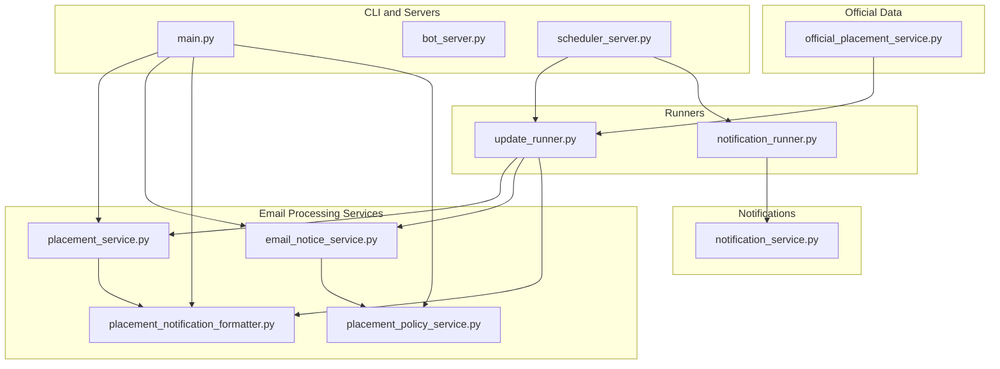
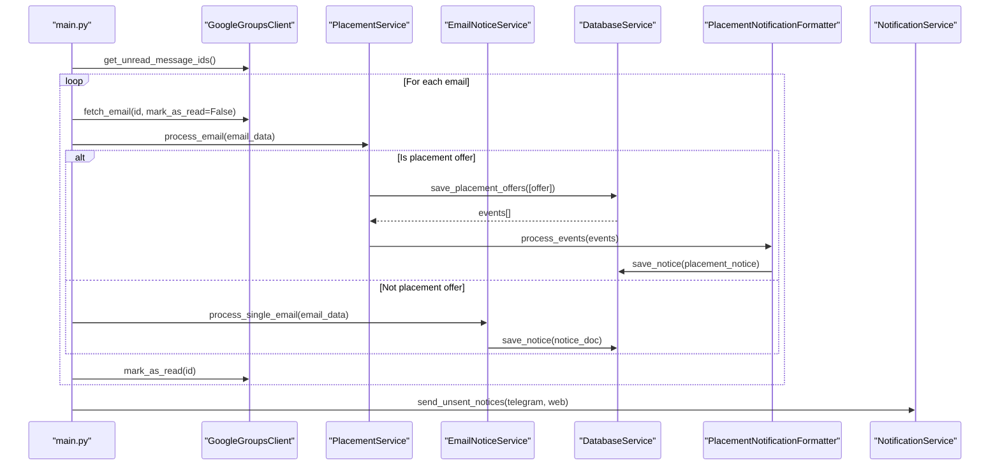
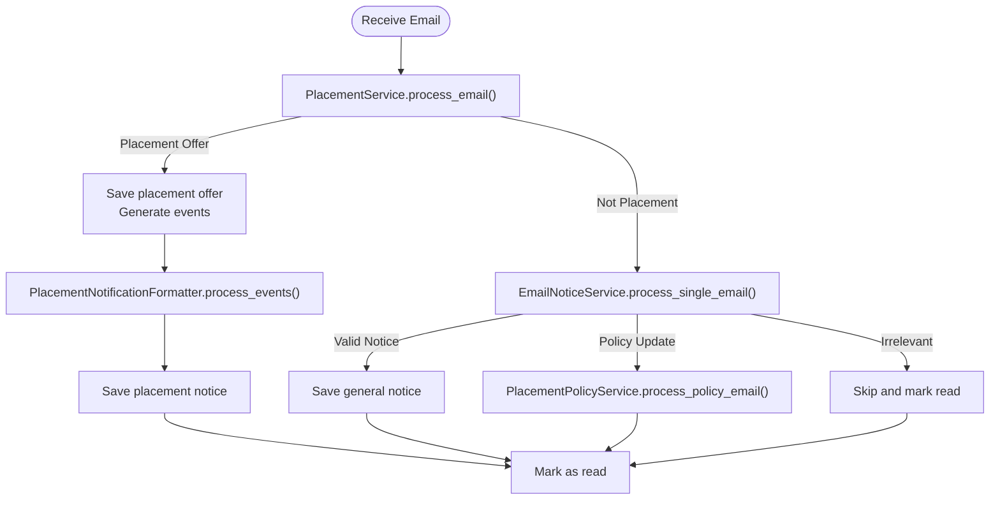
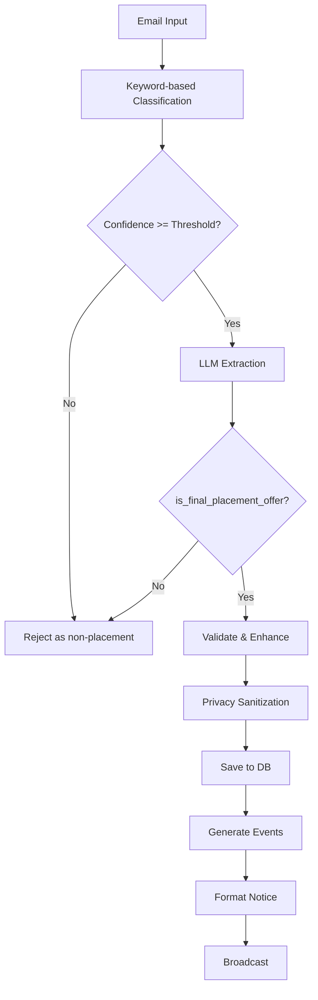
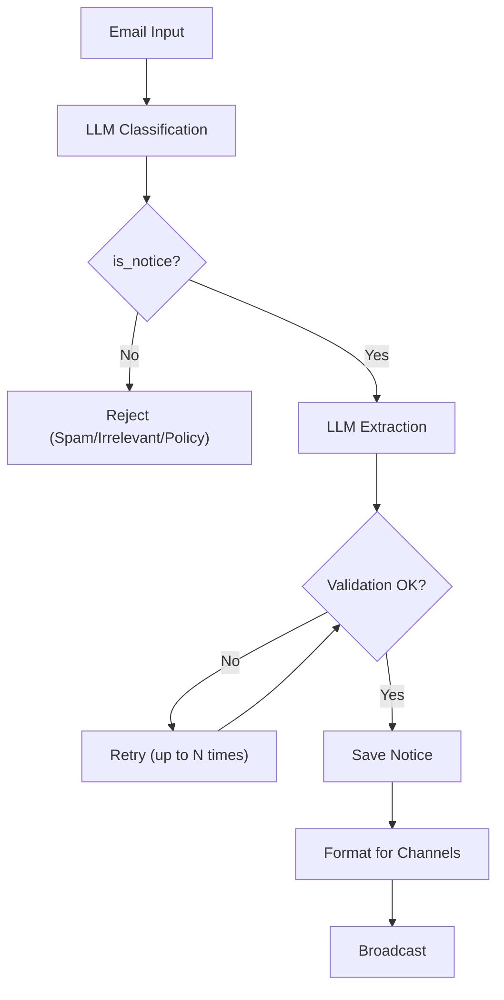
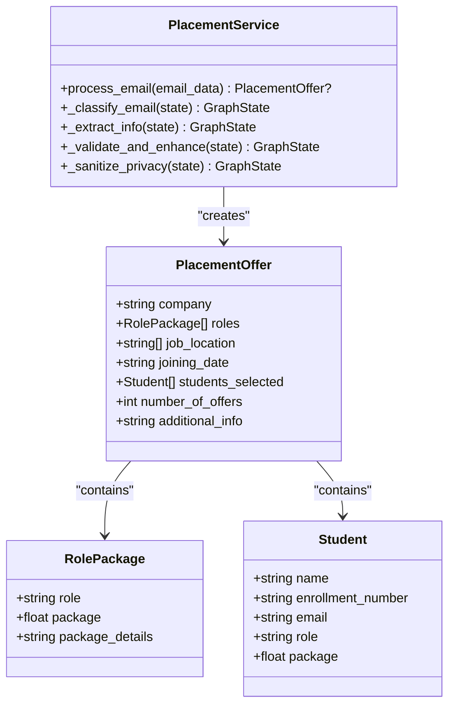
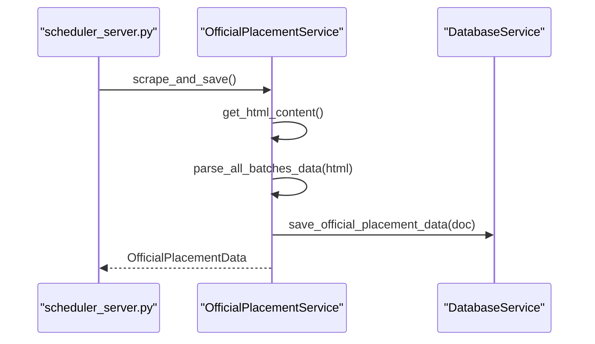
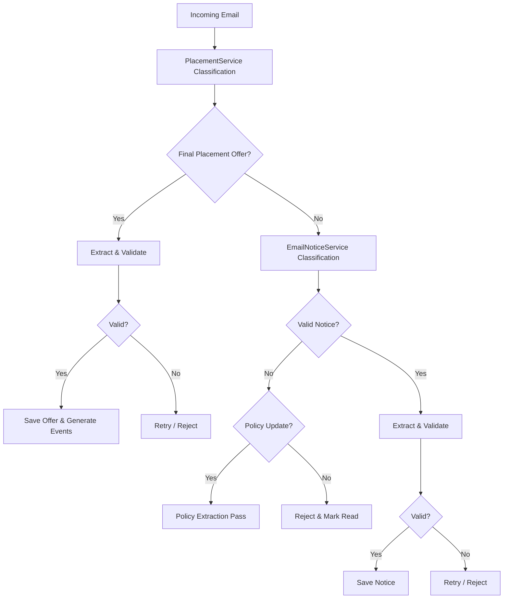
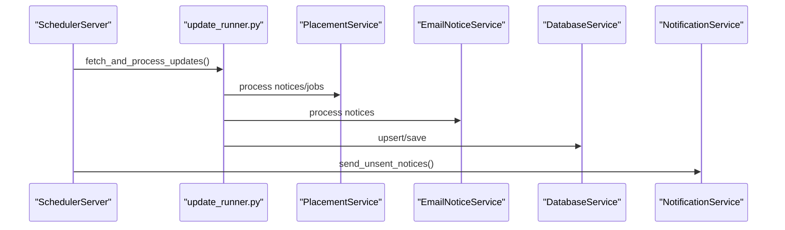
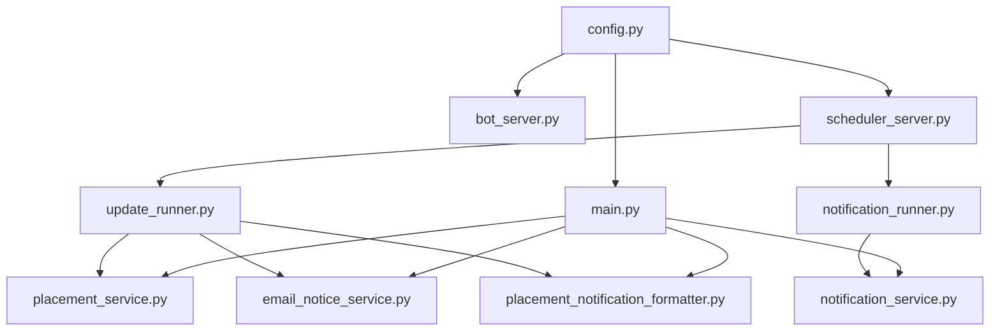

# Email Processing Orchestration

<cite>
**Referenced Files in This Document**
- [main.py](file://app/main.py)
- [email_notice_service.py](file://app/services/email_notice_service.py)
- [placement_service.py](file://app/services/placement_service.py)
- [official_placement_service.py](file://app/services/official_placement_service.py)
- [placement_notification_formatter.py](file://app/services/placement_notification_formatter.py)
- [placement_policy_service.py](file://app/services/placement_policy_service.py)
- [notification_service.py](file://app/services/notification_service.py)
- [notification_runner.py](file://app/runners/notification_runner.py)
- [update_runner.py](file://app/runners/update_runner.py)
- [bot_server.py](file://app/servers/bot_server.py)
- [scheduler_server.py](file://app/servers/scheduler_server.py)
- [config.py](file://app/core/config.py)
</cite>

## Table of Contents
1. [Introduction](#introduction)
2. [Project Structure](#project-structure)
3. [Core Components](#core-components)
4. [Architecture Overview](#architecture-overview)
5. [Detailed Component Analysis](#detailed-component-analysis)
6. [Dependency Analysis](#dependency-analysis)
7. [Performance Considerations](#performance-considerations)
8. [Troubleshooting Guide](#troubleshooting-guide)
9. [Conclusion](#conclusion)

## Introduction
This document describes the email processing orchestration workflow that prioritizes placement offers over general notices, classifies incoming emails, extracts structured content using LLMs, and integrates with official placement data sources. It explains the decision trees for categorization and processing priorities, the LLM-powered extraction pipeline for placement services, and the official placement service integration. It also covers concurrent processing strategies and how the system maintains processing order during email volume spikes.

## Project Structure
The email processing orchestration spans several modules:
- CLI orchestration and scheduling: main entry points and schedulers
- Email processing services: placement and general notice classification/extraction
- Formatting and notification: transforming events into notices and broadcasting
- Official data integration: scraping and storing government portal data
- Configuration and dependency injection: centralized settings and DI

**Diagram sources**
- [main.py](file://app/main.py#L105-L242)
- [scheduler_server.py](file://app/servers/scheduler_server.py#L78-L237)
- [placement_service.py](file://app/services/placement_service.py#L419-L800)
- [email_notice_service.py](file://app/services/email_notice_service.py#L335-L800)
- [placement_notification_formatter.py](file://app/services/placement_notification_formatter.py#L102-L380)
- [placement_policy_service.py](file://app/services/placement_policy_service.py#L200-L588)
- [notification_service.py](file://app/services/notification_service.py#L13-L237)
- [official_placement_service.py](file://app/services/official_placement_service.py#L81-L459)

**Section sources**
- [main.py](file://app/main.py#L105-L242)
- [scheduler_server.py](file://app/servers/scheduler_server.py#L78-L237)

## Core Components
- Priority-based orchestration: placement offers are processed first; only non-placement emails are routed to general notice classification.
- LLM-powered classification and extraction: placement uses keyword-based classification plus LLM extraction; general notices use LLM-based classification and extraction.
- Policy handling: placement policy updates are detected and processed separately from regular notices.
- Official placement integration: periodic scraping of government portal data for batch-wise placement statistics.
- Notification formatting and dispatch: placement events are transformed into notices and broadcast via configured channels.

**Section sources**
- [main.py](file://app/main.py#L105-L242)
- [placement_service.py](file://app/services/placement_service.py#L419-L800)
- [email_notice_service.py](file://app/services/email_notice_service.py#L335-L800)
- [placement_policy_service.py](file://app/services/placement_policy_service.py#L200-L588)
- [official_placement_service.py](file://app/services/official_placement_service.py#L81-L459)
- [notification_service.py](file://app/services/notification_service.py#L13-L237)

## Architecture Overview
The orchestration follows a deterministic priority flow:
1. Fetch unread email IDs from Google Groups.
2. For each email:
   - Attempt placement offer detection using placement_service.
   - If not a placement offer, attempt general notice classification using email_notice_service.
   - Persist results and mark email as read.
3. Periodically scrape official placement data and integrate into the system.
4. Broadcast unsent notices via Telegram and/or Web Push.

**Diagram sources**
- [main.py](file://app/main.py#L105-L242)
- [placement_service.py](file://app/services/placement_service.py#L419-L800)
- [email_notice_service.py](file://app/services/email_notice_service.py#L335-L800)
- [placement_notification_formatter.py](file://app/services/placement_notification_formatter.py#L102-L380)
- [notification_service.py](file://app/services/notification_service.py#L13-L237)

## Detailed Component Analysis

### Priority-Based Email Handling
- Placement offers are processed first using a hybrid approach: keyword-based initial scoring followed by LLM validation to ensure only final placement offers are accepted.
- Non-placement emails are routed to the general notice pipeline, which relies purely on LLM classification to distinguish valid notices from spam or irrelevant content.
- Policy updates are detected and processed separately to maintain clean separation of concerns.

**Diagram sources**
- [main.py](file://app/main.py#L105-L242)
- [placement_service.py](file://app/services/placement_service.py#L419-L800)
- [email_notice_service.py](file://app/services/email_notice_service.py#L335-L800)
- [placement_notification_formatter.py](file://app/services/placement_notification_formatter.py#L102-L380)
- [placement_policy_service.py](file://app/services/placement_policy_service.py#L541-L588)

**Section sources**
- [main.py](file://app/main.py#L105-L242)
- [placement_service.py](file://app/services/placement_service.py#L507-L600)
- [email_notice_service.py](file://app/services/email_notice_service.py#L419-L434)

### Email Classification and Extraction Pipelines

#### Placement Service Pipeline
- Classification: keyword-based scoring with confidence thresholds, plus LLM validation for final placement offers.
- Extraction: LLM-based structured extraction with retry logic and validation.
- Privacy sanitization: removal of headers and forwarded markers.
- Output: PlacementOffer objects persisted to database and transformed into notices.

**Diagram sources**
- [placement_service.py](file://app/services/placement_service.py#L507-L800)

**Section sources**
- [placement_service.py](file://app/services/placement_service.py#L507-L800)

#### General Notice Service Pipeline
- Classification: LLM-based classification without keyword filtering; placement offers are explicitly excluded.
- Extraction: LLM-based extraction with structured schema validation and retry logic.
- Policy detection: separate LLM pass for placement policy updates with dedicated schema.
- Output: NoticeDocument objects saved to database and formatted for notifications.

**Diagram sources**
- [email_notice_service.py](file://app/services/email_notice_service.py#L419-L624)

**Section sources**
- [email_notice_service.py](file://app/services/email_notice_service.py#L419-L624)

### LLM-Powered Content Extraction for Placement Services
- Structured extraction prompts enforce strict schema compliance for company, roles, packages, students, and supporting details.
- Robust retry logic with validation error accumulation and maximum retry limits.
- Privacy sanitization removes headers, forwarded markers, and sensitive metadata.
- Package conversion and normalization ensure consistent units (e.g., LPA) and handling of ranges and stipends.

**Diagram sources**
- [placement_service.py](file://app/services/placement_service.py#L37-L68)

**Section sources**
- [placement_service.py](file://app/services/placement_service.py#L151-L246)
- [placement_service.py](file://app/services/placement_service.py#L601-L705)

### Official Placement Service Integration
- Scrapes official JIIT placement page for batch-wise statistics and pointers.
- Extracts placement pointers and package distribution tables.
- Normalizes and stores structured data for downstream analytics and notifications.

**Diagram sources**
- [scheduler_server.py](file://app/servers/scheduler_server.py#L239-L273)
- [official_placement_service.py](file://app/services/official_placement_service.py#L375-L422)

**Section sources**
- [official_placement_service.py](file://app/services/official_placement_service.py#L150-L422)
- [scheduler_server.py](file://app/servers/scheduler_server.py#L239-L273)

### Decision Trees and Fallback Mechanisms
- Placement classification decision tree:
  - Keyword-based confidence score threshold determines initial relevance.
  - LLM final validation ensures only final placement offers are accepted.
  - On rejection, the system proceeds to general notice classification.
- General notice classification decision tree:
  - LLM-based classification excludes placement offers and spam.
  - Policy updates are detected and processed via a separate extraction pass.
  - On validation failure, retry up to configured limit; otherwise reject.
- Fallback mechanisms:
  - Policy updates are handled independently and saved as policy documents.
  - Non-relevant emails are marked as read to prevent reprocessing.
  - Unsolicited notices are saved and broadcast via notification service.

**Diagram sources**
- [placement_service.py](file://app/services/placement_service.py#L507-L600)
- [email_notice_service.py](file://app/services/email_notice_service.py#L419-L434)
- [placement_policy_service.py](file://app/services/placement_policy_service.py#L541-L588)

**Section sources**
- [placement_service.py](file://app/services/placement_service.py#L507-L600)
- [email_notice_service.py](file://app/services/email_notice_service.py#L419-L434)
- [placement_policy_service.py](file://app/services/placement_policy_service.py#L541-L588)

### Concurrent Processing Strategies and Volume Handling
- Sequential processing per email within a single orchestration loop to maintain ordering and avoid race conditions.
- Separate schedulers for automated updates and bot commands to isolate workloads.
- Retry logic with bounded attempts to handle transient LLM or parsing failures.
- Daemon mode support for long-running processes with controlled logging.
- Notification batching via NotificationService to minimize channel overhead.

**Diagram sources**
- [scheduler_server.py](file://app/servers/scheduler_server.py#L78-L117)
- [update_runner.py](file://app/runners/update_runner.py#L56-L148)
- [notification_runner.py](file://app/runners/notification_runner.py#L60-L115)

**Section sources**
- [scheduler_server.py](file://app/servers/scheduler_server.py#L78-L117)
- [update_runner.py](file://app/runners/update_runner.py#L56-L148)
- [notification_runner.py](file://app/runners/notification_runner.py#L60-L115)

## Dependency Analysis
- Centralized configuration via Settings and safe_print utilities enable consistent logging and daemon behavior across services.
- Dependency injection is used extensively to enable testability and modular composition.
- Email clients and database clients are instantiated per-process or per-runner to avoid cross-service coupling.

**Diagram sources**
- [config.py](file://app/core/config.py#L18-L254)
- [main.py](file://app/main.py#L105-L242)
- [scheduler_server.py](file://app/servers/scheduler_server.py#L78-L117)

**Section sources**
- [config.py](file://app/core/config.py#L18-L254)
- [main.py](file://app/main.py#L105-L242)
- [scheduler_server.py](file://app/servers/scheduler_server.py#L78-L117)

## Performance Considerations
- LLM calls are rate-limited by sequential processing; consider batching and caching for high-volume scenarios.
- Retry logic prevents unnecessary reprocessing of unread emails; ensure exponential backoff if extending retries.
- Database writes are optimized by upsert operations and pre-filtering of existing IDs.
- Official placement scraping is scheduled at off-peak hours to minimize impact on primary processing.

## Troubleshooting Guide
- Placement offers not detected:
  - Verify keyword indicators and LLM prompts are aligned with actual email content.
  - Check validation errors and retry counts in the placement pipeline.
- General notices not appearing:
  - Confirm LLM classification prompt excludes placement offers and spam.
  - Review policy update detection and fallback handling.
- Notification delivery issues:
  - Inspect NotificationService results and channel-specific errors.
  - Ensure database contains unsent notices and proper channel configuration.

**Section sources**
- [placement_service.py](file://app/services/placement_service.py#L663-L705)
- [email_notice_service.py](file://app/services/email_notice_service.py#L553-L569)
- [notification_service.py](file://app/services/notification_service.py#L93-L167)

## Conclusion
The email processing orchestration implements a robust, priority-driven workflow that separates placement offers from general notices, leverages LLMs for accurate classification and extraction, and integrates official placement data for comprehensive coverage. The system’s decision trees, retry mechanisms, and concurrent processing strategies ensure reliability and scalability, while dependency injection and centralized configuration support maintain modularity and testability.