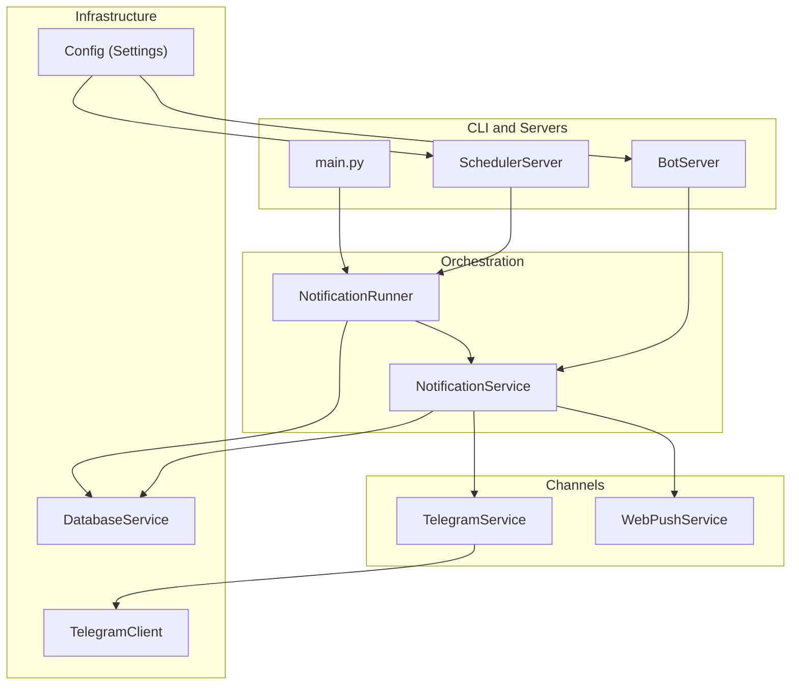
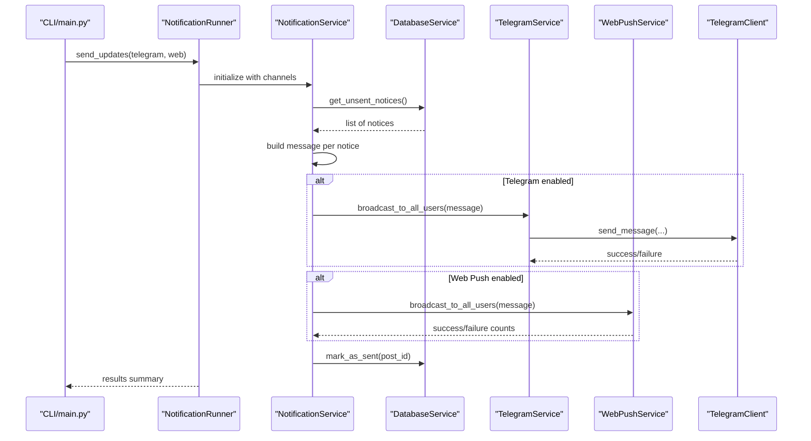
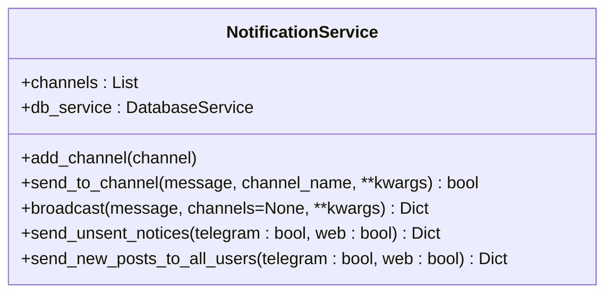
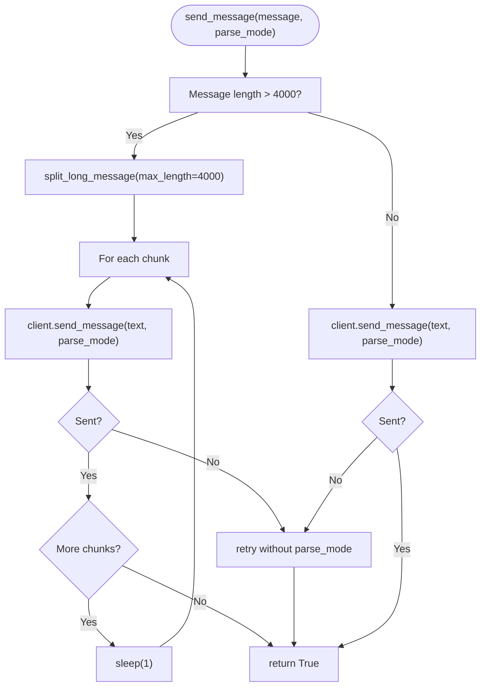
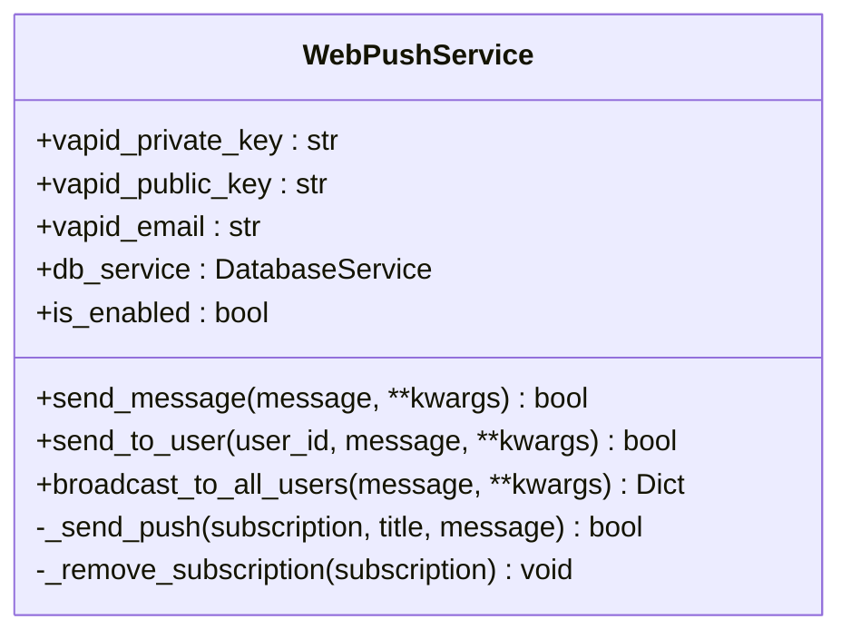
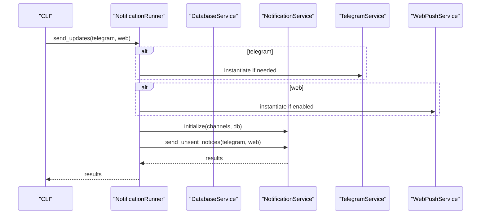
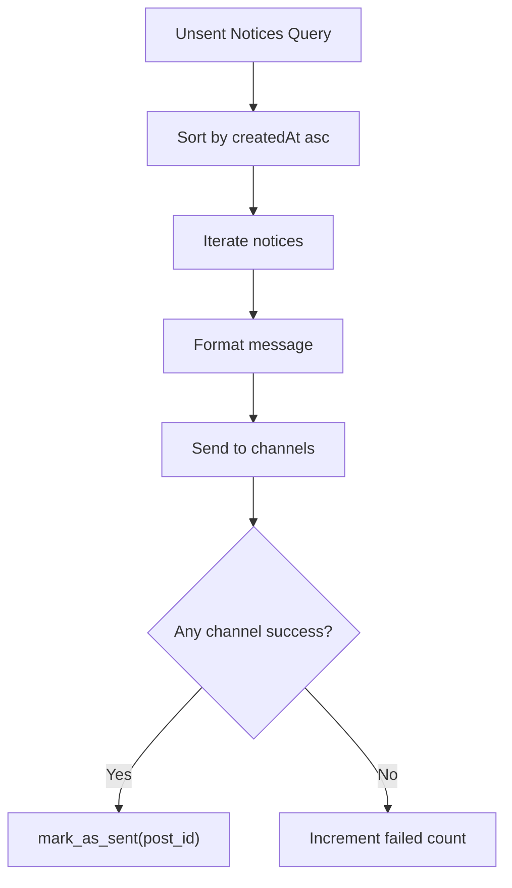
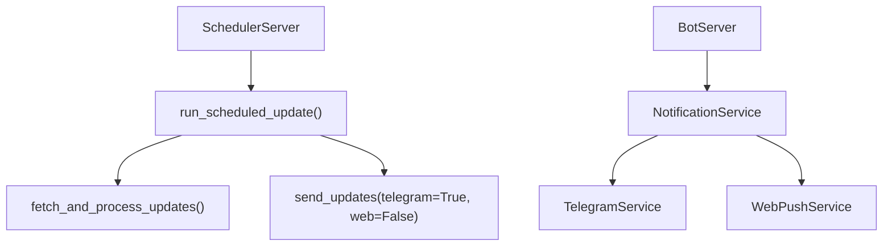
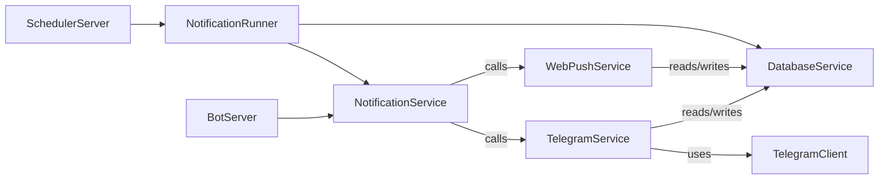

# Notification Flow Distribution

<cite>
**Referenced Files in This Document**
- [notification_service.py](file://app/services/notification_service.py)
- [telegram_service.py](file://app/services/telegram_service.py)
- [web_push_service.py](file://app/services/web_push_service.py)
- [notification_runner.py](file://app/runners/notification_runner.py)
- [bot_server.py](file://app/servers/bot_server.py)
- [scheduler_server.py](file://app/servers/scheduler_server.py)
- [database_service.py](file://app/services/database_service.py)
- [telegram_client.py](file://app/clients/telegram_client.py)
- [config.py](file://app/core/config.py)
- [main.py](file://app/main.py)
- [ARCHITECTURE.md](file://docs/ARCHITECTURE.md)
</cite>

## Table of Contents
1. [Introduction](#introduction)
2. [Project Structure](#project-structure)
3. [Core Components](#core-components)
4. [Architecture Overview](#architecture-overview)
5. [Detailed Component Analysis](#detailed-component-analysis)
6. [Dependency Analysis](#dependency-analysis)
7. [Performance Considerations](#performance-considerations)
8. [Troubleshooting Guide](#troubleshooting-guide)
9. [Conclusion](#conclusion)

## Introduction
This document describes the notification flow distribution system that orchestrates multi-channel delivery of notifications to users via Telegram and Web Push. It explains the routing architecture, batching strategy, channel prioritization, delivery guarantees, error handling, retry logic, user preferences, and queueing mechanisms. It also documents integration patterns between the notification service and channel handlers, including message transformation and delivery confirmation.

## Project Structure
The notification system spans several modules:
- Service orchestration: NotificationService, NotificationRunner
- Channel implementations: TelegramService, WebPushService
- Infrastructure: DatabaseService, TelegramClient, Configuration
- Servers: BotServer, SchedulerServer
- CLI entry points and scheduling: main.py

**Diagram sources**
- [main.py](file://app/main.py#L265-L282)
- [notification_runner.py](file://app/runners/notification_runner.py#L21-L160)
- [notification_service.py](file://app/services/notification_service.py#L13-L237)
- [telegram_service.py](file://app/services/telegram_service.py#L20-L351)
- [web_push_service.py](file://app/services/web_push_service.py#L27-L242)
- [database_service.py](file://app/services/database_service.py#L16-L795)
- [telegram_client.py](file://app/clients/telegram_client.py#L19-L126)
- [bot_server.py](file://app/servers/bot_server.py#L29-L519)
- [scheduler_server.py](file://app/servers/scheduler_server.py#L33-L388)
- [config.py](file://app/core/config.py#L18-L254)

**Section sources**
- [main.py](file://app/main.py#L370-L632)
- [ARCHITECTURE.md](file://docs/ARCHITECTURE.md#L1-L678)

## Core Components
- NotificationService: Central router that dispatches messages to enabled channels and manages batched delivery of unsent notices.
- TelegramService: Implements channel-specific logic for Telegram, including message formatting, long-message chunking, rate limiting, and user broadcasting.
- WebPushService: Implements channel-specific logic for Web Push, including VAPID authentication, subscription management hooks, and broadcast delivery.
- NotificationRunner: CLI-driven orchestrator that wires channels and triggers send operations based on flags.
- DatabaseService: Provides persistent storage for notices, user management, and delivery state tracking.
- TelegramClient: Low-level Telegram API client with retry/backoff and rate-limit handling.
- Configuration: Centralized settings management for tokens, keys, and runtime flags.

**Section sources**
- [notification_service.py](file://app/services/notification_service.py#L13-L237)
- [telegram_service.py](file://app/services/telegram_service.py#L20-L351)
- [web_push_service.py](file://app/services/web_push_service.py#L27-L242)
- [notification_runner.py](file://app/runners/notification_runner.py#L21-L160)
- [database_service.py](file://app/services/database_service.py#L16-L795)
- [telegram_client.py](file://app/clients/telegram_client.py#L19-L126)
- [config.py](file://app/core/config.py#L18-L254)

## Architecture Overview
The notification flow is a multi-stage pipeline:
1. Data ingestion populates notices in the database with a pending state.
2. The scheduler or CLI triggers sending of unsent notices.
3. NotificationService batches notices and routes them to enabled channels.
4. Channel handlers transform messages and deliver to users.
5. Delivery state is persisted to mark notices as sent.

**Diagram sources**
- [main.py](file://app/main.py#L265-L282)
- [notification_runner.py](file://app/runners/notification_runner.py#L60-L115)
- [notification_service.py](file://app/services/notification_service.py#L93-L167)
- [database_service.py](file://app/services/database_service.py#L116-L147)
- [telegram_service.py](file://app/services/telegram_service.py#L140-L172)
- [web_push_service.py](file://app/services/web_push_service.py#L120-L155)
- [telegram_client.py](file://app/clients/telegram_client.py#L39-L111)

## Detailed Component Analysis

### NotificationService
- Responsibilities:
  - Aggregates multiple channels and routes messages accordingly.
  - Batches unsent notices and marks them sent upon successful delivery.
  - Provides channel-specific send and broadcast helpers.
- Key behaviors:
  - Channel selection by name for targeted delivery.
  - Iterative broadcast across enabled channels with per-channel error handling.
  - Delivery guarantees: marks as sent if at least one channel succeeds; otherwise increments failures.

**Diagram sources**
- [notification_service.py](file://app/services/notification_service.py#L13-L237)

**Section sources**
- [notification_service.py](file://app/services/notification_service.py#L42-L91)
- [notification_service.py](file://app/services/notification_service.py#L93-L167)
- [notification_service.py](file://app/services/notification_service.py#L169-L236)

### TelegramService
- Responsibilities:
  - Implements channel contract for Telegram.
  - Formats messages (Markdown/HTML) and handles long messages by chunking.
  - Broadcasts to all active users with rate limiting.
  - Retries with fallback to plain text when formatting fails.
- Key behaviors:
  - Long message splitting with newline-aware chunking.
  - Markdown-to-Telegram conversion and HTML conversion.
  - Per-user delivery with small delays to avoid rate limits.
  - Fallback retry without parse_mode on initial failure.

**Diagram sources**
- [telegram_service.py](file://app/services/telegram_service.py#L62-L121)
- [telegram_client.py](file://app/clients/telegram_client.py#L39-L111)

**Section sources**
- [telegram_service.py](file://app/services/telegram_service.py#L62-L121)
- [telegram_service.py](file://app/services/telegram_service.py#L140-L172)
- [telegram_service.py](file://app/services/telegram_service.py#L218-L253)
- [telegram_service.py](file://app/services/telegram_service.py#L282-L345)
- [telegram_client.py](file://app/clients/telegram_client.py#L39-L111)

### WebPushService
- Responsibilities:
  - Implements channel contract for Web Push.
  - Manages VAPID authentication and subscription-based delivery.
  - Broadcasts to all users with push subscriptions.
  - Gracefully degrades when pywebpush is unavailable.
- Key behaviors:
  - Checks availability of VAPID keys and pywebpush library.
  - Broadcasts per subscription with truncation and payload formatting.
  - Handles expired subscriptions by removing them from DB (placeholder).
  - Returns success counts and error details.

**Diagram sources**
- [web_push_service.py](file://app/services/web_push_service.py#L27-L242)

**Section sources**
- [web_push_service.py](file://app/services/web_push_service.py#L76-L88)
- [web_push_service.py](file://app/services/web_push_service.py#L120-L155)
- [web_push_service.py](file://app/services/web_push_service.py#L157-L193)
- [web_push_service.py](file://app/services/web_push_service.py#L195-L208)

### NotificationRunner
- Responsibilities:
  - CLI-driven orchestration for sending unsent notices.
  - Dependency injection for testability and modularity.
  - Conditional enabling of channels based on flags and availability.
- Key behaviors:
  - Creates channel instances only when enabled.
  - Builds NotificationService with selected channels.
  - Executes send_unsent_notices and returns results.

**Diagram sources**
- [notification_runner.py](file://app/runners/notification_runner.py#L60-L115)

**Section sources**
- [notification_runner.py](file://app/runners/notification_runner.py#L28-L98)
- [notification_runner.py](file://app/runners/notification_runner.py#L106-L115)

### DatabaseService Integration
- Responsibilities:
  - Stores notices with pending state and tracks delivery per channel.
  - Retrieves unsent notices and marks them sent upon successful delivery.
  - Provides user lists for channel broadcasts.
- Key behaviors:
  - get_unsent_notices() returns notices not yet sent to Telegram.
  - mark_as_sent() sets sent flag and timestamps.
  - get_active_users() supplies recipients for broadcasts.

**Diagram sources**
- [database_service.py](file://app/services/database_service.py#L116-L147)
- [notification_service.py](file://app/services/notification_service.py#L133-L167)

**Section sources**
- [database_service.py](file://app/services/database_service.py#L116-L147)
- [database_service.py](file://app/services/database_service.py#L684-L692)

### Servers and Scheduling
- BotServer: Telegram bot with command handlers and DI support; integrates NotificationService for administrative commands.
- SchedulerServer: Automated job runner that executes the same update-and-send sequence on a schedule.

**Diagram sources**
- [scheduler_server.py](file://app/servers/scheduler_server.py#L78-L117)
- [bot_server.py](file://app/servers/bot_server.py#L488-L507)

**Section sources**
- [bot_server.py](file://app/servers/bot_server.py#L455-L507)
- [scheduler_server.py](file://app/servers/scheduler_server.py#L78-L117)

## Dependency Analysis
- Coupling:
  - NotificationService depends on channel implementations via a simple interface (channel_name property and broadcast_to_all_users/send_message).
  - Channels depend on DatabaseService for user lists and on TelegramClient for Telegram API calls.
  - NotificationRunner injects channels and DB into NotificationService.
- Cohesion:
  - Each service has a single responsibility: orchestration, channel delivery, or persistence.
- External dependencies:
  - Telegram Bot API (via TelegramClient).
  - Optional Web Push library (pywebpush) with graceful degradation.
  - MongoDB via DatabaseService.

**Diagram sources**
- [notification_service.py](file://app/services/notification_service.py#L42-L91)
- [telegram_service.py](file://app/services/telegram_service.py#L46-L51)
- [web_push_service.py](file://app/services/web_push_service.py#L55-L58)
- [telegram_client.py](file://app/clients/telegram_client.py#L32-L34)
- [database_service.py](file://app/services/database_service.py#L36-L43)
- [notification_runner.py](file://app/runners/notification_runner.py#L56-L58)
- [bot_server.py](file://app/servers/bot_server.py#L63-L66)
- [scheduler_server.py](file://app/servers/scheduler_server.py#L90-L92)

**Section sources**
- [notification_service.py](file://app/services/notification_service.py#L33-L40)
- [telegram_service.py](file://app/services/telegram_service.py#L45-L51)
- [web_push_service.py](file://app/services/web_push_service.py#L53-L60)
- [notification_runner.py](file://app/runners/notification_runner.py#L44-L58)

## Performance Considerations
- Batching:
  - NotificationService iterates unsent notices and broadcasts to enabled channels; batching occurs at the notice level.
- Rate limiting:
  - TelegramService applies small delays between user sends and long message chunking to avoid rate limits.
  - TelegramClient implements exponential backoff and respects Retry-After headers.
- Concurrency:
  - Current implementation performs sequential broadcasts per notice; parallelization could improve throughput but risks rate limits and DB contention.
- Memory and CPU:
  - Long message splitting and markdown conversions are linear in message length; consider streaming or chunking strategies for very large content.

[No sources needed since this section provides general guidance]

## Troubleshooting Guide
- Telegram delivery failures:
  - Verify bot token and chat ID are configured; TelegramClient validates presence before sending.
  - Check rate limits; TelegramClient handles 429 with Retry-After.
  - Long messages are split; if formatting fails, TelegramService retries without parse_mode.
- Web Push delivery failures:
  - Ensure VAPID keys are configured; WebPushService checks availability and logs warnings when disabled.
  - Expired subscriptions are handled by attempting removal; implement DB-specific removal logic if needed.
- Database connectivity:
  - DatabaseService methods return empty results or errors when collections are uninitialized; confirm connection string and collection initialization.
- CLI usage:
  - Use send command with appropriate flags (--telegram, --web, --both) and optional --fetch to include data updates.

**Section sources**
- [telegram_client.py](file://app/clients/telegram_client.py#L62-L111)
- [telegram_service.py](file://app/services/telegram_service.py#L68-L99)
- [web_push_service.py](file://app/services/web_push_service.py#L62-L69)
- [web_push_service.py](file://app/services/web_push_service.py#L185-L193)
- [database_service.py](file://app/services/database_service.py#L38-L43)
- [main.py](file://app/main.py#L265-L282)

## Conclusion
The notification flow distribution system provides a robust, extensible architecture for delivering notices across Telegram and Web Push channels. It emphasizes separation of concerns, dependency injection, and graceful degradation. Delivery guarantees are achieved by marking notices as sent only when at least one channel succeeds, while error handling and retry logic ensure resilience against transient failures. The design supports future extensions, such as additional channels or improved batching strategies, without disrupting existing functionality.