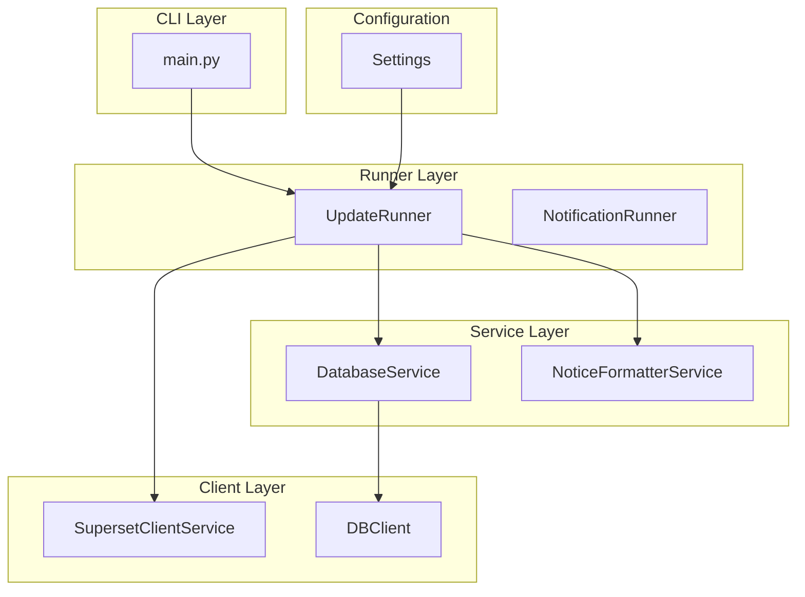
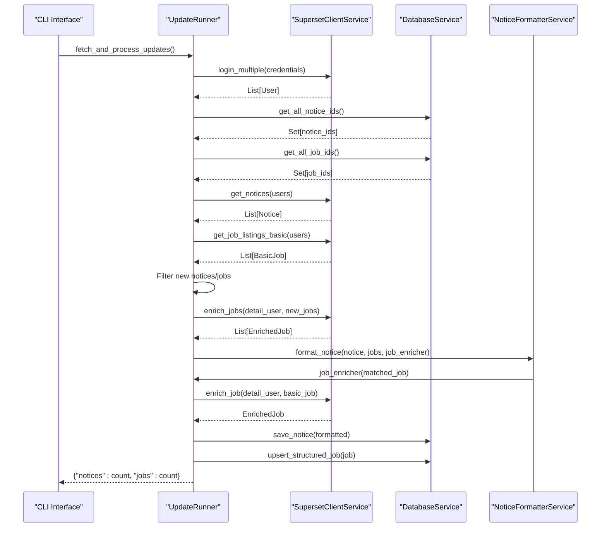
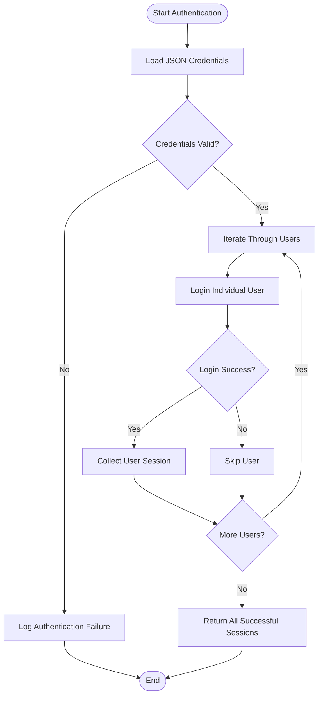
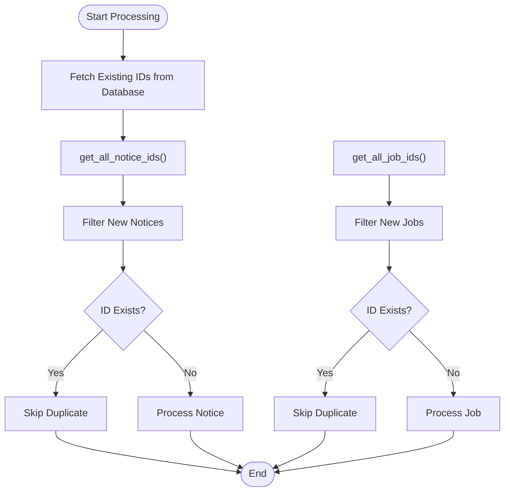
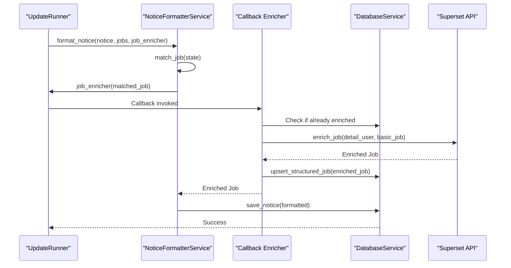
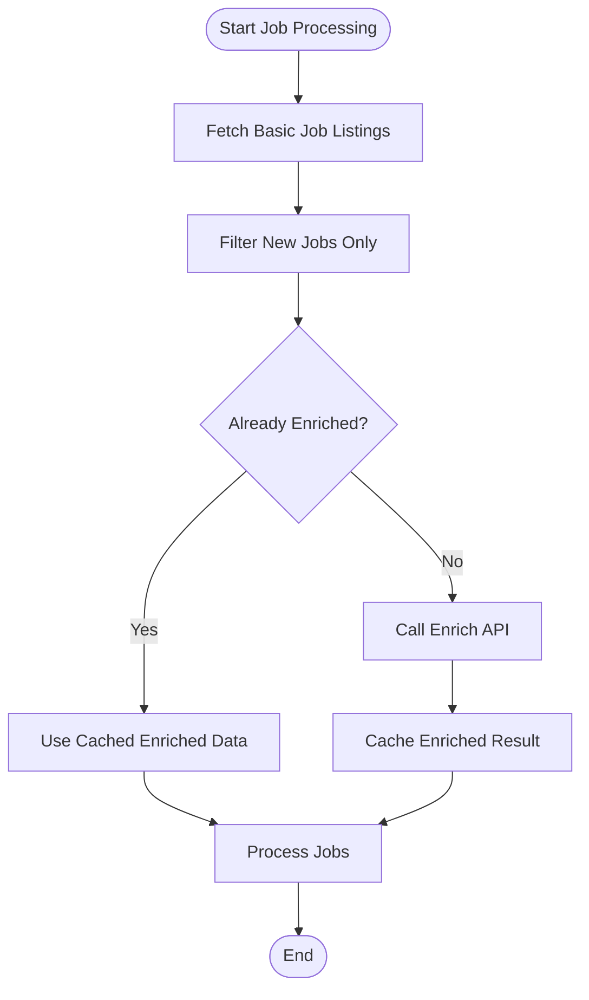
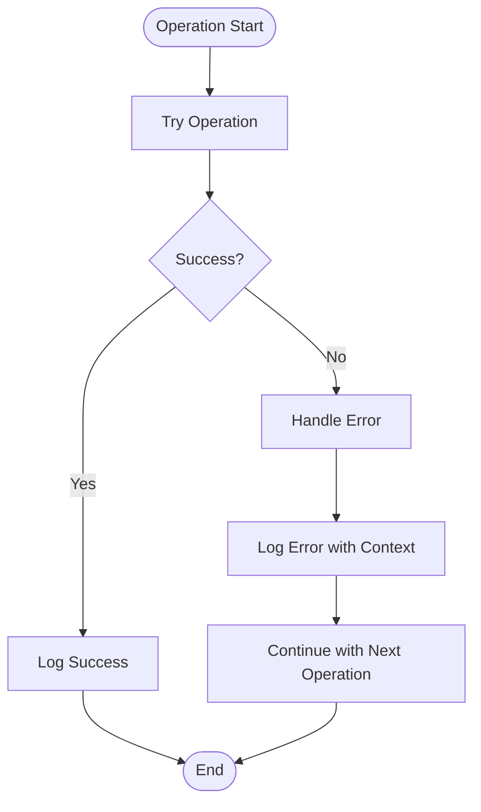
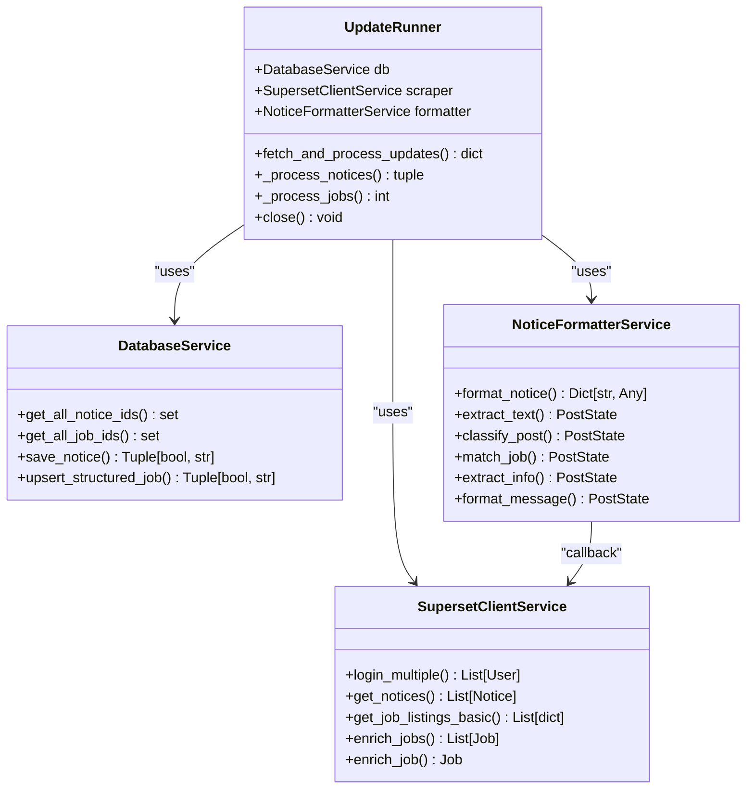

# Update flow processing

## Introduction
This page provides detailed technical documentation for the update flow processing system that powers data ingestion from the SuperSet portal. The system orchestrates multi-user authentication, credential management, and efficient data processing with deduplication and LLM-powered notice matching. It implements a callback-based enricher pattern to optimize API calls by enriching only new jobs while reusing existing enriched data.

## Project structure
The update flow spans several key modules within the application architecture:

```mermaid
graph TB
subgraph "CLI Layer"
MAIN[main.py]
end
subgraph "Runner Layer"
UPDATE_RUNNER[UpdateRunner]
NOTIFICATION_RUNNER[NotificationRunner]
end
subgraph "Client Layer"
SUPERSET_CLIENT[SupersetClientService]
DB_CLIENT[DBClient]
end
subgraph "Service Layer"
DATABASE_SERVICE[DatabaseService]
NOTICE_FORMATTER[NoticeFormatterService]
end
subgraph "Configuration"
CONFIG[Settings]
end
MAIN --> UPDATE_RUNNER
UPDATE_RUNNER --> SUPERSET_CLIENT
UPDATE_RUNNER --> DATABASE_SERVICE
UPDATE_RUNNER --> NOTICE_FORMATTER
DATABASE_SERVICE --> DB_CLIENT
CONFIG --> UPDATE_RUNNER
```

## Core components
The update flow processing system consists of four primary components working in concert:

### UpdateRunner
The central orchestrator responsible for the complete update lifecycle, implementing dependency injection for testability and resource management.

### SupersetClientService
Handles SuperSet portal authentication, data fetching, and job enrichment operations with detailed error handling and retry logic.

### DatabaseService
Provides MongoDB operations with deduplication strategies, efficient ID lookups, and transaction-safe operations for notices and jobs.

### NoticeFormatterService
Implements LLM-powered notice processing with callback-based job enrichment and structured content formatting.

## Architecture overview
The update flow follows a sequential processing pattern optimized for performance and reliability:

```mermaid
sequenceDiagram
participant CLI as "CLI Interface"
participant Runner as "UpdateRunner"
participant Auth as "SupersetClientService"
participant DB as "DatabaseService"
participant Formatter as "NoticeFormatterService"
CLI->>Runner : fetch_and_process_updates()
Runner->>Auth : login_multiple(credentials)
Auth-->>Runner : List[User]
Runner->>DB : get_all_notice_ids()
DB-->>Runner : Set[notice_ids]
Runner->>DB : get_all_job_ids()
DB-->>Runner : Set[job_ids]
Runner->>Auth : get_notices(users)
Auth-->>Runner : List[Notice]
Runner->>Auth : get_job_listings_basic(users)
Auth-->>Runner : List[BasicJob]
Runner->>Runner : Filter new notices/jobs
Runner->>Auth : enrich_jobs(detail_user, new_jobs)
Auth-->>Runner : List[EnrichedJob]
Runner->>Formatter : format_notice(notice, jobs, job_enricher)
Formatter->>Runner : job_enricher(matched_job)
Runner->>Auth : enrich_job(detail_user, basic_job)
Auth-->>Runner : EnrichedJob
Runner->>DB : save_notice(formatted)
Runner->>DB : upsert_structured_job(job)
Runner-->>CLI : {"notices" : count, "jobs" : count}
```

## Detailed component analysis

### Authentication and credential management
The system supports multi-user SuperSet authentication through secure credential handling:

```mermaid
flowchart TD
Start([Start Authentication]) --> LoadCreds["Load JSON Credentials"]
LoadCreds --> ValidateCreds{"Credentials Valid?"}
ValidateCreds --> |No| LogError["Log Authentication Failure"]
ValidateCreds --> |Yes| IterateUsers["Iterate Through Users"]
IterateUsers --> LoginUser["Login Individual User"]
LoginUser --> Success{"Login Success?"}
Success --> |Yes| CollectUser["Collect User Session"]
Success --> |No| SkipUser["Skip User"]
CollectUser --> NextUser{"More Users?"}
SkipUser --> NextUser
NextUser --> |Yes| IterateUsers
NextUser --> |No| ReturnUsers["Return All Successful Sessions"]
LogError --> End([End])
ReturnUsers --> End
```

The authentication process validates credentials from the configuration, attempts login for each user, and collects successful sessions for subsequent operations. Error handling ensures partial failures don't halt the entire authentication process.

### Deduplication strategy
The system implements efficient deduplication using database-backed ID lookups:

```mermaid
flowchart TD
Start([Start Processing]) --> FetchExisting["Fetch Existing IDs from Database"]
FetchExisting --> GetNoticeIDs["get_all_notice_ids()"]
GetJobIDs["get_all_job_ids()"]
GetNoticeIDs --> ProcessNotices["Filter New Notices"]
GetJobIDs --> ProcessJobs["Filter New Jobs"]
ProcessNotices --> CheckNotice{"ID Exists?"}
CheckNotice --> |Yes| SkipNotice["Skip Duplicate"]
CheckNotice --> |No| ProcessNotice["Process Notice"]
ProcessJobs --> CheckJob{"ID Exists?"}
CheckJob --> |Yes| SkipJob["Skip Duplicate"]
CheckJob --> |No| ProcessJob["Process Job"]
SkipNotice --> End([End])
ProcessNotice --> End
SkipJob --> End
ProcessJob --> End
```

The deduplication strategy queries the database for all existing notice and job IDs, then filters incoming data to process only new records. This approach minimizes unnecessary API calls and reduces processing overhead.

### Notice processing workflow
The notice processing pipeline uses LLM-powered matching with callback-based enrichment:

```mermaid
sequenceDiagram
participant Runner as "UpdateRunner"
participant Formatter as "NoticeFormatterService"
participant Enricher as "Callback Enricher"
participant DB as "DatabaseService"
participant API as "Superset API"
Runner->>Formatter : format_notice(notice, jobs, job_enricher)
Formatter->>Formatter : match_job(state)
Formatter->>Runner : job_enricher(matched_job)
Runner->>Enricher : Callback invoked
Enricher->>DB : Check if already enriched
Enricher->>API : enrich_job(detail_user, basic_job)
API-->>Enricher : Enriched Job
Enricher->>DB : upsert_structured_job(enriched_job)
Enricher-->>Formatter : Enriched Job
Formatter->>DB : save_notice(formatted)
DB-->>Runner : Success
```

The callback-based enricher pattern optimizes API usage by:
1. Checking if a job is already enriched in memory
2. Using existing enriched data when available
3. Fetching details only for truly new jobs
4. Persisting enriched data back to the database

### Job enrichment strategy
The system implements a tiered enrichment approach to minimize API calls:

```mermaid
flowchart TD
Start([Start Job Processing]) --> BasicFetch["Fetch Basic Job Listings"]
BasicFetch --> FilterNew["Filter New Jobs Only"]
FilterNew --> CheckCache{"Already Enriched?"}
CheckCache --> |Yes| UseCache["Use Cached Enriched Data"]
CheckCache --> |No| EnrichAPI["Call Enrich API"]
EnrichAPI --> CacheResult["Cache Enriched Result"]
UseCache --> ProcessJobs["Process Jobs"]
CacheResult --> ProcessJobs
ProcessJobs --> End([End])
```

The enrichment strategy processes only new jobs while reusing existing enriched data, significantly reducing API call volume and improving performance.

### Error handling and logging
The system implements detailed error handling across all processing stages:

```mermaid
flowchart TD
Start([Operation Start]) --> TryOp["Try Operation"]
TryOp --> Success{"Success?"}
Success --> |Yes| LogSuccess["Log Success"]
Success --> |No| HandleError["Handle Error"]
HandleError --> LogError["Log Error with Context"]
LogError --> ContinueOps["Continue with Next Operation"]
LogSuccess --> End([End])
ContinueOps --> End
```

Error handling follows a consistent pattern:
- Authentication failures are logged but don't halt processing
- Individual notice processing errors are caught and logged
- Job enrichment errors are handled gracefully
- All operations use structured logging with context information

## Dependency analysis
The update flow demonstrates excellent separation of concerns through dependency injection:

```mermaid
classDiagram
class UpdateRunner {
+DatabaseService db
+SupersetClientService scraper
+NoticeFormatterService formatter
+fetch_and_process_updates() dict
+_process_notices() tuple
+_process_jobs() int
+close() void
}
class SupersetClientService {
+login_multiple() List[User]
+get_notices() List[Notice]
+get_job_listings_basic() List[dict]
+enrich_jobs() List[Job]
+enrich_job() Job
}
class DatabaseService {
+get_all_notice_ids() set
+get_all_job_ids() set
+save_notice() Tuple[bool, str]
+upsert_structured_job() Tuple[bool, str]
}
class NoticeFormatterService {
+format_notice() Dict[str, Any]
+extract_text() PostState
+classify_post() PostState
+match_job() PostState
+extract_info() PostState
+format_message() PostState
}
UpdateRunner --> DatabaseService : "uses"
UpdateRunner --> SupersetClientService : "uses"
UpdateRunner --> NoticeFormatterService : "uses"
NoticeFormatterService --> SupersetClientService : "callback"
```

## Performance considerations
The update flow implements several optimization strategies:

### API call minimization
- **Batch Operations**: Fetches all notices and jobs in single operations
- **Selective Enrichment**: Processes only new jobs requiring API calls
- **Callback Caching**: Reuses enriched data through callback mechanism

### Memory management
- **Lazy Loading**: Jobs are enriched only when needed
- **Efficient Lookups**: Uses sets for O(1) ID existence checks
- **Streaming Processing**: Processes data sequentially to avoid memory pressure

### Database optimization
- **Index Utilization**: Efficient ID lookups using database indexes
- **Upsert Operations**: Atomic updates prevent race conditions
- **Connection Pooling**: Reused database connections reduce overhead

## Troubleshooting guide

### Common authentication issues
- **Credential Format**: Ensure `SUPERSET_CREDENTIALS` is properly formatted JSON array
- **Network Connectivity**: Verify access to SuperSet portal from deployment environment
- **Rate Limiting**: Monitor for API rate limiting during bulk authentication

### Processing failures
- **Notice Processing**: Check individual notice IDs in logs for specific failure points
- **Job Enrichment**: Verify that new job IDs are being properly identified
- **Database Connectivity**: Confirm MongoDB connection and collection accessibility

### Performance issues
- **Memory Usage**: Monitor memory consumption during large batch processing
- **API Throttling**: Implement appropriate delays between API calls
- **Database Performance**: Ensure proper indexing on frequently queried fields

## Conclusion
The update flow processing system demonstrates reliable architecture design with detailed error handling, efficient resource utilization, and scalable processing capabilities. The multi-user authentication, deduplication strategy, and callback-based enrichment pattern work together to provide reliable data ingestion from SuperSet portal while maintaining optimal performance and reliability.

The system's modular design enables easy maintenance, testing, and extension for future enhancements. The documented patterns and strategies provide a solid foundation for understanding and extending the update flow processing capabilities.
