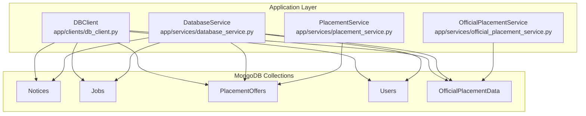
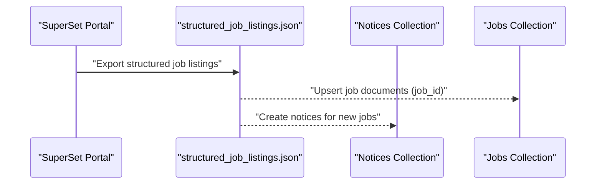
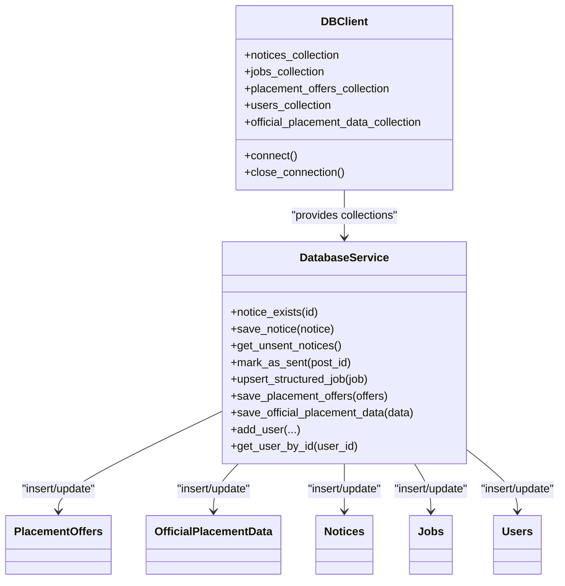

# Collection Schemas & Field Definitions

<cite>
**Referenced Files in This Document**
- [DATABASE.md](file://docs/DATABASE.md)
- [db_client.py](file://app/clients/db_client.py)
- [database_service.py](file://app/services/database_service.py)
- [placement_service.py](file://app/services/placement_service.py)
- [official_placement_service.py](file://app/services/official_placement_service.py)
- [placement_offers.json](file://app/data/placement_offers.json)
- [structured_job_listings.json](file://app/data/structured_job_listings.json)
</cite>

## Table of Contents
1. [Introduction](#introduction)
2. [Project Structure](#project-structure)
3. [Core Components](#core-components)
4. [Architecture Overview](#architecture-overview)
5. [Detailed Component Analysis](#detailed-component-analysis)
6. [Dependency Analysis](#dependency-analysis)
7. [Performance Considerations](#performance-considerations)
8. [Troubleshooting Guide](#troubleshooting-guide)
9. [Conclusion](#conclusion)

## Introduction
This document provides comprehensive collection schemas and field definitions for the SuperSet notification system’s MongoDB database. It covers the five main collections (Notices, Jobs, PlacementOffers, Users, OfficialPlacementData), detailing field types, validation rules, constraints, nested structures, and metadata patterns. It also explains the rationale behind using custom identifiers (id, job_id, offer_id, user_id, data_id) instead of ObjectId, and outlines data transformation rules applied during insertion and updates.

## Project Structure
The database schema is defined in the centralized documentation and enforced by the application’s database client and service layers:
- Centralized schema reference: docs/DATABASE.md
- Database client: app/clients/db_client.py
- Database service: app/services/database_service.py
- Data extraction and validation: app/services/placement_service.py
- Official placement data scraping: app/services/official_placement_service.py
- Sample data for reference: app/data/placement_offers.json, app/data/structured_job_listings.json

**Diagram sources**
- [db_client.py](file://app/clients/db_client.py#L16-L104)
- [database_service.py](file://app/services/database_service.py#L16-L795)
- [placement_service.py](file://app/services/placement_service.py#L419-L800)
- [official_placement_service.py](file://app/services/official_placement_service.py#L80-L459)

**Section sources**
- [DATABASE.md](file://docs/DATABASE.md#L1-L620)
- [db_client.py](file://app/clients/db_client.py#L16-L104)

## Core Components
This section summarizes the five collections and their purposes, identifiers, and key constraints.

- Notices
  - Purpose: Store all types of notifications (job postings, announcements, updates).
  - Identifier: id (string, unique)
  - Key fields: title, content, source, category, formatted_content, sent_to_telegram, sent_to_webpush, metadata, timestamps.
  - Constraints: Unique index on id; metadata.company, role, deadline, tags are optional.

- Jobs
  - Purpose: Structured job listings extracted from SuperSet portal.
  - Identifier: job_id (string, unique)
  - Key fields: company, job_title, job_description, qualification_criteria, position_details, compensation, application_deadline, posted_at, source_url, timestamps.
  - Constraints: Unique index on job_id; indexes on company, application_deadline, qualification criteria arrays.

- PlacementOffers
  - Purpose: Extracted and structured placement offer data from emails.
  - Identifier: offer_id (string, unique)
  - Key fields: company, role, package (nested), students_selected (array of embedded documents), offer_status, source_email, processing_status, notifications_sent, timestamps.
  - Constraints: Unique index on offer_id; indexes on company, processing_status, created_at.

- Users
  - Purpose: Store user subscription data and preferences.
  - Identifier: user_id (string, unique)
  - Key fields: first_name, username, subscription_active, notification_preferences, webpush_subscriptions (array), registered_at, last_active, notifications_sent, metadata.
  - Constraints: Unique index on user_id; indexes on subscription_active, last_active, registered_at.

- OfficialPlacementData
  - Purpose: Store aggregated placement statistics from official sources.
  - Identifier: data_id (string, unique)
  - Key fields: timestamp, overall_statistics (nested), branch_wise (dynamic object), company_wise (array), sector_wise (dynamic object), source_url, timestamps.
  - Constraints: Unique index on data_id; descending index on timestamp.

**Section sources**
- [DATABASE.md](file://docs/DATABASE.md#L32-L424)

## Architecture Overview
The system integrates external data sources (SuperSet portal, email, official website) into MongoDB collections through dedicated services. The database client abstracts connection management, while the database service encapsulates CRUD operations and maintains consistency.

**Diagram sources**
- [database_service.py](file://app/services/database_service.py#L205-L269)
- [structured_job_listings.json](file://app/data/structured_job_listings.json#L1-L800)

**Section sources**
- [database_service.py](file://app/services/database_service.py#L205-L269)
- [structured_job_listings.json](file://app/data/structured_job_listings.json#L1-L800)

## Detailed Component Analysis

### Notices Collection
- Purpose: Central hub for all notifications, including job postings, announcements, and updates.
- Identifier: id (string) — distinct from ObjectId to ensure deterministic uniqueness and external compatibility.
- Required fields:
  - id (string, unique)
  - title (string)
  - content (string)
  - source (enum: 'superset' | 'email' | 'official')
  - category (enum: announcement, job_posting, shortlisting, internship_noc, hackathon, webinar, update)
- Optional fields:
  - formatted_content (string)
  - metadata (embedded object with company, role, deadline, tags)
  - scraped_at (date)
- Metadata patterns:
  - sent_to_telegram: { value: boolean, timestamp: date }
  - sent_to_webpush: { value: boolean, timestamp: date }
- Timestamps:
  - created_at, updated_at
- Indexes:
  - Unique: { id: 1 }
  - Additional: { sent_to_telegram: 1 }, { sent_to_webpush: 1 }, { created_at: -1 }, { source: 1, category: 1 }

Validation and transformation rules:
- Insertion: Adds saved_at and sent_to_telegram.value = false.
- Updates: Modify updated_at; mark sent_to_telegram.timestamp on broadcast completion.

Typical document structure:
- Embedded documents: sent_to_telegram, sent_to_webpush, metadata
- Arrays: None

Unique identifier rationale:
- Using id instead of ObjectId ensures predictable uniqueness and simplifies external integrations and deduplication.

**Section sources**
- [DATABASE.md](file://docs/DATABASE.md#L32-L97)
- [database_service.py](file://app/services/database_service.py#L56-L148)

### Jobs Collection
- Purpose: Structured representation of job listings from SuperSet.
- Identifier: job_id (string) — unique job identifier.
- Required fields:
  - job_id (string, unique)
  - company (string)
  - job_title (string)
  - job_description (string)
- Nested structures:
  - qualification_criteria: { min_cgpa: number, branches: [string], batch_years: [string] }
  - position_details: { total_positions: number, job_location: string, job_type: string }
  - compensation: { base_salary: number, bonus: number, currency: string }
- Optional fields:
  - application_deadline (date)
  - posted_at (date)
  - source_url (string)
- Timestamps:
  - created_at, updated_at
- Indexes:
  - Unique: { job_id: 1 }
  - Additional: { company: 1 }, { application_deadline: 1 }, { "qualification_criteria.branches": 1 }

Validation and transformation rules:
- Upsert logic merges new data with existing records by job_id.
- On update, replaces the entire document and sets updated_at.

Typical document structure:
- Embedded documents: qualification_criteria, position_details, compensation
- Arrays: qualification_criteria.branches, qualification_criteria.batch_years

Unique identifier rationale:
- job_id allows deduplication across scrapers and prevents ObjectId collisions.

**Section sources**
- [DATABASE.md](file://docs/DATABASE.md#L98-L168)
- [database_service.py](file://app/services/database_service.py#L205-L269)
- [structured_job_listings.json](file://app/data/structured_job_listings.json#L1-L800)

### PlacementOffers Collection
- Purpose: Extracted placement offer data from emails with validation and enrichment.
- Identifier: offer_id (string) — unique offer identifier.
- Required fields:
  - offer_id (string, unique)
  - company (string)
  - roles (array of RolePackage)
  - students_selected (array of Student)
  - number_of_offers (integer)
- Nested structures:
  - RolePackage: { role: string, package: number|null, package_details: string|null }
  - Student: { name: string, enrollment_number: string|null, email: string|null, role: string|null, package: number|null }
  - package: { base: number, bonus: number, total: number, currency: string }
  - notifications_sent: { telegram: boolean, webpush: boolean }
- Optional fields:
  - job_location (array of strings)
  - joining_date (string in YYYY-MM-DD)
  - additional_info (string)
  - source_email (string)
  - processing_status (string)
- Timestamps:
  - extracted_at, created_at, updated_at
- Indexes:
  - Unique: { offer_id: 1 }
  - Additional: { company: 1 }, { processing_status: 1 }, { created_at: -1 }

Validation and transformation rules:
- Merge logic:
  - Roles: Deduplicate by role; prefer higher package values; update package_details when present.
  - Students: Deduplicate by enrollment_number or name; update package and role when higher package is found.
  - number_of_offers: Automatically recalculated as length of students_selected.
- Privacy sanitization:
  - Removes forwarded headers and sender metadata from user-facing fields.
- LLM extraction pipeline:
  - Classification, extraction, validation, privacy sanitization, and retry logic.
- Data transformation:
  - Converts stipend to LPA for internships.
  - Uses minimum quantifiable value for ranges.
  - Assigns default role/package when only one role exists.

Typical document structure:
- Embedded documents: roles, students_selected, package
- Arrays: roles, students_selected, job_location

Unique identifier rationale:
- offer_id enables deduplication across email sources and preserves referential integrity.

**Section sources**
- [DATABASE.md](file://docs/DATABASE.md#L169-L251)
- [database_service.py](file://app/services/database_service.py#L274-L442)
- [placement_service.py](file://app/services/placement_service.py#L55-L68)
- [placement_service.py](file://app/services/placement_service.py#L706-L754)
- [placement_offers.json](file://app/data/placement_offers.json#L1-L800)

### Users Collection
- Purpose: User subscription and preference management.
- Identifier: user_id (string) — Telegram user ID.
- Required fields:
  - user_id (string, unique)
  - first_name (string)
- Optional fields:
  - username (string)
  - subscription_active (boolean)
  - notification_preferences: { telegram: boolean, webpush: boolean, email: boolean }
  - webpush_subscriptions: array of subscription objects
  - registered_at (date)
  - last_active (date)
  - notifications_sent (number)
  - metadata: { branch: string, batch_year: string, device_type: string }
- Indexes:
  - Unique: { user_id: 1 }
  - Additional: { subscription_active: 1 }, { last_active: 1 }, { registered_at: 1 }

Validation and transformation rules:
- Upsert logic reactivates existing users; otherwise creates new user record.
- Sets created_at and updated_at timestamps.

Typical document structure:
- Embedded documents: notification_preferences, webpush_subscriptions[], metadata
- Arrays: webpush_subscriptions[]

Unique identifier rationale:
- user_id mirrors Telegram’s user ID for seamless integration.

**Section sources**
- [DATABASE.md](file://docs/DATABASE.md#L252-L330)
- [database_service.py](file://app/services/database_service.py#L616-L729)

### OfficialPlacementData Collection
- Purpose: Aggregated placement statistics from official sources.
- Identifier: data_id (string) — snapshot identifier.
- Required fields:
  - data_id (string, unique)
  - timestamp (date)
  - overall_statistics: { total_students: number, total_placed: number, placement_percentage: number, average_package: number, highest_package: number, lowest_package: number }
  - branch_wise: dynamic object keyed by branch name with counts and averages
  - company_wise: array of { company: string, students_placed: number, average_package: number, roles: [string] }
  - sector_wise: dynamic object keyed by sector with counts
  - source_url (string)
- Timestamps:
  - created_at, updated_at
- Indexes:
  - Unique: { data_id: 1 }
  - Additional: { timestamp: -1 }

Validation and transformation rules:
- Content hash comparison prevents duplicate inserts; updates scrape_timestamp on no-change.
- Statistical aggregation computed from PlacementOffers collection.

Typical document structure:
- Dynamic nested objects: branch_wise, sector_wise
- Arrays: company_wise[]

Unique identifier rationale:
- data_id enables snapshot-based deduplication and time-series analysis.

**Section sources**
- [DATABASE.md](file://docs/DATABASE.md#L331-L424)
- [database_service.py](file://app/services/database_service.py#L443-L499)
- [official_placement_service.py](file://app/services/official_placement_service.py#L53-L65)

## Dependency Analysis
The database client initializes collections and exposes them to the database service. The database service orchestrates CRUD operations and enforces constraints. Placement and official services feed data into PlacementOffers and OfficialPlacementData respectively.

**Diagram sources**
- [db_client.py](file://app/clients/db_client.py#L16-L104)
- [database_service.py](file://app/services/database_service.py#L16-L795)

**Section sources**
- [db_client.py](file://app/clients/db_client.py#L16-L104)
- [database_service.py](file://app/services/database_service.py#L16-L795)

## Performance Considerations
- Indexing strategy:
  - Unique indexes on identifiers (id, job_id, offer_id, user_id, data_id) for fast lookups.
  - Compound indexes on frequently queried fields (e.g., { company: 1 }, { processing_status: 1 }, { created_at: -1 }).
- Query patterns:
  - Prefer filtered queries with limits (e.g., get_unsent_notices, get_all_jobs).
  - Use projections to reduce payload size (e.g., select only needed fields).
- Batch operations:
  - Use bulk insert/update for high-volume ingestion (e.g., save_placement_offers).
- TTL and cleanup:
  - Consider TTL indexes for ephemeral logs or temporary collections.
- Connection pooling:
  - Leverage PyMongo’s built-in connection pooling for scalability.

[No sources needed since this section provides general guidance]

## Troubleshooting Guide
Common issues and resolutions:
- Duplicate notices/jobs/offers:
  - Verify unique index on id/job_id/offer_id; check for duplicate identifiers before insert/upsert.
- Missing or incorrect identifiers:
  - Ensure id/job_id/offer_id/user_id/data_id are populated and unique before insertion.
- Privacy leakage in placement offers:
  - Confirm privacy sanitization removes forwarded headers and sender metadata from user-facing fields.
- Stats computation anomalies:
  - Validate package normalization (LPA conversion) and role/package assignment logic.
- Connection failures:
  - Confirm MONGO_CONNECTION_STR environment variable and DBClient connectivity.

**Section sources**
- [database_service.py](file://app/services/database_service.py#L56-L148)
- [database_service.py](file://app/services/database_service.py#L274-L442)
- [placement_service.py](file://app/services/placement_service.py#L756-L789)

## Conclusion
The SuperSet notification system’s MongoDB schema is designed for reliability, scalability, and clarity. Each collection uses a custom string identifier to ensure deterministic uniqueness and simplify integrations. The database service enforces constraints and indexes, while specialized services handle data extraction, validation, and enrichment. Adhering to the documented schemas and transformation rules ensures consistent data quality and robust querying.