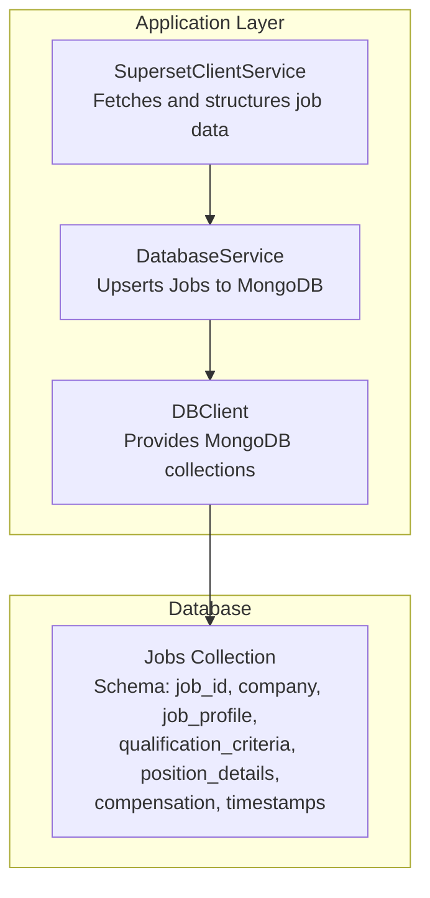
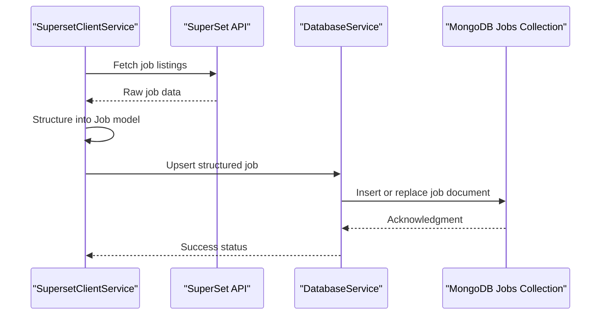
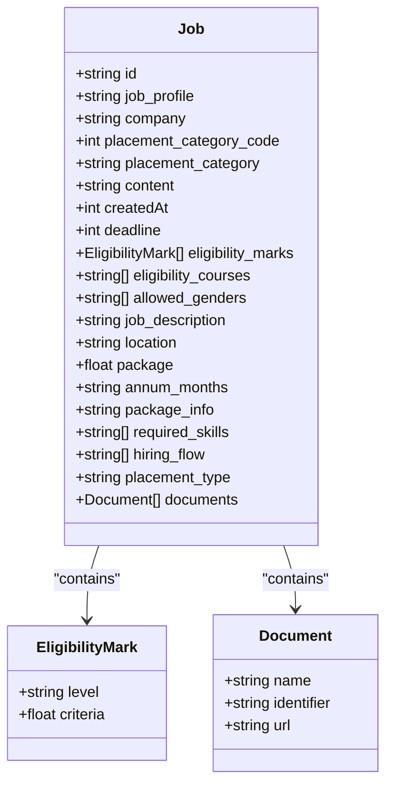
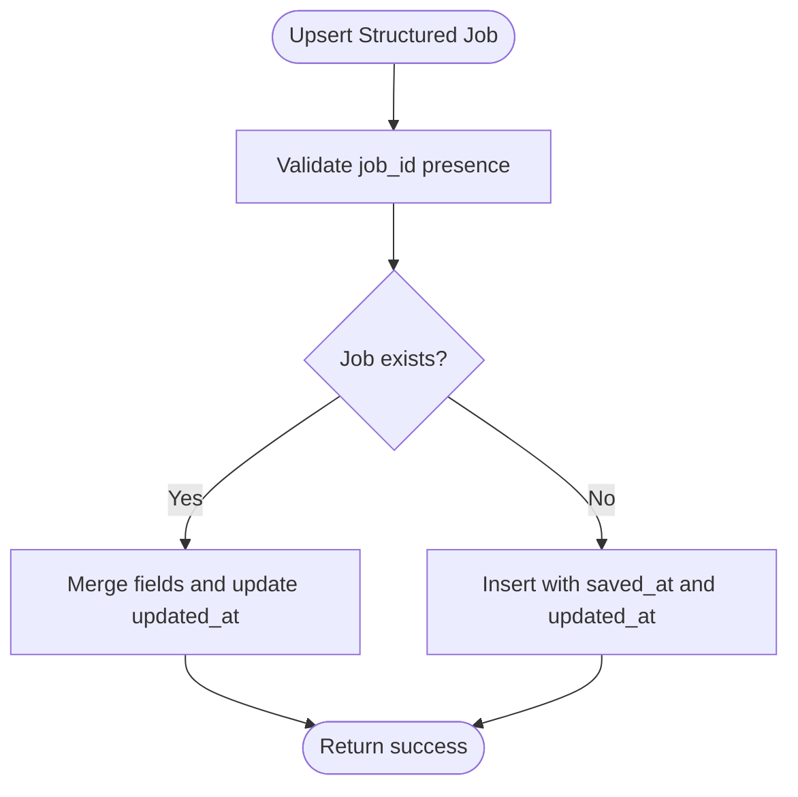
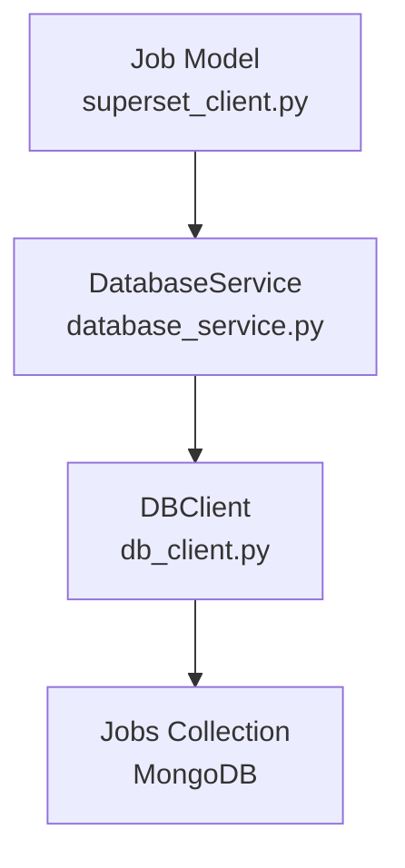

# Jobs Collection

<cite>
**Referenced Files in This Document**
- [superset_client.py](file://app/clients/superset_client.py)
- [database_service.py](file://app/services/database_service.py)
- [db_client.py](file://app/clients/db_client.py)
- [structured_job_listings.json](file://app/data/structured_job_listings.json)
- [placement_offers.json](file://app/data/placement_offers.json)
</cite>

## Table of Contents
1. [Introduction](#introduction)
2. [Project Structure](#project-structure)
3. [Core Components](#core-components)
4. [Architecture Overview](#architecture-overview)
5. [Detailed Component Analysis](#detailed-component-analysis)
6. [Dependency Analysis](#dependency-analysis)
7. [Performance Considerations](#performance-considerations)
8. [Troubleshooting Guide](#troubleshooting-guide)
9. [Conclusion](#conclusion)

## Introduction
This document defines the Jobs collection schema used to store structured job profile data extracted from the SuperSet portal. It explains the job_id unique identifier field and its relationship to MongoDB's ObjectId, details the company and job_profile fields, job_description content storage, and the qualification_criteria embedded structure containing min_cgpa threshold, branches array, and batch_years array. It also covers the position_details structure with total_positions, job_location, and job_type enumeration, the compensation embedded document with base_salary, bonus, and currency fields, and timestamps for application_deadline, posted_at, and metadata timestamps. Validation rules, array field requirements, and example documents are provided to illustrate different job types and qualification criteria combinations.

## Project Structure
The Jobs collection is part of the MongoDB database managed by the application. The schema is defined in the client layer and persisted through the database service.

**Diagram sources**
- [superset_client.py](file://app/clients/superset_client.py#L63-L86)
- [database_service.py](file://app/services/database_service.py#L229-L257)
- [db_client.py](file://app/clients/db_client.py#L56-L56)

**Section sources**
- [superset_client.py](file://app/clients/superset_client.py#L63-L86)
- [database_service.py](file://app/services/database_service.py#L229-L257)
- [db_client.py](file://app/clients/db_client.py#L56-L56)

## Core Components
The Jobs collection schema is defined by the Job model and stored in MongoDB. The schema fields and their types are derived from the Job model and verified against sample data.

- job_id: String (unique identifier for the job)
- company: String
- job_profile: String
- qualification_criteria: Embedded document with:
  - min_cgpa: Number (float)
  - branches: Array of strings
  - batch_years: Array of numbers
- position_details: Embedded document with:
  - total_positions: Number
  - job_location: String
  - job_type: Enumerated string
- compensation: Embedded document with:
  - base_salary: Number
  - bonus: Number
  - currency: String
- application_deadline: Number (epoch milliseconds)
- posted_at: Number (epoch milliseconds)
- metadata timestamps: saved_at, updated_at

Validation rules and array requirements:
- Arrays must not be empty for branches and batch_years
- Minimally one of min_cgpa, branches, or batch_years must be specified
- job_type must be one of the enumerated values
- application_deadline must be greater than posted_at if both are present

**Section sources**
- [superset_client.py](file://app/clients/superset_client.py#L63-L86)
- [structured_job_listings.json](file://app/data/structured_job_listings.json#L1-L800)

## Architecture Overview
The Jobs collection is populated by extracting job data from SuperSet, structuring it into the Job model, and persisting it to MongoDB via the DatabaseService.

**Diagram sources**
- [superset_client.py](file://app/clients/superset_client.py#L518-L541)
- [database_service.py](file://app/services/database_service.py#L229-L257)
- [db_client.py](file://app/clients/db_client.py#L56-L56)

## Detailed Component Analysis

### Job Model Definition
The Job model defines the schema for storing job data. It includes identifiers, descriptive fields, embedded qualification criteria, position details, compensation, and timestamps.

**Diagram sources**
- [superset_client.py](file://app/clients/superset_client.py#L48-L86)

**Section sources**
- [superset_client.py](file://app/clients/superset_client.py#L48-L86)

### Jobs Collection Schema
The Jobs collection schema is derived from the Job model and validated against sample data. The schema includes the following fields:

- job_id (String): Unique identifier for the job
- company (String): Name of the company
- job_profile (String): Title of the job
- qualification_criteria (Embedded Document):
  - min_cgpa (Number): Minimum cumulative grade point average
  - branches (Array of Strings): Eligible academic branches
  - batch_years (Array of Numbers): Eligible batch years
- position_details (Embedded Document):
  - total_positions (Number): Total number of positions
  - job_location (String): Location of the job
  - job_type (Enumerated String): Type of job (e.g., full-time, internship)
- compensation (Embedded Document):
  - base_salary (Number): Base salary amount
  - bonus (Number): Bonus amount
  - currency (String): Currency code
- application_deadline (Number): Application deadline in epoch milliseconds
- posted_at (Number): Posted timestamp in epoch milliseconds
- metadata timestamps:
  - saved_at (Number): Timestamp when the document was saved
  - updated_at (Number): Timestamp when the document was last updated

Validation rules:
- Arrays branches and batch_years must not be empty
- At least one of min_cgpa, branches, or batch_years must be specified
- job_type must be one of the enumerated values
- application_deadline must be greater than posted_at if both are present

**Section sources**
- [superset_client.py](file://app/clients/superset_client.py#L63-L86)
- [structured_job_listings.json](file://app/data/structured_job_listings.json#L1-L800)

### Example Documents
Below are example documents illustrating different job types and qualification criteria combinations:

Example 1: Full-time job with CGPA threshold and branch eligibility
{
  "job_id": "7d7dd5e9-51e6-46b6-a0e2-c8cabf06acdc",
  "company": "Axeno",
  "job_profile": "Software Intern",
  "qualification_criteria": {
    "min_cgpa": 7.0,
    "branches": ["B.Tech - CSE", "M.Tech. - CSE"],
    "batch_years": [2026]
  },
  "position_details": {
    "total_positions": 5,
    "job_location": "Noida",
    "job_type": "full-time"
  },
  "compensation": {
    "base_salary": 600000,
    "bonus": 0,
    "currency": "INR"
  },
  "application_deadline": 1755751008000,
  "posted_at": 1755688649000,
  "metadata": {
    "saved_at": 1755688649000,
    "updated_at": 1755688649000
  }
}

Example 2: Internship with multiple branch eligibility and CGPA thresholds
{
  "job_id": "8c8530ea-07d6-4da1-81a7-595412905513",
  "company": "Oracle Financial Services Software Limited (OFSS)",
  "job_profile": "Associate Consultant",
  "qualification_criteria": {
    "min_cgpa": 7.0,
    "branches": ["M.Tech. - CSE", "B.Tech - IT"],
    "batch_years": [2026]
  },
  "position_details": {
    "total_positions": 10,
    "job_location": "Bengaluru, Mumbai, Pune or Chennai",
    "job_type": "internship"
  },
  "compensation": {
    "base_salary": 982054,
    "bonus": 85100,
    "currency": "INR"
  },
  "application_deadline": null,
  "posted_at": 1755676866000,
  "metadata": {
    "saved_at": 1755676866000,
    "updated_at": 1755676866000
  }
}

Example 3: Remote job with branch and batch eligibility
{
  "job_id": "9b2d06d3-37d7-49ee-92cb-c161f8f6c8c1",
  "company": "Recruit CRM",
  "job_profile": "Customer Success—Associate",
  "qualification_criteria": {
    "min_cgpa": 5.0,
    "branches": ["M.Tech (Integrated) - CSE", "B.Tech - CSE"],
    "batch_years": [2026]
  },
  "position_details": {
    "total_positions": 8,
    "job_location": "Remote",
    "job_type": "full-time"
  },
  "compensation": {
    "base_salary": 800000,
    "bonus": 0,
    "currency": "INR"
  },
  "application_deadline": 1755765057000,
  "posted_at": 1755674049000,
  "metadata": {
    "saved_at": 1755674049000,
    "updated_at": 1755674049000
  }
}

**Section sources**
- [structured_job_listings.json](file://app/data/structured_job_listings.json#L1-L800)

### Data Persistence Flow
The Jobs collection is persisted through the DatabaseService, which handles upsert operations and maintains metadata timestamps.

**Diagram sources**
- [database_service.py](file://app/services/database_service.py#L229-L257)

**Section sources**
- [database_service.py](file://app/services/database_service.py#L229-L257)

## Dependency Analysis
The Jobs collection depends on the Job model and is persisted via the DatabaseService and DBClient.

**Diagram sources**
- [superset_client.py](file://app/clients/superset_client.py#L63-L86)
- [database_service.py](file://app/services/database_service.py#L229-L257)
- [db_client.py](file://app/clients/db_client.py#L56-L56)

**Section sources**
- [superset_client.py](file://app/clients/superset_client.py#L63-L86)
- [database_service.py](file://app/services/database_service.py#L229-L257)
- [db_client.py](file://app/clients/db_client.py#L56-L56)

## Performance Considerations
- Indexing: Create indexes on frequently queried fields such as job_id, company, and job_profile to improve query performance.
- Field Selection: Use projection to limit returned fields when querying large collections.
- Pagination: Implement pagination for listing jobs to avoid loading excessive data.
- Batch Operations: Use bulk write operations when inserting or updating multiple job documents.

## Troubleshooting Guide
Common issues and resolutions:
- Missing job_id: Ensure job_id is present before upserting to avoid errors.
- Duplicate job entries: Use job_id as the unique identifier to prevent duplicates.
- Invalid arrays: Ensure branches and batch_years arrays are not empty and contain valid data.
- Incorrect timestamps: Verify that application_deadline is greater than posted_at if both are present.
- Database connectivity: Confirm MongoDB connection and collection initialization.

**Section sources**
- [database_service.py](file://app/services/database_service.py#L229-L257)
- [db_client.py](file://app/clients/db_client.py#L56-L56)

## Conclusion
The Jobs collection schema provides a structured representation of job profiles extracted from SuperSet, enabling efficient storage, querying, and notification workflows. By adhering to the defined schema and validation rules, the system ensures data consistency and supports robust job posting and filtering capabilities.