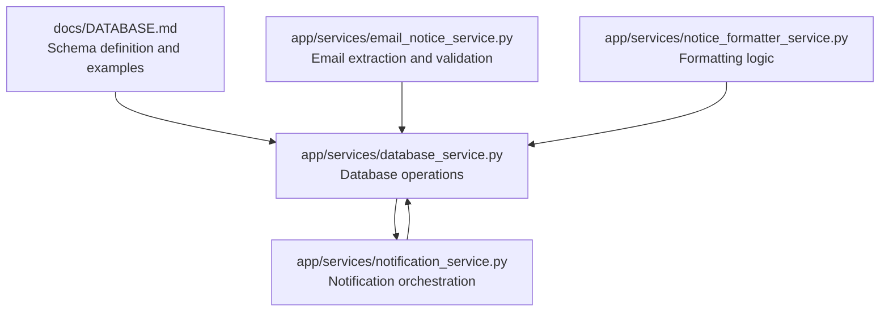
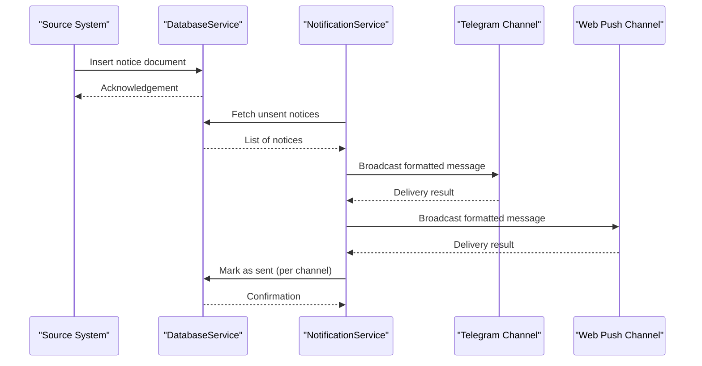
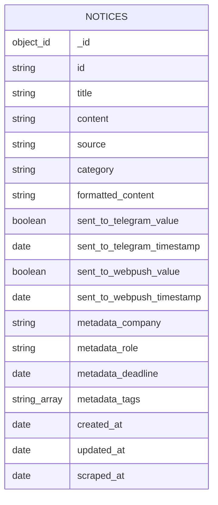
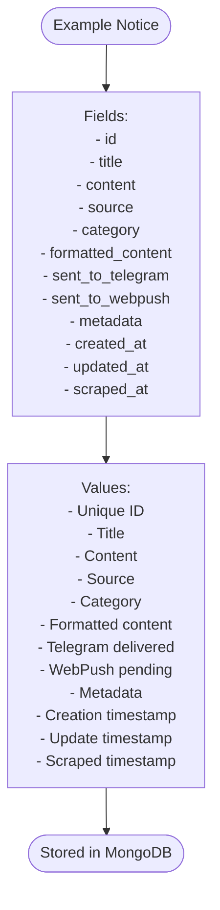
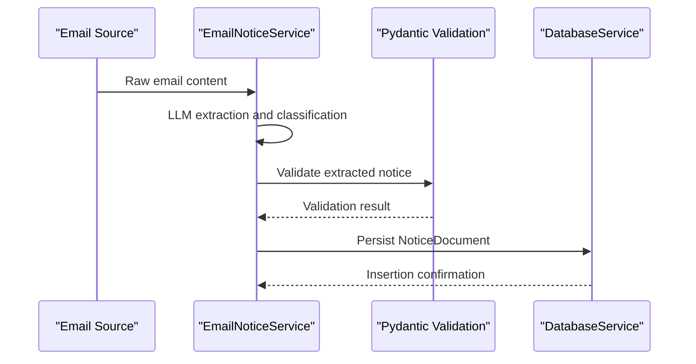
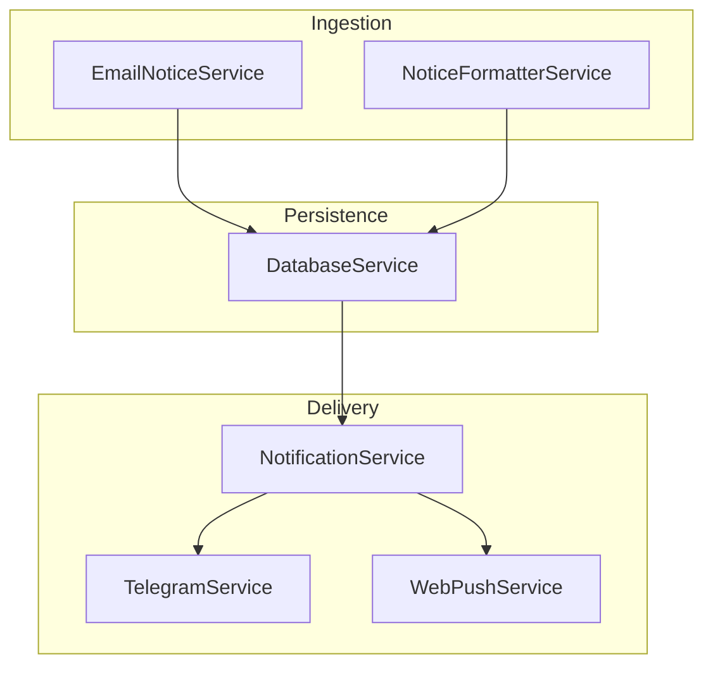

# Notices Collection

<cite>
**Referenced Files in This Document**
- [DATABASE.md](file://docs/DATABASE.md)
- [database_service.py](file://app/services/database_service.py)
- [notification_service.py](file://app/services/notification_service.py)
- [email_notice_service.py](file://app/services/email_notice_service.py)
- [notice_formatter_service.py](file://app/services/notice_formatter_service.py)
- [ARCHITECTURE.md](file://docs/ARCHITECTURE.md)
</cite>

## Table of Contents
1. [Introduction](#introduction)
2. [Project Structure](#project-structure)
3. [Core Components](#core-components)
4. [Architecture Overview](#architecture-overview)
5. [Detailed Component Analysis](#detailed-component-analysis)
6. [Dependency Analysis](#dependency-analysis)
7. [Performance Considerations](#performance-considerations)
8. [Troubleshooting Guide](#troubleshooting-guide)
9. [Conclusion](#conclusion)

## Introduction
This document provides comprehensive documentation for the Notices collection schema in the SuperSet notification system. It explains the complete document structure, including the unique id field (distinct from MongoDB's ObjectId), title and content fields, source enumeration, category taxonomy, nested sent_to_telegram and sent_to_webpush tracking, metadata structure, timestamps, validation rules, and practical examples for different notice types.

## Project Structure
The Notices collection is part of the MongoDB database used by the SuperSet Telegram Notification Bot. The schema and operational flow are defined across documentation and service modules.

**Diagram sources**
- [DATABASE.md](file://docs/DATABASE.md#L32-L96)
- [database_service.py](file://app/services/database_service.py#L16-L46)
- [notification_service.py](file://app/services/notification_service.py#L13-L41)
- [email_notice_service.py](file://app/services/email_notice_service.py#L99-L119)
- [notice_formatter_service.py](file://app/services/notice_formatter_service.py#L217-L246)

**Section sources**
- [DATABASE.md](file://docs/DATABASE.md#L32-L96)
- [database_service.py](file://app/services/database_service.py#L16-L46)

## Core Components
- Notices collection schema with required and optional fields
- Source enumeration and category taxonomy
- Nested delivery tracking objects
- Metadata fields for enrichment
- Timestamps for lifecycle tracking
- Validation rules enforced by extraction and database services

**Section sources**
- [DATABASE.md](file://docs/DATABASE.md#L36-L65)
- [email_notice_service.py](file://app/services/email_notice_service.py#L99-L119)
- [database_service.py](file://app/services/database_service.py#L80-L105)

## Architecture Overview
The Notices collection participates in a multi-stage pipeline: scraping/ingestion, classification and formatting, persistence, and notification dispatch.

**Diagram sources**
- [database_service.py](file://app/services/database_service.py#L116-L148)
- [notification_service.py](file://app/services/notification_service.py#L93-L167)

**Section sources**
- [ARCHITECTURE.md](file://docs/ARCHITECTURE.md#L399-L414)
- [database_service.py](file://app/services/database_service.py#L116-L148)
- [notification_service.py](file://app/services/notification_service.py#L93-L167)

## Detailed Component Analysis

### Document Schema Definition
The Notices collection schema defines the structure and semantics of notice documents stored in MongoDB.

**Diagram sources**
- [DATABASE.md](file://docs/DATABASE.md#L36-L65)

Fields and semantics:
- _id: MongoDB auto-generated ObjectId
- id: Unique notice identifier (must be unique)
- title: Notice title
- content: Full notice content
- source: Enumeration of 'superset', 'email', or 'official'
- category: Taxonomy of 'announcement', 'job_posting', 'shortlisting', 'internship_noc', 'hackathon', 'webinar', 'update'
- formatted_content: Formatted version for display
- sent_to_telegram: Nested object with value (boolean) and timestamp (date)
- sent_to_webpush: Nested object with value (boolean) and timestamp (date)
- metadata: Optional enrichment fields including company, role, deadline, and tags
- created_at, updated_at, scraped_at: Timestamps for lifecycle tracking

**Section sources**
- [DATABASE.md](file://docs/DATABASE.md#L36-L65)

### Validation Rules and Required Fields
Validation is enforced at ingestion and persistence layers:
- Required fields for successful insertion:
  - id
  - title
  - content
  - source
  - category
  - created_at
  - updated_at
- Optional fields:
  - formatted_content
  - sent_to_telegram (value, timestamp)
  - sent_to_webpush (value, timestamp)
  - metadata (company, role, deadline, tags)
  - scraped_at

Behavioral constraints:
- Unique constraint on id
- Delivery tracking uses nested boolean flags with timestamps
- Metadata fields are optional and can be omitted

**Section sources**
- [database_service.py](file://app/services/database_service.py#L80-L105)
- [DATABASE.md](file://docs/DATABASE.md#L96-L97)

### Source Enumeration and Category Taxonomy
- Source values: 'superset', 'email', 'official'
- Category values: 'announcement', 'job_posting', 'shortlisting', 'internship_noc', 'hackathon', 'webinar', 'update'

These enumerations guide downstream processing and filtering.

**Section sources**
- [DATABASE.md](file://docs/DATABASE.md#L43-L45)
- [notice_formatter_service.py](file://app/services/notice_formatter_service.py#L217-L246)

### Delivery Tracking Objects
Each channel maintains a nested object with:
- value: boolean flag indicating whether the notice was sent
- timestamp: date when the notice was marked as sent

Queries commonly filter notices where either channel's value is false to determine pending sends.

**Section sources**
- [DATABASE.md](file://docs/DATABASE.md#L47-L54)
- [database_service.py](file://app/services/database_service.py#L116-L129)

### Metadata Enrichment
Metadata supports filtering and presentation:
- company: Optional company name
- role: Optional job role
- deadline: Optional application deadline
- tags: Optional array of tags for categorization

**Section sources**
- [DATABASE.md](file://docs/DATABASE.md#L55-L60)

### Timestamps and Lifecycle
Timestamps track document lifecycle:
- created_at: When the notice was first created
- updated_at: When the notice was last updated
- scraped_at: When the notice was scraped from the source

**Section sources**
- [DATABASE.md](file://docs/DATABASE.md#L61-L64)

### Example Documents
The schema documentation includes a realistic example showing a job posting with metadata and delivery tracking.

**Diagram sources**
- [DATABASE.md](file://docs/DATABASE.md#L67-L94)

**Section sources**
- [DATABASE.md](file://docs/DATABASE.md#L67-L94)

### Extraction and Validation Pipeline
Email-derived notices are extracted and validated before persistence:
- LLM-based extraction produces structured notice data
- Validation ensures required fields and type correctness
- On success, the notice is transformed into the database-ready schema

**Diagram sources**
- [email_notice_service.py](file://app/services/email_notice_service.py#L532-L568)
- [email_notice_service.py](file://app/services/email_notice_service.py#L99-L119)
- [database_service.py](file://app/services/database_service.py#L80-L105)

**Section sources**
- [email_notice_service.py](file://app/services/email_notice_service.py#L532-L568)
- [email_notice_service.py](file://app/services/email_notice_service.py#L99-L119)
- [database_service.py](file://app/services/database_service.py#L80-L105)

## Dependency Analysis
The Notices collection interacts with multiple services across ingestion, validation, persistence, and notification.

**Diagram sources**
- [email_notice_service.py](file://app/services/email_notice_service.py#L99-L119)
- [notice_formatter_service.py](file://app/services/notice_formatter_service.py#L217-L246)
- [database_service.py](file://app/services/database_service.py#L16-L46)
- [notification_service.py](file://app/services/notification_service.py#L13-L41)

**Section sources**
- [database_service.py](file://app/services/database_service.py#L16-L46)
- [notification_service.py](file://app/services/notification_service.py#L13-L41)

## Performance Considerations
- Indexing strategy for efficient queries on id, sent flags, and timestamps
- Limiting retrieval of notices to reduce memory footprint
- Batch operations for bulk updates and inserts
- Caching frequently accessed metadata for reduced database load

[No sources needed since this section provides general guidance]

## Troubleshooting Guide
Common issues and resolutions:
- Duplicate id errors: Ensure uniqueness of the id field before insertion
- Missing required fields: Validate presence of id, title, content, source, category, created_at, updated_at
- Delivery tracking anomalies: Verify nested boolean flags and timestamps for each channel
- Querying unsent notices: Use appropriate filters on sent_to_telegram and sent_to_webpush

**Section sources**
- [database_service.py](file://app/services/database_service.py#L56-L68)
- [database_service.py](file://app/services/database_service.py#L116-L129)
- [database_service.py](file://app/services/database_service.py#L135-L148)

## Conclusion
The Notices collection schema provides a robust foundation for storing diverse notice types across multiple sources. Its design balances flexibility with strong constraints, enabling reliable ingestion, validation, persistence, and delivery. Adhering to the documented fields, enumerations, and validation rules ensures consistent operation across the notification pipeline.