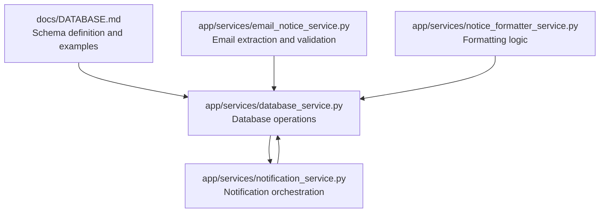
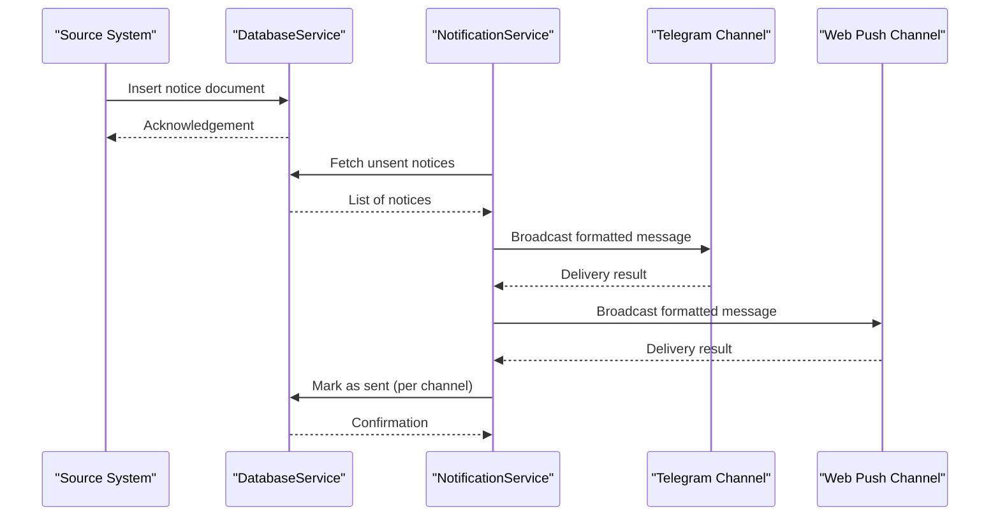
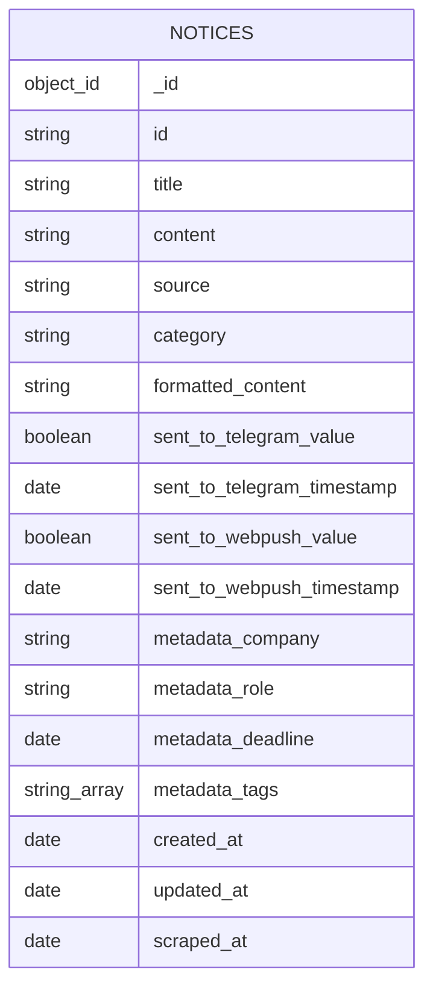
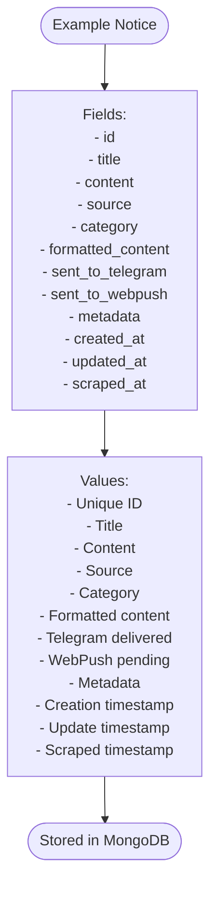
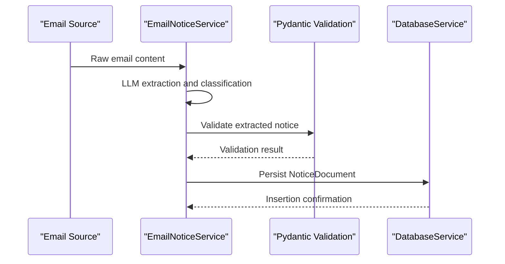
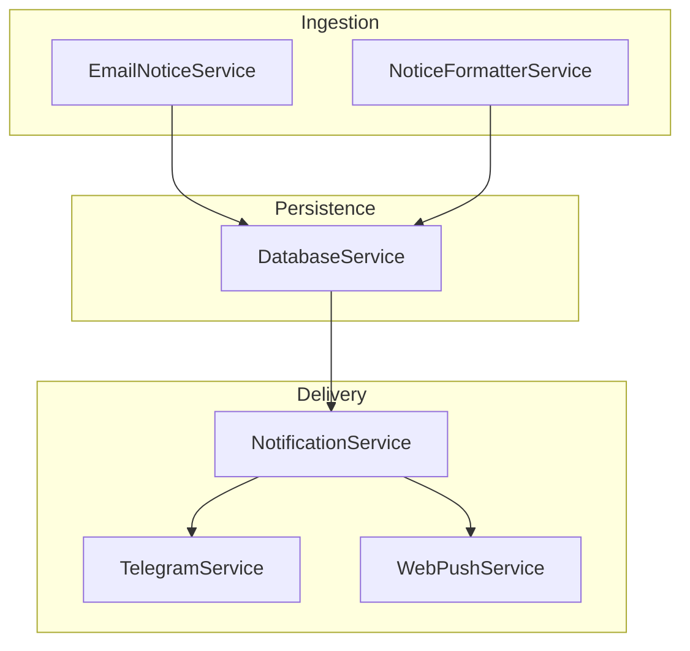

# Notices collection

## Introduction
This page provides detailed documentation for the Notices collection schema in the SuperSet notification system. It explains the complete document structure, including the unique id field (distinct from MongoDB's ObjectId), title and content fields, source enumeration, category taxonomy, nested sent_to_telegram and sent_to_webpush tracking, metadata structure, timestamps, validation rules, and practical examples for different notice types.

## Project structure
The Notices collection is part of the MongoDB database used by the SuperSet Telegram Notification Bot. The schema and operational flow are defined across documentation and service modules.

```mermaid
graph TB
Docs["docs/DATABASE.md<br/>Schema definition and examples"]
DB["app/services/database_service.py<br/>Database operations"]
Notify["app/services/notification_service.py<br/>Notification orchestration"]
Email["app/services/email_notice_service.py<br/>Email extraction and validation"]
Format["app/services/notice_formatter_service.py<br/>Formatting logic"]
Docs --> DB
DB --> Notify
Email --> DB
Format --> DB
Notify --> DB
```

## Core components
- Notices collection schema with required and optional fields
- Source enumeration and category taxonomy
- Nested delivery tracking objects
- Metadata fields for enrichment
- Timestamps for lifecycle tracking
- Validation rules enforced by extraction and database services

## Architecture overview
The Notices collection participates in a multi-stage pipeline: scraping/ingestion, classification and formatting, persistence, and notification dispatch.

```mermaid
sequenceDiagram
participant Source as "Source System"
participant DB as "DatabaseService"
participant Notifier as "NotificationService"
participant Telegram as "Telegram Channel"
participant WebPush as "Web Push Channel"
Source->>DB : Insert notice document
DB-->>Source : Acknowledgement
Notifier->>DB : Fetch unsent notices
DB-->>Notifier : List of notices
Notifier->>Telegram : Broadcast formatted message
Telegram-->>Notifier : Delivery result
Notifier->>WebPush : Broadcast formatted message
WebPush-->>Notifier : Delivery result
Notifier->>DB : Mark as sent (per channel)
DB-->>Notifier : Confirmation
```

## Detailed component analysis

### Document schema definition
The Notices collection schema defines the structure and semantics of notice documents stored in MongoDB.

```mermaid
erDiagram
NOTICES {
object_id _id
string id
string title
string content
string source
string category
string formatted_content
boolean sent_to_telegram_value
date sent_to_telegram_timestamp
boolean sent_to_webpush_value
date sent_to_webpush_timestamp
string metadata_company
string metadata_role
date metadata_deadline
string_array metadata_tags
date created_at
date updated_at
date scraped_at
}
```

Fields and semantics:
- _id: MongoDB auto-generated ObjectId
- id: Unique notice identifier (must be unique)
- title: Notice title
- content: Full notice content
- source: Enumeration of 'superset', 'email', or 'official'
- category: Taxonomy of 'announcement', 'job_posting', 'shortlisting', 'internship_noc', 'hackathon', 'webinar', 'update'
- formatted_content: Formatted version for display
- sent_to_telegram: Nested object with value (boolean) and timestamp (date)
- sent_to_webpush: Nested object with value (boolean) and timestamp (date)
- metadata: Optional enrichment fields including company, role, deadline, and tags
- created_at, updated_at, scraped_at: Timestamps for lifecycle tracking

### Validation rules and required fields
Validation is enforced at ingestion and persistence layers:
- Required fields for successful insertion:
  - id
  - title
  - content
  - source
  - category
  - created_at
  - updated_at
- Optional fields:
  - formatted_content
  - sent_to_telegram (value, timestamp)
  - sent_to_webpush (value, timestamp)
  - metadata (company, role, deadline, tags)
  - scraped_at

Behavioral constraints:
- Unique constraint on id
- Delivery tracking uses nested boolean flags with timestamps
- Metadata fields are optional and can be omitted

### Source enumeration and category taxonomy
- Source values: 'superset', 'email', 'official'
- Category values: 'announcement', 'job_posting', 'shortlisting', 'internship_noc', 'hackathon', 'webinar', 'update'

These enumerations guide downstream processing and filtering.

### Delivery tracking objects
Each channel maintains a nested object with:
- value: boolean flag indicating whether the notice was sent
- timestamp: date when the notice was marked as sent

Queries commonly filter notices where either channel's value is false to determine pending sends.

### Metadata enrichment
Metadata supports filtering and presentation:
- company: Optional company name
- role: Optional job role
- deadline: Optional application deadline
- tags: Optional array of tags for categorization

### Timestamps and lifecycle
Timestamps track document lifecycle:
- created_at: When the notice was first created
- updated_at: When the notice was last updated
- scraped_at: When the notice was scraped from the source

### Example documents
The schema documentation includes a realistic example showing a job posting with metadata and delivery tracking.

```mermaid
flowchart TD
Start(["Example Notice"]) --> Fields["Fields:<br/>- id<br/>- title<br/>- content<br/>- source<br/>- category<br/>- formatted_content<br/>- sent_to_telegram<br/>- sent_to_webpush<br/>- metadata<br/>- created_at<br/>- updated_at<br/>- scraped_at"]
Fields --> Values["Values:<br/>- Unique ID<br/>- Title<br/>- Content<br/>- Source<br/>- Category<br/>- Formatted content<br/>- Telegram delivered<br/>- WebPush pending<br/>- Metadata<br/>- Creation timestamp<br/>- Update timestamp<br/>- Scraped timestamp"]
Values --> End(["Stored in MongoDB"])
```

### Extraction and validation pipeline
Email-derived notices are extracted and validated before persistence:
- LLM-based extraction produces structured notice data
- Validation ensures required fields and type correctness
- On success, the notice is transformed into the database-ready schema

```mermaid
sequenceDiagram
participant Email as "Email Source"
participant Extractor as "EmailNoticeService"
participant Validator as "Pydantic Validation"
participant DB as "DatabaseService"
Email->>Extractor : Raw email content
Extractor->>Extractor : LLM extraction and classification
Extractor->>Validator : Validate extracted notice
Validator-->>Extractor : Validation result
Extractor->>DB : Persist NoticeDocument
DB-->>Extractor : Insertion confirmation
```

## Dependency analysis
The Notices collection interacts with multiple services across ingestion, validation, persistence, and notification.

```mermaid
graph TB
subgraph "Ingestion"
EmailSvc["EmailNoticeService"]
Formatter["NoticeFormatterService"]
end
subgraph "Persistence"
DB["DatabaseService"]
end
subgraph "Delivery"
Notify["NotificationService"]
Telegram["TelegramService"]
WebPush["WebPushService"]
end
EmailSvc --> DB
Formatter --> DB
DB --> Notify
Notify --> Telegram
Notify --> WebPush
```

## Performance considerations
- Indexing strategy for efficient queries on id, sent flags, and timestamps
- Limiting retrieval of notices to reduce memory footprint
- Batch operations for bulk updates and inserts
- Caching frequently accessed metadata for reduced database load

[No sources needed since this section provides general guidance]

## Troubleshooting guide
Common issues and resolutions:
- Duplicate id errors: Ensure uniqueness of the id field before insertion
- Missing required fields: Validate presence of id, title, content, source, category, created_at, updated_at
- Delivery tracking anomalies: Verify nested boolean flags and timestamps for each channel
- Querying unsent notices: Use appropriate filters on sent_to_telegram and sent_to_webpush

## Conclusion
The Notices collection schema provides a reliable foundation for storing diverse notice types across multiple sources. Its design balances flexibility with strong constraints, enabling reliable ingestion, validation, persistence, and delivery. Adhering to the documented fields, enumerations, and validation rules ensures consistent operation across the notification pipeline.
