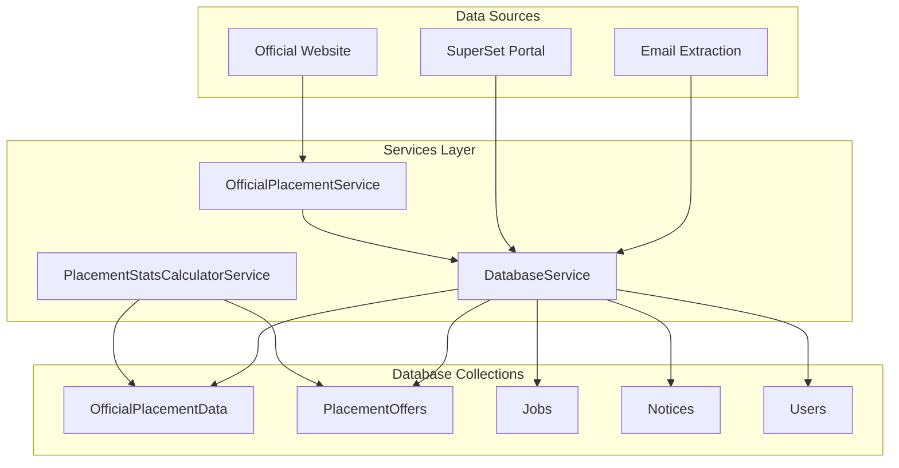
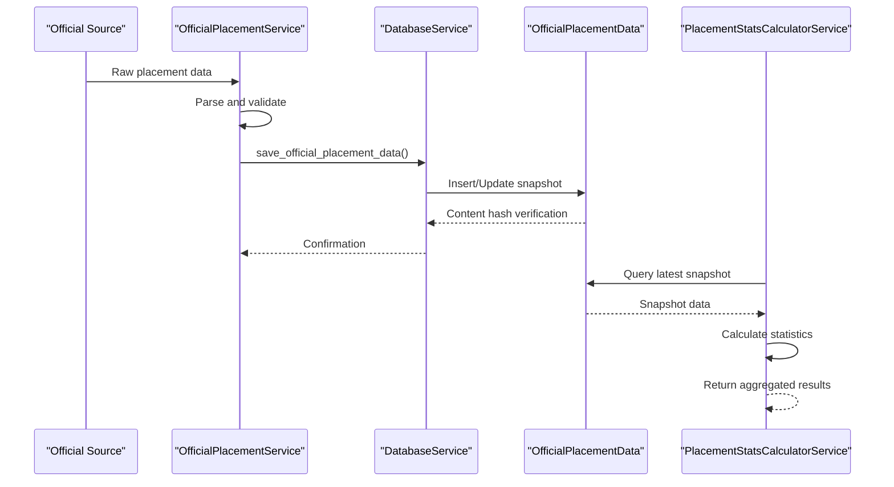
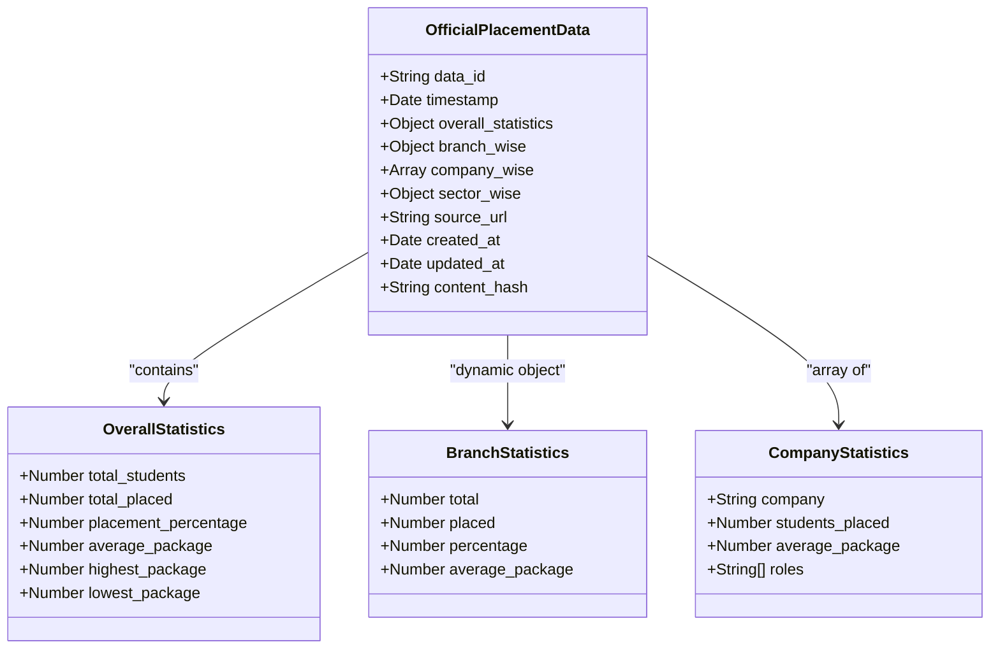
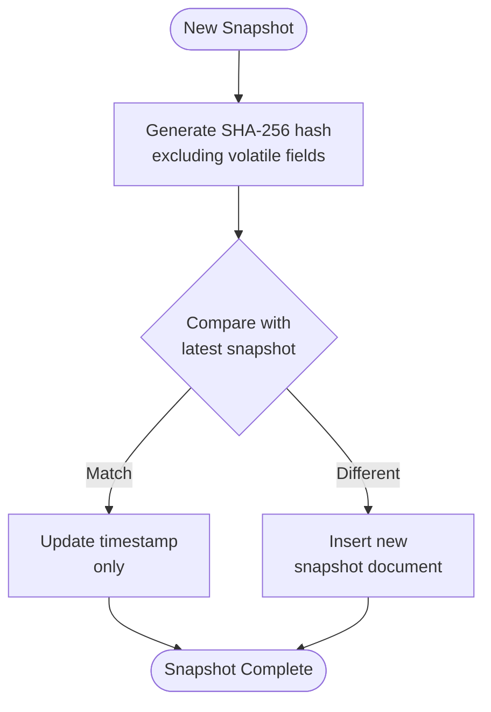
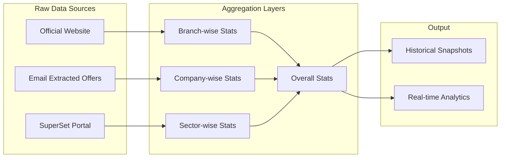
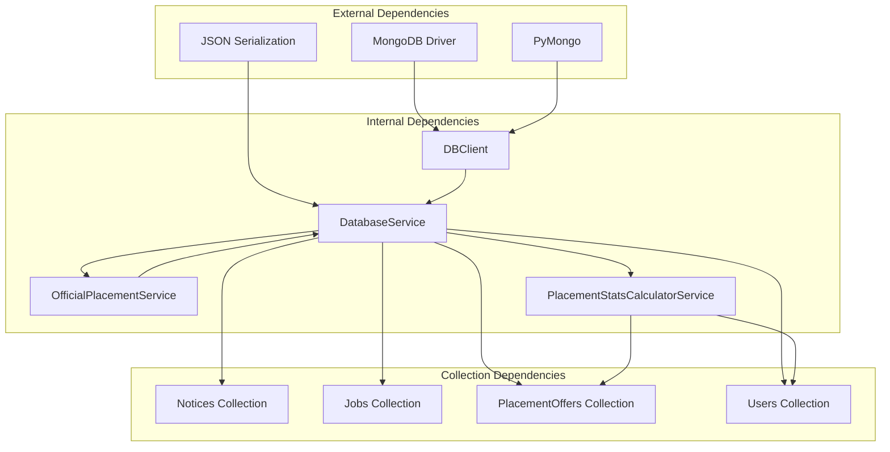

# OfficialPlacementData Collection

<cite>
**Referenced Files in This Document**
- [DATABASE.md](file://docs/DATABASE.md)
- [db_client.py](file://app/clients/db_client.py)
- [database_service.py](file://app/services/database_service.py)
- [official_placement_service.py](file://app/services/official_placement_service.py)
- [placement_stats_calculator_service.py](file://app/services/placement_stats_calculator_service.py)
- [placement_offers.json](file://app/data/placement_offers.json)
- [structured_job_listings.json](file://app/data/structured_job_listings.json)
</cite>

## Table of Contents
1. [Introduction](#introduction)
2. [Project Structure](#project-structure)
3. [Core Components](#core-components)
4. [Architecture Overview](#architecture-overview)
5. [Detailed Component Analysis](#detailed-component-analysis)
6. [Dependency Analysis](#dependency-analysis)
7. [Performance Considerations](#performance-considerations)
8. [Troubleshooting Guide](#troubleshooting-guide)
9. [Conclusion](#conclusion)
10. [Appendices](#appendices)

## Introduction
This document provides comprehensive documentation for the OfficialPlacementData collection schema that stores aggregated placement statistics from official sources. The collection serves as a historical snapshot repository for placement data, enabling trend analysis, comparison across time periods, and reporting on placement outcomes.

The schema supports flexible aggregation of placement metrics while accommodating varying statistical data from different official sources. It includes unique identifiers for snapshots, timestamp tracking, overall statistics, branch-wise distributions, company-wise breakdowns, sector-wise statistics, and source tracking.

## Project Structure
The OfficialPlacementData collection is part of the MongoDB database schema for the SuperSet Telegram Notification Bot system. It integrates with the broader data pipeline that includes notices, jobs, placement offers, and user management collections.



**Diagram sources**
- [db_client.py](file://app/clients/db_client.py#L55-L60)
- [database_service.py](file://app/services/database_service.py#L38-L44)
- [official_placement_service.py](file://app/services/official_placement_service.py#L81-L105)

**Section sources**
- [DATABASE.md](file://docs/DATABASE.md#L331-L424)
- [db_client.py](file://app/clients/db_client.py#L55-L60)

## Core Components
The OfficialPlacementData collection schema consists of several key components that work together to provide comprehensive placement statistics:

### Unique Identifiers and Timestamp Tracking
- **data_id**: Unique identifier for each snapshot, enabling deduplication and versioning
- **timestamp**: ISODate field for precise temporal tracking of snapshots
- **content_hash**: SHA-256 hash of content (excluding volatile fields) for automatic change detection

### Overall Statistics
Embedded document containing comprehensive placement metrics:
- total_students: Total student population
- total_placed: Number of students placed
- placement_percentage: Calculated placement rate
- average_package: Mean package across all placed students
- highest_package: Maximum package offered
- lowest_package: Minimum package offered

### Branch-Wise Statistics
Dynamic embedded object structure allowing branch-specific statistics:
- Branch keys: CSE, ECE, IT, BT, Intg. MTech
- Each branch contains: total, placed, percentage, average_package
- Supports flexible branch additions without schema changes

### Company-Wise Statistics
Array of embedded documents for company-level breakdown:
- company: Company name
- students_placed: Count of students placed
- average_package: Mean package per company
- roles: Array of distinct roles offered

### Sector-Wise Statistics
Dynamic embedded object for industry sector breakdown:
- Sector keys: IT, Finance, Consulting, etc.
- Values: Count of placements per sector
- Enables industry trend analysis

### Metadata and Source Tracking
- source_url: URL of the official source
- created_at: Document creation timestamp
- updated_at: Last modification timestamp

**Section sources**
- [DATABASE.md](file://docs/DATABASE.md#L335-L372)

## Architecture Overview
The OfficialPlacementData collection participates in a multi-layered architecture that transforms raw placement data into actionable insights:



**Diagram sources**
- [official_placement_service.py](file://app/services/official_placement_service.py#L375-L422)
- [database_service.py](file://app/services/database_service.py#L443-L484)
- [placement_stats_calculator_service.py](file://app/services/placement_stats_calculator_service.py#L708-L800)

## Detailed Component Analysis

### Data Model Structure
The OfficialPlacementData schema employs a flexible, denormalized design optimized for read-heavy analytics workloads:



**Diagram sources**
- [DATABASE.md](file://docs/DATABASE.md#L335-L372)

### Snapshot Management and Versioning
The collection implements sophisticated snapshot management through content hashing:



**Diagram sources**
- [database_service.py](file://app/services/database_service.py#L455-L481)

### Statistical Aggregation Pipeline
The system supports comprehensive statistical analysis through multiple aggregation layers:



**Diagram sources**
- [placement_stats_calculator_service.py](file://app/services/placement_stats_calculator_service.py#L575-L676)

**Section sources**
- [DATABASE.md](file://docs/DATABASE.md#L335-L424)
- [database_service.py](file://app/services/database_service.py#L443-L484)
- [placement_stats_calculator_service.py](file://app/services/placement_stats_calculator_service.py#L575-L800)

## Dependency Analysis
The OfficialPlacementData collection has well-defined dependencies within the system architecture:



**Diagram sources**
- [db_client.py](file://app/clients/db_client.py#L1-L104)
- [database_service.py](file://app/services/database_service.py#L16-L46)

### Data Flow Dependencies
The collection participates in several data flow patterns:

1. **Scraping Pipeline**: OfficialPlacementService → DatabaseService → OfficialPlacementData
2. **Analytics Pipeline**: PlacementStatsCalculatorService → Query → OfficialPlacementData
3. **Notification Pipeline**: DatabaseService → Real-time Updates → External Systems

**Section sources**
- [db_client.py](file://app/clients/db_client.py#L55-L60)
- [database_service.py](file://app/services/database_service.py#L38-L44)

## Performance Considerations
The OfficialPlacementData collection is optimized for analytical workloads with several performance-enhancing features:

### Indexing Strategy
- **Unique Index**: `{ data_id: 1 }` for fast snapshot lookup and deduplication
- **Time-based Index**: `{ timestamp: -1 }` for efficient chronological queries
- **Composite Indexes**: Support for common query patterns in analytics

### Storage Optimization
- **Flexible Schema**: Dynamic embedded objects reduce need for joins
- **Content Hashing**: Prevents duplicate snapshots and reduces storage overhead
- **Denormalized Design**: Optimizes read performance for analytical queries

### Query Performance
- **Projection Support**: Efficient field selection for partial document retrieval
- **Aggregation Pipeline**: Built-in support for complex statistical calculations
- **Caching Strategy**: TTL-based caching for frequently accessed snapshots

## Troubleshooting Guide

### Common Issues and Solutions

#### Snapshot Duplication Prevention
**Problem**: Duplicate snapshots being inserted
**Solution**: Verify content_hash calculation excludes volatile fields
**Detection**: Compare content_hash values across snapshots

#### Index Performance Issues
**Problem**: Slow queries on timestamp-based filters
**Solution**: Ensure `{ timestamp: -1 }` index exists and is properly maintained
**Monitoring**: Use `explain()` to analyze query plans

#### Memory Usage Concerns
**Problem**: High memory consumption during statistical calculations
**Solution**: Implement pagination for large dataset queries
**Optimization**: Use projection to limit returned fields

#### Data Integrity Validation
**Problem**: Inconsistent statistical calculations
**Solution**: Validate branch resolution logic and enrollment number parsing
**Verification**: Cross-check calculations against raw data sources

**Section sources**
- [database_service.py](file://app/services/database_service.py#L455-L481)
- [placement_stats_calculator_service.py](file://app/services/placement_stats_calculator_service.py#L220-L271)

## Conclusion
The OfficialPlacementData collection schema provides a robust foundation for storing and analyzing placement statistics from official sources. Its flexible design accommodates varying statistical data while maintaining performance and data integrity. The schema supports comprehensive analytics through multiple aggregation layers and enables efficient historical trend analysis.

Key strengths include:
- Flexible schema design supporting dynamic statistical data
- Sophisticated snapshot management with content hashing
- Comprehensive statistical aggregation capabilities
- Optimized indexing for analytical workloads
- Integration with the broader data ecosystem

The collection serves as a critical component in the SuperSet Telegram Notification Bot's data infrastructure, enabling data-driven decision making and comprehensive placement analytics.

## Appendices

### Example Documents

#### Basic Snapshot Structure
```javascript
{
  _id: ObjectId("..."),
  data_id: "official_2025_01_20",
  timestamp: ISODate("2025-01-20T00:00:00Z"),
  overall_statistics: {
    total_students: 500,
    total_placed: 450,
    placement_percentage: 90,
    average_package: 15.5,
    highest_package: 45.0,
    lowest_package: 8.0
  },
  branch_wise: {
    "CSE": {
      total: 200,
      placed: 190,
      percentage: 95,
      average_package: 18.0
    }
  },
  company_wise: [
    {
      company: "Google",
      students_placed: 45,
      average_package: 24.0,
      roles: ["Software Engineer", "Data Engineer"]
    }
  ],
  sector_wise: {
    "IT": 150,
    "Finance": 120
  },
  source_url: "https://jiit.ac.in/placement",
  created_at: ISODate("2025-01-20T06:30:00Z"),
  updated_at: ISODate("2025-01-20T06:30:00Z")
}
```

### Query Patterns

#### Latest Snapshot Retrieval
```javascript
db.OfficialPlacementData.findOne(
  { timestamp: { $gt: new Date(Date.now() - 24*60*60*1000) } },
  { "branch_wise": 1 }
)
```

#### Historical Trend Analysis
```javascript
db.OfficialPlacementData.find().sort({ timestamp: 1 })
```

#### Branch-wise Comparison
```javascript
db.OfficialPlacementData.aggregate([
  { $unwind: "$branch_wise" },
  { $group: { _id: "$branch_wise.branch", avg_package: { $avg: "$branch_wise.average_package" } } }
])
```

**Section sources**
- [DATABASE.md](file://docs/DATABASE.md#L374-L419)
- [DATABASE.md](file://docs/DATABASE.md#L535-L540)