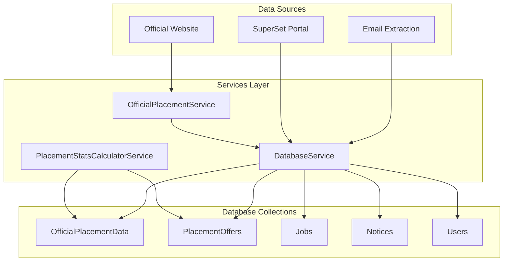
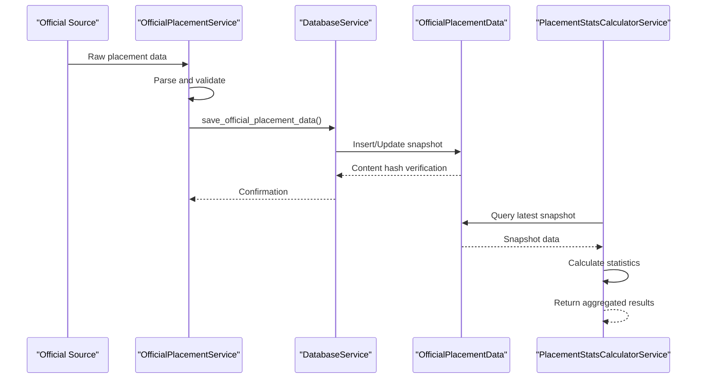
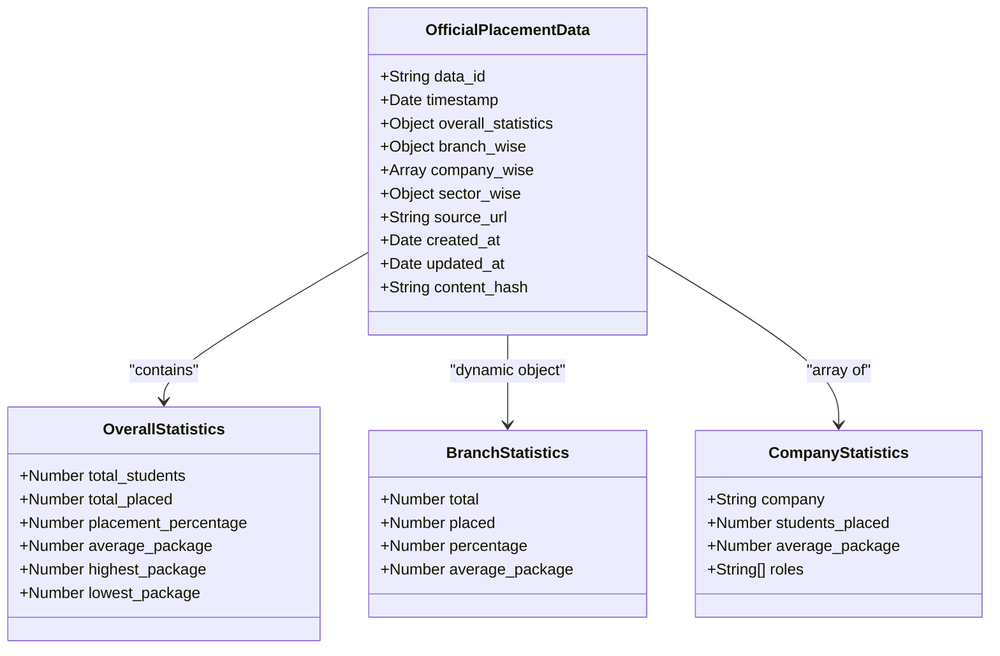
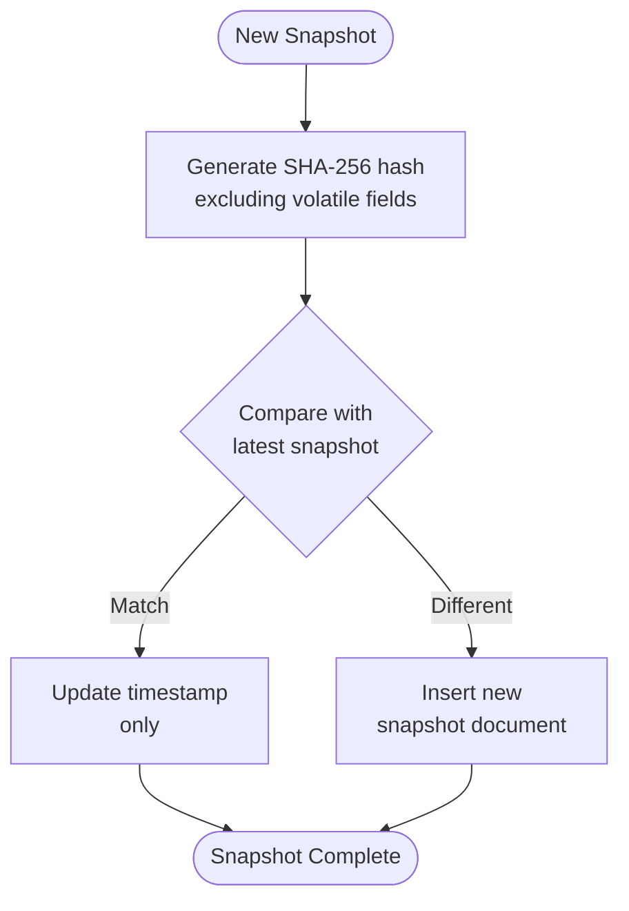
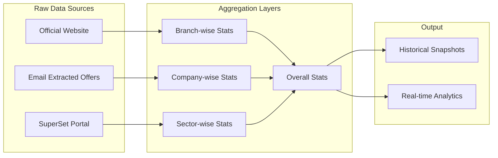
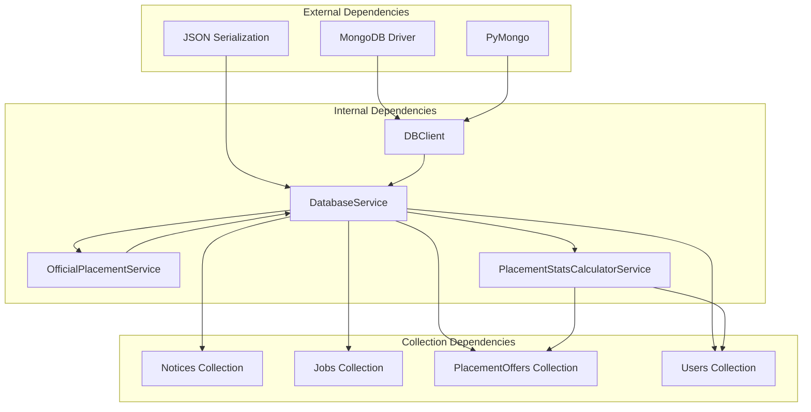

# OfficialPlacementData collection

## Introduction
This page provides detailed documentation for the OfficialPlacementData collection schema that stores aggregated placement statistics from official sources. The collection is a historical snapshot repository for placement data, enabling trend analysis, comparison across time periods, and reporting on placement outcomes.

The schema supports flexible aggregation of placement metrics while accommodating varying statistical data from different official sources. It includes unique identifiers for snapshots, timestamp tracking, overall statistics, branch-wise distributions, company-wise breakdowns, sector-wise statistics, and source tracking.

## Project structure
The OfficialPlacementData collection is part of the MongoDB database schema for the SuperSet Telegram Notification Bot system. It integrates with the broader data pipeline that includes notices, jobs, placement offers, and user management collections.


```mermaid
graph TB
subgraph "Database Collections"
OPD["OfficialPlacementData"]
PO["PlacementOffers"]
JOBS["Jobs"]
NOTICES["Notices"]
USERS["Users"]
end
subgraph "Services Layer"
OPS["OfficialPlacementService"]
DBS["DatabaseService"]
PSCS["PlacementStatsCalculatorService"]
end
subgraph "Data Sources"
OFFICIAL["Official Website"]
EMAILS["Email Extraction"]
SUPERSET["SuperSet Portal"]
end
OFFICIAL --> OPS
EMAILS --> DBS
SUPERSET --> DBS
OPS --> DBS
DBS --> OPD
DBS --> PO
DBS --> JOBS
DBS --> NOTICES
DBS --> USERS
PSCS --> PO
PSCS --> OPD
```

## Core components
The OfficialPlacementData collection schema consists of several key components that work together to provide detailed placement statistics:

### Unique identifiers and timestamp tracking
- **data_id**: Unique identifier for each snapshot, enabling deduplication and versioning
- **timestamp**: ISODate field for precise temporal tracking of snapshots
- **content_hash**: SHA-256 hash of content (excluding volatile fields) for automatic change detection

### Overall statistics
Embedded document containing detailed placement metrics:
- total_students: Total student population
- total_placed: Number of students placed
- placement_percentage: Calculated placement rate
- average_package: Mean package across all placed students
- highest_package: Maximum package offered
- lowest_package: Minimum package offered

### Branch-Wise statistics
Dynamic embedded object structure allowing branch-specific statistics:
- Branch keys: CSE, ECE, IT, BT, Intg. MTech
- Each branch contains: total, placed, percentage, average_package
- Supports flexible branch additions without schema changes

### Company-Wise statistics
Array of embedded documents for company-level breakdown:
- company: Company name
- students_placed: Count of students placed
- average_package: Mean package per company
- roles: Array of distinct roles offered

### Sector-Wise statistics
Dynamic embedded object for industry sector breakdown:
- Sector keys: IT, Finance, Consulting, etc.
- Values: Count of placements per sector
- Enables industry trend analysis

### Metadata and source tracking
- source_url: URL of the official source
- created_at: Document creation timestamp
- updated_at: Last modification timestamp

## Architecture overview
The OfficialPlacementData collection participates in a multi-layered architecture that transforms raw placement data into actionable insights:


```mermaid
sequenceDiagram
participant Source as "Official Source"
participant Service as "OfficialPlacementService"
participant DB as "DatabaseService"
participant Collection as "OfficialPlacementData"
participant Analyzer as "PlacementStatsCalculatorService"
Source->>Service : Raw placement data
Service->>Service : Parse and validate
Service->>DB : save_official_placement_data()
DB->>Collection : Insert/Update snapshot
Collection-->>DB : Content hash verification
DB-->>Service : Confirmation
Analyzer->>Collection : Query latest snapshot
Collection-->>Analyzer : Snapshot data
Analyzer->>Analyzer : Calculate statistics
Analyzer-->>Analyzer : Return aggregated results
```

## Detailed component analysis

### Data model structure
The OfficialPlacementData schema employs a flexible, denormalized design optimized for read-heavy analytics workloads:


```mermaid
classDiagram
class OfficialPlacementData {
+String data_id
+Date timestamp
+Object overall_statistics
+Object branch_wise
+Array company_wise
+Object sector_wise
+String source_url
+Date created_at
+Date updated_at
+String content_hash
}
class OverallStatistics {
+Number total_students
+Number total_placed
+Number placement_percentage
+Number average_package
+Number highest_package
+Number lowest_package
}
class BranchStatistics {
+Number total
+Number placed
+Number percentage
+Number average_package
}
class CompanyStatistics {
+String company
+Number students_placed
+Number average_package
+String[] roles
}
OfficialPlacementData --> OverallStatistics : "contains"
OfficialPlacementData --> BranchStatistics : "dynamic object"
OfficialPlacementData --> CompanyStatistics : "array of"
```

### Snapshot management and versioning
The collection implements sophisticated snapshot management through content hashing:


```mermaid
flowchart TD
Start([New Snapshot]) --> Hash["Generate SHA-256 hash<br/>excluding volatile fields"]
Hash --> Compare{"Compare with<br/>latest snapshot"}
Compare --> |Match| Update["Update timestamp<br/>only"]
Compare --> |Different| Insert["Insert new<br/>snapshot document"]
Update --> End([Snapshot Complete])
Insert --> End
```

### Statistical aggregation pipeline
The system supports detailed statistical analysis through multiple aggregation layers:


```mermaid
graph LR
subgraph "Raw Data Sources"
A["Official Website"]
B["Email Extracted Offers"]
C["SuperSet Portal"]
end
subgraph "Aggregation Layers"
D["Branch-wise Stats"]
E["Company-wise Stats"]
F["Sector-wise Stats"]
G["Overall Stats"]
end
subgraph "Output"
H["Historical Snapshots"]
I["Real-time Analytics"]
end
A --> D
B --> E
C --> F
D --> G
E --> G
F --> G
G --> H
G --> I
```

## Dependency analysis
The OfficialPlacementData collection has well-defined dependencies within the system architecture:


```mermaid
graph TB
subgraph "External Dependencies"
A[MongoDB Driver]
B[PyMongo]
C[JSON Serialization]
end
subgraph "Internal Dependencies"
D[DBClient]
E[DatabaseService]
F[OfficialPlacementService]
G[PlacementStatsCalculatorService]
end
subgraph "Collection Dependencies"
H[Notices Collection]
I[Jobs Collection]
J[PlacementOffers Collection]
K[Users Collection]
end
A --> D
B --> D
C --> E
D --> E
E --> F
E --> G
E --> H
E --> I
E --> J
E --> K
F --> E
G --> J
G --> K
```

### Data flow dependencies
The collection participates in several data flow patterns:

1. **Scraping Pipeline**: OfficialPlacementService → DatabaseService → OfficialPlacementData
2. **Analytics Pipeline**: PlacementStatsCalculatorService → Query → OfficialPlacementData
3. **Notification Pipeline**: DatabaseService → Real-time Updates → External Systems

## Performance considerations
The OfficialPlacementData collection is optimized for analytical workloads with several performance-improving features:

### Indexing strategy
- **Unique Index**: `{ data_id: 1 }` for fast snapshot lookup and deduplication
- **Time-based Index**: `{ timestamp: -1 }` for efficient chronological queries
- **Composite Indexes**: Support for common query patterns in analytics

### Storage optimization
- **Flexible Schema**: Dynamic embedded objects reduce need for joins
- **Content Hashing**: Prevents duplicate snapshots and reduces storage overhead
- **Denormalized Design**: Optimizes read performance for analytical queries

### Query performance
- **Projection Support**: Efficient field selection for partial document retrieval
- **Aggregation Pipeline**: Built-in support for complex statistical calculations
- **Caching Strategy**: TTL-based caching for frequently accessed snapshots

## Troubleshooting guide

### Common issues and solutions

#### Snapshot duplication prevention
**Problem**: Duplicate snapshots being inserted
**Solution**: Verify content_hash calculation excludes volatile fields
**Detection**: Compare content_hash values across snapshots

#### Index performance issues
**Problem**: Slow queries on timestamp-based filters
**Solution**: Ensure `{ timestamp: -1 }` index exists and is properly maintained
**Monitoring**: Use `explain()` to analyze query plans

#### Memory usage concerns
**Problem**: High memory consumption during statistical calculations
**Solution**: Implement pagination for large dataset queries
**Optimization**: Use projection to limit returned fields

#### Data integrity validation
**Problem**: Inconsistent statistical calculations
**Solution**: Validate branch resolution logic and enrollment number parsing
**Verification**: Cross-check calculations against raw data sources

## Conclusion
The OfficialPlacementData collection schema provides a reliable foundation for storing and analyzing placement statistics from official sources. Its flexible design accommodates varying statistical data while maintaining performance and data integrity. The schema supports detailed analytics through multiple aggregation layers and enables efficient historical trend analysis.

Key strengths include:
- Flexible schema design supporting dynamic statistical data
- Sophisticated snapshot management with content hashing
- Detailed statistical aggregation capabilities
- Optimized indexing for analytical workloads
- Integration with the broader data ecosystem

The collection is a critical component in the SuperSet Telegram Notification Bot's data infrastructure, enabling data-driven decision making and detailed placement analytics.

## Appendices

### Example documents

#### Basic snapshot structure
```javascript
{
  _id: ObjectId("..."),
  data_id: "official_2025_01_20",
  timestamp: ISODate("2025-01-20T00:00:00Z"),
  overall_statistics: {
    total_students: 500,
    total_placed: 450,
    placement_percentage: 90,
    average_package: 15.5,
    highest_package: 45.0,
    lowest_package: 8.0
  },
  branch_wise: {
    "CSE": {
      total: 200,
      placed: 190,
      percentage: 95,
      average_package: 18.0
    }
  },
  company_wise: [
    {
      company: "Google",
      students_placed: 45,
      average_package: 24.0,
      roles: ["Software Engineer", "Data Engineer"]
    }
  ],
  sector_wise: {
    "IT": 150,
    "Finance": 120
  },
  source_url: "https://jiit.ac.in/placement",
  created_at: ISODate("2025-01-20T06:30:00Z"),
  updated_at: ISODate("2025-01-20T06:30:00Z")
}
```

### Query patterns

#### Latest snapshot retrieval
```javascript
db.OfficialPlacementData.findOne(
  { timestamp: { $gt: new Date(Date.now() - 24*60*60*1000) } },
  { "branch_wise": 1 }
)
```

#### Historical trend analysis
```javascript
db.OfficialPlacementData.find().sort({ timestamp: 1 })
```

#### Branch-wise comparison
```javascript
db.OfficialPlacementData.aggregate([
  { $unwind: "$branch_wise" },
  { $group: { _id: "$branch_wise.branch", avg_package: { $avg: "$branch_wise.average_package" } } }
])
```
