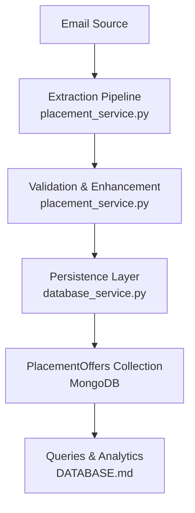
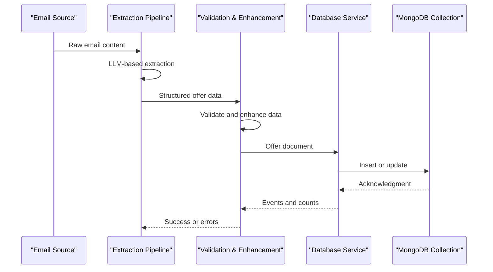
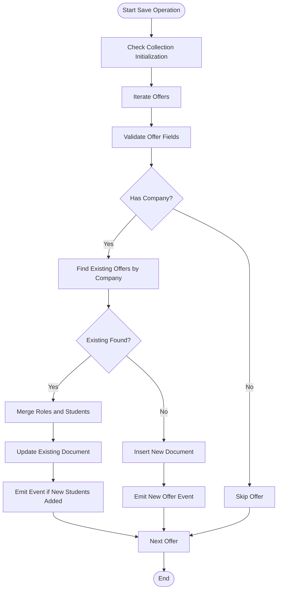
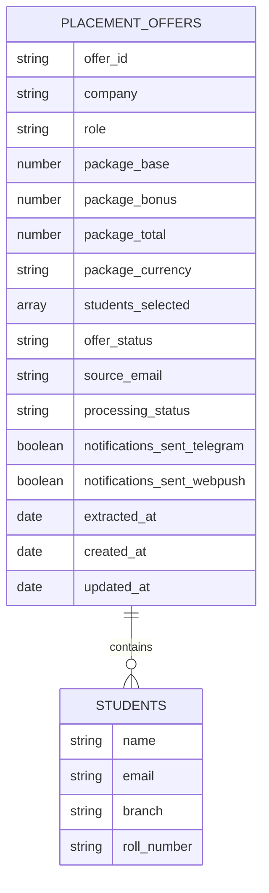
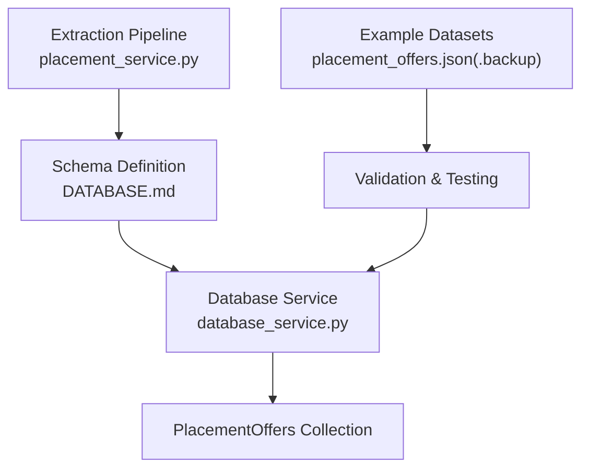

# PlacementOffers Collection

<cite>
**Referenced Files in This Document**
- [DATABASE.md](file://docs/DATABASE.md)
- [placement_service.py](file://app/services/placement_service.py)
- [database_service.py](file://app/services/database_service.py)
- [placement_offers.json](file://app/data/placement_offers.json)
- [placement_offers.json.backup](file://app/data/placement_offers.json.backup)
</cite>

## Table of Contents
1. [Introduction](#introduction)
2. [Project Structure](#project-structure)
3. [Core Components](#core-components)
4. [Architecture Overview](#architecture-overview)
5. [Detailed Component Analysis](#detailed-component-analysis)
6. [Dependency Analysis](#dependency-analysis)
7. [Performance Considerations](#performance-considerations)
8. [Troubleshooting Guide](#troubleshooting-guide)
9. [Conclusion](#conclusion)

## Introduction
This document provides comprehensive documentation for the PlacementOffers collection schema that stores extracted and structured placement offer data from emails. It explains the unique identifier system, field semantics, embedded documents, arrays, enumerations, validation rules, and operational flows. It also includes example documents illustrating different offer scenarios and student selection patterns.

## Project Structure
The PlacementOffers collection is part of the MongoDB database used by the SuperSet Telegram Notification Bot. The schema and operational logic are defined across documentation and service modules:

- Schema definition and indexes are documented in DATABASE.md
- Data extraction and validation logic are implemented in placement_service.py
- Persistence and merge logic are implemented in database_service.py
- Example datasets are provided in placement_offers.json and placement_offers.json.backup

**Diagram sources**
- [placement_service.py](file://app/services/placement_service.py#L151-L246)
- [database_service.py](file://app/services/database_service.py#L274-L437)
- [DATABASE.md](file://docs/DATABASE.md#L169-L250)

**Section sources**
- [DATABASE.md](file://docs/DATABASE.md#L1-L620)
- [placement_service.py](file://app/services/placement_service.py#L1-L200)
- [database_service.py](file://app/services/database_service.py#L274-L500)

## Core Components
The PlacementOffers collection schema defines the structure for storing placement offer records extracted from emails. The key fields and their semantics are:

- offer_id: Unique identifier for the offer (distinct from MongoDB's ObjectId)
- company: Company name associated with the offer
- role: Primary role offered (schema variant)
- package: Embedded document containing base, bonus, total, and currency fields (schema variant)
- students_selected: Array of student records with name, email, branch, roll_number (schema variant)
- offer_status: Enumeration with values 'pending', 'confirmed', 'completed' (schema variant)
- source_email: Email address from which the offer was extracted (schema variant)
- processing_status: Enumeration with values 'new', 'processed', 'notified' (schema variant)
- notifications_sent: Nested object tracking channel-specific notification flags (schema variant)
- extracted_at: Timestamp when the offer was extracted from the email (schema variant)
- created_at: Timestamp when the record was first saved (schema variant)
- updated_at: Timestamp when the record was last updated (schema variant)

Note: The repository contains two variants of the schema:
- Current schema (used by the application) with fields like role, package, students_selected, offer_status, processing_status, notifications_sent, extracted_at, created_at, updated_at
- Historical schema (presented in DATABASE.md) with fields like company, role, package, students_selected, offer_status, source_email, processing_status, notifications_sent, extracted_at, created_at, updated_at

The current schema aligns with the application's implementation and the example datasets.

**Section sources**
- [DATABASE.md](file://docs/DATABASE.md#L169-L250)
- [placement_service.py](file://app/services/placement_service.py#L55-L68)
- [database_service.py](file://app/services/database_service.py#L274-L437)

## Architecture Overview
The PlacementOffers collection participates in a data pipeline that extracts, validates, persists, and notifies about placement offers:

**Diagram sources**
- [placement_service.py](file://app/services/placement_service.py#L151-L246)
- [database_service.py](file://app/services/database_service.py#L274-L437)

## Detailed Component Analysis

### Schema Fields and Semantics
- offer_id: Unique string identifier for the offer; separate from MongoDB's ObjectId
- company: Company name associated with the offer
- role: Role offered (current schema variant)
- package: Embedded document with base, bonus, total, and currency fields (current schema variant)
- students_selected: Array of student records with name, email, branch, roll_number (current schema variant)
- offer_status: Enumeration with values 'pending', 'confirmed', 'completed' (current schema variant)
- source_email: Email address from which the offer was extracted (historical schema variant)
- processing_status: Enumeration with values 'new', 'processed', 'notified' (current schema variant)
- notifications_sent: Nested object with telegram and webpush boolean flags (current schema variant)
- extracted_at: Timestamp when the offer was extracted from the email (current schema variant)
- created_at: Timestamp when the record was first saved (current schema variant)
- updated_at: Timestamp when the record was last updated (current schema variant)

### Data Types and Constraints
- offer_id: String, unique index
- company: String
- role: String
- package.base: Number
- package.bonus: Number
- package.total: Number
- package.currency: String
- students_selected: Array of embedded documents
- offer_status: String enum
- source_email: String
- processing_status: String enum
- notifications_sent.telegram: Boolean
- notifications_sent.webpush: Boolean
- extracted_at: Date
- created_at: Date
- updated_at: Date

### Validation Rules
- Numeric fields (package.base, package.bonus, package.total) must be numeric
- Arrays (students_selected) must be present and non-empty for valid offers
- offer_status must be one of 'pending', 'confirmed', 'completed'
- processing_status must be one of 'new', 'processed', 'notified'
- offer_id must be unique
- company must be present and meaningful (length >= 2)

### Example Documents
Below are example documents illustrating different offer scenarios and student selection patterns:

- Single student selection with role and package
- Multiple students selected for the same role
- Multiple roles with different packages
- Internship offer with stipend handling
- Conditional/full-time offer with detailed package breakdown

These examples are derived from the repository's example datasets and demonstrate typical structures encountered in practice.

**Section sources**
- [DATABASE.md](file://docs/DATABASE.md#L207-L245)
- [placement_service.py](file://app/services/placement_service.py#L55-L68)
- [database_service.py](file://app/services/database_service.py#L274-L437)
- [placement_offers.json](file://app/data/placement_offers.json#L1-L800)
- [placement_offers.json.backup](file://app/data/placement_offers.json.backup#L1-L800)

### Processing Logic and Merge Behavior
The database service implements merge logic for PlacementOffers:

**Diagram sources**
- [database_service.py](file://app/services/database_service.py#L274-L437)

Key behaviors:
- Merges roles by role name, updating package details when higher packages are found
- Merges students by enrollment_number or name, prioritizing higher packages
- Emits events for new offers and updates with newly added students
- Skips offers without a company name

**Section sources**
- [database_service.py](file://app/services/database_service.py#L274-L437)

### Data Model Relationships
The PlacementOffers collection schema can be represented as:

**Diagram sources**
- [DATABASE.md](file://docs/DATABASE.md#L169-L250)
- [placement_service.py](file://app/services/placement_service.py#L37-L45)

## Dependency Analysis
The PlacementOffers collection depends on several components:

- Extraction pipeline (placement_service.py) for generating structured offer data
- Database service (database_service.py) for persistence and merge logic
- Documentation (DATABASE.md) for schema definition and indexes
- Example datasets (placement_offers.json, placement_offers.json.backup) for validation and testing

**Diagram sources**
- [placement_service.py](file://app/services/placement_service.py#L151-L246)
- [DATABASE.md](file://docs/DATABASE.md#L169-L250)
- [database_service.py](file://app/services/database_service.py#L274-L437)
- [placement_offers.json](file://app/data/placement_offers.json#L1-L800)
- [placement_offers.json.backup](file://app/data/placement_offers.json.backup#L1-L800)

**Section sources**
- [placement_service.py](file://app/services/placement_service.py#L1-L200)
- [DATABASE.md](file://docs/DATABASE.md#L1-L620)
- [database_service.py](file://app/services/database_service.py#L274-L500)
- [placement_offers.json](file://app/data/placement_offers.json#L1-L800)
- [placement_offers.json.backup](file://app/data/placement_offers.json.backup#L1-L800)

## Performance Considerations
- Indexes: Unique index on offer_id, single-field indexes on company and processing_status, and descending index on created_at
- Query patterns: Sorting by created_at, filtering by processing_status, and aggregation for counting students per company
- Batch operations: Using insert_many for bulk ingestion and update_many for bulk updates
- Caching: Consider caching frequently accessed statistics and recent offers

## Troubleshooting Guide
Common issues and resolutions:

- Duplicate offers: The merge logic updates existing documents and emits events for newly added students
- Missing company name: Offers without a company are skipped during processing
- Validation failures: Extraction pipeline returns validation errors; review extraction prompts and retry logic
- Privacy concerns: Forwarded sender information is sanitized and not included in user-facing fields

**Section sources**
- [database_service.py](file://app/services/database_service.py#L274-L437)
- [placement_service.py](file://app/services/placement_service.py#L531-L583)

## Conclusion
The PlacementOffers collection schema provides a robust foundation for storing and managing placement offer data extracted from emails. Its design supports efficient querying, maintains data integrity through validation and merge logic, and enables scalable notification workflows. The schema aligns with the application's extraction and persistence layers while maintaining flexibility for diverse offer scenarios and student selection patterns.